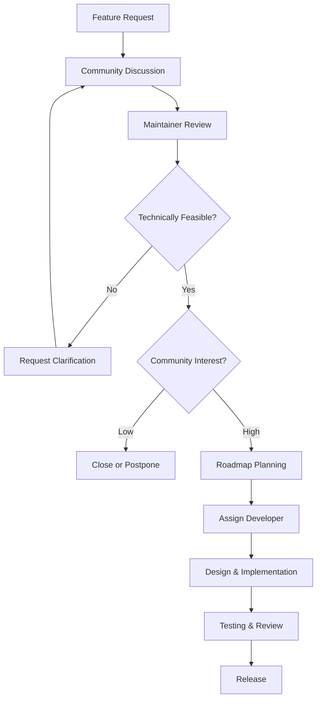

# Feature Request Process & Development Workflows

## Feature Request Process

### Before Submitting a Feature Request

**Research Phase:**
1. **Check existing issues** and documentation
2. **Review roadmap** for planned features
3. **Search discussions** for similar ideas
4. **Understand impact** on existing features

**Proposal Guidelines:**
- Problem-solution fit: Clearly identify the problem
- User impact: Who benefits and how
- Technical feasibility: Implementation complexity
- Resource requirements: Development effort needed

## Feature Request Template

Use this template when submitting feature requests:

```markdown
## Feature Description
Clear description of the proposed feature.

## Problem Statement
What problem does this feature solve? Who experiences this problem?

## Proposed Solution
Describe your proposed solution in detail.

## Alternative Solutions
Describe any alternative solutions you've considered.

## User Stories
As a [type of user], I want [goal] so that [benefit].

## Technical Considerations
- Implementation complexity: [Low/Medium/High]
- Database changes required: [Yes/No]
- API changes required: [Yes/No]
- Security implications: [Description]
- Performance impact: [Description]

## Mockups/Examples
If applicable, provide mockups or examples of the feature.

## Acceptance Criteria
- [ ] Criterion 1
- [ ] Criterion 2
- [ ] Criterion 3

## Additional Context
Any additional information about the feature request.
```

## Feature Development Workflow

### 1. Feature Approval Process



### 2. Implementation Standards

**Feature Branches:**
```bash
# Create feature branch with descriptive name
git checkout -b feature/ai-email-optimization
git checkout -b feature/advanced-analytics-dashboard
git checkout -b feature/mobile-app-integration

# Make incremental commits
git commit -m "feat(ai): add email subject line optimization algorithm"
git commit -m "test(ai): add unit tests for optimization model"
git commit -m "docs: update API documentation for AI features"
```

**Feature Documentation:**
```markdown
# Feature Implementation: AI Email Optimization

## Overview
This feature adds AI-powered email content optimization to improve campaign performance through machine learning analysis.

## Implementation Details

### Algorithm
- **Model**: Gradient Boosting Regressor
- **Training Data**: Historical campaign performance metrics
- **Features**: Subject line characteristics, content analysis, recipient engagement history
- **Output**: Optimization score and specific recommendations

### API Endpoints
- `POST /api/v1/ai/optimize-content` - Optimize email content
- `GET /api/v1/ai/optimization-history` - Get optimization history
- `POST /api/v1/ai/train-model` - Retrain optimization model

### Database Changes
- `ai_optimization_cache` table for caching optimization results
- `optimization_metrics` table for tracking improvement rates
- New indexes for performance optimization

### Frontend Changes
- Added optimization panel to campaign editor
- Real-time optimization score display
- Recommendation suggestion interface

## Testing Strategy
- Unit tests for optimization algorithm (95% coverage)
- Integration tests for API endpoints
- Performance tests for model inference time
- A/B testing framework for measuring improvements

## Rollout Plan
1. **Beta**: Enable for select enterprise customers
2. **General Availability**: Release to all customers
3. **Enhancement**: Add advanced features based on usage data
```

### 3. Feature Testing Requirements

**Automated Testing:**
```python
# tests/unit/test_ai_optimization.py
import pytest
from unittest.mock import Mock, patch
from app.ai.optimizer import EmailOptimizer

class TestEmailOptimizer:
    def setup_method(self):
        self.optimizer = EmailOptimizer()

    def test_optimize_subject_line_improvement(self):
        """Test that optimization improves subject line performance."""
        original_subject = "New product launch"
        optimized_subject = self.optimizer.optimize_subject_line(
            original_subject,
            target_audience="tech_professionals"
        )

        # Verify optimization made meaningful changes
        assert optimized_subject != original_subject
        assert len(optimized_subject) <= 100  # Character limit

        # Mock AI model prediction
        with patch.object(self.optimizer, '_predict_improvement') as mock_predict:
            mock_predict.return_value = 0.15
            improvement = self.optimizer._predict_improvement(optimized_subject)
            assert improvement > 0

    def test_optimization_score_calculation(self):
        """Test optimization score calculation."""
        content = {
            'subject': 'Welcome to our platform!',
            'html': '<h1>Welcome!</h1><p>Get started today.</p>'
        }

        score = self.optimizer.calculate_optimization_score(content)
        assert 0 <= score <= 1
        assert isinstance(score, float)
```

**Integration Testing:**
```python
# tests/integration/test_ai_optimization_api.py
import pytest
from httpx import AsyncClient
from app.main import app

@pytest.mark.asyncio
async def test_optimization_api_integration():
    async with AsyncClient(app=app, base_url="http://testserver") as client:
        response = await client.post("/api/v1/ai/optimize-content", json={
            "content": {
                "subject": "Product Update",
                "html": "<h1>Update</h1><p>New features available.</p>"
            },
            "audience": {"demographics": {"age_range": "25-45"}}
        })

        assert response.status_code == 200
        data = response.json()
        assert "optimized_content" in data
        assert "improvement_score" in data
        assert "recommendations" in data
```

## Feature Categories

### UI/UX Improvements

**Implementation Pattern:**
```typescript
// components/CampaignOptimization.tsx
interface OptimizationPanelProps {
  readonly campaign: EmailCampaign;
  readonly onOptimizationApplied: (optimizedContent: EmailContent) => void;
}

export const CampaignOptimizationPanel: React.FC<OptimizationPanelProps> = ({
  campaign,
  onOptimizationApplied
}) => {
  const [isOptimizing, setIsOptimizing] = useState(false);
  const [optimizationScore, setOptimizationScore] = useState<number | null>(null);
  const [recommendations, setRecommendations] = useState<string[]>([]);

  const handleOptimize = useCallback(async () => {
    setIsOptimizing(true);
    try {
      const result = await aiService.optimizeCampaign(campaign.id);
      
      setOptimizationScore(result.score);
      setRecommendations(result.recommendations);
      
      // Update campaign content if user accepts
      if (result.confidence > 0.8) {
        onOptimizationApplied(result.optimizedContent);
      }
    } catch (error) {
      toast.error('Optimization failed. Please try again.');
    } finally {
      setIsOptimizing(false);
    }
  }, [campaign.id, aiService, onOptimizationApplied]);

  return (
    <div className="optimization-panel">
      <div className="panel-header">
        <h3>AI Content Optimization</h3>
        <Button
          onClick={handleOptimize}
          disabled={isOptimizing}
          loading={isOptimizing}
        >
          {isOptimizing ? 'Optimizing...' : 'Optimize with AI'}
        </Button>
      </div>

      {optimizationScore !== null && (
        <div className="optimization-results">
          <div className="score-display">
            <span className="score-label">Optimization Score:</span>
            <span className="score-value">{optimizationScore}%</span>
          </div>
          
          <div className="recommendations">
            <h4>Recommendations</h4>
            <ul>
              {recommendations.map((rec, index) => (
                <li key={index}>{rec}</li>
              ))}
            </ul>
          </div>
        </div>
      )}
    </div>
  );
};
```

### API Enhancements

**Endpoint Design Pattern:**
```typescript
// api/ai-optimization.ts
export class AIOptimizationAPI {
  constructor(private readonly httpClient: HTTPClient) {}

  async optimizeContent(request: OptimizationRequest): Promise<OptimizationResponse> {
    return this.httpClient.post('/api/v1/ai/optimize-content', {
      ...request,
      options: {
        confidence_threshold: 0.8,
        include_explanations: true,
        target_metrics: ['open_rate', 'click_rate']
      }
    });
  }

  async getOptimizationHistory(campaignId: string, options?: HistoryOptions): Promise<OptimizationHistory[]> {
    return this.httpClient.get(`/api/v1/ai/optimization-history/${campaignId}`, {
      params: options
    });
  }

  async trainModel(datasets: TrainingDataset[]): Promise<TrainingResult> {
    return this.httpClient.post('/api/v1/ai/train-model', {
      datasets,
      hyperparameters: {
        learning_rate: 0.01,
        max_depth: 6,
        n_estimators: 100
      }
    });
  }
}

// Request/Response types
interface OptimizationRequest {
  readonly content: {
    readonly subject: string;
    readonly html: string;
    readonly text?: string;
  };
  readonly audience: {
    readonly demographics: AudienceDemographics;
    readonly preferences?: AudiencePreferences;
  };
  readonly constraints?: ContentConstraints;
}

interface OptimizationResponse {
  readonly optimized_content: {
    readonly subject: string;
    readonly html: string;
    readonly text?: string;
  };
  readonly improvement_score: number;
  readonly confidence: number;
  readonly recommendations: string[];
  readonly explanations: OptimizationExplanation[];
}
```

### Infrastructure Features

**Database Migration Pattern:**
```python
# migrations/0024_add_ai_optimization_features.py
from sqlalchemy import Column, Integer, String, DateTime, Text, Float, Boolean
from sqlalchemy.dialects.postgresql import JSONB
from datetime import datetime

def upgrade():
    """Add AI optimization tables and features."""
    
    # Create AI optimization cache table
    op.create_table('ai_optimization_cache',
        Column('id', Integer, primary_key=True),
        Column('content_hash', String(64), unique=True, nullable=False),
        Column('original_subject', Text, nullable=False),
        Column('optimized_subject', Text, nullable=False),
        Column('improvement_score', Float, nullable=False),
        Column('confidence', Float, nullable=False),
        Column('optimization_type', String(50), nullable=False),
        Column('created_at', DateTime, default=datetime.utcnow),
        Column('expires_at', DateTime, nullable=False),
        Index('ix_optimization_cache_content_hash', 'content_hash'),
        Index('ix_optimization_cache_expires', 'expires_at')
    )

    # Create optimization metrics table
    op.create_table('optimization_metrics',
        Column('id', Integer, primary_key=True),
        Column('campaign_id', Integer, nullable=False),
        Column('original_metrics', JSONB, nullable=False),
        Column('optimized_metrics', JSONB, nullable=False),
        Column('improvement_percentage', Float, nullable=False),
        Column('metric_type', String(50), nullable=False),
        Column('created_at', DateTime, default=datetime.utcnow),
        ForeignKey('campaigns.id', ondelete='CASCADE'),
        Index('ix_optimization_metrics_campaign', 'campaign_id'),
        Index('ix_optimization_metrics_type', 'metric_type')
    )

    # Add optimization columns to campaigns table
    op.add_column('campaigns', Column('ai_optimization_enabled', Boolean, default=False))
    op.add_column('campaigns', Column('optimization_score', Float, nullable=True))
    op.add_column('campaigns', Column('last_optimization', DateTime, nullable=True))

def downgrade():
    """Remove AI optimization features."""
    op.drop_column('campaigns', 'last_optimization')
    op.drop_column('campaigns', 'optimization_score')
    op.drop_column('campaigns', 'ai_optimization_enabled')
    op.drop_table('optimization_metrics')
    op.drop_table('ai_optimization_cache')
```

## Feature Development Guidelines

### Code Organization

```
feature/
├── src/
│   ├── api/                    # API endpoints
│   ├── services/               # Business logic
│   ├── models/                 # Data models
│   ├── components/             # UI components
│   └── utils/                  # Helper functions
├── tests/
│   ├── unit/                   # Unit tests
│   ├── integration/            # Integration tests
│   └── e2e/                    # End-to-end tests
├── docs/                       # Feature documentation
├── migration/                  # Database migrations
└── scripts/                    # Setup/deployment scripts
```

### Documentation Requirements

Each feature must include:

1. **API Documentation**: Complete endpoint documentation
2. **User Guide**: How to use the feature
3. **Technical Specification**: Architecture and implementation details
4. **Migration Guide**: For existing users
5. **Changelog**: Update entry for next release

### Quality Gates

**Before feature can be merged:**
- [ ] Code review approved by 2+ developers
- [ ] All tests passing (unit, integration, e2e)
- [ ] Performance benchmarks met
- [ ] Security review completed
- [ ] Documentation updated
- [ ] Migration scripts tested
- [ ] Rollback plan prepared
- [ ] Monitoring/alerting configured

### Feature Launch Checklist

**Pre-Launch:**
- [ ] Feature flag implemented and tested
- [ ] Rollback plan documented
- [ ] Monitoring dashboard configured
- [ ] Support documentation prepared
- [ ] Beta users identified and briefed
- [ ] Metrics tracking implemented

**Launch:**
- [ ] Feature flag enabled for beta users
- [ ] Monitoring systems active
- [ ] Support team briefed
- [ ] Documentation published
- [ ] Announcement prepared
- [ ] Metrics collection verified

**Post-Launch:**
- [ ] Monitor metrics for 24-48 hours
- [ ] Gather user feedback
- [ ] Address any critical issues
- [ ] Plan feature enhancements
- [ ] Document lessons learned

## Feature Request Best Practices

### Writing Effective Feature Requests

1. **Start with the problem**: Clearly articulate the user problem
2. **Provide context**: Why is this important now?
3. **Define success**: How will we know this feature works?
4. **Consider complexity**: Be realistic about effort required
5. **Think about edge cases**: What could go wrong?

### Common Feature Request Patterns

**User Experience Improvements:**
- "As a [user type], I want [capability] so that [benefit]"
- Focus on user pain points
- Provide mockups or examples
- Consider accessibility implications

**Performance Enhancements:**
- "The system should [performance goal] when [trigger]"
- Include specific metrics
- Consider scalability requirements
- Plan for monitoring and alerting

**Integration Features:**
- "Integrate with [third-party service] to [achieve goal]"
- Document API requirements
- Consider security implications
- Plan for error handling

**Analytics and Reporting:**
- "Provide [type] reports showing [metrics]"
- Define data sources
- Specify update frequency
- Consider data retention

### Evaluation Criteria

**Impact Assessment:**
- User adoption potential
- Business value delivered
- Technical complexity
- Resource requirements
- Timeline implications
- Risk factors

**Priority Scoring:**
- Critical: Blocks core functionality
- High: Significantly improves user experience
- Medium: Nice-to-have enhancement
- Low: Future consideration

For testing requirements, see [`testing-requirements.md`](testing-requirements).
For code standards, see [`code-standards.md`](code-standards).