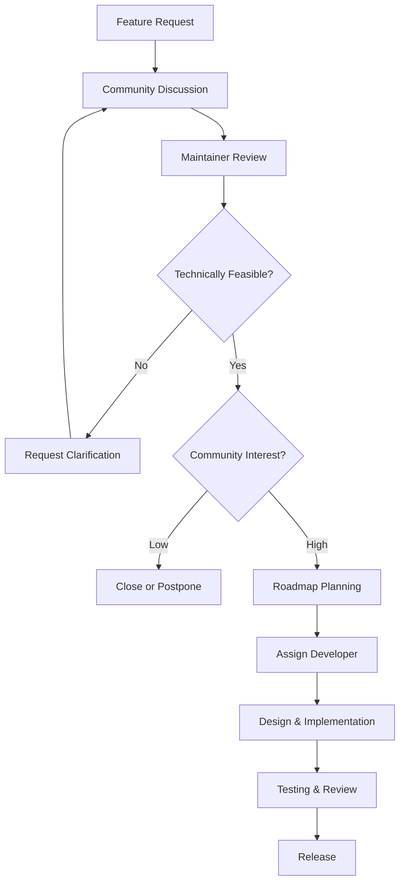

# Feature Request Process & Development Workflows

## Feature Request Process

### Before Submitting a Feature Request

**Research Phase:**

1. **Check existing issues** and documentation

2. **Review roadmap** for planned features

3. **Search discussions** for similar ideas

4. **Understand impact** on existing features

**Proposal Guidelines:**

- Problem-solution fit: Clearly identify the problem

- User impact: Who benefits and how

- Technical feasibility: Implementation complexity

- Resource requirements: Development effort needed

## Feature Request Template

Use this template when submitting feature requests:

```markdown


## Feature Description

Clear description of the proposed feature.


## Problem Statement

What problem does this feature solve? Who experiences this problem?


## Proposed Solution

Describe your proposed solution in detail.


## Alternative Solutions

Describe any alternative solutions you've considered.


## User Stories

As a [type of user], I want [goal] so that [benefit].


## Technical Considerations


- Implementation complexity: [Low/Medium/High]


- Database changes required: [Yes/No]


- API changes required: [Yes/No]


- Security implications: [Description]


- Performance impact: [Description]


## Mockups/Examples

If applicable, provide mockups or examples of the feature.


## Acceptance Criteria


- [ ] Criterion 1


- [ ] Criterion 2


- [ ] Criterion 3


## Additional Context

Any additional information about the feature request.


```

## Feature Development Workflow

### 1. Feature Approval Process



### 2. Implementation Standards

**Feature Branches:**

```bash


# Create feature branch with descriptive name

git checkout -b feature/ai-email-optimization
git checkout -b feature/advanced-analytics-dashboard
git checkout -b feature/mobile-app-integration


# Make incremental commits

git commit -m "feat(ai): add email subject line optimization algorithm"
git commit -m "test(ai): add unit tests for optimization model"
git commit -m "docs: update API documentation for AI features"


```

**Feature Documentation:**

```markdown


# Feature Implementation: AI Email Optimization


## Overview

This feature adds AI-powered email content optimization to improve campaign performance through machine learning analysis.


## Implementation Details


### Algorithm


- **Model**: Gradient Boosting Regressor


- **Training Data**: Historical campaign performance metrics


- **Features**: Subject line characteristics, content analysis, recipient engagement history


- **Output**: Optimization score and specific recommendations


### API Endpoints


- `POST /api/v1/ai/optimize-content` - Optimize email content


- `GET /api/v1/ai/optimization-history` - Get optimization history


- `POST /api/v1/ai/train-model` - Retrain optimization model


### Database Changes


- `ai_optimization_cache` table for caching optimization results


- `optimization_metrics` table for tracking improvement rates


- New indexes for performance optimization


### Frontend Changes


- Added optimization panel to campaign editor


- Real-time optimization score display


- Recommendation suggestion interface


## Testing Strategy


- Unit tests for optimization algorithm (95% coverage)


- Integration tests for API endpoints


- Performance tests for model inference time


- A/B testing framework for measuring improvements


## Rollout Plan


1. **Beta**: Enable for select enterprise customers


2. **General Availability**: Release to all customers


3. **Enhancement**: Add advanced features based on usage data


```

### 3. Feature Testing Requirements

**Automated Testing:**

```typescript
// tests/unit/test-ai-optimization.ts
import { describe, it, expect, beforeEach, vi } from 'vitest';
import { EmailOptimizer } from '../../app/ai/optimizer';
import { OptimizationResult } from '../../app/ai/types';

describe('EmailOptimizer', () => {
  let optimizer: EmailOptimizer;

  beforeEach(() => {
    optimizer = new EmailOptimizer();
  });

  it('should improve subject line performance', async () => {
    const originalSubject = 'New product launch';
    const optimizedSubject = await optimizer.optimizeSubjectLine(
      originalSubject,
      { targetAudience: 'tech_professionals' }
    );

    // Verify optimization made meaningful changes
    expect(optimizedSubject).not.toBe(originalSubject);
    expect(optimizedSubject.length).toBeLessThanOrEqual(100);

    // Mock AI model prediction
    const mockPredictImprovement = vi.spyOn(optimizer, 'predictImprovement');
    mockPredictImprovement.mockResolvedValue(0.15);

    const improvement = await optimizer.predictImprovement(optimizedSubject);
    expect(improvement).toBeGreaterThan(0);
  });

  it('should calculate optimization score correctly', async () => {
    const content: EmailContent = {
      subject: 'Welcome to our platform!',
      html: '<h1>Welcome!</h1><p>Get started today.</p>'
    };

    const score = await optimizer.calculateOptimizationScore(content);
    expect(score).toBeGreaterThanOrEqual(0);
    expect(score).toBeLessThanOrEqual(1);
    expect(typeof score).toBe('number');
  });

  it('should handle empty content gracefully', async () => {
    const emptyContent: EmailContent = {
      subject: '',
      html: ''
    };

    const result = await optimizer.optimizeContent(emptyContent);
    expect(result.success).toBe(true);
    expect(result.error).toBeUndefined();
  });

  it('should provide optimization recommendations', async () => {
    const content: EmailContent = {
      subject: 'Limited time offer - buy now!',
      html: '<h1>SPECIAL DEAL!</h1><p>Click here to get 50% off!</p>'
    };

    const result = await optimizer.optimizeContent(content);
    expect(result.recommendations).toBeDefined();
    expect(result.recommendations.length).toBeGreaterThan(0);
    expect(result.recommendations).toEqual(
      expect.arrayContaining([
        expect.stringContaining('professional'),
        expect.stringContaining('call-to-action')
      ])
    );
  });
});

// Supporting types
interface EmailContent {
  subject: string;
  html: string;
  text?: string;
}

interface OptimizationOptions {
  targetAudience: string;
  confidenceThreshold?: number;
  includeExplanations?: boolean;
}

interface AudienceDemographics {
  ageRange?: string;
  industry?: string;
  interests?: string[];
}

interface EmailOptimizer {
  optimizeSubjectLine(
    subject: string,
    options: OptimizationOptions
  ): Promise<string>;
  calculateOptimizationScore(content: EmailContent): Promise<number>;
  optimizeContent(content: EmailContent): Promise<OptimizationResult>;
  predictImprovement(content: string): Promise<number>;
}


```

**Integration Testing:**

```typescript
// tests/integration/test-ai-optimization-api.ts
import { describe, it, expect, beforeAll, afterAll } from 'vitest';
import { setupServer } from 'msw/node';
import { http, HttpResponse } from 'msw';
import { EmailOptimizationAPI } from '../../api/ai-optimization';
import { EmailCampaign, OptimizationRequest, OptimizationResponse } from '../../app/ai/types';

describe('AI Optimization API Integration', () => {
  let server: ReturnType<typeof setupServer>;
  let apiClient: EmailOptimizationAPI;

  beforeAll(() => {
    server = setupServer(
      http.post('/api/v1/ai/optimize-content', async ({ request }) => {
        const body = await request.json() as OptimizationRequest;

        // Mock successful optimization response
        const response: OptimizationResponse = {
          optimizedContent: {
            subject: `Optimized: ${body.content.subject}`,
            html: body.content.html
          },
          improvementScore: 0.15,
          confidence: 0.85,
          recommendations: [
            'Consider using more engaging subject lines',
            'Add personalization elements'
          ],
          explanations: [
            {
              type: 'subject_analysis',
              message: 'Subject line improved for engagement',
              confidence: 0.85
            }
          ]
        };

        return HttpResponse.json(response);
      })
    );

    server.listen();
    apiClient = new EmailOptimizationAPI();
  });

  afterAll(() => {
    server.close();
  });

  it('should optimize email content successfully', async () => {
    const request: OptimizationRequest = {
      content: {
        subject: 'Product Update',
        html: '<h1>Update</h1><p>New features available.</p>'
      },
      audience: {
        demographics: {
          ageRange: '25-45',
          industry: 'technology'
        }
      }
    };

    const response = await apiClient.optimizeContent(request);

    expect(response.status).toBe(200);
    expect(response.data).toBeDefined();
    expect(response.data.optimizedContent).toBeDefined();
    expect(response.data.improvementScore).toBeGreaterThan(0);
    expect(response.data.recommendations).toBeDefined();
    expect(response.data.recommendations.length).toBeGreaterThan(0);
  });

  it('should handle optimization errors gracefully', async () => {
    server.use(
      http.post('/api/v1/ai/optimize-content', () => {
        return new HttpResponse('Service unavailable', { status: 503 });
      })
    );

    const request: OptimizationRequest = {
      content: { subject: 'Test', html: '<p>Test content</p>' },
      audience: { demographics: {} }
    };

    await expect(apiClient.optimizeContent(request)).rejects.toThrow('Service unavailable');
  });

  it('should validate optimization request parameters', async () => {
    const invalidRequest = {
      content: null,
      audience: {}
    };

    await expect(apiClient.optimizeContent(invalidRequest as OptimizationRequest))
      .rejects.toThrow('Invalid request parameters');
  });
});

// Supporting types and classes
interface OptimizationRequest {
  content: EmailContent;
  audience: AudienceData;
  constraints?: ContentConstraints;
}

interface OptimizationResponse {
  optimizedContent: EmailContent;
  improvementScore: number;
  confidence: number;
  recommendations: string[];
  explanations: OptimizationExplanation[];
}

interface OptimizationExplanation {
  type: 'subject_analysis' | 'content_analysis' | 'audience_targeting';
  message: string;
  confidence: number;
}

interface AudienceData {
  demographics: AudienceDemographics;
  preferences?: AudiencePreferences;
}

interface ContentConstraints {
  maxLength?: number;
  includeEmojis?: boolean;
  tone?: 'professional' | 'casual' | 'urgent';
}

class EmailOptimizationAPI {
  private readonly baseURL = '/api/v1/ai';

  async optimizeContent(request: OptimizationRequest): Promise<{
    status: number;
    data: OptimizationResponse;
  }> {
    try {
      const response = await fetch(`${this.baseURL}/optimize-content`, {
        method: 'POST',
        headers: {
          'Content-Type': 'application/json',
          'Authorization': `Bearer ${process.env.API_TOKEN}`
        },
        body: JSON.stringify(request)
      });

      if (!response.ok) {
        throw new Error(`API request failed: ${response.statusText}`);
      }

      const data = await response.json();
      return { status: response.status, data };
    } catch (error) {
      throw new Error(`Optimization request failed: ${error instanceof Error ? error.message : 'Unknown error'}`);
    }
  }
}


```

## Feature Categories

### UI/UX Improvements

**Implementation Pattern:**

```typescript
// components/CampaignOptimization.tsx
interface OptimizationPanelProps {
  readonly campaign: EmailCampaign;
  readonly onOptimizationApplied: (optimizedContent: EmailContent) => void;
}

export const CampaignOptimizationPanel: React.FC<OptimizationPanelProps> = ({
  campaign,
  onOptimizationApplied
}) => {
  const [isOptimizing, setIsOptimizing] = useState(false);
  const [optimizationScore, setOptimizationScore] = useState<number | null>(null);
  const [recommendations, setRecommendations] = useState<string[]>([]);

  const handleOptimize = useCallback(async () => {
    setIsOptimizing(true);
    try {
      const result = await aiService.optimizeCampaign(campaign.id);

      setOptimizationScore(result.score);
      setRecommendations(result.recommendations);

      // Update campaign content if user accepts
      if (result.confidence > 0.8) {
        onOptimizationApplied(result.optimizedContent);
      }
    } catch (error) {
      toast.error('Optimization failed. Please try again.');
    } finally {
      setIsOptimizing(false);
    }
  }, [campaign.id, aiService, onOptimizationApplied]);

  return (
    <div className="optimization-panel">
      <div className="panel-header">
        <h3>AI Content Optimization</h3>
        <Button
          onClick={handleOptimize}
          disabled={isOptimizing}
          loading={isOptimizing}
        >
          {isOptimizing ? 'Optimizing...' : 'Optimize with AI'}
        </Button>
      </div>

      {optimizationScore !== null && (
        <div className="optimization-results">
          <div className="score-display">
            <span className="score-label">Optimization Score:</span>
            <span className="score-value">{optimizationScore}%</span>
          </div>

          <div className="recommendations">
            <h4>Recommendations</h4>
            <ul>
              {recommendations.map((rec, index) => (
                <li key={index}>{rec}</li>
              ))}
            </ul>
          </div>
        </div>
      )}
    </div>
  );
};


```

### API Enhancements

**Endpoint Design Pattern:**

```typescript
// api/ai-optimization.ts
export class AIOptimizationAPI {
  constructor(private readonly httpClient: HTTPClient) {}

  async optimizeContent(request: OptimizationRequest): Promise<OptimizationResponse> {
    return this.httpClient.post('/api/v1/ai/optimize-content', {
      ...request,
      options: {
        confidence_threshold: 0.8,
        include_explanations: true,
        target_metrics: ['open_rate', 'click_rate']
      }
    });
  }

  async getOptimizationHistory(campaignId: string, options?: HistoryOptions): Promise<OptimizationHistory[]> {
    return this.httpClient.get(`/api/v1/ai/optimization-history/${campaignId}`, {
      params: options
    });
  }

  async trainModel(datasets: TrainingDataset[]): Promise<TrainingResult> {
    return this.httpClient.post('/api/v1/ai/train-model', {
      datasets,
      hyperparameters: {
        learning_rate: 0.01,
        max_depth: 6,
        n_estimators: 100
      }
    });
  }
}

// Request/Response types
interface OptimizationRequest {
  readonly content: {
    readonly subject: string;
    readonly html: string;
    readonly text?: string;
  };
  readonly audience: {
    readonly demographics: AudienceDemographics;
    readonly preferences?: AudiencePreferences;
  };
  readonly constraints?: ContentConstraints;
}

interface OptimizationResponse {
  readonly optimized_content: {
    readonly subject: string;
    readonly html: string;
    readonly text?: string;
  };
  readonly improvement_score: number;
  readonly confidence: number;
  readonly recommendations: string[];
  readonly explanations: OptimizationExplanation[];
}


```

### Infrastructure Features

**Database Migration Pattern:**

```typescript
// migrations/0024_add_ai_optimization_features.ts
import { sql } from 'postgres';

interface ColumnDefinition {
  name: string;
  type: 'INTEGER' | 'VARCHAR' | 'TEXT' | 'TIMESTAMP' | 'FLOAT' | 'BOOLEAN' | 'JSONB';
  primaryKey?: boolean;
  unique?: boolean;
  nullable?: boolean;
  default?: string;
  references?: string;
}

interface TableDefinition {
  name: string;
  columns: ColumnDefinition[];
  indexes?: string[];
}

interface MigrationResult {
  success: boolean;
  message: string;
  tablesCreated?: string[];
  columnsAdded?: string[];
}

interface DatabaseMigration {
  upgrade(): Promise<MigrationResult>;
  downgrade(): Promise<MigrationResult>;
}

class AIOptimizationMigration implements DatabaseMigration {
  async upgrade(): Promise<MigrationResult> {
    try {
      const results = {
        success: true,
        message: 'AI optimization features migration completed',
        tablesCreated: [] as string[],
        columnsAdded: [] as string[]
      };

      // Create AI optimization cache table
      await sql`
        CREATE TABLE ai_optimization_cache (
          id SERIAL PRIMARY KEY,
          content_hash VARCHAR(64) UNIQUE NOT NULL,
          original_subject TEXT NOT NULL,
          optimized_subject TEXT NOT NULL,
          improvement_score FLOAT NOT NULL,
          confidence FLOAT NOT NULL,
          optimization_type VARCHAR(50) NOT NULL,
          created_at TIMESTAMP DEFAULT CURRENT_TIMESTAMP,
          expires_at TIMESTAMP NOT NULL
        );
      `;
      results.tablesCreated.push('ai_optimization_cache');

      // Create indexes for optimization cache
      await sql`CREATE INDEX ix_optimization_cache_content_hash ON ai_optimization_cache(content_hash);`;
      await sql`CREATE INDEX ix_optimization_cache_expires ON ai_optimization_cache(expires_at);`;

      // Create optimization metrics table
      await sql`
        CREATE TABLE optimization_metrics (
          id SERIAL PRIMARY KEY,
          campaign_id INTEGER NOT NULL,
          original_metrics JSONB NOT NULL,
          optimized_metrics JSONB NOT NULL,
          improvement_percentage FLOAT NOT NULL,
          metric_type VARCHAR(50) NOT NULL,
          created_at TIMESTAMP DEFAULT CURRENT_TIMESTAMP,
          FOREIGN KEY (campaign_id) REFERENCES campaigns(id) ON DELETE CASCADE
        );
      `;
      results.tablesCreated.push('optimization_metrics');

      // Create indexes for optimization metrics
      await sql`CREATE INDEX ix_optimization_metrics_campaign ON optimization_metrics(campaign_id);`;
      await sql`CREATE INDEX ix_optimization_metrics_type ON optimization_metrics(metric_type);`;

      // Add optimization columns to campaigns table
      await sql`ALTER TABLE campaigns ADD COLUMN ai_optimization_enabled BOOLEAN DEFAULT FALSE;`;
      results.columnsAdded.push('campaigns.ai_optimization_enabled');

      await sql`ALTER TABLE campaigns ADD COLUMN optimization_score FLOAT;`;
      results.columnsAdded.push('campaigns.optimization_score');

      await sql`ALTER TABLE campaigns ADD COLUMN last_optimization TIMESTAMP;`;
      results.columnsAdded.push('campaigns.last_optimization');

      return results;
    } catch (error) {
      return {
        success: false,
        message: `Migration failed: ${error instanceof Error ? error.message : 'Unknown error'}`
      };
    }
  }

  async downgrade(): Promise<MigrationResult> {
    try {
      const results = {
        success: true,
        message: 'AI optimization features rollback completed',
        tablesCreated: [],
        columnsAdded: []
      };

      // Remove optimization columns from campaigns table
      await sql`ALTER TABLE campaigns DROP COLUMN IF EXISTS last_optimization;`;
      await sql`ALTER TABLE campaigns DROP COLUMN IF EXISTS optimization_score;`;
      await sql`ALTER TABLE campaigns DROP COLUMN IF EXISTS ai_optimization_enabled;`;

      // Drop optimization metrics table
      await sql`DROP TABLE IF EXISTS optimization_metrics CASCADE;`;

      // Drop AI optimization cache table
      await sql`DROP TABLE IF EXISTS ai_optimization_cache CASCADE;`;

      return results;
    } catch (error) {
      return {
        success: false,
        message: `Rollback failed: ${error instanceof Error ? error.message : 'Unknown error'}`
      };
    }
  }
}

// Migration runner utility
class MigrationRunner {
  async runMigration(migration: DatabaseMigration): Promise<boolean> {
    try {
      console.log('Starting migration...');
      const result = await migration.upgrade();

      if (result.success) {
        console.log(`Migration completed successfully: ${result.message}`);
        if (result.tablesCreated) {
          console.log(`Tables created: ${result.tablesCreated.join(', ')}`);
        }
        if (result.columnsAdded) {
          console.log(`Columns added: ${result.columnsAdded.join(', ')}`);
        }
        return true;
      } else {
        console.error(`Migration failed: ${result.message}`);
        return false;
      }
    } catch (error) {
      console.error(`Migration error: ${error instanceof Error ? error.message : 'Unknown error'}`);
      return false;
    }
  }

  async rollbackMigration(migration: DatabaseMigration): Promise<boolean> {
    try {
      console.log('Starting rollback...');
      const result = await migration.downgrade();

      if (result.success) {
        console.log(`Rollback completed successfully: ${result.message}`);
        return true;
      } else {
        console.error(`Rollback failed: ${result.message}`);
        return false;
      }
    } catch (error) {
      console.error(`Rollback error: ${error instanceof Error ? error.message : 'Unknown error'}`);
      return false;
    }
  }
}

// Usage example
async function runAIOptimizationMigration() {
  const migration = new AIOptimizationMigration();
  const runner = new MigrationRunner();

  const success = await runner.runMigration(migration);
  if (!success) {
    throw new Error('Migration failed - please check logs');
  }

  return success;
}


```

## Feature Development Guidelines

### Code Organization

```text

feature/
├── src/
│   ├── api/                    # API endpoints
│   ├── services/               # Business logic
│   ├── models/                 # Data models
│   ├── components/             # UI components
│   └── utils/                  # Helper functions
├── tests/
│   ├── unit/                   # Unit tests
│   ├── integration/            # Integration tests
│   └── e2e/                    # End-to-end tests
├── docs/                       # Feature documentation
├── migration/                  # Database migrations
└── scripts/                    # Setup/deployment scripts


```

### Documentation Requirements

Each feature must include:

1. **API Documentation**: Complete endpoint documentation

2. **User Guide**: How to use the feature

3. **Technical Specification**: Architecture and implementation details

4. **Migration Guide**: For existing users

5. **Changelog**: Update entry for next release

### Quality Gates

**Before feature can be merged:**

- [ ] Code review approved by 2+ developers

- [ ] All tests passing (unit, integration, e2e)

- [ ] Performance benchmarks met

- [ ] Security review completed

- [ ] Documentation updated

- [ ] Migration scripts tested

- [ ] Rollback plan prepared

- [ ] Monitoring/alerting configured

### Feature Launch Checklist

**Pre-Launch:**

- [ ] Feature flag implemented and tested

- [ ] Rollback plan documented

- [ ] Monitoring dashboard configured

- [ ] Support documentation prepared

- [ ] Beta users identified and briefed

- [ ] Metrics tracking implemented

**Launch:**

- [ ] Feature flag enabled for beta users

- [ ] Monitoring systems active

- [ ] Support team briefed

- [ ] Documentation published

- [ ] Announcement prepared

- [ ] Metrics collection verified

**Post-Launch:**

- [ ] Monitor metrics for 24-48 hours

- [ ] Gather user feedback

- [ ] Address any critical issues

- [ ] Plan feature enhancements

- [ ] Document lessons learned

## Feature Request Best Practices

### Writing Effective Feature Requests

1. **Start with the problem**: Clearly articulate the user problem

2. **Provide context**: Why is this important now?

3. **Define success**: How will we know this feature works?

4. **Consider complexity**: Be realistic about effort required

5. **Think about edge cases**: What could go wrong?

### Common Feature Request Patterns

**User Experience Improvements:**

- "As a [user type], I want [capability] so that [benefit]"

- Focus on user pain points

- Provide mockups or examples

- Consider accessibility implications

**Performance Enhancements:**

- "The system should [performance goal] when [trigger]"

- Include specific metrics

- Consider scalability requirements

- Plan for monitoring and alerting

**Integration Features:**

- "Integrate with [third-party service] to [achieve goal]"

- Document API requirements

- Consider security implications

- Plan for error handling

**Analytics and Reporting:**

- "Provide [type] reports showing [metrics]"

- Define data sources

- Specify update frequency

- Consider data retention

### Evaluation Criteria

**Impact Assessment:**

- User adoption potential

- Business value delivered

- Technical complexity

- Resource requirements

- Timeline implications

- Risk factors

**Priority Scoring:**

- Critical: Blocks core functionality

- High: Significantly improves user experience

- Medium: Nice-to-have enhancement

- Low: Future consideration

For testing requirements, see [`testing-requirements.md`](testing-requirements).
For code standards, see [`code-standards.md`](code-standards).
