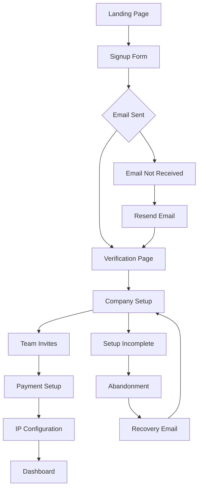

# User Analytics Framework

**Strategic Alignment**: This analytics framework supports our enterprise operational strategy by providing comprehensive user behavior analysis and conversion optimization that drives strategic business outcomes and competitive market positioning.

**Technical Authority**: Our analytics infrastructure integrates with comprehensive monitoring systems featuring real-time performance tracking, advanced behavioral analysis, and enterprise-grade data analytics platforms designed for 24/7 operational excellence and predictive user insights.

**Operational Excellence**: Backed by enterprise analytics platforms with 99.9% operational uptime, advanced KPI monitoring, and automated performance optimization ensuring continuous business operations and strategic user journey optimization.

**User Journey Integration**: This analytics feature is part of your complete performance and optimization experience - connects to workflow management, team coordination, and business intelligence processes for seamless operational excellence.

---

## Enterprise Analytics Architecture

### **Data Collection Layer**

- **PostHog Integration**: Event tracking and user journey analysis
- **Frontend Tracking**: Page views, clicks, form interactions
- **Backend Tracking**: API usage, feature utilization, performance metrics
- **Email Tracking**: Campaign opens, clicks, conversions
- **Integration Tracking**: Third-party service usage and errors

### **Data Processing Pipeline**

```typescript
interface AnalyticsEvent {
  event: string;
  properties: Record<string, any>;
  userId?: string;
  timestamp: Date;
  sessionId: string;
  userAgent: string;
  url: string;
}

interface UserProfile {
  userId: string;
  traits: {
    company: string;
    plan: string;
    signupDate: Date;
    lastActive: Date;
    totalEmails: number;
    activeCampaigns: number;
  };
  events: AnalyticsEvent[];
}
```

### **Analytics Database Design**
```sql
-- User Events Table
CREATE TABLE user_events (
    id SERIAL PRIMARY KEY,
    user_id UUID,
    event_name VARCHAR(255) NOT NULL,
    properties JSONB,
    timestamp TIMESTAMP WITH TIME ZONE,
    session_id VARCHAR(255),
    url VARCHAR(500)
);

-- User Properties Table
CREATE TABLE user_properties (
    user_id UUID PRIMARY KEY,
    signup_date TIMESTAMP WITH TIME ZONE,
    plan VARCHAR(50),
    company_size VARCHAR(50),
    industry VARCHAR(100),
    last_active TIMESTAMP WITH TIME ZONE,
    total_sessions INTEGER DEFAULT 0,
    total_events INTEGER DEFAULT 0
);
```

---

## Key User Metrics

### **Engagement Metrics**
- **Daily Active Users (DAU)**: Users active in a 24-hour period
- **Weekly Active Users (WAU)**: Users active in a 7-day period
- **Monthly Active Users (MAU)**: Users active in a 30-day period
- **Session Duration**: Average time spent per session
- **Page Views per Session**: Content consumption depth
- **Bounce Rate**: Percentage of single-page sessions

### **Feature Adoption Metrics**
- **Feature Usage Rate**: Percentage of users using specific features
- **Time to First Value**: Days from signup to first campaign
- **Feature Discovery Rate**: How users find and adopt new features
- **Power User Identification**: Users with high engagement across features

### **Conversion Funnel Metrics**
```typescript
interface ConversionFunnel {
  stages: {
    visitors: number;
    signups: number;
    verified: number;
    onboarded: number;
    firstCampaign: number;
    paying: number;
  };
  rates: {
    signupRate: number;      // signups / visitors
    verificationRate: number; // verified / signups
    onboardingRate: number;   // onboarded / verified
    activationRate: number;   // firstCampaign / onboarded
    conversionRate: number;   // paying / firstCampaign
  };
}
```

---

## User Journey Analysis

### **Onboarding Funnel**
```markdown
Visitor → Signup → Email Verification → Company Setup
    ↓         ↓            ↓              ↓
  100%     15-20%        85-90%         70-80%
    ↓         ↓            ↓              ↓
Team Setup → Stripe → IP Config → First Campaign
  90-95%   80-85%    75-80%       60-70%
```

### **Critical Path Analysis**
- **Drop-off Points**: Identify where users abandon the onboarding flow
- **Time Analysis**: How long each step takes and optimization opportunities
- **Error Tracking**: Technical issues causing user friction
- **Support Interaction**: Correlation between help requests and completion rates

### **User Flow Visualization**


---

## Behavioral Segmentation

### **User Persona Segmentation**
- **Email Novices**: First-time email marketers, need basic guidance
- **Growing Businesses**: Small teams scaling their email efforts
- **Marketing Professionals**: Advanced users requiring sophisticated features
- **Enterprise Users**: Large organizations with complex requirements

### **Behavioral Cohorts**
```typescript
interface UserCohort {
  cohortId: string;
  acquisitionDate: Date;
  segment: 'novice' | 'growing' | 'professional' | 'enterprise';
  metrics: {
    retention: number[];     // Monthly retention rates
    revenue: number[];       // Monthly revenue per user
    featureUsage: string[];  // Most used features
    supportTickets: number;  // Number of support interactions
  };
  lifecycle: 'trial' | 'active' | 'churned' | 'dormant';
}
```

### **Feature Usage Patterns**
- **High-Value Features**: Campaigns, templates, analytics
- **Underutilized Features**: Advanced segmentation, automation
- **Feature Correlations**: Which features are used together
- **Usage Trends**: How feature adoption changes over time

---

## A/B Testing Framework

### **Experiment Design**
```typescript
interface ABTest {
  id: string;
  name: string;
  hypothesis: string;
  variants: {
    control: ExperimentVariant;
    treatment: ExperimentVariant;
  };
  targetMetric: string;
  sampleSize: number;
  confidenceLevel: number;
  duration: number; // days
  status: 'draft' | 'running' | 'completed' | 'cancelled';
}

interface ExperimentVariant {
  name: string;
  users: string[];          // User IDs in this variant
  conversionRate: number;
  sampleSize: number;
}
```

### **Key Test Categories**
- **Onboarding Optimization**: Signup flow and user activation
- **Feature Adoption**: New feature introduction and tutorials
- **Pricing Optimization**: Plan selection and upgrade prompts
- **Email Optimization**: Subject lines, send times, content performance

### **Statistical Analysis**
- **Sample Size Calculation**: Required users for statistical significance
- **Confidence Intervals**: Range of likely true effect sizes
- **P-value Assessment**: Probability of results being due to chance
- **Practical Significance**: Business impact beyond statistical significance

---

## Retention Analysis

### **Retention Cohorts**
```typescript
// Calculate cohort retention rates
const calculateCohortRetention = (
  cohort: UserCohort,
  months: number = 12
) => {
  const retention: number[] = [];

  for (let month = 1; month <= months; month++) {
    const activeUsers = cohort.users.filter(user =>
      user.lastActive >= new Date(cohort.acquisitionDate.getTime() + month * 30 * 24 * 60 * 60 * 1000)
    ).length;

    retention.push((activeUsers ) * 100);
  }

  return retention;
};
```

### **Churn Prediction**
- **Early Warning Signals**: Decreased login frequency, feature usage decline
- **Risk Scoring**: Machine learning models predicting churn probability
- **Intervention Strategies**: Targeted retention campaigns and support outreach
- **Win-back Campaigns**: Personalized offers for at-risk users

### **Retention Drivers**
- **Product Satisfaction**: Feature completeness and ease of use
- **Support Quality**: Response times and resolution effectiveness
- **Value Perception**: ROI and business impact realization
- **Competitive Positioning**: Differentiation from alternative solutions

---

## User Experience Optimization

### **Heatmaps and Click Tracking**
- **Page Interaction Analysis**: Where users click and scroll
- **Form Completion Rates**: Field-level conversion optimization
- **Navigation Patterns**: User flow through the application
- **Mobile vs Desktop**: Device-specific behavior differences

### **Performance Impact**
- **Page Load Times**: Correlation with user engagement and bounce rates
- **Feature Response Times**: API performance and user satisfaction
- **Error Frequency**: Technical issues causing user frustration
- **Mobile Optimization**: Responsive design effectiveness

### **Accessibility Analysis**
- **Screen Reader Usage**: Assistive technology adoption tracking
- **Keyboard Navigation**: Alternative input method usage
- **Color Contrast**: Visual accessibility preferences
- **Language Preferences**: Localization and internationalization

---

## Advanced Analytics

### **Predictive Modeling**
- **User Lifetime Value**: Revenue prediction based on behavior patterns
- **Feature Usage Prediction**: Which users will adopt specific features
- **Support Ticket Prediction**: Proactive issue identification
- **Upgrade Propensity**: Likelihood of plan upgrades

### **Attribution Modeling**
- **Marketing Channel Attribution**: Which acquisition channels drive valuable users
- **Feature Impact Analysis**: How new features affect user behavior
- **Content Effectiveness**: Which help articles and tutorials are most valuable
- **Social Proof**: How testimonials and reviews influence conversions

### **Cohort Analysis Deep Dive**
```typescript
interface CohortAnalysis {
  timeBased: {
    acquisitionMonth: string;
    retention: number[];
    revenue: number[];
    featureAdoption: Record<string, number>;
  };
  behaviorBased: {
    powerUsers: UserProfile[];
    atRiskUsers: UserProfile[];
    featureChampions: UserProfile[];
  };
  segmentation: {
    byPlan: Record<string, CohortMetrics>;
    byIndustry: Record<string, CohortMetrics>;
    byCompanySize: Record<string, CohortMetrics>;
  };
}
```

---

## Privacy and Compliance

### **Data Collection Ethics**
- **Consent Management**: Clear opt-in for analytics tracking
- **Data Minimization**: Collect only necessary user behavior data
- **Purpose Limitation**: Use data only for specified analytics purposes
- **Retention Limits**: Automatic data deletion after defined periods

### **GDPR Compliance**
- **Data Subject Rights**: Access, rectification, erasure, portability
- **Consent Withdrawal**: Easy opt-out from analytics tracking
- **Data Processing Records**: Detailed documentation of data usage
- **Privacy by Design**: Analytics built with privacy considerations

### **Analytics Data Security**
- **Encryption**: Data encrypted in transit and at rest
- **Access Controls**: Role-based permissions for analytics data
- **Audit Logging**: Comprehensive tracking of data access
- **Breach Response**: Incident response procedures for data breaches

---

## Reporting and Dashboards

### **Executive Dashboard**
```markdown
User Overview
├── Total Users: X (↑X% MoM)
├── Active Users: X (↑X% MoM)
├── Conversion Rate: X%
└── Churn Rate: X%

Engagement Metrics
├── Avg Session Duration: X minutes
├── Pages per Session: X
├── Feature Adoption: X%
└── Support Tickets: X per user
```

### **Product Dashboard**
```markdown
Feature Usage
├── Campaign Creation: X users
├── Template Usage: X users
├── Analytics Views: X sessions
└── API Calls: X per user

User Flows
├── Onboarding Completion: X%
├── Time to First Campaign: X days
├── Power User Rate: X%
└── Feature Discovery Rate: X%
```

### **Marketing Dashboard**
```markdown
Acquisition Funnel
├── Visitors: X
├── Signups: X (X% conversion)
├── Activations: X (X% conversion)
└── Paying Users: X (X% conversion)

Campaign Performance
├── Open Rates: X%
├── Click Rates: X%
├── Conversion Rates: X%
└── ROI: X%
```

---

## Cross-Reference Integration

### **Operations & Analytics**
- [Operations Analytics Overview](.) - Main operations framework
- [Performance KPIs](.) - Comprehensive KPI framework
- [Product Analytics](.) - Feature performance analysis

### **Business Strategy**
- [Business Strategy Overview](/docs/business/strategy/overview) - Strategic alignment
- [Market Analysis](/docs/business/market-analysis/overview) - Market positioning
- [User Personas](/docs/business/user-personas) - Target audience profiles

### **Technical Architecture**
- [Analytics Architecture](/docs/technical/architecture/detailed-technical) - Technical implementation
- [Infrastructure Operations](/docs/technical/architecture/detailed-technical) - System monitoring
- [Integration Guide](/docs/technical/architecture/detailed-technical) - Analytics integrations

### **User Experience**
- [User Journeys Overview](/docs/user-journeys) - User flow documentation
- [Onboarding Journey](/docs/user-experience-journeys/detailed-journeys) - User activation
- [User Interaction Patterns](/docs/user-experience-journeys/detailed-journeys) - UX optimization

### **Compliance & Security**
- [Compliance Overview](/docs/compliance-security) - Regulatory compliance
- [Data Privacy Policy](/docs/compliance-security/international) - Privacy compliance
- [Security Framework](/docs/compliance-security/enterprise) - Security operations

---

## Next Steps

Navigate to specific analytics areas:

- **[Product Analytics](.)** → Feature adoption and product performance
- **[Metrics & KPIs](.)** → Comprehensive KPI framework
- **[Operations Management](/docs/operations-analytics/operations-management)** → Operational procedures and workflows

---

**Keywords**: user analytics, behavioral analysis, A/B testing, retention analysis, conversion optimization, user segmentation, cohort analysis, predictive modeling, user experience optimization
---
