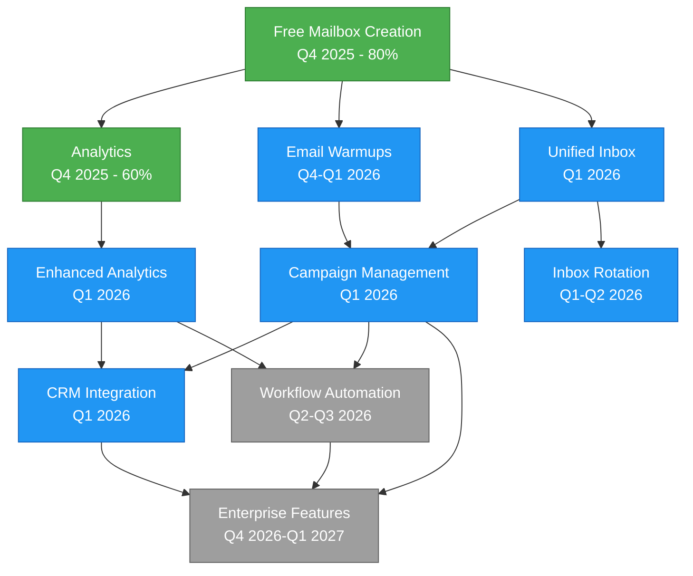

# Feature Roadmap Index

## Overview

This directory contains detailed roadmap documents for each major feature in the PenguinMails platform. Each feature has its own file with timeline, dependencies, milestones, and cross-references to related documentation.

---

## 🗺️ All Features by Timeline

### Q4 2025: MVP Foundation

| Feature | Status | Progress | Dependencies | Priority |
|---------|--------|----------|--------------|----------|
| **[Free Mailbox Creation](./free-mailbox-creation.md)** | In Progress | 80% | None | Critical |
| **[Analytics](./analytics.md)** | In Progress | 60% | Free Mailbox Creation | High |
| **[Email Warmups](./email-warmups.md)** | Planned | 0% | Free Mailbox Creation | High |

### Q1 2026: Growth Phase

| Feature | Status | Progress | Dependencies | Priority |
|---------|--------|----------|--------------|----------|
| **[Unified Inbox](./unified-inbox.md)** | Planned | 0% | Free Mailbox Creation | High |
| **[Campaign Management](./campaign-management.md)** | Planned | 0% | Email Warmups, Unified Inbox | Critical |
| **[Enhanced Analytics](./enhanced-analytics.md)** | Planned | 0% | Analytics | Medium |
| **[CRM Integration](./crm-integration.md)** | Planned | 0% | Campaign Mgmt, Enhanced Analytics | High |

### Q1-Q2 2026: Scale Optimization

| Feature | Status | Progress | Dependencies | Priority |
|---------|--------|----------|--------------|----------|
| **[Inbox Rotation](./inbox-rotation.md)** | Planned | 0% | Free Mailbox, Unified Inbox | Medium |

### Q2-Q3 2026: Advanced Automation

| Feature | Status | Progress | Dependencies | Priority |
|---------|--------|----------|--------------|----------|
| **[Workflow Automation](./workflow-automation.md)** | Planned | 0% | Enhanced Analytics, Campaign Mgmt | Medium |

### Q4 2026 - Q1 2027: Enterprise Ready

| Feature | Status | Progress | Dependencies | Priority |
|---------|--------|----------|--------------|----------|
| **[Enterprise Features](./enterprise-features.md)** | Planned | 0% | Campaign Mgmt, CRM, Workflow | High |

---

## 📊 Dependency Graph



---

## 🔗 Feature Relationships

### Foundational Features (Block Multiple Others)

**[Free Mailbox Creation](./free-mailbox-creation.md)** blocks:

- Analytics
- Email Warmups
- Unified Inbox
- Inbox Rotation

**[Unified Inbox](./unified-inbox.md)** blocks:

- Campaign Management
- Inbox Rotation

**[Email Warmups](./email-warmups.md)** blocks:

- Campaign Management

### Core Product Features

**[Campaign Management](./campaign-management.md)** is required for:

- CRM Integration (needs campaign data)
- Workflow Automation (builds on campaigns)
- Enterprise Features (complete platform needed)

**[Enhanced Analytics](./enhanced-analytics.md)** is required for:

- CRM Integration (enhanced metrics)
- Workflow Automation (trigger conditions)

---

## 📈 Development Timeline

```
2025 Q4              Q1 2026              Q2 2026              Q3 2026              Q4 2026              Q1 2027
   |                    |                    |                    |                    |                    |
   ├─ Free Mailbox ────┤
   ├─ Analytics ───────┤
   ├───── Email Warmups ─────┤
               ├─ Unified Inbox ──┤
               ├─ Campaign Mgmt───┤
               ├─ Enhanced Analytics ─┤
               ├─ CRM Integration ────┤
                          ├──── Inbox Rotation ────┤
                                    ├───── Workflow Automation ─────┤
                                                      ├────── Enterprise Features ───────┤
```

---

## 🎯 Critical Path

The **critical path** for Product Launch is:

1. **[Free Mailbox Creation](./free-mailbox-creation.md)** (Q4 2025) → Foundation
2. **[Email Warmups](./email-warmups.md)** (Q4 2025 - Q1 2026) → Email reputation
3. **[Unified Inbox](./unified-inbox.md)** (Q1 2026) → Reply management
4. **[Campaign Management](./campaign-management.md)** (Q1 2026) → Core product

**Delays in any of these 4 features will delay the entire product launch.**

---

## 📋 Feature Status Legend

- **In Progress**: Active development, percentage shows completion
- **Planned**: Designed and scheduled, ready to start
- **Future**: Researched but execution timeline TBD

### Progress Indicators

| Range | Meaning |
|-------|---------|
| 0% | Not started, scheduled |
| 1-30% | Research and design phase |
| 31-60% | Core implementation underway |
| 61-90% | Testing and refinement |
| 91-99% | Launch preparation |
| 100% | Complete and launched |

---

## 🔗 Related Documentation

### Planning

- **[Product Roadmap](../product-roadmap.md)** - Overall product timeline and business context
- **[Technical Roadmap](../technical-roadmap.md)** - Infrastructure milestones and technical considerations
- **[Roadmap Overview](../README.md)** - Roadmap navigation hub

### Feature Specifications

- **[Features Directory](../../features/README.md)** - Detailed feature requirements and specifications

### User Workflows

- **[User Journeys](../../user-journeys/README.md)** - How features fit into user workflows

### Implementation

- **[Tasks Directory](../../../tasks/README.md)** - Development tasks organized by epic

---

## 📊 Statistics

- **Total Features**: 10
- **In Progress**: 2 (Free Mailbox Creation, Analytics)
- **Planned - Q4 2025**: 1 (Email Warmups)
- **Planned - Q1 2026**: 4 (Unified Inbox, Campaign Mgmt, Enhanced Analytics, CRM)
- **Planned - Q1-Q2 2026**: 1 (Inbox Rotation)
- **Planned - Q2-Q3 2026**: 1 (Workflow Automation)
- **Planned - Q4 2026-Q1 2027**: 1 (Enterprise Features)

---

## 💡 How to Use This Directory

### For Product Managers

1. Start with this README for the big picture
2. Read individual feature files for detailed milestones
3. Check dependencies before committing to timelines
4. Use the dependency graph to understand feature relationships

### For Engineering Teams

1. View the critical path to understand priorities
2. Read feature files for technical requirements
3. Check "Related Documentation" links for specs
4. Monitor dependencies before starting implementation

### For Business Leaders

1. Review the timeline chart for delivery expectations
2. Understand the critical path for product launch
3. See statistics for progress tracking
4. Link to business context in product roadmap

---

**Last Updated**: 2025-11-24  
**Features in This Directory**: 10  
**Next Milestone**: Free Mailbox Creation completion (Q4 2025)
