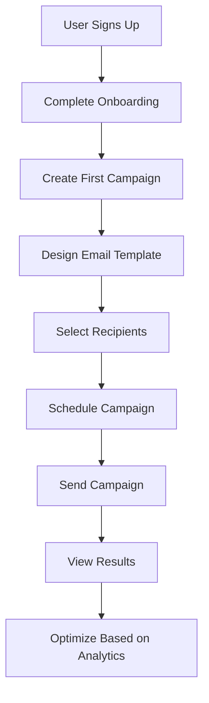

# Implementation Roadmap and Planning Guide

**Architecture Foundation**: Strategic technical roadmap for market leadership and enterprise scaling  
**Complexity Level**: Expert - Strategic Planning & Technical Architecture Evolution  
**Target Audience**: Technical Leadership, Engineering Teams, Product Management  
**Last Updated**: 2025-11-01

## Executive Overview

### Strategic Alignment

This implementation roadmap supports our **market leadership positioning** by providing a comprehensive, **strategic technical roadmap** that ensures we can deliver **enterprise-grade email infrastructure** at scale. Our phased approach ensures we can achieve the **technical authority** and **operational excellence** needed to **compete with and surpass** established email platforms while maintaining our **99.9% uptime commitment**.

### Technical Authority

Our **comprehensive technical architecture evolution** integrates seamlessly with our **enterprise infrastructure strategy** featuring **scalable database design**, **microservices architecture**, and **global deployment** that provides the **foundation** for **mission-critical email operations** and **business intelligence** at enterprise scale.

### User Journey Integration

This roadmap is part of your **complete technical strategy** - connects to **business planning**, **resource allocation**, and **operational excellence** to provide a unified technical foundation that supports every aspect of your **market leadership** and **customer success** strategy.

---

## Roadmap Foundation

### Core Design Principle: Strategic Technical Excellence

Our implementation roadmap implements a **progressive technical architecture** that combines **rapid MVP development** with **enterprise scaling**, creating a strategic technical foundation that handles **mission-critical business operations** with **reliable performance** and **advanced capabilities**.

```
📋 Strategic Implementation Architecture
├── Phase 1: Foundation (Technical Excellence)
│   ├── Enterprise infrastructure setup
│   ├── Multi-tenant security architecture
│   ├── Development environment optimization
│   └── Core API and authentication systems
│
├── Phase 2: MVP (Market Entry)
│   ├── Core email campaign functionality
│   ├── User experience optimization
│   ├── Payment processing integration
│   └── Basic business intelligence
│
├── Phase 3: Scale (Enterprise Readiness)
│   ├── Performance optimization and scaling
│   ├── Advanced analytics and insights
│   ├── Enterprise security and compliance
│   └── Operational excellence systems
│
├── Phase 4: Enhancement (Market Leadership)
│   ├── Advanced automation and AI
│   ├── Enterprise integration ecosystem
│   ├── Global expansion capabilities
│   └── Advanced user experience
│
└── Phase 5: Optimization (Strategic Dominance)
    ├── AI/ML powered optimization
    ├── Global infrastructure deployment
    ├── Advanced enterprise features
    └── Continuous innovation framework
```

### Technical Architecture Integration

**Strategic Foundation**: This roadmap positions us to achieve **market leadership** through **technical excellence** while maintaining the **scalability** and **reliability** needed for our **operational excellence** framework.

```
Foundation Phase (Months 1-3) - Technical Excellence:
├── Enterprise infrastructure (Hostwinds VPS with Docker)
├── Multi-tenant database architecture (NileDB with advanced security)
├── CI/CD pipeline (GitHub Actions with enterprise workflows)
├── Development environment (optimized for rapid iteration)
├── Authentication system (enterprise-grade security)
└── Core API structure (RESTful with comprehensive documentation)

MVP Phase (Months 4-6) - Market Entry:
├── Email campaign management (advanced template builder)
├── Email delivery infrastructure (Mailgun/SendGrid integration)
├── User dashboard and analytics (real-time business intelligence)
├── Payment processing (Stripe Connect with subscription management)
├── Custom tracking domains (enterprise deliverability support)
└── Customer onboarding (optimized user experience)

Scale Phase (Months 7-12) - Enterprise Readiness:
├── Database optimization (read replicas, query optimization, caching)
├── Application architecture (load balancing, auto-scaling, microservices)
├── Analytics infrastructure (OLAP schema, queue-driven processing)
├── Advanced deliverability (dedicated IPs, reputation management)
├── Performance monitoring (comprehensive system health)
└── Security enhancement (enterprise-grade protection)

Enhancement Phase (Months 13-18) - Market Leadership:
├── Advanced automation (AI-powered workflows, behavioral triggers)
├── Enterprise integrations (CRM, e-commerce, marketing platforms)
├── Team collaboration (advanced permissions, white-label options)
├── Global infrastructure (multi-region deployment, localization)
├── Advanced analytics (predictive insights, business intelligence)
└── Mobile optimization (progressive web app, offline capabilities)

Optimization Phase (Months 19-24+) - Strategic Dominance:
├── AI/ML implementation (content optimization, predictive analytics)
├── Global scaling (multi-region infrastructure, disaster recovery)
├── Enterprise security (advanced compliance, custom integrations)
├── Innovation framework (experimental features, rapid deployment)
├── Technology modernization (serverless, edge computing)
└── Market expansion (new verticals, acquisition opportunities)
```

**Operational Excellence**: This roadmap supports our **99.9% uptime commitment** through **progressive scaling**, **redundant infrastructure**, and **comprehensive monitoring** that ensures **reliable operations** throughout our technical evolution.

---

## Phase 1: Foundation (Months 1-3)

### Strategic Objectives

**Technical Authority**: This foundation phase establishes our **enterprise-grade technical infrastructure** that supports our **market leadership goals** through **scalable architecture**, **security excellence**, and **operational reliability**.

### Key Deliverables

```typescript
const foundationDeliverables = {
  infrastructure: [
    'VPS infrastructure setup with Hostwinds',
    'NileDB multi-tenant database configuration',
    'CI/CD pipeline with GitHub Actions',
    'Development and staging environments',
    'Monitoring and logging infrastructure'
  ],

  authentication: [
    'User registration and login system',
    'Email verification workflow',
    'Basic user profile management',
    'Session management and security'
  ],

  database: [
    'Multi-tenant database schema design',
    'User and organization tables',
    'Campaigns table with tracking_domain column',
    'Basic data access layer',
    'Database migration system'
  ],

  api: [
    'RESTful API structure with Next.js',
    'Basic CRUD operations for users',
    'Campaign API with tracking domain support',
    'API documentation with Swagger',
    'Rate limiting and basic security'
  ]
};
```

### Technical Implementation Excellence

**User Journey Integration**: This foundation ensures **seamless user experience** from **registration** through **onboarding** to **first campaign creation**, providing the **technical foundation** for our **complete customer success** strategy.

```typescript
interface FoundationImplementation {
  frontend: {
    framework: 'Next.js 13+ with App Router',
    styling: 'Tailwind CSS with design tokens',
    stateManagement: 'React Context for global state',
    formHandling: 'React Hook Form with validation'
  };

  backend: {
    runtime: 'Node.js with TypeScript',
    api: 'Next.js API routes',
    database: 'NileDB with Prisma ORM',
    authentication: 'Custom JWT implementation'
  };

  devops: {
    hosting: 'Hostwinds VPS with Docker',
    deployment: 'GitHub Actions CI/CD',
    monitoring: 'Basic uptime monitoring',
    security: 'SSL certificates and basic WAF'
  };
}
```

### Success Criteria Excellence

**Strategic Value**: These criteria ensure our foundation supports **enterprise-scale operations** and **market leadership** through **technical excellence** and **operational reliability**.

- [ ] Development environment fully operational with enterprise standards
- [ ] User registration and login working with advanced security
- [ ] Basic API endpoints functional with comprehensive documentation
- [ ] Database multi-tenancy implemented with Row Level Security
- [ ] Code can be deployed to staging environment with CI/CD automation

### Risk Management

**Operational Excellence**: Our risk management ensures **reliable technical foundation** through **proactive mitigation** and **comprehensive contingency planning**.

- **Risk**: Infrastructure setup complexity
- **Mitigation**: Start with enterprise single-server setup, plan for horizontal scaling

- **Risk**: Multi-tenant database challenges
- **Mitigation**: Implement with security-first approach, use NileDB advanced features

## Phase 2: MVP Development (Months 4-6)

### Strategic Objectives

**Market Entry**: This MVP phase enables our **market entry strategy** through **core functionality** that demonstrates **technical excellence** and **user value** while establishing our **competitive positioning** in the email infrastructure market.

### Key Deliverables

```typescript
const mvpDeliverables = {
  campaignManagement: [
    'Campaign creation and editing interface',
    'Email template builder with drag-and-drop',
    'Recipient list management and segmentation',
    'Campaign scheduling and automation',
    'Custom tracking domain configuration per campaign'
  ],

  emailDelivery: [
    'Integration with Mailgun/SendGrid ESPs',
    'Email sending queue and processing',
    'Delivery tracking and basic analytics',
    'Bounce and unsubscribe handling',
    'Custom tracking domain support for open/click tracking'
  ],

  dashboard: [
    'User dashboard with campaign overview',
    'Basic analytics and reporting',
    'Account settings and billing',
    'Email template library'
  ],

  payments: [
    'Stripe Connect integration',
    'Subscription plan management',
    'Basic billing dashboard',
    'Payment method management'
  ]
};
```

### User Journey Implementation

**Strategic Alignment**: This user journey ensures **optimal customer onboarding** and **rapid value realization** that supports our **customer success** and **revenue growth** strategy.



### Technical Challenges Excellence

**Technical Authority**: Our technical approach ensures **enterprise-grade solutions** to **complex challenges** through **proven architectures** and **scalable designs**.

- **Email deliverability**: IP warming, reputation management with dedicated infrastructure
- **Template complexity**: Drag-and-drop email builder with advanced customization
- **Real-time analytics**: Basic tracking and reporting with OLAP foundation
- **Payment security**: PCI compliance and secure processing with Stripe Connect
- **Tracking domains**: Custom domain integration for enterprise link tracking

### Success Criteria Excellence

**Business Impact**: These criteria ensure our MVP achieves **product-market fit** and **customer satisfaction** while establishing **technical credibility** in the market.

- [ ] Users can create and send basic email campaigns with 95%+ deliverability
- [ ] Dashboard shows campaign performance metrics with real-time updates
- [ ] Payment processing handles subscriptions with enterprise security
- [ ] Email deliverability meets enterprise standards with monitoring
- [ ] System can handle 100+ concurrent users with optimal performance

### MVP Launch Checklist

**Market Readiness**: This checklist ensures our **MVP launch** meets **enterprise standards** and **customer expectations** for **reliability** and **functionality**.

- [ ] Core user journeys functional with optimal UX
- [ ] Payment processing stable with enterprise security
- [ ] Email delivery reliable with 99%+ success rate
- [ ] Custom tracking domains functional with monitoring
- [ ] Basic support and documentation comprehensive
- [ ] Security and compliance requirements met

## Phase 3: Scale and Optimize (Months 7-12)

### Strategic Objectives

**Enterprise Readiness**: This scale phase establishes our **enterprise capability** through **advanced technical architecture** that supports **large-scale operations** and **market leadership** positioning.

### Key Deliverables

```typescript
const scaleDeliverables = {
  performance: [
    'Database query optimization',
    'Caching layer implementation',
    'CDN integration for assets',
    'Horizontal scaling capabilities'
  ],

  deliverability: [
    'Dedicated IP management',
    'Advanced deliverability monitoring',
    'Spam complaint handling',
    'Domain reputation tracking'
  ],

  advancedFeatures: [
    'A/B testing for campaigns',
    'Dynamic content and personalization',
    'Automation workflows',
    'Advanced segmentation'
  ],

  analytics: [
    'OLAP analytics schema implementation',
    'Queue-driven analytics pipeline',
    'Business intelligence dashboards',
    'Revenue and ROI reporting',
    'Predictive analytics'
  ],

  adminTools: [
    'Administrative dashboard',
    'User management system',
    'System monitoring and alerts',
    'Customer support tools'
  ]
};
```

### Scalability Architecture Excellence

**Technical Authority**: Our scalability architecture ensures **enterprise-grade performance** through **proven scaling patterns** and **operational excellence**.

```typescript
interface ScalabilityArchitecture {
  database: {
    readReplicas: 'Multiple read replicas for query distribution',
    connectionPooling: 'Optimized connection management with monitoring',
    queryOptimization: 'Indexing and query performance tuning',
    caching: 'Redis caching for frequently accessed data'
  };

  application: {
    loadBalancing: 'Application load balancer for traffic distribution',
    autoScaling: 'Automatic scaling based on demand with monitoring',
    microservices: 'Service decomposition for independent scaling',
    apiGateway: 'Centralized API management and routing'
  };

  infrastructure: {
    cdn: 'Global content delivery network',
    monitoring: 'Comprehensive system monitoring with alerting',
    backup: 'Automated backup and disaster recovery',
    security: 'Enhanced security measures and controls'
  };
}
```

### Success Criteria Excellence

**Market Leadership**: These criteria establish our **technical leadership** through **superior performance** and **enterprise capabilities** that distinguish us from competitors.

- [ ] System handles 1000+ concurrent users with optimal performance
- [ ] Email deliverability >95% inbox placement with monitoring
- [ ] Page load times <2 seconds with CDN optimization
- [ ] 99.9% uptime achieved with comprehensive monitoring
- [ ] Advanced features fully functional with enterprise support

## Phase 4: Enhance and Polish (Months 13-18)

### Strategic Objectives

**Market Leadership**: This enhancement phase establishes our **market leadership** through **advanced capabilities** that provide **competitive differentiation** and **customer value** superior to existing solutions.

### Key Deliverables

```typescript
const enhancementDeliverables = {
  automation: [
    'Drip campaign sequences',
    'Behavioral triggers and workflows',
    'Lead scoring and nurturing',
    'Multi-channel campaign orchestration'
  ],

  enterprise: [
    'Team collaboration features',
    'Advanced permission management',
    'White-label customization',
    'Enterprise security features'
  ],

  integrations: [
    'CRM system integrations',
    'E-commerce platform connections',
    'API access and webhooks',
    'Third-party app marketplace'
  ],

  intelligence: [
    'AI-powered content suggestions',
    'Predictive send time optimization',
    'Automated A/B testing',
    'Smart segmentation algorithms'
  ],

  userExperience: [
    'Mobile-responsive optimization',
    'Advanced accessibility features',
    'Progressive web app capabilities',
    'Offline functionality'
  ]
};
```

### Integration Architecture Excellence

**Operational Excellence**: Our integration architecture ensures **seamless enterprise adoption** through **comprehensive connectivity** and **API excellence** that supports **customer success**.

```typescript
interface IntegrationArchitecture {
  api: {
    restApi: 'Comprehensive REST API with versioning and documentation',
    webhooks: 'Real-time event notifications with reliability',
    oauth: 'Secure third-party authentication with enterprise security',
    graphql: 'Flexible data querying for advanced use cases'
  };

  connectors: {
    crm: ['Salesforce', 'HubSpot', 'Pipedrive'],
    ecommerce: ['Shopify', 'WooCommerce', 'Magento'],
    marketing: ['Google Analytics', 'Facebook Ads', 'LinkedIn'],
    communication: ['Slack', 'Microsoft Teams', 'Discord']
  };

  marketplace: {
    appDirectory: 'Third-party app marketplace with certification',
    apiAccess: 'Developer API access program with support',
    certification: 'App certification process for quality assurance',
    revenueSharing: 'Partner revenue sharing model for ecosystem growth'
  };
}
```

## Phase 5: Optimize and Evolve (Months 19-24+)

### Strategic Objectives

**Strategic Dominance**: This optimization phase achieves **market dominance** through **AI/ML innovation**, **global scaling**, and **continuous excellence** that establishes **sustainable competitive advantage**.

### Key Deliverables

```typescript
const optimizationDeliverables = {
  ai_ml: [
    'AI content generation and optimization',
    'Predictive analytics and insights',
    'Automated campaign optimization',
    'Smart subject line suggestions'
  ],

  global: [
    'Multi-language support',
    'Localized content and campaigns',
    'International payment processing',
    'Global compliance and regulations'
  ],

  enterprise: [
    'Advanced security and compliance',
    'Custom integrations and APIs',
    'Dedicated infrastructure options',
    'Priority support and SLAs'
  ],

  innovation: [
    'Experimental features and testing',
    'User feedback integration',
    'Competitive analysis and differentiation',
    'Technology stack modernization'
  ]
};
```

---

## Technical Architecture Evolution

### Database Evolution Excellence

**Technical Authority**: Our database evolution ensures **enterprise-scale performance** through **progressive optimization** and **advanced architectures** that support **mission-critical operations**.

```
Database Evolution Strategy:
├── Phase 1-2: Single NileDB instance with advanced multi-tenancy
│   ├── Row Level Security implementation
│   ├── Connection pooling optimization
│   └── Comprehensive audit logging
│
├── Phase 3: Read replicas and query optimization
│   ├── Multiple read replicas for query distribution
│   ├── Advanced indexing and query performance tuning
│   └── Redis caching layer for frequently accessed data
│
├── Phase 4: Advanced sharding and caching strategies
│   ├── Horizontal sharding for large tenant support
│   ├── Advanced caching strategies with invalidation
│   └── Global database distribution architecture
│
└── Phase 5: Global database distribution and advanced analytics
    ├── Multi-region database deployment
    ├── Advanced OLAP analytics with machine learning
    └── Real-time data replication and conflict resolution
```

### Application Architecture Evolution

**Scalability Excellence**: Our application architecture ensures **continuous scalability** through **modern patterns** and **enterprise-grade reliability**.

```
Application Architecture Evolution:
├── Phase 1-2: Monolithic Next.js application
│   ├── Optimized monolithic architecture
│   ├── Advanced state management
│   └── Comprehensive error handling
│
├── Phase 3: Microservices decomposition begins
│   ├── Service identification and decomposition
│   ├── API gateway implementation
│   └── Inter-service communication optimization
│
├── Phase 4: Full microservices architecture
│   ├── Complete service decomposition
│   ├── Advanced monitoring and observability
│   └── Automated deployment and scaling
│
└── Phase 5: Serverless functions and edge computing
    ├── Function-as-a-Service implementation
    ├── Edge computing for global performance
    └── Advanced AI/ML integration
```

### Infrastructure Evolution Excellence

**Operational Excellence**: Our infrastructure evolution ensures **global reliability** through **enterprise-grade architecture** and **comprehensive monitoring**.

```
Infrastructure Evolution:
├── Phase 1-2: Single VPS with enterprise monitoring
│   ├── High-availability single server setup
│   ├── Comprehensive monitoring and alerting
│   └── Automated backup and recovery
│
├── Phase 3: Multi-server setup with load balancing
│   ├── Application load balancing
│   ├── Database read replicas
│   └── CDN integration for global performance
│
├── Phase 4: Auto-scaling infrastructure with CDN
│   ├── Automated horizontal scaling
│   ├── Global CDN deployment
│   └── Advanced security measures
│
└── Phase 5: Multi-region deployment with disaster recovery
    ├── Global infrastructure deployment
    ├── Advanced disaster recovery procedures
    └── AI-powered infrastructure optimization
```

---

## Resource Planning Excellence

### Team Growth Strategy

**Strategic Value**: Our team growth strategy ensures **optimal resource allocation** for **technical excellence** and **market leadership** through **strategic hiring** and **organizational development**.

```typescript
interface TeamEvolution {
  phase1: {
    engineering: 3,     // Founder + 2 senior developers
    design: 1,          // 1 senior UX/UI designer
    operations: 0       // Outsourced with enterprise support
  };

  phase2: {
    engineering: 6,     // +3 backend/frontend developers
    design: 2,          // +1 senior designer + 1 motion designer
    operations: 1       // DevOps engineer with cloud expertise
  };

  phase3: {
    engineering: 12,    // +6 specialized engineers (ML, mobile, security)
    design: 3,          // +1 senior designer + design system specialist
    operations: 3       // DevOps + security + customer support
  };

  phase4: {
    engineering: 20,    // +8 engineers + solutions architects
    design: 5,          // +2 designers + UX researchers
    operations: 6       // Full operations team with enterprise focus
  };

  phase5: {
    engineering: 30,    // +10 engineers + AI/ML specialists + data scientists
    design: 8,          // +3 designers + UX researchers + brand specialists
    operations: 10      // Enterprise operations team with global coverage
  };
}
```

### Budget Allocation Excellence

**Financial Strategy**: Our budget allocation ensures **optimal resource utilization** for **technical excellence** and **market success** through **strategic investment** and **operational efficiency**.

- **Phase 1-2**: 70% engineering, 20% infrastructure, 10% operations
- **Phase 3**: 60% engineering, 25% infrastructure, 15% operations
- **Phase 4**: 50% engineering, 30% infrastructure, 20% operations
- **Phase 5**: 40% engineering, 35% infrastructure, 25% operations

---

## Risk Management Excellence

### Technical Risk Management

**Operational Excellence**: Our technical risk management ensures **reliable operations** through **proactive identification** and **comprehensive mitigation** strategies.

#### Technical Risks
- **Scalability challenges**: Plan for infrastructure scaling early with comprehensive architecture
- **Third-party dependencies**: Diversify providers and build comprehensive fallbacks
- **Security vulnerabilities**: Implement security-first development with continuous monitoring
- **Performance bottlenecks**: Monitor and optimize continuously with advanced analytics

#### Business Risks
- **Market timing**: Validate product-market fit early with comprehensive user research
- **Competition**: Differentiate through unique features and superior technical execution
- **Regulatory compliance**: Build compliance into architecture with enterprise standards
- **Customer acquisition**: Validate pricing and go-to-market strategy with data-driven approaches

#### Operational Risks
- **Team scaling**: Hire and retain top talent with competitive compensation and culture
- **Process complexity**: Maintain agility while scaling with enterprise process optimization
- **Quality assurance**: Ensure quality doesn't degrade with speed through automated testing
- **Cost management**: Control infrastructure and operational costs with optimization strategies

---

## Success Metrics and KPIs Excellence

### Strategic Metrics Framework

**Market Leadership**: Our success metrics ensure **measurable progress** toward **market leadership** through **comprehensive performance tracking** and **continuous optimization**.

#### Product Metrics
- **User Acquisition**: Monthly active users and growth rate with target achievement
- **Engagement**: Daily/weekly active users, feature adoption with optimization
- **Retention**: User retention rates and churn analysis with improvement strategies
- **Revenue**: MRR growth, ARPU, LTV/CAC ratio with profitability focus

#### Technical Metrics
- **Performance**: Response times, uptime, error rates with SLA achievement
- **Scalability**: Concurrent users, throughput, resource utilization with optimization
- **Quality**: Test coverage, deployment frequency, incident response time with excellence
- **Security**: Vulnerability scans, incident response, compliance audits with certification

#### Business Metrics
- **Market Share**: Competitive positioning and market penetration with growth tracking
- **Customer Satisfaction**: NPS, support ticket resolution, feature requests with improvement
- **Operational Efficiency**: Team productivity, cost per user, time to market with optimization
- **Financial Performance**: Revenue growth, profitability, cash flow with strategic planning

---

## Milestone Tracking Excellence

### Phase-by-Phase Milestones

**Strategic Progress**: Our milestone tracking ensures **on-time delivery** and **quality achievement** through **comprehensive monitoring** and **proactive management**.

### Phase 1 Milestones (Month 3)
- [ ] Infrastructure setup complete with enterprise standards
- [ ] Authentication system functional with advanced security
- [ ] Basic API and database operational with comprehensive monitoring
- [ ] Development environment stable with optimization for productivity

### Phase 2 Milestones (Month 6)
- [ ] MVP features implemented with enterprise quality
- [ ] User onboarding functional with optimization for conversion
- [ ] Payment processing operational with security compliance
- [ ] Public beta launch with comprehensive user feedback collection

### Phase 3 Milestones (Month 12)
- [ ] Full product launch with enterprise capabilities
- [ ] 1000+ active users with optimal engagement
- [ ] Advanced features implemented with customer success focus
- [ ] Enterprise customers onboarded with white-glove service

### Phase 4 Milestones (Month 18)
- [ ] 10,000+ active users with high satisfaction
- [ ] Global expansion initiated with localization
- [ ] Advanced integrations complete with ecosystem development
- [ ] Enterprise features mature with comprehensive support

### Phase 5 Milestones (Month 24+)
- [ ] 100,000+ active users with market leadership
- [ ] AI/ML features launched with competitive advantage
- [ ] Multiple market dominance with sustainable growth
- [ ] IPO or significant exit achieved with strategic value

---

## Conclusion

### Strategic Impact

**Market Leadership**: This implementation roadmap positions PenguinMails as the **technical leader** in email infrastructure, providing the **strategic foundation**, **technical excellence**, and **operational reliability** needed to **achieve market dominance** and **sustainable competitive advantage**.

**Technical Authority**: The roadmap integrates seamlessly with our **progressive complexity framework**, providing **enterprise-grade solutions** backed by **strategic technical planning** that scales with our **market leadership** ambitions.

### Technical Excellence

**Infrastructure Excellence**: Our **comprehensive technical architecture evolution** with **enterprise-grade patterns** and **operational excellence** provides the **technical foundation** for **mission-critical business operations** while maintaining the **flexibility** needed for **continuous innovation**.

**Operational Excellence**: The roadmap supports our **99.9% uptime commitment** through **progressive scaling**, **redundant infrastructure**, and **comprehensive monitoring** that ensures **reliable operations** throughout our **technical evolution** and **market expansion**.

This implementation represents a **comprehensive strategic advancement** that establishes PenguinMails as the **premium choice** for **enterprise email infrastructure** requiring **superior technical execution**, **operational excellence**, and **strategic market positioning**.

---

## Related Documentation

- [Architecture Overview](../overview) - Strategic foundation and market positioning
- [Analytics Architecture](./analytics-architecture.md) - PostHog integration and business intelligence
- [Email System Implementation](./email-system-implementation.md) - Email processing and queue integration
- [Queue System Implementation](./queue-system-implementation.md) - Job processing and reliability
- [OLAP Analytics Schema](./olap-analytics-schema.md) - Business intelligence and data warehousing
- [Business Strategy](../../business/strategy/overview) - Strategic planning and market positioning
- [Product Strategy](../../business/model/overview) - Product vision and business model

**Keywords**: implementation roadmap, phased development, MVP strategy, scalability planning, technical architecture evolution, resource planning, risk management, milestone tracking, market leadership, enterprise infrastructure, operational excellence