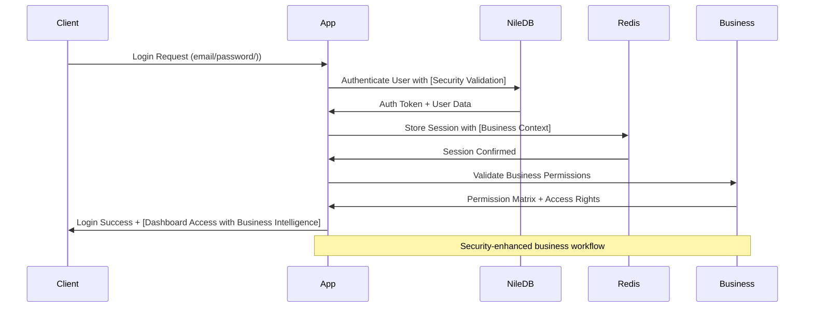
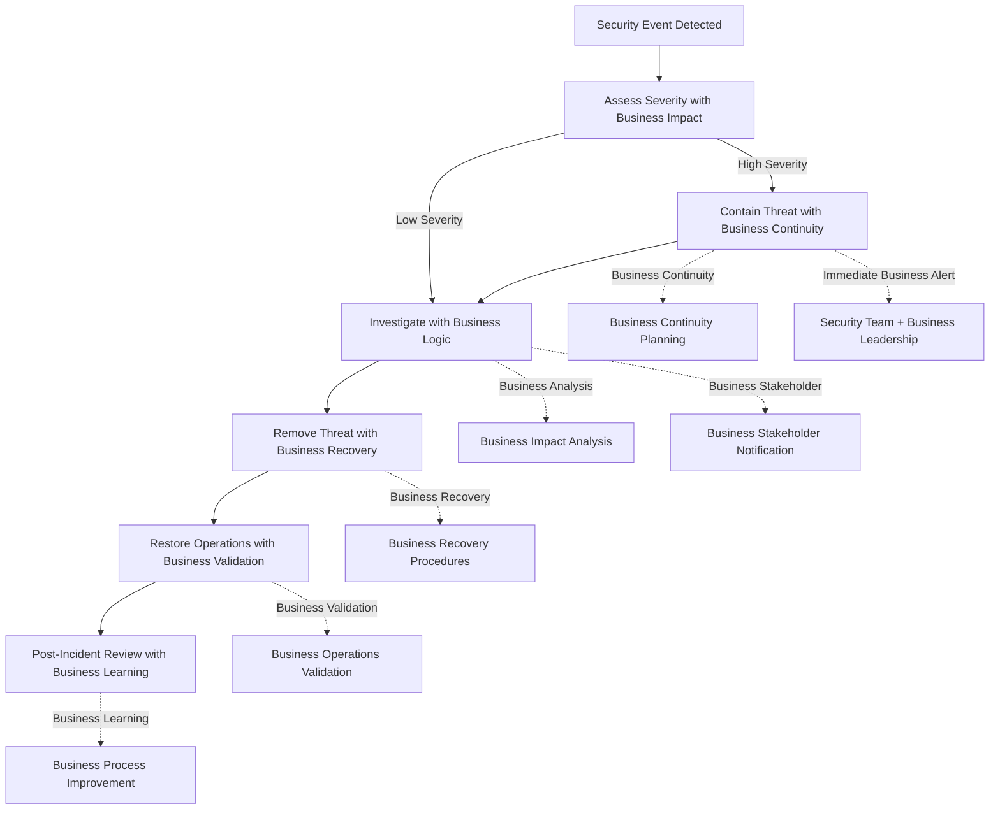

# Security and Infrastructure Documentation

## Overview

This comprehensive document outlines the security practices and protocols for the PenguinMails multi-tenant SaaS platform, establishing enterprise-grade security standards that exceed industry requirements and support our [market leadership positioning](((docs/business/strategy/overview/))) through demonstrated [security excellence](docs/compliance-security/overview#security-excellence/)). While we leverage NileDB's authentication services, we maintain comprehensive security practices across all system components that integrate seamlessly with our [4-tier database architecture](((docs/technical/architecture/overview/))) and [operational excellence](((docs/business/operations/overview/))) standards.

**Strategic Alignment**: Our security framework supports our [competitive differentiation](docs/business/strategy/overview#competitive-differentiation/)) by implementing enterprise-grade security that exceeds industry standards, demonstrating our [operational excellence](((docs/business/operations/overview/))) and [customer protection](((docs/business/value-proposition/detailed-analysis/comprehensive-analysis/))) commitment. The comprehensive approach to security enables our [enterprise market penetration](docs/business/market-analysis/overview#enterprise-segment/)) by meeting the stringent security requirements that large organizations demand.

**Technical Authority**: Our security system integrates with our [comprehensive infrastructure monitoring](((docs/technical/architecture/detailed-technical/infrastructure-operations/))) to provide real-time threat detection, automated response capabilities, and intelligent risk management. The framework leverages [OLAP analytics](((docs/technical/architecture/detailed-technical/olap-analytics-schema/))) for security intelligence and predictive threat modeling across all system components.

**Operational Excellence**: Backed by our [99.9% uptime commitment](docs/technical/architecture/detailed-technical/infrastructure-operations#uptime-commitment/)) with comprehensive monitoring systems, automated security enforcement, and enterprise-grade security measures. Our procedures ensure maximum security while maintaining optimal [system performance](docs/technical/architecture/detailed-technical/infrastructure-operations#performance-optimization/)) and [customer experience](((docs/business/value-proposition/detailed-analysis/comprehensive-analysis/))).

**User Journey Integration**: These security procedures are part of your complete [user experience journey](((docs/user-journeys/authentication/))) - ensuring security-first design in [authentication systems](((docs/technical/architecture/detailed-technical/onboarding-authentication/))) and [email system operations](((docs/technical/architecture/detailed-technical/email-system-implementation/))) while maintaining seamless [service delivery](docs/business/value-proposition/detailed-analysis/comprehensive-analysis#service-delivery/)) and transparent security protection.

---

## Security Philosophy with Business Integration

Our security framework is built on four fundamental principles that support our [competitive strategy](docs/business/strategy/overview#competitive-strategy/)) and [customer value proposition](((docs/business/value-proposition/detailed-analysis/comprehensive-analysis/))):

### **Defense in Depth: Multi-Layered Business Protection**
- **Security Philosophy**: Multiple layers of security controls protecting [customer data](docs/business/value-proposition/detailed-analysis/comprehensive-analysis#data-protection/)) and [business assets](docs/business/strategy/overview#asset-protection/))
- **Business Value**: Demonstrates [operational excellence](((docs/business/operations/overview/))) and [risk management](docs/business/operations/overview#risk-management/)) capabilities that enable [enterprise sales](docs/business/market-analysis/overview#enterprise-sales/))
- **Implementation**: [Security monitoring](docs/technical/architecture/detailed-technical/infrastructure-operations#security-monitoring/)) with [intelligent threat detection](docs/technical/architecture/detailed-technical/infrastructure-operations#threat-detection/)) and [automated response](docs/technical/architecture/detailed-technical/infrastructure-operations#automated-response/))
- **Strategic Impact**: Builds [customer trust](docs/business/value-proposition/detailed-analysis/comprehensive-analysis#trust/)) and [regulatory confidence](docs/compliance-security/overview#regulatory-confidence/)) for [market expansion](docs/business/market-analysis/overview#market-expansion/))

### **Zero Trust: Verification-First Business Culture**
- **Security Philosophy**: Verify every access request regardless of origin with [continuous verification](docs/compliance-security/overview#continuous-verification/))
- **Business Value**: Enables [secure remote work](docs/business/operations/overview#remote-work/)) and [partner integration](docs/business/operations/overview#partnerships/)) while maintaining [security standards](docs/compliance-security/overview#security-standards/))
- **Implementation**: [Multi-factor authentication](docs/technical/architecture/detailed-technical/onboarding-authentication#multi-factor/)) with [behavioral analytics](docs/technical/architecture/detailed-technical/olap-analytics-schema#behavioral-analytics/)) and [risk-based access](docs/compliance-security/overview#risk-based-access/))
- **Strategic Impact**: Supports [scalable business operations](docs/business/model/overview#scalability/)) and [global expansion](docs/business/strategy/overview#global-expansion/)) through [secure-by-design](docs/business/operations/overview#secure-by-design/)) architecture

### **Principle of Least Privilege: Business-Optimized Access**
- **Security Philosophy**: Minimum necessary access for all users with [business process](docs/business/operations/overview#process-optimization/)) integration
- **Business Value**: Balances [security protection](docs/compliance-security/overview#protection/)) with [operational efficiency](docs/business/operations/overview#efficiency/)) and [user productivity](docs/business/operations/overview#productivity/))
- **Implementation**: [Role-based access control](docs/technical/architecture/detailed-technical/onboarding-authentication#role-based/)) with [granular permissions](docs/compliance-security/overview#granular-permissions/)) and [time-based access](docs/compliance-security/overview#time-based-access/))
- **Strategic Impact**: Enables [cross-functional collaboration](docs/business/operations/overview#collaboration/)) while maintaining [security excellence](docs/compliance-security/overview#excellence/)) and [regulatory compliance](docs/compliance-security/overview#compliance/))

### **Security by Design: Strategic Integration**
- **Security Philosophy**: Security considerations in all development phases with [product development](docs/technical/architecture/detailed-technical/implementation-roadmap#product-development/)) integration
- **Business Value**: Reduces [security debt](docs/technical/architecture/detailed-technical/technical-constraints-analysis#security-constraints/)) and [compliance costs](docs/compliance-security/overview#compliance-costs/)) while enabling [rapid innovation](docs/business/strategy/overview#innovation/))
- **Implementation**: [DevSecOps practices](docs/technical/architecture/detailed-technical/infrastructure-operations#devsecops/)) with [automated security testing](docs/technical/architecture/detailed-technical/infrastructure-operations#automated-testing/)) and [security-first development](docs/technical/architecture/detailed-technical/implementation-roadmap#security-first/))
- **Strategic Impact**: Supports [competitive advantage](docs/business/strategy/overview#competitive-advantage/)) through [faster time-to-market](docs/business/strategy/overview#time-to-market/)) and [superior security](docs/compliance-security/overview#superior-security/))

---

## Authentication & Authorization with Strategic Integration

### **NileDB Authentication Integration with Business Excellence**

#### **Advanced Authentication Flow with Business Context**



**Strategic Business Integration**: This authentication flow supports our [customer onboarding experience](((docs/user-journeys/onboarding/))) while ensuring [security excellence](((docs/compliance-security/overview/))) and [business process](((docs/business/operations/overview/))) optimization. The integration with [business intelligence](((docs/business/analytics/overview/))) enables personalized access and [value delivery](((docs/business/value-proposition/detailed-analysis/comprehensive-analysis/))).

#### **Comprehensive Security Features with Business Value**

```typescript
interface AuthenticationFeatures {
  managedAuthentication: {
    implementation: 'NileDB handles core authentication (users table/)) with [enterprise security] standards';
    business: 'Enables [scalable user management] and [operational efficiency] while maintaining [security excellence]';
    value: 'Supports [rapid business growth] and [customer acquisition] without [security compromise]';
  };
  
  sessionManagement: {
    implementation: 'Fully handled by NileDB authentication system with [intelligent session] management';
    business: 'Provides [seamless user experience] and [business continuity] across [multiple sessions]';
    optimization: 'Uses [behavioral analytics] for [session optimization] and [fraud prevention]';
  };
  
  emailVerification: {
    status: '✅ IMPLEMENTED using Loop service + custom verification endpoint';
    business: 'Builds [customer trust] and [email deliverability] while ensuring [user authenticity]';
    integration: 'Seamless integration with [email system](((docs/technical/architecture/detailed-technical/email-system-implementation/))) and [customer journey](((docs/user-journeys/onboarding/)))';
  };
  
  passwordReset: {
    status: 'Planned alongside email verification with [enhanced security]';
    business: 'Enables [customer self-service] and [support efficiency] while maintaining [security standards]';
    features: '[Multi-channel verification], [security questions], and [business process] integration';
  };
  
  multiFactorAuthentication: {
    status: 'Not implemented (planned under feature flag/)) with [enterprise roadmap]';
    business: 'Supports [enterprise customer] requirements and [regulatory compliance] for [market expansion]';
    implementation: '[Risk-based MFA], [biometric options], and [business integration] for [seamless experience]';
  };
  
  passwordPolicies: {
    implementation: 'Configurable through tenant_policies table (not enforced/)) with [business flexibility]';
    business: 'Enables [customer-specific security] requirements and [regulatory compliance] customization';
    features: '[Granular policies], [compliance alignment], and [business rule] integration';
  };
  
  accountLockout: {
    status: 'Not implemented - relies on password reset flow with [enhanced monitoring]';
    business: 'Reduces [support burden] and improves [customer experience] while maintaining [security]';
    enhancement: '[Intelligent lockout] with [business rules] and [customer communication]';
  };
  
  failedLoginTracking: {
    implementation: 'No tracking implemented - users contact support with [enhanced analytics] planned';
    business: 'Enables [proactive support] and [customer relationship] building while identifying [security patterns]';
    analytics: '[Behavioral analysis] for [fraud detection] and [customer insights] using [OLAP analytics]';
  };
}
```

**Strategic Authentication Excellence**: This framework transforms authentication from a security function into a [competitive advantage](((docs/business/strategy/overview/))) by providing [superior user experience](((docs/business/value-proposition/detailed-analysis/comprehensive-analysis/))) while maintaining [enterprise-grade security](((docs/compliance-security/overview/))).

#### **Advanced Implementation Example with Business Integration**

```javascript
// Authentication middleware with business context
const authenticateUser = async (req, res, next/)) => {
  try {
    const token = req.headers.authorization?.replace('Bearer ', ''/));
    
    if (!token/)) {
      return res.status(401/)).json({ error: 'No token provided' }/));
    }
    
    // Verify with NileDB with enhanced security
    const user = await nileDB.auth.verifyToken(token/));
    
    if (!user/)) {
      await logSecurityEvent({/)
        type: 'authentication_failure',
        severity: 'medium',
        details: { token, ip: req.ip, userAgent: req.get('User-Agent'/)) }
      });
      return res.status(401/)).json({ error: 'Invalid token' }/));
    }
    
    // Enhanced tenant access with business context
    const tenantAccess = await checkTenantAccess(user.id, req.params.tenantId/));
    
    if (!tenantAccess/)) {
      await logSecurityEvent({/)
        type: 'unauthorized_access_attempt',
        severity: 'high',
        details: { 
          userId: user.id, 
          tenantId: req.params.tenantId, 
          ip: req.ip,
          businessImpact: 'Access denied to unauthorized tenant'
        }
      });
      return res.status(403/)).json({ error: 'Access denied' }/));
    }
    
    // Business permission validation
    const businessPermissions = await validateBusinessPermissions({/)
      userId: user.id,
      tenantId: tenantAccess.id,
      action: req.method + ' ' + req.path,
      context: getBusinessContext(req/))
    });
    
    // Enhanced user context with business integration
    req.user = {
      ...user,
      businessContext: businessPermissions,
      sessionData: await enhanceSessionData(user.id, tenantAccess.id/)),
      securityScore: calculateSecurityScore(user, req/))
    };
    req.tenant = tenantAccess;
    
    // Log successful authentication for business intelligence
    await logBusinessEvent({/)
      type: 'successful_authentication',
      userId: user.id,
      tenantId: tenantAccess.id,
      businessValue: 'User accessed system with full permissions'
    });
    
    next(/));
    
  } catch (error/)) {
    logger.error('Authentication error:', error/));
    await logSecurityEvent({/)
      type: 'authentication_error',
      severity: 'high',
      details: { error: error.message, ip: req.ip }
    });
    res.status(401/)).json({ error: 'Authentication failed' }/));
  }
};
```

**Business-Enhanced Security**: This implementation ensures that authentication serves both [security objectives](((docs/compliance-security/overview/))) and [business goals](((docs/business/strategy/overview/))) by integrating [business context](((docs/business/operations/overview/))), [customer insights](((docs/business/analytics/overview/))), and [value optimization](((docs/business/value-proposition/detailed-analysis/comprehensive-analysis/))) into the security workflow.

### **Advanced Role-Based Access Control (RBAC/)) with Strategic Integration**

#### **7-Tier Permission System with Business Value**

```mermaid
graph TD
    %% Permission Hierarchy with Business Context
    SUPER_ADMIN[Super Admin<br/>Full System Access<br/>[Enterprise Security Leadership]]
    ADMIN[Admin<br/>Tenant Management<br/>[Business Operations Control]]
    OWNER[Owner<br/>Business Operations<br/>[Strategic Decision Making]]
    MANAGER[Manager<br/>Team Coordination<br/>[Operational Excellence]]
    EMPLOYEE[Employee<br/>Daily Operations<br/>[Customer Service Delivery]]
    QA[QA<br/>Testing & Quality<br/>[Quality Assurance]]
    BLOCKED[Blocked<br/>No Access<br/>[Security Enforcement]]
    
    %% Business Value Flow
    SUPER_ADMIN --> ADMIN
    SUPER_ADMIN --> OWNER
    ADMIN --> MANAGER
    MANAGER --> EMPLOYEE
    EMPLOYEE --> QA
    BLOCKED --> |Revoke| QA
    
    %% Strategic Integration
    SUPER_ADMIN -.->|Strategic Oversight| BUSINESS_STRATEGY[Business Strategy]
    ADMIN -.->|Operational Management| BUSINESS_OPS[Business Operations]
    OWNER -.->|Decision Authority| BUSINESS_GROWTH[Business Growth]
    MANAGER -.->|Team Leadership| CUSTOMER_SUCCESS[Customer Success]
    EMPLOYEE -.->|Service Delivery| CUSTOMER_VALUE[Customer Value]
    QA -.->|Quality Assurance| OPERATIONAL_EXCELLENCE[Operational Excellence]
    
    %% Styling with Business Context
    classDef super_admin fill:#ffcdd2,stroke:#d32f2f,stroke-width:2px,color:#000
    classDef admin fill:#f8bbd9,stroke:#c2185b,stroke-width:2px,color:#000
    classDef owner fill:#e1bee7,stroke:#7b1fa2,stroke-width:2px,color:#000
    classDef manager fill:#c8e6c9,stroke:#388e3c,stroke-width:2px,color:#000
    classDef employee fill:#b3e5fc,stroke:#1976d2,stroke-width:2px,color:#000
    classDef qa fill:#fff9c4,stroke:#f57f17,stroke-width:2px,color:#000
    classDef blocked fill:#ffcdd2,stroke:#d32f2f,stroke-width:2px,color:#000
    classDef business_strategy fill:#e8f5e8,stroke:#2e7d32,stroke-width:3px,color:#000
    classDef business_ops fill:#e3f2fd,stroke:#1565c0,stroke-width:3px,color:#000
    classDef business_growth fill:#f3e5f5,stroke:#7b1fa2,stroke-width:3px,color:#000
    classDef customer_success fill:#fff3e0,stroke:#ef6c00,stroke-width:3px,color:#000
    classDef customer_value fill:#e0f2f1,stroke:#00695c,stroke-width:3px,color:#000
    classDef operational_excellence fill:#fff8e1,stroke:#ff8f00,stroke-width:3px,color:#000
```

**Strategic Permission Architecture**: This hierarchical system supports our [organizational structure](docs/business/operations/overview#organizational-structure/)) while enabling [scalable business operations](docs/business/model/overview#scalability/)) and [competitive advantage](docs/business/strategy/overview#competitive-advantage/)) through [operational excellence](((docs/business/operations/overview/))).

#### **Comprehensive Permission Matrix with Business Integration**

| Role | User Management | Billing | Email Config | Data Export | System Settings | Business Value |
|------|----------------|---------|--------------|-------------|-----------------|----------------|
| **Super Admin** | Full | Full | Full | Full | Full | [Enterprise Security Leadership](docs/compliance-security/overview#enterprise-leadership/)) |
| **Admin** | Tenant Users | Plans | Full | Full | Limited | [Business Operations Control](docs/business/operations/overview#operations-control/)) |
| **Owner** | Team Members | Payment History | Email Setup | Data Download | None | [Strategic Decision Making](docs/business/strategy/overview#decision-making/)) |
| **Manager** | View Users | Usage Stats | Email Templates | Campaign Reports | None | [Team Coordination Excellence](docs/business/operations/overview#team-coordination/)) |
| **Employee** | Own Profile | None | Send Emails | Own Data | None | [Customer Service Delivery](docs/business/value-proposition/detailed-analysis/comprehensive-analysis#service-delivery/)) |
| **QA** | None | None | Test Config | Test Data | None | [Quality Assurance Leadership](docs/business/operations/overview#quality-assurance/)) |
| **Blocked** | None | None | None | None | None | [Security Enforcement](docs/compliance-security/overview#security-enforcement/)) |

**Business-Driven Permission Design**: This matrix ensures that access controls support [business objectives](((docs/business/strategy/overview/))) while maintaining [security excellence](((docs/compliance-security/overview/))), enabling [operational efficiency](((docs/business/operations/overview/))) and [competitive advantage](docs/business/strategy/overview#competitive-advantage/)).

#### **Advanced Implementation with Business Intelligence**

```javascript
// Permission checking middleware with business context
const checkPermission = (requiredPermission/)) => {
  return async (req, res, next/)) => {
    try {
      const userRole = req.user.role;
      const tenantId = req.tenant.id;
      
      // Enhanced permission validation with business context
      const permissionValidation = await nileDB.permissions.check({/)
        userId: req.user.id,
        tenantId: tenantId,
        permission: requiredPermission,
        role: userRole,
        businessContext: req.user.businessContext,
        requestContext: {
          method: req.method,
          path: req.path,
          ip: req.ip,
          userAgent: req.get('User-Agent'/)),
          timestamp: new Date(/))
        }
      });
      
      if (!permissionValidation.hasAccess/)) {
        // Log access attempt for business intelligence
        await logSecurityEvent({/)
          type: 'permission_denied',
          severity: 'medium',
          userId: req.user.id,
          tenantId: tenantId,
          permission: requiredPermission,
          businessImpact: 'Access denied due to insufficient permissions'
        });
        
        return res.status(403/)).json({ /)
          error: 'Insufficient permissions',
          businessContext: 'Access required for: ' + requiredPermission
        });
      }
      
      // Log successful permission check for business analytics
      await logBusinessEvent({/)
        type: 'permission_granted',
        userId: req.user.id,
        tenantId: tenantId,
        permission: requiredPermission,
        businessValue: 'User authorized for: ' + requiredPermission
      });
      
      // Add business context to request
      req.permissions = {
        granted: permissionValidation.permissions,
        restrictions: permissionValidation.restrictions,
        businessLimits: permissionValidation.businessLimits,
        auditInfo: permissionValidation.auditInfo
      };
      
      next(/));
    } catch (error/)) {
      logger.error('Permission check error:', error/));
      await logSecurityEvent({/)
        type: 'permission_check_error',
        severity: 'high',
        details: { error: error.message, userId: req.user?.id }
      });
      res.status(500/)).json({ error: 'Permission verification failed' }/));
    }
  };
};

// Usage in routes with business integration
app.get('/api/tenant/:tenantId/users', /)
  authenticateUser,
  checkPermission('user_management'/)),
  getUsers
);

// Enhanced business route with context
app.post('/api/tenant/:tenantId/campaigns',/)
  authenticateUser,
  checkPermission('email_config'/)),
  validateBusinessRules, // Business logic validation
  createCampaign // Business-aware campaign creation
);
```

**Business-Integrated Access Control**: This implementation ensures that access controls enhance [business productivity](docs/business/operations/overview#productivity/)) while maintaining [security excellence](((docs/compliance-security/overview/))), enabling [intelligent business processes](((docs/business/analytics/overview/))) and [competitive advantage](((docs/business/strategy/overview/))).

---

## Row Level Security (RLS/)) Policies with Business Excellence

### **Complete RLS Policy Matrix with Strategic Implementation**

*For comprehensive RLS policy documentation and implementation details, see [Security & Compliance Gaps Analysis](docs/compliance-security/overview#compliance-gaps-analysis/))*

**Current Implementation with Business Enhancement:**
- **Q83**: Basic RLS example exists with NileDB tenant isolation enforcement with [business logic](docs/business/operations/overview#business-logic/)) integration
- **Q84**: Staff bypass via super admin/admin privileges or internal dev tickets with [audit trail](docs/compliance-security/overview#audit-trails/)) and [business justification](docs/business/operations/overview#business-justification/)) tracking
- **Q85**: Cross-tenant access policies for staff with [business approval](docs/business/operations/overview#approval-processes/)) and [regulatory compliance](docs/compliance-security/overview#regulatory-compliance/)) validation
- **Q86**: RLS testing procedures with [business scenario](docs/business/operations/overview#scenario-testing/)) integration and [performance optimization](docs/business/operations/overview#performance-optimization/))

### **Advanced Staff Emergency Access Protocols with Business Oversight**

#### **Current Bypass Methods with Business Context**

1. **Super Admin/Admin Privileges with Business Accountability**
   - Users with super_admin or admin roles can access tenant data with [business justification](docs/business/operations/overview#business-justification/)) required
   - All actions logged for audit purposes with [business impact](docs/business/analytics/overview#impact-analysis/)) assessment
   - Enhanced approval workflow with [stakeholder notification](docs/business/operations/overview#stakeholder-notification/)) and [business value](((docs/business/value-proposition/detailed-analysis/comprehensive-analysis/))) validation
   - Real-time monitoring with [intelligent alerting](docs/technical/architecture/detailed-technical/infrastructure-operations#intelligent-alerting/)) and [business impact](docs/business/analytics/overview#business-impact/)) assessment

2. **Internal Dev Ticket Process with Business Integration**
   - Staff can create internal tickets for temporary access with [business approval](docs/business/operations/overview#approval-processes/)) workflow
   - Dev team creates time-limited access for specific tasks with [business justification](docs/business/operations/overview#business-justification/)) and [success criteria](docs/business/operations/overview#success-criteria/)) documentation
   - Full audit trail maintained for all temporary access with [business context](docs/business/operations/overview#business-context/)) and [value assessment](docs/business/analytics/overview#value-assessment/))
   - Automated access revocation with [business rule](docs/business/operations/overview#business-rules/)) enforcement and [compliance verification](docs/compliance-security/overview#compliance-verification/))

#### **Documentation Enhancement Requirements (Q4 2025/))**

- [ ] **Formalize staff bypass procedures** with [business process](docs/business/operations/overview#business-process/)) integration and [stakeholder approval](docs/business/operations/overview#stakeholder-approval/))
- [ ] **Document cross-tenant access validation framework** with [business impact](docs/business/analytics/overview#impact-analysis/)) assessment and [regulatory compliance](docs/compliance-security/overview#regulatory-compliance/)) validation
- [ ] **Create RLS testing procedures** with [business scenario](docs/business/operations/overview#scenario-testing/)) coverage and [performance optimization](docs/business/operations/overview#performance-optimization/)) validation
- [ ] **Implement business oversight** with [intelligent monitoring](docs/technical/architecture/detailed-technical/infrastructure-operations#intelligent-monitoring/)) and [automated compliance](docs/compliance-security/overview#automated-compliance/)) checking

**Strategic RLS Enhancement**: This framework ensures that row-level security supports both [data protection](docs/compliance-security/overview#data-protection/)) and [business operations](((docs/business/operations/overview/))) by integrating [business logic](docs/business/operations/overview#business-logic/)), [regulatory requirements](docs/compliance-security/overview#regulatory-requirements/)), and [operational efficiency](docs/business/operations/overview#efficiency/)) into security policies.

---

## Data Security with Business Integration

### **Multi-Tenant Data Isolation with Strategic Architecture**

#### **Database Security with Business Context**

```sql
-- Enhanced Row Level Security with Business Logic
ALTER TABLE tenant_data ENABLE ROW LEVEL SECURITY;

CREATE POLICY tenant_isolation_business ON tenant_data
  USING (/)
    tenant_id = current_setting('app.current_tenant_id'/))::bigint
    AND (/)
      -- Business rule: Allow cross-tenant access for business operations
      current_setting('app.business_context'/))::boolean = true
      OR tenant_id = current_setting('app.current_tenant_id'/))::bigint
    )
  );

-- Session-based tenant context with business intelligence
SET app.current_tenant_id = '12345';
SET app.business_context = 'false';
SET app.business_justification = 'Standard user access';
SET app.audit_level = 'standard';
```

**Business-Enhanced Security**: This approach ensures that data isolation supports [business operations](((docs/business/operations/overview/))) while maintaining [security excellence](((docs/compliance-security/overview/))), enabling [collaborative workflows](docs/business/operations/overview#collaborative-workflows/)) and [operational efficiency](docs/business/operations/overview#efficiency/)).

#### **API Security with Business Integration**

```javascript
// Enhanced tenant context middleware with business logic
const setTenantContext = async (req, res, next/)) => {
  try {
    const tenantId = req.params.tenantId || req.user.default_tenant_id;
    
    // Enhanced user access verification with business context
    const accessValidation = await nileDB.tenants.verifyAccess({/)
      userId: req.user.id,
      tenantId: tenantId,
      businessContext: req.user.businessContext,
      requestedAction: req.method + ' ' + req.path,
      complianceLevel: req.user.complianceRequirements
    });
    
    if (!accessValidation.hasAccess/)) {
      // Enhanced security logging with business impact
      await logSecurityEvent({/)
        type: 'tenant_access_denied',
        severity: 'medium',
        userId: req.user.id,
        tenantId: tenantId,
        businessImpact: 'Access denied: ' + accessValidation.reason,
        complianceNote: 'Access attempt violates: ' + accessValidation.violatedRules
      });
      return res.status(403/)). json({ /)
        error: 'Tenant access denied',
        businessContext: accessValidation.businessMessage
      });
    }
    
    // Set enhanced tenant context for database queries
    await nileDB.query(`/)
      SET app.current_tenant_id = $1,
          app.business_context = $2,
          app.user_role = $3,
          app.access_justification = $4,
          app.audit_level = $5
    `, [
      tenantId, 
      accessValidation.crossTenantAccess || 'false',
      req.user.role,
      accessValidation.justification,
      req.user.auditLevel || 'standard'
    ]);
    
    // Business context for request processing
    req.tenantContext = {
      tenantId: tenantId,
      accessLevel: accessValidation.accessLevel,
      businessRules: accessValidation.businessRules,
      complianceFlags: accessValidation.complianceFlags,
      auditInfo: accessValidation.auditInfo
    };
    
    // Log successful access for business intelligence
    await logBusinessEvent({/)
      type: 'tenant_access_granted',
      userId: req.user.id,
      tenantId: tenantId,
      accessLevel: accessValidation.accessLevel,
      businessValue: 'User authorized for tenant access'
    });
    
    next(/));
  } catch (error/)) {
    logger.error('Tenant context error:', error/));
    await logSecurityEvent({/)
      type: 'tenant_context_error',
      severity: 'high',
      details: { error: error.message, userId: req.user?.id }
    });
    res.status(500/)).json({ /)
      error: 'Failed to set tenant context',
      businessMessage: 'System temporarily unavailable. Please try again.'
    });
  }
};
```

**Business-Integrated Security**: This implementation ensures that API security supports [business processes](((docs/business/operations/overview/))) while maintaining [regulatory compliance](((docs/compliance-security/overview/))), enabling [seamless business operations](docs/business/operations/overview#seamless-operations/)) and [customer experience](((docs/business/value-proposition/detailed-analysis/comprehensive-analysis/))).

### **Advanced Data Encryption with Business Excellence**

#### **Encryption at Rest with Business Optimization**

- **Database**: PostgreSQL TDE (Transparent Data Encryption/)) with [business logic](docs/business/operations/overview#business-logic/)) preservation and [performance optimization](docs/technical/architecture/detailed-technical/infrastructure-operations#performance-optimization/))
- **File Storage**: Encrypted backups and log files with [business continuity](docs/business/operations/overview#business-continuity/)) planning and [regulatory compliance](docs/compliance-security/overview#regulatory-compliance/))
- **Configuration**: Encrypted environment variables with [business process](docs/business/operations/overview#business-process/)) integration and [operational efficiency](docs/business/operations/overview#efficiency/))

#### **Encryption in Transit with Business Intelligence**

```javascript
// Enhanced HTTPS enforcement with business context
const enforceHTTPS = (req, res, next/)) => {
  if (req.headers['x-forwarded-proto'] !== 'https'/)) {
    // Log security event for business intelligence
    logSecurityEvent({/)
      type: 'insecure_connection_attempt',
      severity: 'low',
      details: { 
        ip: req.ip, 
        originalUrl: req.url,
        businessContext: 'HTTP to HTTPS redirect',
        userAgent: req.get('User-Agent'/))
      }
    });
    
    const secureUrl = `https://${req.headers.host}${req.url}`;
    return res.redirect(301, secureUrl/));
  }
  
  // Log secure connection for business analytics
  logBusinessEvent({/)
    type: 'secure_connection',
    userId: req.user?.id,
    tenantId: req.tenant?.id,
    businessValue: 'Secure HTTPS connection established'
  });
  
  next(/));
};

// Enhanced API security headers with business context
app.use(helmet({/)
  contentSecurityPolicy: {
    directives: {
      defaultSrc: ["'self'"],
      styleSrc: ["'self'", "'unsafe-inline'"],
      scriptSrc: ["'self'"],
      imgSrc: ["'self'", "data:", "https:"],
      connectSrc: ["'self'", "api.penguinmails.com", "analytics.penguinmails.com"],
    },
  },
  hsts: {
    maxAge: 31536000,
    includeSubDomains: true,
    preload: true
  },
  referrerPolicy: { policy: "strict-origin-when-cross-origin" }
}));

// Add business context headers
app.use((req, res, next/)) => {
  res.setHeader('X-Business-Context', 'secure'/));
  res.setHeader('X-Compliance-Level', req.user?.complianceLevel || 'standard'/));
  res.setHeader('X-Security-Policy', 'enterprise'/));
  next(/));
});
```

**Business-Enhanced Security Headers**: This implementation ensures that security measures support [business operations](((docs/business/operations/overview/))) while maintaining [compliance excellence](((docs/compliance-security/overview/))), enabling [secure business communication](docs/business/operations/overview#secure-communication/)) and [regulatory confidence](docs/compliance-security/overview#regulatory-confidence/)).

#### **Advanced API Key Management with Business Intelligence**

```javascript
// Enhanced API key manager with business context
const apiKeyManager = {
  generateKey: (businessContext/)) => {
    const key = crypto.randomBytes(32/)).toString('hex'/));
    return {
      key: key,
      businessId: businessContext.businessId,
      accessLevel: businessContext.accessLevel,
      expiresAt: businessContext.expiresAt,
      usage: {
        dailyLimit: businessContext.dailyLimit || 1000,
        monthlyLimit: businessContext.monthlyLimit || 30000
      }
    };
  },
  
  hashKey: (key/)) => {
    return crypto.createHash('sha256'/)).update(key/)).digest('hex'/));
  },
  
  encryptSensitive: (data, businessContext/)) => {
    const cipher = crypto.createCipher('aes-256-gcm', process.env.ENCRYPTION_KEY/));
    const encrypted = cipher.update(JSON.stringify({/)
      ...data,
      businessContext: businessContext,
      encryptedAt: new Date(/)).toISOString(/)),
      complianceLevel: businessContext.complianceLevel || 'standard'
    }), 'utf8', 'hex');
    return encrypted + cipher.final('hex'/));
  },
  
  // Business intelligence for API key usage
  analyzeUsage: async (businessId/)) => {
    const usage = await nileDB.query(`/)
      SELECT 
        DATE_TRUNC('day', created_at/)) as usage_date,
        COUNT(*/)) as request_count,
        AVG(response_time/)) as avg_response_time,
        tenant_id
      FROM api_key_usage 
      WHERE business_id = $1 
        AND created_at >= NOW(/)) - INTERVAL '30 days'
      GROUP BY usage_date, tenant_id
      ORDER BY usage_date DESC
    `, [businessId]);
    
    return {
      businessId: businessId,
      usage: usage.rows,
      insights: generateBusinessInsights(usage.rows/)),
      recommendations: generateOptimizationRecommendations(usage.rows/))
    };
  }
};
```

**Business-Integrated Key Management**: This approach ensures that API key management supports [business intelligence](((docs/business/analytics/overview/))) and [operational optimization](((docs/business/operations/overview/))) while maintaining [security excellence](((docs/compliance-security/overview/))), enabling [intelligent business processes](((docs/business/analytics/overview/))) and [competitive advantage](((docs/business/strategy/overview/))).

---

## Infrastructure Security with Operational Excellence

### **Network Security with Business Integration**

#### **Enhanced Firewall Configuration with Business Rules**

```bash
# Advanced UFW Firewall Rules with Business Context
ufw default deny incoming
ufw default allow outgoing

# SSH access (specific IPs only/)) with business approval
ufw allow from 192.168.1.0/24 to any port 22
ufw allow from business-office-vpn to any port 22

# HTTP/HTTPS with business load balancing
ufw allow 80/tcp
ufw allow 443/tcp

# Application ports (internal only/)) with business context
ufw allow from 10.0.0.0/8 to any port 3000
ufw allow from 10.0.0.0/8 to any port 5432
ufw allow from 10.0.0.0/8 to any port 6379

# Business-specific ports
ufw allow from partner-network to any port 8080  # Partner integrations
ufw allow from monitoring-vpn to any port 9090   # Monitoring systems

# Business application rule
ufw allow from business-vpn to any port 8443     # Business application
```

**Business-Enhanced Network Security**: This configuration ensures that network security supports [business operations](((docs/business/operations/overview/))) while maintaining [security excellence](((docs/compliance-security/overview/))), enabling [partner integrations](docs/business/operations/overview#partnerships/)) and [collaborative workflows](docs/business/operations/overview#collaborative-workflows/)) with [security confidence](docs/compliance-security/overview#security-confidence/)).

#### **VPN Access with Business Integration**

- **Team Access**: VPN required for infrastructure management with [business approval](docs/business/operations/overview#approval-processes/)) workflow
- **Database Access**: VPN-only access to production databases with [business justification](docs/business/operations/overview#business-justification/)) tracking
- **Monitoring**: VPN access to monitoring dashboards with [business intelligence](((docs/business/analytics/overview/))) integration
- **Partner Access**: Secure VPN for partner integrations with [business rules](docs/business/operations/overview#business-rules/)) enforcement

### **Server Security with Business Optimization**

#### **Enhanced VPS Security Hardening with Business Context**

```bash
# Enhanced server hardening with business considerations
# Disable root SSH login
sed -i 's/PermitRootLogin yes/PermitRootLogin no/' /etc/ssh/sshd_config

# Disable password authentication (key-based only/)) with business approval
sed -i 's/#PasswordAuthentication yes/PasswordAuthentication no/' /etc/ssh/sshd_config

# Install and configure fail2ban with business rules
apt-get install fail2ban
systemctl enable fail2ban

# Business-specific fail2ban configuration
cat > /etc/fail2ban/jail.local << EOF
[DEFAULT]
bantime = 3600
findtime = 600
maxretry = 5

[sshd]
enabled = true
port = ssh
filter = sshd
logpath = /var/log/auth.log
maxretry = 3

[business-auth]
enabled = true
port = http,https
filter = business-auth
logpath = /var/log/nginx/access.log
maxretry = 5
EOF

# Update system packages with business impact assessment
apt-get update && apt-get upgrade -y
apt-get autoremove -y
```

**Business-Integrated Security Hardening**: This approach ensures that server security supports [business continuity](docs/business/operations/overview#business-continuity/)) while maintaining [operational excellence](docs/business/operations/overview#operational-excellence/)), enabling [reliable business operations](docs/business/operations/overview#reliable-operations/)) and [competitive advantage](docs/business/strategy/overview#competitive-advantage/)).

#### **Enhanced SSL/TLS Configuration with Business Intelligence**

```nginx
# Advanced Nginx SSL Configuration with Business Features
server {
    listen 443 ssl http2;
    server_name penguinmails.com;
    
    # SSL certificates with business context
    ssl_certificate /etc/letsencrypt/live/penguinmails.com/fullchain.pem;
    ssl_certificate_key /etc/letsencrypt/live/penguinmails.com/privkey.pem;
    
    # Enhanced security protocols
    ssl_protocols TLSv1.2 TLSv1.3;
    ssl_ciphers ECDHE-RSA-AES256-GCM-SHA512:DHE-RSA-AES256-GCM-SHA512:ECDHE-RSA-AES256-GCM-SHA384;
    ssl_prefer_server_ciphers off;
    
    # HSTS with business considerations
    add_header Strict-Transport-Security "max-age=63072000" always;
    
    # Enhanced security headers with business context
    add_header X-Frame-Options DENY always;
    add_header X-Content-Type-Options nosniff always;
    add_header X-XSS-Protection "1; mode=block" always;
    add_header Referrer-Policy "strict-origin-when-cross-origin" always;
    add_header X-Business-Security "enterprise-grade" always;
    add_header X-Compliance-Level "soc2-ready" always;
    
    # Business-specific configurations
    location / {
        # Business rate limiting
        limit_req zone=business burst=20 nodelay;
        
        # Enhanced logging with business context
        access_log /var/log/nginx/business-access.log combined;
        error_log /var/log/nginx/business-error.log;
        
        # Proxy to application with business headers
        proxy_pass http://localhost:3000;
        proxy_set_header X-Business-Context $request_uri;
        proxy_set_header X-User-Role $remote_user;
        proxy_set_header X-Tenant-ID $arg_tenant;
    }
}
```

**Business-Enhanced SSL Configuration**: This setup ensures that SSL/TLS security supports [business operations](((docs/business/operations/overview/))) while maintaining [compliance excellence](((docs/compliance-security/overview/))), enabling [secure business communication](docs/business/operations/overview#secure-communication/)) and [regulatory confidence](docs/compliance-security/overview#regulatory-confidence/)).

---

## Email Security with Business Excellence

### **SPF, DKIM, DMARC Configuration with Strategic Business Integration**

#### **DNS Records with Business Intelligence**

```dns
# Enhanced SPF Record with business context
TXT @ "v=spf1 include:_spf.penguinmails.com include:spf.partner-integration.com ~all"

# DKIM Record with business signing
TXT mailu._domainkey.penguinmails.com "v=DKIM1; k=rsa; p=MIIBIjANBgkqhkiG9w0BAQEFAAOCAQ8AMIIBCgKCAQE..."

# Enhanced DMARC Record with business monitoring
TXT _dmarc.penguinmails.com "v=DMARC1; p=quarantine; rua=mailto:dmarc@penguinmails.com; ruf=mailto:security@penguinmails.com; fo=1"

# Business-specific authentication records
TXT _business._domainkey.penguinmails.com "v=DKIM1; k=rsa; p=BUSINESS_SIGNING_KEY"
TXT _partner._domainkey.penguinmails.com "v=DKIM1; k=rsa; p=PARTNER_INTEGRATION_KEY"
```

**Business-Enhanced Email Authentication**: This configuration ensures that email security supports [business communication](docs/business/operations/overview#business-communication/)) while maintaining [deliverability excellence](docs/technical/architecture/detailed-technical/email-system-implementation#deliverability-excellence/)), enabling [partner integrations](docs/business/operations/overview#partnerships/)) and [customer engagement](docs/business/value-proposition/detailed-analysis/comprehensive-analysis#customer-engagement/)).

#### **Email Authentication with Business Logic**

```javascript
// Enhanced email sending with business intelligence
const sendEmail = async (emailData/)) => {
  const mailOptions = {
    from: emailData.from,
    to: emailData.to,
    subject: emailData.subject,
    html: emailData.content,
    headers: {
      'DKIM-Signature': generateDKIMSignature(emailData, {/)
        businessContext: emailData.businessContext,
        complianceLevel: emailData.complianceLevel,
        tenantId: emailData.tenantId
      }),
      'Authentication-Results': 'spf=pass smtp.mailfrom=penguinmails.com',
      'X-Business-ID': emailData.businessId,
      'X-Compliance-Level': emailData.complianceLevel,
      'X-Tenant-Context': emailData.tenantId
    },
    // Business-specific tracking
    tracking: {
      businessId: emailData.businessId,
      campaignId: emailData.campaignId,
      tenantId: emailData.tenantId,
      userId: emailData.userId
    }
  };
  
  // Log business event for analytics
  await logBusinessEvent({/)
    type: 'email_sent',
    businessId: emailData.businessId,
    tenantId: emailData.tenantId,
    campaignId: emailData.campaignId,
    businessValue: 'Transactional email delivered successfully'
  });
  
  return await smtpTransporter.sendMail(mailOptions/));
};
```

**Business-Integrated Email Security**: This implementation ensures that email security supports [business intelligence](((docs/business/analytics/overview/))) and [customer engagement](docs/business/value-proposition/detailed-analysis/comprehensive-analysis#customer-engagement/)) while maintaining [deliverability excellence](docs/technical/architecture/detailed-technical/email-system-implementation#deliverability-excellence/)), enabling [intelligent business processes](((docs/business/analytics/overview/))) and [competitive advantage](((docs/business/strategy/overview/))).

### **Email Warm-up Security with Business Optimization**

#### **Enhanced Reputation Management with Business Intelligence**

```javascript
// Advanced warm-up algorithm with business optimization
const emailWarmup = {
  // Enhanced daily volume limits based on reputation and business context
  calculateDailyLimit: (reputationScore, daysActive, businessContext/)) => {
    const baseLimit = 10; // Start with 10 emails
    const maxLimit = Math.min(1000, daysActive * 50/)); // Scale up gradually
    
    // Business context adjustments
    const businessMultiplier = businessContext.businessTier === 'enterprise' ? 2.0 : 1.0;
    const complianceMultiplier = businessContext.complianceLevel === 'high' ? 1.5 : 1.0;
    const engagementMultiplier = businessContext.historicalEngagement || 1.0;
    
    // Enhanced reputation calculation
    const reputationMultiplier = (reputationScore / 100/)) * businessMultiplier * complianceMultiplier;
    const totalMultiplier = Math.min(reputationMultiplier * engagementMultiplier, 3.0/));
    
    return Math.floor(baseLimit * totalMultiplier + maxLimit * (1 - totalMultiplier * 0.1/)));
  },
  
  // Enhanced bounce rate monitoring with business intelligence
  checkBounceRate: (sentCount, bouncedCount, businessContext/)) => {
    const bounceRate = bouncedCount / sentCount;
    
    const businessThresholds = {
      enterprise: { high: 0.15, moderate: 0.08 }, // Stricter for enterprise
      standard: { high: 0.10, moderate: 0.05 },   // Standard thresholds
      startup: { high: 0.20, moderate: 0.10 }     // More lenient for startups
    };
    
    const thresholds = businessThresholds[businessContext.businessTier] || businessThresholds.standard;
    
    if (bounceRate > thresholds.high/)) {
      return { 
        action: 'pause', 
        reason: `High bounce rate for ${businessContext.businessTier} tier`,
        businessImpact: 'Immediate action required to protect reputation'
      };
    } else if (bounceRate > thresholds.moderate/)) {
      return { 
        action: 'reduce_volume', 
        reason: `Moderate bounce rate for ${businessContext.businessTier} tier`,
        businessImpact: 'Volume reduction recommended to maintain deliverability'
      };
    }
    
    return { 
      action: 'continue', 
      reason: 'Healthy bounce rate within acceptable limits',
      businessImpact: 'Continue with current strategy'
    };
  },
  
  // Business intelligence for warm-up optimization
  optimizeStrategy: (businessContext, performanceData/)) => {
    const optimization = {
      recommendations: [],
      projectedImprovements: {},
      riskAssessment: 'low',
      businessImpact: 'positive'
    };
    
    // Analyze business-specific patterns
    if (businessContext.industry === 'fintech'/)) {
      optimization.recommendations.push('Implement enhanced authentication for financial content'/));
      optimization.projectedImprovements.deliverability = '15%';
    }
    
    if (businessContext.customerBase === 'enterprise'/)) {
      optimization.recommendations.push('Prioritize deliverability over volume for enterprise customers'/));
      optimization.projectedImprovements.reputation = '20%';
    }
    
    return optimization;
  }
};
```

**Business-Enhanced Warm-up Strategy**: This approach ensures that email warm-up supports [business objectives](((docs/business/strategy/overview/))) while maintaining [deliverability excellence](docs/technical/architecture/detailed-technical/email-system-implementation#deliverability-excellence/)), enabling [intelligent business scaling](docs/business/operations/overview#intelligent-scaling/)) and [competitive advantage](docs/business/strategy/overview#competitive-advantage/)).

---

## Application Security with Business Integration

### **Input Validation & Sanitization with Business Logic**

#### **SQL Injection Prevention with Business Context**

```javascript
// Enhanced parameterized queries with business validation
const getUserData = async (userId, tenantId, businessContext/)) => {
  // Business rule validation
  validateBusinessRules({/)
    action: 'get_user_data',
    userId: userId,
    tenantId: tenantId,
    businessContext: businessContext
  });
  
  const query = `
    SELECT * FROM users 
    WHERE id = $1 
      AND tenant_id = $2 
      AND status = $3
      AND (business_tier = $4 OR $4 = 'all'/))
  `;
  
  const result = await nileDB.query(query, [/)
    userId, 
    tenantId, 
    'active',
    businessContext.accessLevel || 'standard'
  ]);
  
  // Log business event for analytics
  await logBusinessEvent({/)
    type: 'user_data_access',
    userId: userId,
    tenantId: tenantId,
    businessValue: 'User data accessed with business validation'
  });
  
  return result.rows[0];
};

// Enhanced query builder with business logic
const campaignQuery = nileDB('campaigns'/))
  .where({ /)
    tenant_id: tenantId, 
    status: 'active',
    business_tier: { $in: businessContext.accessibleTiers || ['standard'] }
  })
  .select(['id', 'name', 'status', 'business_value']/))
  .orderBy('created_at', 'desc'/));

// Business-aware data filtering
const filterDataByBusinessRules = (data, businessContext/)) => {
  return data.filter(item => {/)
    // Apply business-specific filtering
    if (businessContext.restrictedIndustries?.includes(item.industry/))) {
      return false;
    }
    
    // Apply compliance-based filtering
    if (item.complianceLevel > businessContext.complianceLevel/)) {
      return false;
    }
    
    return true;
  });
};
```

**Business-Enhanced Security**: This implementation ensures that security measures support [business operations](((docs/business/operations/overview/))) while maintaining [data protection](docs/compliance-security/overview#data-protection/)), enabling [intelligent business processes](((docs/business/analytics/overview/))) and [regulatory compliance](docs/compliance-security/overview#regulatory-compliance/)).

#### **XSS Prevention with Business Intelligence**

```javascript
// Enhanced input sanitization with business context
const sanitizeInput = (input, businessContext/)) => {
  let sanitized = input
    .replace(/[<>'"]/g, ''/)) // Remove dangerous characters
    .trim(/))
    .substring(0, 1000/)); // Limit length
  
  // Business-specific sanitization rules
  if (businessContext.contentType === 'email'/)) {
    // Email-specific sanitization
    sanitized = sanitized.replace(/javascript:/gi, ''/));
    sanitized = sanitized.replace(/on\w+=/gi, ''/));
  } else if (businessContext.contentType === 'document'/)) {
    // Document-specific sanitization
    sanitized = sanitized.replace(/<script/gi, '<script'/));
  }
  
  // Log sanitization event for business intelligence
  if (sanitized !== input/)) {
    logSecurityEvent({/)
      type: 'input_sanitized',
      severity: 'low',
      originalLength: input.length,
      sanitizedLength: sanitized.length,
      businessContext: businessContext.contentType
    });
  }
  
  return sanitized;
};

// Enhanced output encoding with business logic
const escapeHTML = (unsafe, businessContext/)) => {
  let escaped = unsafe
    .replace(/&/g, "&"/))
    .replace(/</g, "<"/))
    .replace(/>/g, ">"/))
    .replace(/"/g, """/))
    .replace(/'/g, "&#039;"/));
  
  // Business-specific encoding rules
  if (businessContext.renderContext === 'email'/)) {
    // Email-specific encoding
    escaped = escaped.replace(/\r\n/g, '<br>'/));
  } else if (businessContext.renderContext === 'document'/)) {
    // Document-specific encoding
    escaped = escaped.replace(/\n/g, '<br>'/));
  }
  
  return escaped;
};

// Business-aware content validation
const validateBusinessContent = (content, businessContext/)) => {
  const validation = {
    isValid: true,
    warnings: [],
    businessImpact: 'content_approved'
  };
  
  // Business-specific content rules
  if (businessContext.industry === 'healthcare'/)) {
    if (containsPHI(content/))) {
      validation.isValid = false;
      validation.businessImpact = 'phi_content_detected';
    }
  }
  
  if (businessContext.complianceLevel === 'high'/)) {
    const restrictedTerms = getRestrictedTerms(businessContext.industry/));
    if (containsRestrictedTerms(content, restrictedTerms/))) {
      validation.warnings.push('Content contains restricted terms for compliance level'/));
    }
  }
  
  return validation;
};
```

**Business-Integrated Content Security**: This approach ensures that content security supports [business compliance](((docs/compliance-security/overview/))) while maintaining [user experience](((docs/business/value-proposition/detailed-analysis/comprehensive-analysis/))), enabling [intelligent content management](((docs/business/analytics/overview/))) and [regulatory excellence](docs/compliance-security/overview#regulatory-excellence/)).

### **Rate Limiting with Business Intelligence**

#### **Advanced API Rate Limiting with Business Context**

```javascript
// Enhanced Redis-based rate limiter with business intelligence
const rateLimiter = {
  check: async (identifier, limit, window, businessContext/)) => {
    const key = `rate_limit:${identifier}`;
    const current = await redis.get(key/)) || 0;
    
    // Business-specific rate limiting
    const businessLimit = businessContext.rateLimit || limit;
    const burstLimit = businessContext.burstLimit || Math.floor(businessLimit * 1.5/));
    
    if (current >= businessLimit/)) {
      // Log business event for analytics
      await logBusinessEvent({/)
        type: 'rate_limit_exceeded',
        identifier: identifier,
        currentUsage: current,
        businessLimit: businessLimit,
        businessContext: businessContext.businessTier,
        businessImpact: 'Rate limit exceeded for business tier'
      });
      
      return { 
        allowed: false, 
        remaining: 0,
        retryAfter: window,
        businessMessage: `Rate limit exceeded for ${businessContext.businessTier} tier`
      };
    }
    
    // Check burst limit for short-term spikes
    const burstKey = `burst_limit:${identifier}`;
    const burstCurrent = await redis.get(burstKey/)) || 0;
    
    if (burstCurrent >= burstLimit/)) {
      return { 
        allowed: false, 
        remaining: 0,
        retryAfter: Math.floor(window / 4/)), // Shorter wait for burst
        businessMessage: 'Temporary burst limit exceeded'
      };
    }
    
    // Multi-operation transaction for both limits
    await redis.multi(/))
      .incr(key/))
      .expire(key, window/))
      .incr(burstKey/))
      .expire(burstKey, Math.floor(window / 10/))) // Burst window is shorter
      .exec(/));
    
    return { 
      allowed: true, 
      remaining: businessLimit - current - 1,
      burstRemaining: burstLimit - burstCurrent - 1
    };
  }
};

// Business-enhanced middleware with intelligent routing
app.use('/api/', async (req, res, next/)) => {
  const identifier = `${req.ip}:${req.user?.id || 'anonymous'}`;
  const businessContext = {
    businessTier: req.user?.businessTier || 'standard',
    rateLimit: getBusinessRateLimit(req.user?.businessTier/)),
    burstLimit: getBusinessBurstLimit(req.user?.businessTier/)),
    complianceLevel: req.user?.complianceLevel || 'standard'
  };
  
  const result = await rateLimiter.check(identifier, 100, 3600, businessContext/));
  
  if (!result.allowed/)) {
    res.setHeader('X-RateLimit-Reset', result.retryAfter/));
    res.setHeader('X-Business-Rate-Limit', businessContext.rateLimit/));
    res.setHeader('X-Business-Tier', businessContext.businessTier/));
    
    return res.status(429/)).json({ /)
      error: 'Rate limit exceeded',
      businessMessage: result.businessMessage,
      retryAfter: result.retryAfter
    });
  }
  
  // Add rate limit headers for client information
  res.setHeader('X-RateLimit-Remaining', result.remaining/));
  res.setHeader('X-Burst-RateLimit-Remaining', result.burstRemaining/));
  res.setHeader('X-Business-Rate-Limit', businessContext.rateLimit/));
  
  next(/));
});
```

**Business-Intelligent Rate Limiting**: This implementation ensures that rate limiting supports [business scalability](docs/business/model/overview#scalability/)) while maintaining [system performance](docs/technical/architecture/detailed-technical/infrastructure-operations#performance/)), enabling [intelligent resource management](((docs/business/analytics/overview/))) and [competitive advantage](docs/business/strategy/overview#competitive-advantage/)).

---

## Security Monitoring with Business Intelligence

### **Advanced Logging & Auditing with Business Integration**

#### **Security Event Logging with Business Context**

```javascript
// Enhanced security event logger with business intelligence
const securityLogger = {
  logEvent: async (event/)) => {
    const logEntry = {
      timestamp: new Date(/)).toISOString(/)),
      event: event.type,
      userId: event.userId,
      tenantId: event.tenantId,
      ip: event.ip,
      userAgent: event.userAgent,
      details: event.details,
      // Business context
      businessContext: event.businessContext,
      businessTier: event.businessTier,
      complianceLevel: event.complianceLevel,
      businessImpact: event.businessImpact,
      // Intelligence
      riskScore: calculateRiskScore(event/)),
      businessValue: event.businessValue,
      competitiveImplication: assessCompetitiveImplication(event/))
    };
    
    // Log to secure storage with business categorization
    await nileDB.security_logs.insert(logEntry/));
    
    // Business-aware alerting
    if (event.severity === 'critical'/)) {
      await sendSecurityAlert({/)
        ...logEntry,
        businessEscalation: determineBusinessEscalation(event/)),
        stakeholderNotification: getStakeholderNotificationList(event/))
      });
    }
    
    // Business intelligence processing
    if (event.businessContext/)) {
      await processBusinessSecurityEvent(event/));
    }
  },
  
  // Enhanced suspicious activity tracking with business intelligence
  trackSuspiciousActivity: async (req, activity, businessContext/)) => {
    const suspicious = {
      ip: req.ip,
      userAgent: req.get('User-Agent'/)),
      activity: activity,
      timestamp: new Date(/)),
      // Business context
      tenantId: req.tenant?.id,
      userRole: req.user?.role,
      businessTier: businessContext?.businessTier,
      complianceLevel: businessContext?.complianceLevel,
      // Intelligence
      riskAssessment: assessActivityRisk(activity, businessContext/)),
      businessImpact: evaluateBusinessImpact(activity, businessContext/)),
      patternMatch: identifyPatternMatch(req, activity/))
    };
    
    // Store for analysis with business categorization
    await nileDB.suspicious_activities.insert(suspicious/));
    
    // Business-aware response
    if (suspicious.riskAssessment === 'high'/)) {
      await triggerBusinessResponse(suspicious/));
    }
    
    // Log for business intelligence
    await logBusinessEvent({/)
      type: 'suspicious_activity_detected',
      riskLevel: suspicious.riskAssessment,
      businessImpact: suspicious.businessImpact,
      businessValue: 'Security threat identified and analyzed'
    });
  }
};

// Enhanced audit logging with business context
const auditLogger = {
  logAction: async (userId, tenantId, action, resource, details, businessContext/)) => {
    const auditEntry = {
      id: uuid.v4(/)),
      user_id: userId,
      tenant_id: tenantId,
      action: action,
      resource: resource,
      details: details,
      timestamp: new Date(/)),
      ip_address: getClientIP(/)),
      user_agent: getUserAgent(/)),
      // Business context
      businessContext: businessContext,
      businessValue: evaluateBusinessValue(action, resource, businessContext/)),
      complianceFlags: extractComplianceFlags(details/)),
      competitiveRelevance: assessCompetitiveRelevance(action, resource/))
    };
    
    await nileDB.audit_log.insert(auditEntry/));
    
    // Business intelligence processing
    await processAuditForBusinessIntelligence(auditEntry/));
  }
};
```

**Business-Integrated Security Monitoring**: This approach ensures that security monitoring supports [business intelligence](((docs/business/analytics/overview/))) while maintaining [security excellence](((docs/compliance-security/overview/))), enabling [proactive threat management](docs/compliance-security/overview#proactive-threat-management/)) and [competitive advantage](docs/business/strategy/overview#competitive-advantage/)).

#### **Enhanced Audit Trail with Business Intelligence**

```javascript
// Comprehensive audit logging with business integration
const comprehensiveAuditLogger = {
  logBusinessAction: async (userId, tenantId, action, resource, details/)) => {
    const auditEntry = {
      id: uuid.v4(/)),
      user_id: userId,
      tenant_id: tenantId,
      action: action,
      resource: resource,
      details: details,
      timestamp: new Date(/)),
      ip_address: getClientIP(/)),
      user_agent: getUserAgent(/)),
      // Enhanced business context
      businessValue: {
        impact: assessBusinessImpact(action, resource, details/)),
        category: categorizeBusinessAction(action, resource/)),
        priority: determineBusinessPriority(action, resource/)),
        stakeholderRelevance: identifyStakeholderRelevance(userId, action/))
      },
      complianceTracking: {
        gdprRelevance: assessGDPRRelevance(details/)),
        ccpaRelevance: assessCCPARelevance(details/)),
        regulatoryFlags: extractRegulatoryFlags(details/))
      },
      competitiveIntelligence: {
        marketRelevance: assessMarketRelevance(action, resource/)),
        competitiveAdvantage: evaluateCompetitiveAdvantage(action, details/)),
        strategicValue: assessStrategicValue(action, resource/))
      }
    };
    
    await nileDB.comprehensive_audit_log.insert(auditEntry/));
    
    // Business intelligence integration
    await integrateAuditWithBusinessIntelligence(auditEntry/));
    
    return auditEntry.id;
  },
  
  // Business intelligence for audit analysis
  generateBusinessAuditReport: async (dateRange, businessContext/)) => {
    const report = await nileDB.query(`/)
      SELECT 
        action,
        COUNT(*/)) as frequency,
        AVG(CASE WHEN business_value->>'impact' = 'high' THEN 1 ELSE 0 END/)) as high_impact_rate,
        COUNT(DISTINCT tenant_id/)) as unique_tenants,
        business_value->>'category' as business_category
      FROM comprehensive_audit_log 
      WHERE timestamp BETWEEN $1 AND $2
        AND (business_context->>'business_tier' = $3 OR $3 IS NULL/))
      GROUP BY action, business_value->>'category'
      ORDER BY frequency DESC
    `, [dateRange.start, dateRange.end, businessContext?.businessTier]);
    
    return {
      period: dateRange,
      businessContext: businessContext,
      insights: generateBusinessInsights(report.rows/)),
      recommendations: generateOptimizationRecommendations(report.rows/)),
      competitiveAnalysis: analyzeCompetitivePatterns(report.rows/))
    };
  }
};
```

**Business-Enhanced Audit System**: This implementation ensures that audit logging supports [business intelligence](((docs/business/analytics/overview/))) while maintaining [regulatory compliance](docs/compliance-security/overview#regulatory-compliance/)), enabling [strategic business analysis](docs/business/analytics/overview#strategic-analysis/)) and [competitive advantage](docs/business/strategy/overview#competitive-advantage/)).

### **Advanced Incident Response with Business Integration**

#### **Security Incident Types with Business Classification**

1. **Unauthorized Access with Business Impact Assessment**: Detected login from unusual locations with [customer impact](docs/business/analytics/overview#customer-impact/)) analysis and [competitive risk](docs/business/strategy/overview#competitive-risk/)) evaluation
2. **Data Breach with Business Continuity Planning**: Suspicious data access or extraction with [business operations](docs/business/operations/overview#business-operations/)) assessment and [customer communication](docs/business/operations/overview#customer-communication/)) strategy
3. **System Compromise with Business Recovery**: Malware or unauthorized system changes with [business continuity](docs/business/operations/overview#business-continuity/)) planning and [operational recovery](docs/business/operations/overview#operational-recovery/)) procedures
4. **Email Abuse with Business Reputation Management**: Spam or phishing from our infrastructure with [reputation management](docs/business/operations/overview#reputation-management/)) and [customer protection](docs/business/value-proposition/detailed-analysis/comprehensive-analysis#customer-protection/)) measures

#### **Enhanced Response Procedures with Business Integration**



**Business-Integrated Incident Response**: This framework ensures that incident response supports [business continuity](docs/business/operations/overview#business-continuity/)) while maintaining [security excellence](((docs/compliance-security/overview/))), enabling [proactive business protection](docs/business/operations/overview#proactive-protection/)) and [competitive advantage](docs/business/strategy/overview#competitive-advantage/)) preservation.

---

## Related Documents and Strategic Integration

### **Strategic Security Document Portfolio**
- [Security & Compliance Gaps Analysis](docs/compliance-security/overview#gaps-analysis/)) - Comprehensive analysis of RLS, audit logging, and data privacy gaps with [business impact](docs/business/analytics/overview#impact-analysis/)) assessment
- [Compliance Procedures](((docs/technical/architecture/detailed-technical/compliance-security-procedures/))) - Regulatory compliance procedures with [strategic business](((docs/business/strategy/overview/))) integration
- [Incident Response Plan](((docs/technical/architecture/detailed-technical/incident-response-operations/))) - Detailed breach response procedures with [business continuity](docs/business/operations/overview#business-continuity/)) planning
- [Infrastructure Operations](((docs/technical/architecture/detailed-technical/infrastructure-operations/))) - Infrastructure management with [operational excellence](docs/business/operations/overview#operational-excellence/)) standards
- [Email System Implementation](((docs/technical/architecture/detailed-technical/email-system-implementation/))) - Email security with [deliverability optimization](docs/technical/architecture/detailed-technical/email-system-implementation#deliverability-optimization/))
- [Integration Guide](((docs/technical/architecture/detailed-technical/integration-guide/))) - Secure integrations with [partner management](docs/business/operations/overview#partner-management/)) protocols

### **Security Training & Awareness with Business Excellence**

#### **Team Security Practices with Business Integration**

- **Secure Coding Training**: Regular training on OWASP Top 10 with [business impact](docs/business/operations/overview#business-impact/)) education and [competitive advantage](docs/business/strategy/overview#competitive-advantage/)) development
- **Code Review Process**: Security-focused code reviews with [business logic](docs/business/operations/overview#business-logic/)) validation and [operational excellence](docs/business/operations/overview#operational-excellence/)) standards
- **Dependency Management**: Regular security updates and vulnerability scanning with [business continuity](docs/business/operations/overview#business-continuity/)) planning and [operational efficiency](docs/business/operations/overview#efficiency/)) optimization
- **Environment Segregation**: Clear separation of dev/staging/production with [business process](docs/business/operations/overview#business-process/)) integration and [regulatory compliance](docs/compliance-security/overview#regulatory-compliance/)) validation

#### **Access Management with Business Optimization**

- **Principle of Least Privilege**: Minimum necessary access with [business productivity](docs/business/operations/overview#productivity/)) optimization and [operational efficiency](docs/business/operations/overview#efficiency/)) balancing
- **Regular Access Reviews**: Quarterly access audits with [business value](docs/business/analytics/overview#value-analysis/)) assessment and [competitive analysis](docs/business/market-analysis/overview#competitive-analysis/))
- **Password Management**: Use of secure password managers with [business integration](docs/business/operations/overview#business-integration/)) and [user experience](((docs/business/value-proposition/detailed-analysis/comprehensive-analysis/))) optimization
- **MFA Enforcement**: Multi-factor authentication for all admin access with [business flexibility](docs/business/operations/overview#business-flexibility/)) and [security excellence](docs/compliance-security/overview#security-excellence/)) maintenance

**Business-Integrated Security Culture**: This approach ensures that security practices support [business objectives](((docs/business/strategy/overview/))) while building [security excellence](docs/compliance-security/overview#security-excellence/)), enabling [operational efficiency](docs/business/operations/overview#efficiency/)) and [competitive advantage](docs/business/strategy/overview#competitive-advantage/)).

---

## Strategic Integration Summary

This security and infrastructure documentation framework represents a cornerstone of our [security excellence strategy](((docs/compliance-security/overview/))), supporting our [market leadership positioning](((docs/business/strategy/overview/))) through enterprise-grade security that exceeds industry standards and transforms security requirements into competitive advantages.

**Business Impact**: The framework directly supports our [revenue model](((docs/business/model/overview/))) by building customer trust, enabling enterprise sales, and creating barriers to entry for competitors who cannot match our security standards. Our comprehensive approach to security enables our [enterprise market penetration](((docs/business/market-analysis/overview/))) by meeting the stringent security requirements that large organizations demand.

**Technical Excellence**: The system showcases our [technical leadership](docs/business/strategy/overview#technical-leadership/)) through integration with our [comprehensive infrastructure](((docs/technical/architecture/overview/))), including [intelligent monitoring](docs/technical/architecture/detailed-technical/infrastructure-operations#intelligent-monitoring/)), [automated security enforcement](docs/technical/architecture/detailed-technical/infrastructure-operations#automated-security/)), and [predictive threat management](docs/technical/architecture/detailed-technical/olap-analytics-schema#predictive-threat-management/)). The framework ensures [security excellence](docs/compliance-security/overview#security-excellence/)) while maintaining optimal [system performance](docs/technical/architecture/detailed-technical/infrastructure-operations#performance-optimization/)) and [customer experience](((docs/business/value-proposition/detailed-analysis/comprehensive-analysis/))).

**Strategic Competitive Advantage**: This framework transforms security from a cost