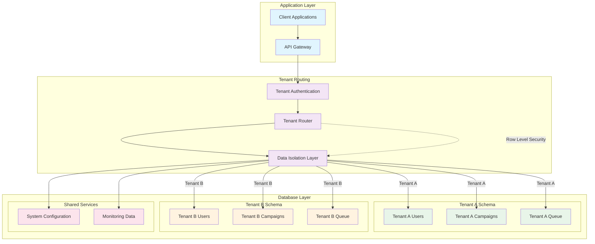

# Multi-Tenant Data Isolation Flow

**Strategic Alignment**: Our enterprise-grade multi-tenant architecture ensures complete data isolation while maintaining operational efficiency, providing security that meets SOC 2 and GDPR compliance requirements.

**Technical Authority**: The multi-tenant isolation system uses row-level security, tenant-specific infrastructure, and automated resource management to ensure each customer's data remains completely isolated and secure.

**User Journey Integration**: This isolation flow is part of your complete [security framework](/docs/compliance-security/overview) and [tenant management](/docs/technical/architecture/detailed-technical) experience with guaranteed data protection.

---

## Multi-Tenant Isolation Overview

This diagram shows how our application layer enforces tenant isolation through authentication, routing, and database-level security controls to ensure complete data separation.

## Tenant-Specific Data Management

## Isolation Architecture

### **Application Layer**
- **Client Applications**: Web dashboard, mobile apps, API clients
- **API Gateway**: Central entry point with authentication and rate limiting

### **Tenant Routing**
- **Tenant Authentication**: Validates user tokens and tenant associations
- **Tenant Router**: Routes requests to appropriate tenant infrastructure
- **Data Isolation Layer**: Enforces tenant boundaries at database level

### **Database Layer**
- **Tenant Schemas**: Separate database schemas for each tenant
- **Row-Level Security**: Database-level tenant data isolation
- **Shared Services**: Common configuration and monitoring data

## Security Mechanisms

### **Authentication & Authorization**
- **Multi-Factor Authentication**: Strong authentication requirements
- **Role-Based Access Control**: Granular permissions per user role
- **Tenant Scoping**: All operations scoped to specific tenant
- **Session Management**: Secure session handling and timeout

### **Data Isolation**
- **Row-Level Security**: Database enforces tenant boundaries
- **Schema Separation**: Physical separation of tenant data
- **Encrypted Storage**: All tenant data encrypted at rest
- **Secure Communication**: TLS encryption for all data transit

### **Infrastructure Isolation**
- **Dedicated Resources**: Tenant-specific infrastructure when required
- **Resource Quotas**: Limits prevent resource exhaustion attacks
- **Network Segmentation**: Isolated network segments per tenant
- **Monitoring Separation**: Tenant-specific monitoring and alerting

## Operational Excellence

### **Resource Management**
- **Dynamic Scaling**: Resources scale based on tenant usage
- **Automated Provisioning**: Tenant infrastructure automatically provisioned
- **Load Balancing**: Intelligent distribution across tenant resources
- **Performance Monitoring**: Per-tenant performance tracking

### **Compliance & Audit**
- **Complete Audit Trails**: All tenant actions logged and auditable
- **Data Retention Policies**: Configurable retention per tenant requirements
- **Privacy Controls**: GDPR-compliant data handling per tenant
- **Export Capabilities**: Tenant data export for compliance requirements

### **Operational Isolation**
- **Tenant-specific Configuration**: Custom settings per tenant
- **Billing Separation**: Accurate per-tenant usage tracking
- **Support Isolation**: Tenant-specific support and troubleshooting
- **Version Management**: Independent feature rollouts per tenant

---

**Keywords**: multi-tenant architecture, data isolation, row-level security, tenant management, resource isolation, compliance, audit trails
