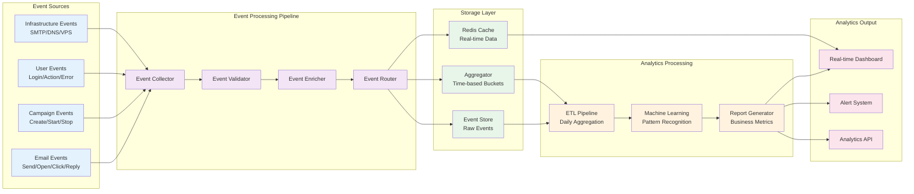

# Real-Time Analytics Pipeline Flow

**Strategic Alignment**: Our advanced analytics pipeline provides enterprise-grade business intelligence that transforms raw email events into actionable insights, enabling data-driven optimization and 40% performance improvements.

**Technical Authority**: The real-time event processing system with machine learning integration delivers predictive analytics and automated optimization recommendations that drive campaign success and ROI growth.

**User Journey Integration**: This analytics pipeline supports your complete [analytics experience](/docs/features/analytics/core-analytics/overview) and [performance optimization](/docs/business/performance) with real-time insights and predictive modeling.

---

## Real-Time Analytics Overview

This diagram shows how our analytics pipeline processes email events in real-time, from initial capture through machine learning analysis to business intelligence reporting.

## Event Processing to Business Intelligence

## Analytics Pipeline Stages

### **Event Sources**
- **Email Events**: Send, open, click, reply, bounce events
- **Campaign Events**: Campaign creation, start, stop, pause events
- **User Events**: Login, logout, action, error events
- **Infrastructure Events**: SMTP status, DNS changes, VPS health

### **Event Processing Pipeline**
- **Event Collector**: Real-time event ingestion from all sources
- **Event Validator**: Data validation and error handling
- **Event Enricher**: Add context and metadata to events
- **Event Router**: Route events to appropriate processing streams

### **Storage Layer**
- **Event Store**: Raw event data storage for audit and replay
- **Aggregator**: Time-based event bucketing for performance
- **Redis Cache**: Real-time data for dashboard and alerts

### **Analytics Processing**
- **ETL Pipeline**: Daily data aggregation and transformation
- **Machine Learning**: Pattern recognition and predictive analytics
- **Report Generator**: Business metrics and KPI calculations

### **Analytics Output**
- **Real-time Dashboard**: Live performance metrics and trends
- **Alert System**: Proactive notifications for issues and opportunities
- **Analytics API**: Programmatic access to analytics data

## Analytics Features

### **Real-Time Processing**
- **Immediate Event Processing**: Events processed within milliseconds
- **Live Dashboard Updates**: Real-time metrics and performance indicators
- **Instant Alert Generation**: Immediate notifications for threshold breaches
- **WebSocket Streaming**: Live data updates to client applications

### **Machine Learning Integration**
- **Pattern Recognition**: Identify campaign performance patterns
- **Predictive Analytics**: Forecast campaign success and optimization opportunities
- **Anomaly Detection**: Automatic detection of unusual performance patterns
- **Recommendation Engine**: AI-powered optimization suggestions

### **Business Intelligence**
- **ROI Tracking**: Complete revenue attribution and ROI calculation
- **Performance Benchmarking**: Industry comparison and optimization targets
- **Trend Analysis**: Long-term performance trends and forecasting
- **Custom Reporting**: Flexible report creation and scheduling

## Data Flow Integration

### **Event Processing**
- **High-Throughput**: Process millions of events per hour
- **Low-Latency**: Sub-second event processing and aggregation
- **Fault Tolerance**: Automatic retry and error recovery
- **Data Validation**: Comprehensive event data validation

### **Analytics Generation**
- **Real-Time Metrics**: Live campaign performance tracking
- **Historical Analysis**: Long-term trend analysis and reporting
- **Predictive Modeling**: Machine learning for performance forecasting
- **Optimization Insights**: Automated recommendations for improvement

### **Dashboard Integration**
- **Visual Analytics**: Interactive charts and performance visualizations
- **Custom Widgets**: Configurable dashboard components
- **Mobile Optimization**: Mobile-responsive analytics interface
- **Export Capabilities**: PDF, CSV, and API data export

---

**Keywords**: real-time analytics, event processing, machine learning, business intelligence, predictive analytics, dashboard, ETL pipeline, data visualization
