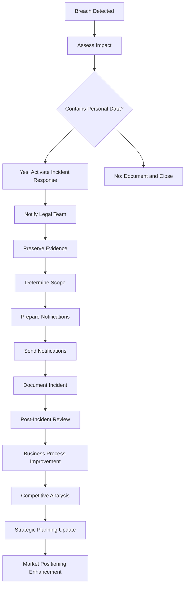

# Broken Links Report (Generated)

## README.md

- ❌ **What is PenguinMails** → `./docs/what-is-penguinmails/README.md` (target not found: `/home/israel/personal/penguinmails/penguinmails.github.io/docs/what-is-penguinmails/README.md`)
- ❌ **Features & Capabilities** → `./docs/features-capabilities/README.md` (target not found: `/home/israel/personal/penguinmails/penguinmails.github.io/docs/features-capabilities/README.md`)
- ❌ **Getting Started** → `./docs/implementation-getting-started/README.md` (target not found: `/home/israel/personal/penguinmails/penguinmails.github.io/docs/implementation-getting-started/README.md`)
- ❌ **Features & Capabilities** → `./docs/features-capabilities.md` (target not found: `/home/israel/personal/penguinmails/penguinmails.github.io/docs/features-capabilities.md`)
- ❌ **Strategic Planning** → `./docs/plan/` (target not found: `/home/israel/personal/penguinmails/penguinmails.github.io/docs/plan`)
- ❌ **Implementation** → `./docs/implement/` (target not found: `/home/israel/personal/penguinmails/penguinmails.github.io/docs/implement`)
- ❌ **Operations** → `./docs/operate/` (target not found: `/home/israel/personal/penguinmails/penguinmails.github.io/docs/operate`)
- ❌ **Security** → `./docs/security/` (target not found: `/home/israel/personal/penguinmails/penguinmails.github.io/docs/security`)
- ❌ **Analytics** → `./docs/analytics/` (target not found: `/home/israel/personal/penguinmails/penguinmails.github.io/docs/analytics`)
- ❌ **Development** → `./docs/development/` (target not found: `/home/israel/personal/penguinmails/penguinmails.github.io/docs/development`)
- ❌ **Resources & Support** → `./docs/resources-support/README.md` (target not found: `/home/israel/personal/penguinmails/penguinmails.github.io/docs/resources-support/README.md`)

## user-journeys/user-stories/prioritization-framework.md

- ❌ **`validation-process.md`** → `validation-process` (target not found: `/home/israel/personal/penguinmails/penguinmails.github.io/user-journeys/user-stories/validation-process`)

## user-journeys/user-stories/templates/internal-user-stories.md

- ❌ **`../user-types-classification.md`** → `../user-types-classification` (target not found: `/home/israel/personal/penguinmails/penguinmails.github.io/user-journeys/user-stories/user-types-classification`)

## user-journeys/user-stories/templates/stakeholder-stories.md

- ❌ **`../user-types-classification.md`** → `../user-types-classification` (target not found: `/home/israel/personal/penguinmails/penguinmails.github.io/user-journeys/user-stories/user-types-classification`)

## user-journeys/user-stories/templates/customer-stories.md

- ❌ **`../user-types-classification.md`** → `../user-types-classification` (target not found: `/home/israel/personal/penguinmails/penguinmails.github.io/user-journeys/user-stories/user-types-classification`)

## user-journeys/external-users/agency-owner-journeys.md

- ❌ **Client Report Portal Design** → `/docs/design/analytics-views#33-client-report-portal-white-label` (target not found: `/home/israel/personal/penguinmails/penguinmails.github.io/docs/design/analytics-views`)

## user-journeys/external-users/onboarding-flows/business-owner-onboarding.md

- ❌ **`user-types-classification.md`** → `../user-types-classification` (target not found: `/home/israel/personal/penguinmails/penguinmails.github.io/user-journeys/external-users/user-types-classification`)

## user-journeys/external-users/onboarding-flows/freelancer-onboarding.md

- ❌ **`user-types-classification.md`** → `../user-types-classification` (target not found: `/home/israel/personal/penguinmails/penguinmails.github.io/user-journeys/external-users/user-types-classification`)

## user-journeys/external-users/onboarding-flows/agencies-onboarding.md

- ❌ **`user-types-classification.md`** → `../user-types-classification` (target not found: `/home/israel/personal/penguinmails/penguinmails.github.io/user-journeys/external-users/user-types-classification`)

## user-journeys/external-users/onboarding-flows/enterprise-onboarding.md

- ❌ **`user-types-classification.md`** → `../user-types-classification` (target not found: `/home/israel/personal/penguinmails/penguinmails.github.io/user-journeys/external-users/user-types-classification`)

## tasks/epic-3-tenant-company-management/README.md

- ❌ **High-Level Architecture** → `../docs/quick-access/high-level-architecture` (target not found: `/home/israel/personal/penguinmails/penguinmails.github.io/tasks/docs/quick-access/high-level-architecture`)
- ❌ **OLTP Schema Guide** → `../docs/implementation-technical/database-infrastructure/oltp-schema-guide` (target not found: `/home/israel/personal/penguinmails/penguinmails.github.io/tasks/docs/implementation-technical/database-infrastructure/oltp-schema-guide`)
- ❌ **Team Workflow** → `../docs/quick-access/team-workflow` (target not found: `/home/israel/personal/penguinmails/penguinmails.github.io/tasks/docs/quick-access/team-workflow`)
- ❌ **Features & Capabilities** → `../docs/features-capabilities/index` (target not found: `/home/israel/personal/penguinmails/penguinmails.github.io/tasks/docs/features-capabilities/index`)
- ❌ **Roadmap & Development Priorities** → `../docs/quick-access/roadmap-development-priorities` (target not found: `/home/israel/personal/penguinmails/penguinmails.github.io/tasks/docs/quick-access/roadmap-development-priorities`)

## tasks/epic-3-tenant-company-management/milestone-1-tenant-company-creation/TEN-1.4-create-tenant-company-endpoint.md

- ❌ **Implementation & Getting Started** → `../../docs/implementation-getting-started/index` (target not found: `/home/israel/personal/penguinmails/penguinmails.github.io/tasks/docs/implementation-getting-started/index`)
- ❌ **High-Level Architecture** → `../../docs/quick-access/high-level-architecture` (target not found: `/home/israel/personal/penguinmails/penguinmails.github.io/tasks/docs/quick-access/high-level-architecture`)
- ❌ **High-Level Architecture** → `../../docs/quick-access/high-level-architecture` (target not found: `/home/israel/personal/penguinmails/penguinmails.github.io/tasks/docs/quick-access/high-level-architecture`)
- ❌ **API Reference** → `../../docs/implementation-technical/development-guidelines/api-reference` (target not found: `/home/israel/personal/penguinmails/penguinmails.github.io/tasks/docs/implementation-technical/development-guidelines/api-reference`)
- ❌ **OLTP Schema Guide** → `../../docs/implementation-technical/database-infrastructure/oltp-schema-guide` (target not found: `/home/israel/personal/penguinmails/penguinmails.github.io/tasks/docs/implementation-technical/database-infrastructure/oltp-schema-guide`)
- ❌ **Implementation & Getting Started** → `../../docs/implementation-getting-started/index` (target not found: `/home/israel/personal/penguinmails/penguinmails.github.io/tasks/docs/implementation-getting-started/index`)

## tasks/epic-3-tenant-company-management/milestone-1-tenant-company-creation/README.md

- ❌ **High-Level Architecture** → `../../docs/quick-access/high-level-architecture` (target not found: `/home/israel/personal/penguinmails/penguinmails.github.io/tasks/docs/quick-access/high-level-architecture`)

## tasks/epic-3-tenant-company-management/milestone-1-tenant-company-creation/TEN-1.1-define-companies-schema.md

- ❌ **High-Level Architecture** → `../../docs/quick-access/high-level-architecture` (target not found: `/home/israel/personal/penguinmails/penguinmails.github.io/tasks/docs/quick-access/high-level-architecture`)
- ❌ **Features & Capabilities** → `../../docs/features-capabilities/index` (target not found: `/home/israel/personal/penguinmails/penguinmails.github.io/tasks/docs/features-capabilities/index`)
- ❌ **OLTP Schema Guide** → `../../docs/implementation-technical/database-infrastructure/oltp-schema-guide.md#companies---tenant-workspaces` (target not found: `/home/israel/personal/penguinmails/penguinmails.github.io/tasks/docs/implementation-technical/database-infrastructure/oltp-schema-guide.md`)
- ❌ **High-Level Architecture** → `../../docs/quick-access/high-level-architecture` (target not found: `/home/israel/personal/penguinmails/penguinmails.github.io/tasks/docs/quick-access/high-level-architecture`)
- ❌ **OLTP Schema Guide** → `../../docs/implementation-technical/database-infrastructure/oltp-schema-guide` (target not found: `/home/israel/personal/penguinmails/penguinmails.github.io/tasks/docs/implementation-technical/database-infrastructure/oltp-schema-guide`)
- ❌ **Database Schema Guide** → `../../docs/implementation-technical/database-infrastructure/database-schema-guide` (target not found: `/home/israel/personal/penguinmails/penguinmails.github.io/tasks/docs/implementation-technical/database-infrastructure/database-schema-guide`)
- ❌ **Features & Capabilities** → `../../docs/features-capabilities/index` (target not found: `/home/israel/personal/penguinmails/penguinmails.github.io/tasks/docs/features-capabilities/index`)

## tasks/epic-3-tenant-company-management/milestone-1-tenant-company-creation/TEN-1.3-define-tenant-creation-schema.md

- ❌ **High-Level Architecture** → `../../docs/quick-access/high-level-architecture` (target not found: `/home/israel/personal/penguinmails/penguinmails.github.io/tasks/docs/quick-access/high-level-architecture`)
- ❌ **High-Level Architecture** → `../../docs/quick-access/high-level-architecture` (target not found: `/home/israel/personal/penguinmails/penguinmails.github.io/tasks/docs/quick-access/high-level-architecture`)
- ❌ **Compliance & Regulatory Standards** → `../../docs/quick-access/compliance-regulatory-standards` (target not found: `/home/israel/personal/penguinmails/penguinmails.github.io/tasks/docs/quick-access/compliance-regulatory-standards`)

## tasks/epic-3-tenant-company-management/milestone-1-tenant-company-creation/TEN-1.2-generate-apply-migration.md

- ❌ **Database Operations Guide** → `../../operations_runbooks/database_operations_guide` (target not found: `/home/israel/personal/penguinmails/penguinmails.github.io/tasks/operations_runbooks/database_operations_guide`)
- ❌ **Migration & Deployment Guide** → `../../operations_runbooks/migration_deployment_guide` (target not found: `/home/israel/personal/penguinmails/penguinmails.github.io/tasks/operations_runbooks/migration_deployment_guide`)

## tasks/epic-3-tenant-company-management/milestone-3-tenant-user-management/README.md

- ❌ **Team Workflow** → `../../docs/quick-access/team-workflow` (target not found: `/home/israel/personal/penguinmails/penguinmails.github.io/tasks/docs/quick-access/team-workflow`)

## tasks/epic-3-tenant-company-management/milestone-3-tenant-user-management/TEN-3.2-invite-user-endpoint.md

- ❌ **Team Workflow** → `../../docs/quick-access/team-workflow` (target not found: `/home/israel/personal/penguinmails/penguinmails.github.io/tasks/docs/quick-access/team-workflow`)
- ❌ **Team Workflow** → `../../docs/quick-access/team-workflow` (target not found: `/home/israel/personal/penguinmails/penguinmails.github.io/tasks/docs/quick-access/team-workflow`)
- ❌ **Features & Capabilities** → `../../docs/features-capabilities/index` (target not found: `/home/israel/personal/penguinmails/penguinmails.github.io/tasks/docs/features-capabilities/index`)

## tasks/epic-3-tenant-company-management/milestone-3-tenant-user-management/TEN-3.3-remove-user-endpoint.md

- ❌ **Team Workflow** → `../../docs/quick-access/team-workflow` (target not found: `/home/israel/personal/penguinmails/penguinmails.github.io/tasks/docs/quick-access/team-workflow`)
- ❌ **Team Workflow** → `../../docs/quick-access/team-workflow` (target not found: `/home/israel/personal/penguinmails/penguinmails.github.io/tasks/docs/quick-access/team-workflow`)
- ❌ **Features & Capabilities** → `../../docs/features-capabilities/index` (target not found: `/home/israel/personal/penguinmails/penguinmails.github.io/tasks/docs/features-capabilities/index`)

## tasks/epic-3-tenant-company-management/milestone-3-tenant-user-management/TEN-3.1-list-tenant-members-endpoint.md

- ❌ **Team Workflow** → `../../docs/quick-access/team-workflow` (target not found: `/home/israel/personal/penguinmails/penguinmails.github.io/tasks/docs/quick-access/team-workflow`)
- ❌ **Team Workflow** → `../../docs/quick-access/team-workflow` (target not found: `/home/israel/personal/penguinmails/penguinmails.github.io/tasks/docs/quick-access/team-workflow`)
- ❌ **High-Level Architecture** → `../../docs/quick-access/high-level-architecture` (target not found: `/home/israel/personal/penguinmails/penguinmails.github.io/tasks/docs/quick-access/high-level-architecture`)

## tasks/epic-3-tenant-company-management/milestone-2-viewing-managing-workspaces/TEN-2.4-update-company-endpoint.md

- ❌ **Features & Capabilities** → `../../docs/features-capabilities/index` (target not found: `/home/israel/personal/penguinmails/penguinmails.github.io/tasks/docs/features-capabilities/index`)
- ❌ **High-Level Architecture** → `../../docs/quick-access/high-level-architecture` (target not found: `/home/israel/personal/penguinmails/penguinmails.github.io/tasks/docs/quick-access/high-level-architecture`)
- ❌ **Features & Capabilities** → `../../docs/features-capabilities/index` (target not found: `/home/israel/personal/penguinmails/penguinmails.github.io/tasks/docs/features-capabilities/index`)

## tasks/epic-3-tenant-company-management/milestone-2-viewing-managing-workspaces/README.md

- ❌ **Features & Capabilities** → `../../docs/features-capabilities/index` (target not found: `/home/israel/personal/penguinmails/penguinmails.github.io/tasks/docs/features-capabilities/index`)

## tasks/epic-3-tenant-company-management/milestone-2-viewing-managing-workspaces/TEN-2.3-define-company-update-schema.md

- ❌ **High-Level Architecture** → `../../docs/quick-access/high-level-architecture` (target not found: `/home/israel/personal/penguinmails/penguinmails.github.io/tasks/docs/quick-access/high-level-architecture`)
- ❌ **High-Level Architecture** → `../../docs/quick-access/high-level-architecture` (target not found: `/home/israel/personal/penguinmails/penguinmails.github.io/tasks/docs/quick-access/high-level-architecture`)
- ❌ **Compliance & Regulatory Standards** → `../../docs/quick-access/compliance-regulatory-standards` (target not found: `/home/israel/personal/penguinmails/penguinmails.github.io/tasks/docs/quick-access/compliance-regulatory-standards`)

## tasks/epic-3-tenant-company-management/milestone-2-viewing-managing-workspaces/TEN-2.1-list-companies-endpoint.md

- ❌ **High-Level Architecture** → `../../docs/quick-access/high-level-architecture` (target not found: `/home/israel/personal/penguinmails/penguinmails.github.io/tasks/docs/quick-access/high-level-architecture`)
- ❌ **High-Level Architecture** → `../../docs/quick-access/high-level-architecture` (target not found: `/home/israel/personal/penguinmails/penguinmails.github.io/tasks/docs/quick-access/high-level-architecture`)
- ❌ **Features & Capabilities** → `../../docs/features-capabilities/index` (target not found: `/home/israel/personal/penguinmails/penguinmails.github.io/tasks/docs/features-capabilities/index`)

## tasks/epic-3-tenant-company-management/milestone-2-viewing-managing-workspaces/TEN-2.2-get-company-details-endpoint.md

- ❌ **High-Level Architecture** → `../../docs/quick-access/high-level-architecture` (target not found: `/home/israel/personal/penguinmails/penguinmails.github.io/tasks/docs/quick-access/high-level-architecture`)
- ❌ **High-Level Architecture** → `../../docs/quick-access/high-level-architecture` (target not found: `/home/israel/personal/penguinmails/penguinmails.github.io/tasks/docs/quick-access/high-level-architecture`)
- ❌ **Features & Capabilities** → `../../docs/features-capabilities/index` (target not found: `/home/israel/personal/penguinmails/penguinmails.github.io/tasks/docs/features-capabilities/index`)

## tasks/epic-1-project-foundation/README.md

- ❌ **Roadmap & Development Priorities** → `../docs/quick-access/roadmap-development-priorities` (target not found: `/home/israel/personal/penguinmails/penguinmails.github.io/tasks/docs/quick-access/roadmap-development-priorities`)
- ❌ **High-Level Architecture** → `../docs/quick-access/high-level-architecture` (target not found: `/home/israel/personal/penguinmails/penguinmails.github.io/tasks/docs/quick-access/high-level-architecture`)
- ❌ **OLTP Schema Guide** → `../docs/implementation-technical/database-infrastructure/oltp-schema-guide` (target not found: `/home/israel/personal/penguinmails/penguinmails.github.io/tasks/docs/implementation-technical/database-infrastructure/oltp-schema-guide`)
- ❌ **Development Standards** → `../docs/implementation-technical/development-guidelines/development-standards` (target not found: `/home/israel/personal/penguinmails/penguinmails.github.io/tasks/docs/implementation-technical/development-guidelines/development-standards`)
- ❌ **Compliance & Regulatory Standards** → `../docs/quick-access/compliance-regulatory-standards` (target not found: `/home/israel/personal/penguinmails/penguinmails.github.io/tasks/docs/quick-access/compliance-regulatory-standards`)
- ❌ **Team Workflow** → `../docs/quick-access/team-workflow` (target not found: `/home/israel/personal/penguinmails/penguinmails.github.io/tasks/docs/quick-access/team-workflow`)

## tasks/epic-1-project-foundation/milestone-4-services-layer/README.md

- ❌ **High-Level Architecture** → `../../docs/quick-access/high-level-architecture` (target not found: `/home/israel/personal/penguinmails/penguinmails.github.io/tasks/docs/quick-access/high-level-architecture`)

## tasks/epic-1-project-foundation/milestone-4-services-layer/CORE-4.3-implement-redis-health-check.md

- ❌ **High-Level Architecture** → `../../docs/quick-access/high-level-architecture` (target not found: `/home/israel/personal/penguinmails/penguinmails.github.io/tasks/docs/quick-access/high-level-architecture`)
- ❌ **High-Level Architecture** → `../../docs/quick-access/high-level-architecture` (target not found: `/home/israel/personal/penguinmails/penguinmails.github.io/tasks/docs/quick-access/high-level-architecture`)
- ❌ **Performance Monitoring Guide** → `../../operations_runbooks/performance_monitoring_guide` (target not found: `/home/israel/personal/penguinmails/penguinmails.github.io/tasks/operations_runbooks/performance_monitoring_guide`)

## tasks/epic-1-project-foundation/milestone-4-services-layer/CORE-4.2-create-redis-service.md

- ❌ **High-Level Architecture** → `../../docs/quick-access/high-level-architecture` (target not found: `/home/israel/personal/penguinmails/penguinmails.github.io/tasks/docs/quick-access/high-level-architecture`)
- ❌ **High-Level Architecture** → `../../docs/quick-access/high-level-architecture` (target not found: `/home/israel/personal/penguinmails/penguinmails.github.io/tasks/docs/quick-access/high-level-architecture`)
- ❌ **Database Schema Guide** → `../../docs/implementation-technical/database-infrastructure/database-schema-guide` (target not found: `/home/israel/personal/penguinmails/penguinmails.github.io/tasks/docs/implementation-technical/database-infrastructure/database-schema-guide`)
- ❌ **Queue System Implementation Guide** → `../../docs/implementation-technical/database-infrastructure/queue-system-implementation-guide` (target not found: `/home/israel/personal/penguinmails/penguinmails.github.io/tasks/docs/implementation-technical/database-infrastructure/queue-system-implementation-guide`)
- ❌ **Connection Pooling Strategy** → `../../operations_runbooks/connection_pooling_strategy` (target not found: `/home/israel/personal/penguinmails/penguinmails.github.io/tasks/operations_runbooks/connection_pooling_strategy`)
- ❌ **Performance Monitoring Guide** → `../../operations_runbooks/performance_monitoring_guide` (target not found: `/home/israel/personal/penguinmails/penguinmails.github.io/tasks/operations_runbooks/performance_monitoring_guide`)

## tasks/epic-1-project-foundation/milestone-4-services-layer/CORE-4.1-install-configure-redis.md

- ❌ **High-Level Architecture** → `../../docs/quick-access/high-level-architecture` (target not found: `/home/israel/personal/penguinmails/penguinmails.github.io/tasks/docs/quick-access/high-level-architecture`)
- ❌ **High-Level Architecture** → `../../docs/quick-access/high-level-architecture` (target not found: `/home/israel/personal/penguinmails/penguinmails.github.io/tasks/docs/quick-access/high-level-architecture`)
- ❌ **Performance Monitoring Guide** → `../../operations_runbooks/performance_monitoring_guide` (target not found: `/home/israel/personal/penguinmails/penguinmails.github.io/tasks/operations_runbooks/performance_monitoring_guide`)

## tasks/epic-1-project-foundation/milestone-1-project-initialization/CORE-1.5-setup-environment-variables.md

- ❌ **High-Level Architecture** → `../../docs/quick-access/high-level-architecture` (target not found: `/home/israel/personal/penguinmails/penguinmails.github.io/tasks/docs/quick-access/high-level-architecture`)
- ❌ **High-Level Architecture** → `../../docs/quick-access/high-level-architecture` (target not found: `/home/israel/personal/penguinmails/penguinmails.github.io/tasks/docs/quick-access/high-level-architecture`)
- ❌ **Implementation & Getting Started** → `../../docs/implementation-getting-started/index` (target not found: `/home/israel/personal/penguinmails/penguinmails.github.io/tasks/docs/implementation-getting-started/index`)

## tasks/epic-1-project-foundation/milestone-1-project-initialization/CORE-1.3-configure-prettier.md

- ❌ **Development Standards** → `../../docs/implementation-technical/development-guidelines/development-standards` (target not found: `/home/israel/personal/penguinmails/penguinmails.github.io/tasks/docs/implementation-technical/development-guidelines/development-standards`)
- ❌ **Team Workflow** → `../../docs/quick-access/team-workflow` (target not found: `/home/israel/personal/penguinmails/penguinmails.github.io/tasks/docs/quick-access/team-workflow`)

## tasks/epic-1-project-foundation/milestone-1-project-initialization/CORE-1.1-initialize-nextjs-project.md

- ❌ **High-Level Architecture** → `../../docs/quick-access/high-level-architecture` (target not found: `/home/israel/personal/penguinmails/penguinmails.github.io/tasks/docs/quick-access/high-level-architecture`)
- ❌ **High-Level Architecture** → `../../docs/quick-access/high-level-architecture` (target not found: `/home/israel/personal/penguinmails/penguinmails.github.io/tasks/docs/quick-access/high-level-architecture`)
- ❌ **Architecture System Overview** → `../../docs/implementation-technical/architecture-system/architecture-overview` (target not found: `/home/israel/personal/penguinmails/penguinmails.github.io/tasks/docs/implementation-technical/architecture-system/architecture-overview`)
- ❌ **Development Standards** → `../../docs/implementation-technical/development-guidelines/development-standards` (target not found: `/home/israel/personal/penguinmails/penguinmails.github.io/tasks/docs/implementation-technical/development-guidelines/development-standards`)
- ❌ **Implementation & Getting Started** → `../../docs/implementation-getting-started/index` (target not found: `/home/israel/personal/penguinmails/penguinmails.github.io/tasks/docs/implementation-getting-started/index`)

## tasks/epic-1-project-foundation/milestone-1-project-initialization/CORE-1.2-configure-eslint.md

- ❌ **Development Standards** → `../../docs/implementation-technical/development-guidelines/development-standards` (target not found: `/home/israel/personal/penguinmails/penguinmails.github.io/tasks/docs/implementation-technical/development-guidelines/development-standards`)
- ❌ **Team Workflow** → `../../docs/quick-access/team-workflow` (target not found: `/home/israel/personal/penguinmails/penguinmails.github.io/tasks/docs/quick-access/team-workflow`)

## tasks/epic-1-project-foundation/milestone-1-project-initialization/CORE-1.4-implement-pre-commit-hooks.md

- ❌ **Development Standards** → `../../docs/implementation-technical/development-guidelines/development-standards` (target not found: `/home/israel/personal/penguinmails/penguinmails.github.io/tasks/docs/implementation-technical/development-guidelines/development-standards`)
- ❌ **Team Workflow** → `../../docs/quick-access/team-workflow` (target not found: `/home/israel/personal/penguinmails/penguinmails.github.io/tasks/docs/quick-access/team-workflow`)

## tasks/epic-1-project-foundation/milestone-2-database-connectivity/CORE-5.2-create-test-validation-endpoint.md

- ❌ **High-Level Architecture** → `../../docs/quick-access/high-level-architecture` (target not found: `/home/israel/personal/penguinmails/penguinmails.github.io/tasks/docs/quick-access/high-level-architecture`)
- ❌ **Implementation & Getting Started** → `../../docs/implementation-getting-started/index` (target not found: `/home/israel/personal/penguinmails/penguinmails.github.io/tasks/docs/implementation-getting-started/index`)

## tasks/epic-1-project-foundation/milestone-2-database-connectivity/CORE-2.3-generate-first-migration.md

- ❌ **Database Operations Guide** → `../../operations_runbooks/database_operations_guide` (target not found: `/home/israel/personal/penguinmails/penguinmails.github.io/tasks/operations_runbooks/database_operations_guide`)
- ❌ **Migration & Deployment Guide** → `../../operations_runbooks/migration_deployment_guide` (target not found: `/home/israel/personal/penguinmails/penguinmails.github.io/tasks/operations_runbooks/migration_deployment_guide`)
- ❌ **Database Schema Guide** → `../../docs/implementation-technical/database-infrastructure/database-schema-guide` (target not found: `/home/israel/personal/penguinmails/penguinmails.github.io/tasks/docs/implementation-technical/database-infrastructure/database-schema-guide`)
- ❌ **OLTP Schema Guide** → `../../docs/implementation-technical/database-infrastructure/oltp-schema-guide` (target not found: `/home/israel/personal/penguinmails/penguinmails.github.io/tasks/docs/implementation-technical/database-infrastructure/oltp-schema-guide`)

## tasks/epic-1-project-foundation/milestone-2-database-connectivity/CORE-2.1-install-configure-drizzle.md

- ❌ **High-Level Architecture** → `../../docs/quick-access/high-level-architecture` (target not found: `/home/israel/personal/penguinmails/penguinmails.github.io/tasks/docs/quick-access/high-level-architecture`)
- ❌ **High-Level Architecture** → `../../docs/quick-access/high-level-architecture` (target not found: `/home/israel/personal/penguinmails/penguinmails.github.io/tasks/docs/quick-access/high-level-architecture`)
- ❌ **Database Schema Guide** → `../../docs/implementation-technical/database-infrastructure/database-schema-guide` (target not found: `/home/israel/personal/penguinmails/penguinmails.github.io/tasks/docs/implementation-technical/database-infrastructure/database-schema-guide`)
- ❌ **OLTP Schema Guide** → `../../docs/implementation-technical/database-infrastructure/oltp-schema-guide` (target not found: `/home/israel/personal/penguinmails/penguinmails.github.io/tasks/docs/implementation-technical/database-infrastructure/oltp-schema-guide`)
- ❌ **Connection Pooling Strategy** → `../../docs/implementation-technical/database-infrastructure/connection-pooling-strategy` (target not found: `/home/israel/personal/penguinmails/penguinmails.github.io/tasks/docs/implementation-technical/database-infrastructure/connection-pooling-strategy`)
- ❌ **Database Operations Guide** → `../../operations_runbooks/database_operations_guide` (target not found: `/home/israel/personal/penguinmails/penguinmails.github.io/tasks/operations_runbooks/database_operations_guide`)

## tasks/epic-1-project-foundation/milestone-2-database-connectivity/CORE-2.4-implement-migration-script.md

- ❌ **Database Operations Guide** → `../../operations_runbooks/database_operations_guide` (target not found: `/home/israel/personal/penguinmails/penguinmails.github.io/tasks/operations_runbooks/database_operations_guide`)
- ❌ **Migration & Deployment Guide** → `../../operations_runbooks/migration_deployment_guide` (target not found: `/home/israel/personal/penguinmails/penguinmails.github.io/tasks/operations_runbooks/migration_deployment_guide`)
- ❌ **Database Schema Guide** → `../../docs/implementation-technical/database-infrastructure/database-schema-guide` (target not found: `/home/israel/personal/penguinmails/penguinmails.github.io/tasks/docs/implementation-technical/database-infrastructure/database-schema-guide`)
- ❌ **OLTP Schema Guide** → `../../docs/implementation-technical/database-infrastructure/oltp-schema-guide` (target not found: `/home/israel/personal/penguinmails/penguinmails.github.io/tasks/docs/implementation-technical/database-infrastructure/oltp-schema-guide`)

## tasks/epic-1-project-foundation/milestone-2-database-connectivity/CORE-5.1-install-zod-define-schemas.md

- ❌ **High-Level Architecture** → `../../docs/quick-access/high-level-architecture` (target not found: `/home/israel/personal/penguinmails/penguinmails.github.io/tasks/docs/quick-access/high-level-architecture`)
- ❌ **High-Level Architecture** → `../../docs/quick-access/high-level-architecture` (target not found: `/home/israel/personal/penguinmails/penguinmails.github.io/tasks/docs/quick-access/high-level-architecture`)
- ❌ **Compliance & Regulatory Standards** → `../../docs/quick-access/compliance-regulatory-standards` (target not found: `/home/israel/personal/penguinmails/penguinmails.github.io/tasks/docs/quick-access/compliance-regulatory-standards`)

## tasks/epic-1-project-foundation/milestone-2-database-connectivity/CORE-2.2-define-initial-schemas.md

- ❌ **High-Level Architecture** → `../../docs/quick-access/high-level-architecture` (target not found: `/home/israel/personal/penguinmails/penguinmails.github.io/tasks/docs/quick-access/high-level-architecture`)
- ❌ **Team Workflow** → `../../docs/quick-access/team-workflow` (target not found: `/home/israel/personal/penguinmails/penguinmails.github.io/tasks/docs/quick-access/team-workflow`)
- ❌ **OLTP Schema Guide - users table** → `../../docs/implementation-technical/database-infrastructure/oltp-schema-guide.md#users---user-identity--profile` (target not found: `/home/israel/personal/penguinmails/penguinmails.github.io/tasks/docs/implementation-technical/database-infrastructure/oltp-schema-guide.md`)
- ❌ **OLTP Schema Guide - tenants table** → `../../docs/implementation-technical/database-infrastructure/oltp-schema-guide.md#tenants---tenant-organization` (target not found: `/home/israel/personal/penguinmails/penguinmails.github.io/tasks/docs/implementation-technical/database-infrastructure/oltp-schema-guide.md`)
- ❌ **OLTP Schema Guide - tenant_users table** → `../../docs/implementation-technical/database-infrastructure/oltp-schema-guide.md#tenant_users---multi-tenant-user-associations` (target not found: `/home/israel/personal/penguinmails/penguinmails.github.io/tasks/docs/implementation-technical/database-infrastructure/oltp-schema-guide.md`)
- ❌ **OLTP Schema Guide** → `../../docs/implementation-technical/database-infrastructure/oltp-schema-guide.md#users---user-identity--profile` (target not found: `/home/israel/personal/penguinmails/penguinmails.github.io/tasks/docs/implementation-technical/database-infrastructure/oltp-schema-guide.md`)
- ❌ **High-Level Architecture** → `../../docs/quick-access/high-level-architecture` (target not found: `/home/israel/personal/penguinmails/penguinmails.github.io/tasks/docs/quick-access/high-level-architecture`)
- ❌ **OLTP Schema Guide** → `../../docs/implementation-technical/database-infrastructure/oltp-schema-guide` (target not found: `/home/israel/personal/penguinmails/penguinmails.github.io/tasks/docs/implementation-technical/database-infrastructure/oltp-schema-guide`)
- ❌ **Database Schema Guide** → `../../docs/implementation-technical/database-infrastructure/database-schema-guide` (target not found: `/home/israel/personal/penguinmails/penguinmails.github.io/tasks/docs/implementation-technical/database-infrastructure/database-schema-guide`)
- ❌ **Team Workflow** → `../../docs/quick-access/team-workflow` (target not found: `/home/israel/personal/penguinmails/penguinmails.github.io/tasks/docs/quick-access/team-workflow`)
- ❌ **Compliance & Regulatory Standards** → `../../docs/quick-access/compliance-regulatory-standards` (target not found: `/home/israel/personal/penguinmails/penguinmails.github.io/tasks/docs/quick-access/compliance-regulatory-standards`)

## tasks/epic-1-project-foundation/milestone-3-multi-tenant-core/CORE-3.5-create-protected-endpoint.md

- ❌ **High-Level Architecture** → `../../docs/quick-access/high-level-architecture` (target not found: `/home/israel/personal/penguinmails/penguinmails.github.io/tasks/docs/quick-access/high-level-architecture`)
- ❌ **High-Level Architecture** → `../../docs/quick-access/high-level-architecture` (target not found: `/home/israel/personal/penguinmails/penguinmails.github.io/tasks/docs/quick-access/high-level-architecture`)
- ❌ **Team Workflow** → `../../docs/quick-access/team-workflow` (target not found: `/home/israel/personal/penguinmails/penguinmails.github.io/tasks/docs/quick-access/team-workflow`)

## tasks/epic-1-project-foundation/milestone-3-multi-tenant-core/CORE-3.3-create-signup-endpoint.md

- ❌ **High-Level Architecture** → `../../docs/quick-access/high-level-architecture` (target not found: `/home/israel/personal/penguinmails/penguinmails.github.io/tasks/docs/quick-access/high-level-architecture`)
- ❌ **High-Level Architecture** → `../../docs/quick-access/high-level-architecture` (target not found: `/home/israel/personal/penguinmails/penguinmails.github.io/tasks/docs/quick-access/high-level-architecture`)
- ❌ **API Reference** → `../../docs/implementation-technical/development-guidelines/api-reference` (target not found: `/home/israel/personal/penguinmails/penguinmails.github.io/tasks/docs/implementation-technical/development-guidelines/api-reference`)
- ❌ **OLTP Schema Guide** → `../../docs/implementation-technical/database-infrastructure/oltp-schema-guide` (target not found: `/home/israel/personal/penguinmails/penguinmails.github.io/tasks/docs/implementation-technical/database-infrastructure/oltp-schema-guide`)
- ❌ **Implementation & Getting Started** → `../../docs/implementation-getting-started/index` (target not found: `/home/israel/personal/penguinmails/penguinmails.github.io/tasks/docs/implementation-getting-started/index`)

## tasks/epic-1-project-foundation/milestone-3-multi-tenant-core/README.md

- ❌ **High-Level Architecture** → `../../docs/quick-access/high-level-architecture` (target not found: `/home/israel/personal/penguinmails/penguinmails.github.io/tasks/docs/quick-access/high-level-architecture`)
- ❌ **Team Workflow** → `../../docs/quick-access/team-workflow` (target not found: `/home/israel/personal/penguinmails/penguinmails.github.io/tasks/docs/quick-access/team-workflow`)
- ❌ **Compliance & Regulatory Standards** → `../../docs/quick-access/compliance-regulatory-standards` (target not found: `/home/israel/personal/penguinmails/penguinmails.github.io/tasks/docs/quick-access/compliance-regulatory-standards`)

## tasks/epic-1-project-foundation/milestone-3-multi-tenant-core/CORE-3.2-implement-middleware.md

- ❌ **High-Level Architecture** → `../../docs/quick-access/high-level-architecture` (target not found: `/home/israel/personal/penguinmails/penguinmails.github.io/tasks/docs/quick-access/high-level-architecture`)
- ❌ **High-Level Architecture** → `../../docs/quick-access/high-level-architecture` (target not found: `/home/israel/personal/penguinmails/penguinmails.github.io/tasks/docs/quick-access/high-level-architecture`)
- ❌ **API Reference** → `../../docs/implementation-technical/development-guidelines/api-reference` (target not found: `/home/israel/personal/penguinmails/penguinmails.github.io/tasks/docs/implementation-technical/development-guidelines/api-reference`)
- ❌ **Development Standards** → `../../docs/implementation-technical/development-guidelines/development-standards` (target not found: `/home/israel/personal/penguinmails/penguinmails.github.io/tasks/docs/implementation-technical/development-guidelines/development-standards`)
- ❌ **Team Workflow** → `../../docs/quick-access/team-workflow` (target not found: `/home/israel/personal/penguinmails/penguinmails.github.io/tasks/docs/quick-access/team-workflow`)

## tasks/epic-1-project-foundation/milestone-3-multi-tenant-core/CORE-3.1-install-configure-niledb.md

- ❌ **High-Level Architecture** → `../../docs/quick-access/high-level-architecture` (target not found: `/home/israel/personal/penguinmails/penguinmails.github.io/tasks/docs/quick-access/high-level-architecture`)
- ❌ **High-Level Architecture** → `../../docs/quick-access/high-level-architecture` (target not found: `/home/israel/personal/penguinmails/penguinmails.github.io/tasks/docs/quick-access/high-level-architecture`)
- ❌ **Implementation & Getting Started** → `../../docs/implementation-getting-started/index` (target not found: `/home/israel/personal/penguinmails/penguinmails.github.io/tasks/docs/implementation-getting-started/index`)

## tasks/epic-1-project-foundation/milestone-3-multi-tenant-core/CORE-3.4-create-login-endpoint.md

- ❌ **High-Level Architecture** → `../../docs/quick-access/high-level-architecture` (target not found: `/home/israel/personal/penguinmails/penguinmails.github.io/tasks/docs/quick-access/high-level-architecture`)
- ❌ **High-Level Architecture** → `../../docs/quick-access/high-level-architecture` (target not found: `/home/israel/personal/penguinmails/penguinmails.github.io/tasks/docs/quick-access/high-level-architecture`)
- ❌ **Implementation & Getting Started** → `../../docs/implementation-getting-started/index` (target not found: `/home/israel/personal/penguinmails/penguinmails.github.io/tasks/docs/implementation-getting-started/index`)

## tasks/epic-2-user-authentication-profile/README.md

- ❌ **Features & Capabilities** → `../docs/features-capabilities/index` (target not found: `/home/israel/personal/penguinmails/penguinmails.github.io/tasks/docs/features-capabilities/index`)
- ❌ **OLTP Schema Guide** → `../docs/implementation-technical/database-infrastructure/oltp-schema-guide` (target not found: `/home/israel/personal/penguinmails/penguinmails.github.io/tasks/docs/implementation-technical/database-infrastructure/oltp-schema-guide`)
- ❌ **Compliance & Regulatory Standards** → `../docs/quick-access/compliance-regulatory-standards` (target not found: `/home/israel/personal/penguinmails/penguinmails.github.io/tasks/docs/quick-access/compliance-regulatory-standards`)
- ❌ **High-Level Architecture** → `../docs/quick-access/high-level-architecture` (target not found: `/home/israel/personal/penguinmails/penguinmails.github.io/tasks/docs/quick-access/high-level-architecture`)

## tasks/epic-2-user-authentication-profile/milestone-1-foundational-profile-api/AUTH-3.1-define-user-preferences-schema.md

- ❌ **Features & Capabilities** → `../../docs/features-capabilities/index` (target not found: `/home/israel/personal/penguinmails/penguinmails.github.io/tasks/docs/features-capabilities/index`)
- ❌ **OLTP Schema Guide** → `../../docs/implementation-technical/database-infrastructure/oltp-schema-guide.md#user_preferences---user-preferences` (target not found: `/home/israel/personal/penguinmails/penguinmails.github.io/tasks/docs/implementation-technical/database-infrastructure/oltp-schema-guide.md`)
- ❌ **High-Level Architecture** → `../../docs/quick-access/high-level-architecture` (target not found: `/home/israel/personal/penguinmails/penguinmails.github.io/tasks/docs/quick-access/high-level-architecture`)
- ❌ **OLTP Schema Guide** → `../../docs/implementation-technical/database-infrastructure/oltp-schema-guide` (target not found: `/home/israel/personal/penguinmails/penguinmails.github.io/tasks/docs/implementation-technical/database-infrastructure/oltp-schema-guide`)
- ❌ **Database Schema Guide** → `../../docs/implementation-technical/database-infrastructure/database-schema-guide` (target not found: `/home/israel/personal/penguinmails/penguinmails.github.io/tasks/docs/implementation-technical/database-infrastructure/database-schema-guide`)
- ❌ **Features & Capabilities** → `../../docs/features-capabilities/index` (target not found: `/home/israel/personal/penguinmails/penguinmails.github.io/tasks/docs/features-capabilities/index`)

## tasks/epic-2-user-authentication-profile/milestone-1-foundational-profile-api/AUTH-3.4-define-profile-update-schema.md

- ❌ **High-Level Architecture** → `../../docs/quick-access/high-level-architecture` (target not found: `/home/israel/personal/penguinmails/penguinmails.github.io/tasks/docs/quick-access/high-level-architecture`)
- ❌ **High-Level Architecture** → `../../docs/quick-access/high-level-architecture` (target not found: `/home/israel/personal/penguinmails/penguinmails.github.io/tasks/docs/quick-access/high-level-architecture`)
- ❌ **Compliance & Regulatory Standards** → `../../docs/quick-access/compliance-regulatory-standards` (target not found: `/home/israel/personal/penguinmails/penguinmails.github.io/tasks/docs/quick-access/compliance-regulatory-standards`)

## tasks/epic-2-user-authentication-profile/milestone-1-foundational-profile-api/AUTH-3.2-generate-apply-migration.md

- ❌ **Database Operations Guide** → `../../operations_runbooks/database_operations_guide` (target not found: `/home/israel/personal/penguinmails/penguinmails.github.io/tasks/operations_runbooks/database_operations_guide`)
- ❌ **Migration & Deployment Guide** → `../../operations_runbooks/migration_deployment_guide` (target not found: `/home/israel/personal/penguinmails/penguinmails.github.io/tasks/operations_runbooks/migration_deployment_guide`)

## tasks/epic-2-user-authentication-profile/milestone-1-foundational-profile-api/AUTH-3.5-create-update-profile-endpoint.md

- ❌ **Features & Capabilities** → `../../docs/features-capabilities/index` (target not found: `/home/israel/personal/penguinmails/penguinmails.github.io/tasks/docs/features-capabilities/index`)
- ❌ **High-Level Architecture** → `../../docs/quick-access/high-level-architecture` (target not found: `/home/israel/personal/penguinmails/penguinmails.github.io/tasks/docs/quick-access/high-level-architecture`)
- ❌ **Compliance & Regulatory Standards** → `../../docs/quick-access/compliance-regulatory-standards` (target not found: `/home/israel/personal/penguinmails/penguinmails.github.io/tasks/docs/quick-access/compliance-regulatory-standards`)

## tasks/epic-2-user-authentication-profile/milestone-1-foundational-profile-api/AUTH-3.3-create-fetch-profile-endpoint.md

- ❌ **Features & Capabilities** → `../../docs/features-capabilities/index` (target not found: `/home/israel/personal/penguinmails/penguinmails.github.io/tasks/docs/features-capabilities/index`)
- ❌ **High-Level Architecture** → `../../docs/quick-access/high-level-architecture` (target not found: `/home/israel/personal/penguinmails/penguinmails.github.io/tasks/docs/quick-access/high-level-architecture`)
- ❌ **API Reference** → `../../docs/implementation-technical/development-guidelines/api-reference` (target not found: `/home/israel/personal/penguinmails/penguinmails.github.io/tasks/docs/implementation-technical/development-guidelines/api-reference`)
- ❌ **Development Standards** → `../../docs/implementation-technical/development-guidelines/development-standards` (target not found: `/home/israel/personal/penguinmails/penguinmails.github.io/tasks/docs/implementation-technical/development-guidelines/development-standards`)
- ❌ **Implementation & Getting Started** → `../../docs/implementation-getting-started/index` (target not found: `/home/israel/personal/penguinmails/penguinmails.github.io/tasks/docs/implementation-getting-started/index`)

## tasks/epic-2-user-authentication-profile/milestone-2-enhanced-authentication-security/README.md

- ❌ **Compliance & Regulatory Standards** → `../../docs/quick-access/compliance-regulatory-standards` (target not found: `/home/israel/personal/penguinmails/penguinmails.github.io/tasks/docs/quick-access/compliance-regulatory-standards`)
- ❌ **Features & Capabilities** → `../../docs/features-capabilities/index` (target not found: `/home/israel/personal/penguinmails/penguinmails.github.io/tasks/docs/features-capabilities/index`)
- ❌ **High-Level Architecture** → `../../docs/quick-access/high-level-architecture` (target not found: `/home/israel/personal/penguinmails/penguinmails.github.io/tasks/docs/quick-access/high-level-architecture`)

## tasks/epic-2-user-authentication-profile/milestone-2-enhanced-authentication-security/AUTH-4.1-create-logout-endpoint.md

- ❌ **High-Level Architecture** → `../../docs/quick-access/high-level-architecture` (target not found: `/home/israel/personal/penguinmails/penguinmails.github.io/tasks/docs/quick-access/high-level-architecture`)
- ❌ **High-Level Architecture** → `../../docs/quick-access/high-level-architecture` (target not found: `/home/israel/personal/penguinmails/penguinmails.github.io/tasks/docs/quick-access/high-level-architecture`)
- ❌ **Compliance & Regulatory Standards** → `../../docs/quick-access/compliance-regulatory-standards` (target not found: `/home/israel/personal/penguinmails/penguinmails.github.io/tasks/docs/quick-access/compliance-regulatory-standards`)

## tasks/epic-2-user-authentication-profile/milestone-2-enhanced-authentication-security/AUTH-4.4-create-change-password-endpoint.md

- ❌ **Features & Capabilities** → `../../docs/features-capabilities/index` (target not found: `/home/israel/personal/penguinmails/penguinmails.github.io/tasks/docs/features-capabilities/index`)
- ❌ **Compliance & Regulatory Standards** → `../../docs/quick-access/compliance-regulatory-standards` (target not found: `/home/israel/personal/penguinmails/penguinmails.github.io/tasks/docs/quick-access/compliance-regulatory-standards`)
- ❌ **Features & Capabilities** → `../../docs/features-capabilities/index` (target not found: `/home/israel/personal/penguinmails/penguinmails.github.io/tasks/docs/features-capabilities/index`)

## tasks/epic-2-user-authentication-profile/milestone-2-enhanced-authentication-security/AUTH-4.3-implement-reset-password.md

- ❌ **Compliance & Regulatory Standards** → `../../docs/quick-access/compliance-regulatory-standards` (target not found: `/home/israel/personal/penguinmails/penguinmails.github.io/tasks/docs/quick-access/compliance-regulatory-standards`)
- ❌ **Compliance & Regulatory Standards** → `../../docs/quick-access/compliance-regulatory-standards` (target not found: `/home/israel/personal/penguinmails/penguinmails.github.io/tasks/docs/quick-access/compliance-regulatory-standards`)
- ❌ **Features & Capabilities** → `../../docs/features-capabilities/index` (target not found: `/home/israel/personal/penguinmails/penguinmails.github.io/tasks/docs/features-capabilities/index`)

## tasks/epic-2-user-authentication-profile/milestone-2-enhanced-authentication-security/AUTH-4.2-implement-forgot-password.md

- ❌ **Features & Capabilities** → `../../docs/features-capabilities/index` (target not found: `/home/israel/personal/penguinmails/penguinmails.github.io/tasks/docs/features-capabilities/index`)
- ❌ **Compliance & Regulatory Standards** → `../../docs/quick-access/compliance-regulatory-standards` (target not found: `/home/israel/personal/penguinmails/penguinmails.github.io/tasks/docs/quick-access/compliance-regulatory-standards`)
- ❌ **Features & Capabilities** → `../../docs/features-capabilities/index` (target not found: `/home/israel/personal/penguinmails/penguinmails.github.io/tasks/docs/features-capabilities/index`)

## tasks/templates/frontend-task-template.md

- ❌ **Frontend Spec** → `../../docs/design/routes/[spec-name].md` (target not found: `/home/israel/personal/penguinmails/penguinmails.github.io/docs/design/routes/[spec-name].md`)
- ❌ **API Spec** → `../../docs/implementation-technical/api/[spec-name].md` (target not found: `/home/israel/personal/penguinmails/penguinmails.github.io/docs/implementation-technical/api/[spec-name].md`)
- ❌ **Feature Spec** → `../../docs/features/[feature-name].md` (target not found: `/home/israel/personal/penguinmails/penguinmails.github.io/docs/features/[feature-name].md`)
- ❌ **Accessibility Guidelines** → `../../docs/design/accessibility.md` (target not found: `/home/israel/personal/penguinmails/penguinmails.github.io/docs/design/accessibility.md`)
- ❌ **Testing Guidelines** → `../../docs/implementation-technical/development-guidelines/testing-guidelines.md` (target not found: `/home/israel/personal/penguinmails/penguinmails.github.io/docs/implementation-technical/development-guidelines/testing-guidelines.md`)

## tasks/templates/infrastructure-task-template.md

- ❌ **Infrastructure Spec** → `../../docs/implementation-technical/[spec-name].md` (target not found: `/home/israel/personal/penguinmails/penguinmails.github.io/docs/implementation-technical/[spec-name].md`)
- ❌ **Integration Guide** → `../../docs/technical/integration/[integration-name].md` (target not found: `/home/israel/personal/penguinmails/penguinmails.github.io/docs/technical/integration/[integration-name].md`)
- ❌ **Development Setup** → `../../docs/implementation-getting-started/development-setup.md` (target not found: `/home/israel/personal/penguinmails/penguinmails.github.io/docs/implementation-getting-started/development-setup.md`)
- ❌ **Deployment Guide** → `../../docs/implementation-technical/deployment/[deployment-guide].md` (target not found: `/home/israel/personal/penguinmails/penguinmails.github.io/docs/implementation-technical/deployment/[deployment-guide].md`)
- ❌ **Environment Variables** → `../../docs/implementation-technical/development-guidelines/environment-variables.md` (target not found: `/home/israel/personal/penguinmails/penguinmails.github.io/docs/implementation-technical/development-guidelines/environment-variables.md`)
- ❌ **Monitoring Guide** → `../../docs/operations/monitoring.md` (target not found: `/home/israel/personal/penguinmails/penguinmails.github.io/docs/operations/monitoring.md`)
- ❌ **Runbooks** → `../../docs/operations/runbooks/[component].md` (target not found: `/home/israel/personal/penguinmails/penguinmails.github.io/docs/operations/runbooks/[component].md`)

## tasks/templates/backend-task-template.md

- ❌ **API Spec** → `../../docs/implementation-technical/api/[spec-name].md` (target not found: `/home/israel/personal/penguinmails/penguinmails.github.io/docs/implementation-technical/api/[spec-name].md`)
- ❌ **Feature Spec** → `../../docs/features/[feature-name].md` (target not found: `/home/israel/personal/penguinmails/penguinmails.github.io/docs/features/[feature-name].md`)
- ❌ **Database Schema** → `../../docs/implementation-technical/database-infrastructure/[schema-doc].md` (target not found: `/home/israel/personal/penguinmails/penguinmails.github.io/docs/implementation-technical/database-infrastructure/[schema-doc].md`)
- ❌ **Multi-Tenancy Guide** → `../../docs/technical/niledb/multi-tenancy-guide.md` (target not found: `/home/israel/personal/penguinmails/penguinmails.github.io/docs/technical/niledb/multi-tenancy-guide.md`)
- ❌ **Authentication Guide** → `../../docs/technical/niledb/authentication.md` (target not found: `/home/israel/personal/penguinmails/penguinmails.github.io/docs/technical/niledb/authentication.md`)
- ❌ **API Best Practices** → `../../docs/implementation-technical/development-guidelines/api-best-practices.md` (target not found: `/home/israel/personal/penguinmails/penguinmails.github.io/docs/implementation-technical/development-guidelines/api-best-practices.md`)
- ❌ **Error Handling** → `../../docs/implementation-technical/development-guidelines/error-handling.md` (target not found: `/home/israel/personal/penguinmails/penguinmails.github.io/docs/implementation-technical/development-guidelines/error-handling.md`)

## tasks/epic-6-core-email-pipeline/README.md

- ❌ **Technical Architecture — Overview** → `../docs/technical/architecture/overview` (target not found: `/home/israel/personal/penguinmails/penguinmails.github.io/tasks/docs/technical/architecture/overview`)
- ❌ **Development Standards (coding, linting, CI)** → `../docs/implementation-technical/development-guidelines/development-standards` (target not found: `/home/israel/personal/penguinmails/penguinmails.github.io/tasks/docs/implementation-technical/development-guidelines/development-standards`)
- ❌ **Operations: Infrastructure & Management** → `../docs/operations-analytics/operations-management/infrastructure-operations-management` (target not found: `/home/israel/personal/penguinmails/penguinmails.github.io/tasks/docs/operations-analytics/operations-management/infrastructure-operations-management`)
- ❌ **Quick Setup / Getting Started** → `../docs/quick-setup` (target not found: `/home/israel/personal/penguinmails/penguinmails.github.io/tasks/docs/quick-setup`)
- ❌ **Compliance & Security Framework** → `../docs/compliance-security/enterprise/security-framework` (target not found: `/home/israel/personal/penguinmails/penguinmails.github.io/tasks/docs/compliance-security/enterprise/security-framework`)

## tasks/epic-6-core-email-pipeline/milestone-3-engagement-tracking/MAIL-3.5-create-the-analytics-processing-worker-stub.md

- ❌ **Operations: Infrastructure Operations Management (queues & analytics)** → `../../docs/operations-analytics/operations-management/infrastructure-operations-management` (target not found: `/home/israel/personal/penguinmails/penguinmails.github.io/tasks/docs/operations-analytics/operations-management/infrastructure-operations-management`)
- ❌ **Development Standards (worker patterns)** → `../../docs/implementation-technical/development-guidelines/development-standards` (target not found: `/home/israel/personal/penguinmails/penguinmails.github.io/tasks/docs/implementation-technical/development-guidelines/development-standards`)

## tasks/epic-6-core-email-pipeline/milestone-3-engagement-tracking/MAIL-3.2-create-the-public-tracking-api-route.md

- ❌ **Technical Architecture — Overview** → `../../docs/technical/architecture/overview` (target not found: `/home/israel/personal/penguinmails/penguinmails.github.io/tasks/docs/technical/architecture/overview`)
- ❌ **Compliance & Security Framework** → `../../docs/compliance-security/enterprise/security-framework` (target not found: `/home/israel/personal/penguinmails/penguinmails.github.io/tasks/docs/compliance-security/enterprise/security-framework`)
- ❌ **Development Standards (API & edge handlers)** → `../../docs/implementation-technical/development-guidelines/development-standards` (target not found: `/home/israel/personal/penguinmails/penguinmails.github.io/tasks/docs/implementation-technical/development-guidelines/development-standards`)

## tasks/epic-6-core-email-pipeline/milestone-3-engagement-tracking/MAIL-3.1-implement-tracking-token-generation.md

- ❌ **Compliance & Security Framework** → `../../docs/compliance-security/enterprise/security-framework` (target not found: `/home/israel/personal/penguinmails/penguinmails.github.io/tasks/docs/compliance-security/enterprise/security-framework`)
- ❌ **Development Standards (JWT & token handling)** → `../../docs/implementation-technical/development-guidelines/development-standards` (target not found: `/home/israel/personal/penguinmails/penguinmails.github.io/tasks/docs/implementation-technical/development-guidelines/development-standards`)

## tasks/epic-6-core-email-pipeline/milestone-3-engagement-tracking/MAIL-3.3-implement-the-open-tracking-handler.md

- ❌ **Compliance & Security Framework** → `../../docs/compliance-security/enterprise/security-framework` (target not found: `/home/israel/personal/penguinmails/penguinmails.github.io/tasks/docs/compliance-security/enterprise/security-framework`)
- ❌ **Development Standards (high-performance endpoints)** → `../../docs/implementation-technical/development-guidelines/development-standards` (target not found: `/home/israel/personal/penguinmails/penguinmails.github.io/tasks/docs/implementation-technical/development-guidelines/development-standards`)

## tasks/epic-6-core-email-pipeline/milestone-3-engagement-tracking/MAIL-3.4-implement-the-click-tracking-handler.md

- ❌ **Compliance & Security Framework** → `../../docs/compliance-security/enterprise/security-framework` (target not found: `/home/israel/personal/penguinmails/penguinmails.github.io/tasks/docs/compliance-security/enterprise/security-framework`)
- ❌ **Development Standards (redirect handling & security)** → `../../docs/implementation-technical/development-guidelines/development-standards` (target not found: `/home/israel/personal/penguinmails/penguinmails.github.io/tasks/docs/implementation-technical/development-guidelines/development-standards`)

## tasks/epic-6-core-email-pipeline/milestone-1-job-enqueueing-and-campaign-scheduling/MAIL-1.4-create-a-cron-job-to-run-the-scheduler.md

- ❌ **Operations: Infrastructure Operations Management (scheduling)** → `../../docs/operations-analytics/operations-management/infrastructure-operations-management` (target not found: `/home/israel/personal/penguinmails/penguinmails.github.io/tasks/docs/operations-analytics/operations-management/infrastructure-operations-management`)
- ❌ **Development Standards (API routes & secrets)** → `../../docs/implementation-technical/development-guidelines/development-standards` (target not found: `/home/israel/personal/penguinmails/penguinmails.github.io/tasks/docs/implementation-technical/development-guidelines/development-standards`)

## tasks/epic-6-core-email-pipeline/milestone-1-job-enqueueing-and-campaign-scheduling/MAIL-1.1-define-drizzle-schemas-for-email-pipeline.md

- ❌ **Technical Architecture — Overview** → `../../docs/technical/architecture/overview` (target not found: `/home/israel/personal/penguinmails/penguinmails.github.io/tasks/docs/technical/architecture/overview`)
- ❌ **Development Standards (DB design & migrations)** → `../../docs/implementation-technical/development-guidelines/development-standards` (target not found: `/home/israel/personal/penguinmails/penguinmails.github.io/tasks/docs/implementation-technical/development-guidelines/development-standards`)

## tasks/epic-6-core-email-pipeline/milestone-1-job-enqueueing-and-campaign-scheduling/MAIL-1.2-define-zod-schema-for-job-payloads.md

- ❌ **Development Standards (validation & schemas)** → `../../docs/implementation-technical/development-guidelines/development-standards` (target not found: `/home/israel/personal/penguinmails/penguinmails.github.io/tasks/docs/implementation-technical/development-guidelines/development-standards`)
- ❌ **Technical Architecture — Overview** → `../../docs/technical/architecture/overview` (target not found: `/home/israel/personal/penguinmails/penguinmails.github.io/tasks/docs/technical/architecture/overview`)

## tasks/epic-6-core-email-pipeline/milestone-1-job-enqueueing-and-campaign-scheduling/MAIL-1.3-implement-the-campaign-scheduler-service.md

- ❌ **Technical Architecture — Overview** → `../../docs/technical/architecture/overview` (target not found: `/home/israel/personal/penguinmails/penguinmails.github.io/tasks/docs/technical/architecture/overview`)
- ❌ **Development Standards (background jobs & services)** → `../../docs/implementation-technical/development-guidelines/development-standards` (target not found: `/home/israel/personal/penguinmails/penguinmails.github.io/tasks/docs/implementation-technical/development-guidelines/development-standards`)
- ❌ **Operations: Infrastructure Operations Management (queues & workers)** → `../../docs/operations-analytics/operations-management/infrastructure-operations-management` (target not found: `/home/israel/personal/penguinmails/penguinmails.github.io/tasks/docs/operations-analytics/operations-management/infrastructure-operations-management`)

## tasks/epic-6-core-email-pipeline/milestone-2-email-sending-worker/MAIL-2.2-implement-the-workers-main-loop.md

- ❌ **Operations: Infrastructure Operations Management (queues & workers)** → `../../docs/operations-analytics/operations-management/infrastructure-operations-management` (target not found: `/home/israel/personal/penguinmails/penguinmails.github.io/tasks/docs/operations-analytics/operations-management/infrastructure-operations-management`)
- ❌ **Development Standards (background job patterns)** → `../../docs/implementation-technical/development-guidelines/development-standards` (target not found: `/home/israel/personal/penguinmails/penguinmails.github.io/tasks/docs/implementation-technical/development-guidelines/development-standards`)

## tasks/epic-6-core-email-pipeline/milestone-2-email-sending-worker/MAIL-2.4-implement-smtp-sending-with-nodemailer.md

- ❌ **Technical Architecture — Overview** → `../../docs/technical/architecture/overview` (target not found: `/home/israel/personal/penguinmails/penguinmails.github.io/tasks/docs/technical/architecture/overview`)
- ❌ **Development Standards (external integrations & secrets)** → `../../docs/implementation-technical/development-guidelines/development-standards` (target not found: `/home/israel/personal/penguinmails/penguinmails.github.io/tasks/docs/implementation-technical/development-guidelines/development-standards`)
- ❌ **Quick Setup / Getting Started** → `../../docs/quick-setup` (target not found: `/home/israel/personal/penguinmails/penguinmails.github.io/tasks/docs/quick-setup`)

## tasks/epic-6-core-email-pipeline/milestone-2-email-sending-worker/MAIL-2.5-integrate-sending-logic-and-database-logging.md

- ❌ **Development Standards (retries & logging)** → `../../docs/implementation-technical/development-guidelines/development-standards` (target not found: `/home/israel/personal/penguinmails/penguinmails.github.io/tasks/docs/implementation-technical/development-guidelines/development-standards`)
- ❌ **Operations: Infrastructure Operations Management (worker monitoring)** → `../../docs/operations-analytics/operations-management/infrastructure-operations-management` (target not found: `/home/israel/personal/penguinmails/penguinmails.github.io/tasks/docs/operations-analytics/operations-management/infrastructure-operations-management`)

## tasks/epic-6-core-email-pipeline/milestone-2-email-sending-worker/MAIL-2.1-set-up-standalone-worker-project.md

- ❌ **Operations: Infrastructure Operations Management (running workers)** → `../../docs/operations-analytics/operations-management/infrastructure-operations-management` (target not found: `/home/israel/personal/penguinmails/penguinmails.github.io/tasks/docs/operations-analytics/operations-management/infrastructure-operations-management`)
- ❌ **Technical Architecture — Overview** → `../../docs/technical/architecture/overview` (target not found: `/home/israel/personal/penguinmails/penguinmails.github.io/tasks/docs/technical/architecture/overview`)
- ❌ **Development Standards (project layout & scripts)** → `../../docs/implementation-technical/development-guidelines/development-standards` (target not found: `/home/israel/personal/penguinmails/penguinmails.github.io/tasks/docs/implementation-technical/development-guidelines/development-standards`)

## tasks/epic-6-core-email-pipeline/milestone-2-email-sending-worker/MAIL-2.3-implement-email-assembly-logic.md

- ❌ **Development Standards (templating & sanitization)** → `../../docs/implementation-technical/development-guidelines/development-standards` (target not found: `/home/israel/personal/penguinmails/penguinmails.github.io/tasks/docs/implementation-technical/development-guidelines/development-standards`)
- ❌ **Technical Architecture — Overview** → `../../docs/technical/architecture/overview` (target not found: `/home/israel/personal/penguinmails/penguinmails.github.io/tasks/docs/technical/architecture/overview`)

## tasks/epic-5-infrastructure-management/README.md

- ❌ **Technical Architecture — Overview** → `../docs/technical/architecture/overview` (target not found: `/home/israel/personal/penguinmails/penguinmails.github.io/tasks/docs/technical/architecture/overview`)
- ❌ **Development Standards (coding, linting, CI)** → `../docs/implementation-technical/development-guidelines/development-standards` (target not found: `/home/israel/personal/penguinmails/penguinmails.github.io/tasks/docs/implementation-technical/development-guidelines/development-standards`)
- ❌ **Operations: Infrastructure Operations Management** → `../docs/operations-analytics/operations-management/infrastructure-operations-management` (target not found: `/home/israel/personal/penguinmails/penguinmails.github.io/tasks/docs/operations-analytics/operations-management/infrastructure-operations-management`)
- ❌ **Security & Compliance Framework** → `../docs/compliance-security/enterprise/security-framework` (target not found: `/home/israel/personal/penguinmails/penguinmails.github.io/tasks/docs/compliance-security/enterprise/security-framework`)
- ❌ **Quick Setup / Getting Started** → `../docs/quick-setup` (target not found: `/home/israel/personal/penguinmails/penguinmails.github.io/tasks/docs/quick-setup`)

## tasks/epic-5-infrastructure-management/milestone-3-internal-api-for-infrastructure-visibility/INFRA-3.3-create-api-endpoint-get-sync-status.md

- ❌ **Operations: Infrastructure Operations Management** → `../../docs/operations-analytics/operations-management/infrastructure-operations-management` (target not found: `/home/israel/personal/penguinmails/penguinmails.github.io/tasks/docs/operations-analytics/operations-management/infrastructure-operations-management`)
- ❌ **Development Standards (API design & caching)** → `../../docs/implementation-technical/development-guidelines/development-standards` (target not found: `/home/israel/personal/penguinmails/penguinmails.github.io/tasks/docs/implementation-technical/development-guidelines/development-standards`)

## tasks/epic-5-infrastructure-management/milestone-3-internal-api-for-infrastructure-visibility/INFRA-3.1-define-drizzle-schema-for-domain_ip_assignments.md

- ❌ **Technical Architecture — Overview** → `../../docs/technical/architecture/overview` (target not found: `/home/israel/personal/penguinmails/penguinmails.github.io/tasks/docs/technical/architecture/overview`)
- ❌ **Development Standards (DB design & indexing)** → `../../docs/implementation-technical/development-guidelines/development-standards` (target not found: `/home/israel/personal/penguinmails/penguinmails.github.io/tasks/docs/implementation-technical/development-guidelines/development-standards`)

## tasks/epic-5-infrastructure-management/milestone-3-internal-api-for-infrastructure-visibility/INFRA-3.2-create-api-endpoint-list-tenant-ips.md

- ❌ **Technical Architecture — Overview** → `../../docs/technical/architecture/overview` (target not found: `/home/israel/personal/penguinmails/penguinmails.github.io/tasks/docs/technical/architecture/overview`)
- ❌ **Development Standards (API design & multi-tenant scoping)** → `../../docs/implementation-technical/development-guidelines/development-standards` (target not found: `/home/israel/personal/penguinmails/penguinmails.github.io/tasks/docs/implementation-technical/development-guidelines/development-standards`)

## tasks/epic-5-infrastructure-management/milestone-1-database-schema-and-hostwind-api-client/INFRA-1.2-generate-and-apply-infrastructure-migrations.md

- ❌ **Development Standards (migrations & DB conventions)** → `../../docs/implementation-technical/development-guidelines/development-standards` (target not found: `/home/israel/personal/penguinmails/penguinmails.github.io/tasks/docs/implementation-technical/development-guidelines/development-standards`)
- ❌ **Technical Architecture — Overview** → `../../docs/technical/architecture/overview` (target not found: `/home/israel/personal/penguinmails/penguinmails.github.io/tasks/docs/technical/architecture/overview`)

## tasks/epic-5-infrastructure-management/milestone-1-database-schema-and-hostwind-api-client/INFRA-1.1-define-drizzle-schemas-for-infrastructure.md

- ❌ **Technical Architecture — Overview** → `../../docs/technical/architecture/overview` (target not found: `/home/israel/personal/penguinmails/penguinmails.github.io/tasks/docs/technical/architecture/overview`)
- ❌ **Development Standards (coding, linting, CI)** → `../../docs/implementation-technical/development-guidelines/development-standards` (target not found: `/home/israel/personal/penguinmails/penguinmails.github.io/tasks/docs/implementation-technical/development-guidelines/development-standards`)
- ❌ **Quick Setup / Getting Started** → `../../docs/quick-setup` (target not found: `/home/israel/personal/penguinmails/penguinmails.github.io/tasks/docs/quick-setup`)

## tasks/epic-5-infrastructure-management/milestone-1-database-schema-and-hostwind-api-client/INFRA-1.5-implement-getvpsinstances-function.md

- ❌ **Technical Architecture — Overview** → `../../docs/technical/architecture/overview` (target not found: `/home/israel/personal/penguinmails/penguinmails.github.io/tasks/docs/technical/architecture/overview`)
- ❌ **Development Standards (HTTP clients, retries)** → `../../docs/implementation-technical/development-guidelines/development-standards` (target not found: `/home/israel/personal/penguinmails/penguinmails.github.io/tasks/docs/implementation-technical/development-guidelines/development-standards`)

## tasks/epic-5-infrastructure-management/milestone-1-database-schema-and-hostwind-api-client/INFRA-1.4-create-a-secure-hostwind-api-client-service.md

- ❌ **Technical Architecture — Overview** → `../../docs/technical/architecture/overview` (target not found: `/home/israel/personal/penguinmails/penguinmails.github.io/tasks/docs/technical/architecture/overview`)
- ❌ **Development Standards (HTTP clients & error handling)** → `../../docs/implementation-technical/development-guidelines/development-standards` (target not found: `/home/israel/personal/penguinmails/penguinmails.github.io/tasks/docs/implementation-technical/development-guidelines/development-standards`)
- ❌ **Operations: Infrastructure Operations Management** → `../../docs/operations-analytics/operations-management/infrastructure-operations-management` (target not found: `/home/israel/personal/penguinmails/penguinmails.github.io/tasks/docs/operations-analytics/operations-management/infrastructure-operations-management`)

## tasks/epic-5-infrastructure-management/milestone-1-database-schema-and-hostwind-api-client/INFRA-1.3-configure-hostwind-api-credentials.md

- ❌ **Development Standards (env & secrets)** → `../../docs/implementation-technical/development-guidelines/development-standards` (target not found: `/home/israel/personal/penguinmails/penguinmails.github.io/tasks/docs/implementation-technical/development-guidelines/development-standards`)
- ❌ **Compliance & Security Framework** → `../../docs/compliance-security/enterprise/security-framework` (target not found: `/home/israel/personal/penguinmails/penguinmails.github.io/tasks/docs/compliance-security/enterprise/security-framework`)
- ❌ **Quick Setup / Getting Started** → `../../docs/quick-setup` (target not found: `/home/israel/personal/penguinmails/penguinmails.github.io/tasks/docs/quick-setup`)

## tasks/epic-5-infrastructure-management/milestone-2-infrastructure-state-synchronization/INFRA-2.2-implement-upsert-logic-for-smtp_ip_addresses.md

- ❌ **Technical Architecture — Overview** → `../../docs/technical/architecture/overview` (target not found: `/home/israel/personal/penguinmails/penguinmails.github.io/tasks/docs/technical/architecture/overview`)
- ❌ **Development Standards (DB operations & indexing)** → `../../docs/implementation-technical/development-guidelines/development-standards` (target not found: `/home/israel/personal/penguinmails/penguinmails.github.io/tasks/docs/implementation-technical/development-guidelines/development-standards`)

## tasks/epic-5-infrastructure-management/milestone-2-infrastructure-state-synchronization/INFRA-2.1-implement-upsert-logic-for-vps_instances.md

- ❌ **Technical Architecture — Overview** → `../../docs/technical/architecture/overview` (target not found: `/home/israel/personal/penguinmails/penguinmails.github.io/tasks/docs/technical/architecture/overview`)
- ❌ **Development Standards (DB operations & upserts)** → `../../docs/implementation-technical/development-guidelines/development-standards` (target not found: `/home/israel/personal/penguinmails/penguinmails.github.io/tasks/docs/implementation-technical/development-guidelines/development-standards`)
- ❌ **Operations: Infrastructure Operations Management** → `../../docs/operations-analytics/operations-management/infrastructure-operations-management` (target not found: `/home/israel/personal/penguinmails/penguinmails.github.io/tasks/docs/operations-analytics/operations-management/infrastructure-operations-management`)

## tasks/epic-5-infrastructure-management/milestone-2-infrastructure-state-synchronization/INFRA-2.4-implement-sync-status-tracking.md

- ❌ **Operations: Infrastructure Operations Management** → `../../docs/operations-analytics/operations-management/infrastructure-operations-management` (target not found: `/home/israel/personal/penguinmails/penguinmails.github.io/tasks/docs/operations-analytics/operations-management/infrastructure-operations-management`)
- ❌ **Development Standards (system config & monitoring)** → `../../docs/implementation-technical/development-guidelines/development-standards` (target not found: `/home/israel/personal/penguinmails/penguinmails.github.io/tasks/docs/implementation-technical/development-guidelines/development-standards`)

## tasks/epic-5-infrastructure-management/milestone-2-infrastructure-state-synchronization/INFRA-2.3-create-a-scheduled-cron-job-for-synchronization.md

- ❌ **Operations: Infrastructure Operations Management** → `../../docs/operations-analytics/operations-management/infrastructure-operations-management` (target not found: `/home/israel/personal/penguinmails/penguinmails.github.io/tasks/docs/operations-analytics/operations-management/infrastructure-operations-management`)
- ❌ **Development Standards (API routes & secrets)** → `../../docs/implementation-technical/development-guidelines/development-standards` (target not found: `/home/israel/personal/penguinmails/penguinmails.github.io/tasks/docs/implementation-technical/development-guidelines/development-standards`)

## tasks/epic-4-billing-plans-subscriptions/README.md

- ❌ **Goals & Competitive Edge** → `../docs/goals-competitive-edge/index` (target not found: `/home/israel/personal/penguinmails/penguinmails.github.io/tasks/docs/goals-competitive-edge/index`)
- ❌ **Roadmap & Development Priorities** → `../docs/quick-access/roadmap-development-priorities` (target not found: `/home/israel/personal/penguinmails/penguinmails.github.io/tasks/docs/quick-access/roadmap-development-priorities`)
- ❌ **Implementation & Getting Started** → `../docs/implementation-getting-started/index` (target not found: `/home/israel/personal/penguinmails/penguinmails.github.io/tasks/docs/implementation-getting-started/index`)
- ❌ **Implementation & Getting Started** → `../docs/implementation-getting-started/index` (target not found: `/home/israel/personal/penguinmails/penguinmails.github.io/tasks/docs/implementation-getting-started/index`)

## tasks/epic-4-billing-plans-subscriptions/milestone-1-plans-subscriptions-schema/README.md

- ❌ **Implementation & Getting Started** → `../../docs/implementation-getting-started/index` (target not found: `/home/israel/personal/penguinmails/penguinmails.github.io/tasks/docs/implementation-getting-started/index`)

## tasks/epic-4-billing-plans-subscriptions/milestone-1-plans-subscriptions-schema/BILL-1.2-generate-apply-billing-migrations.md

- ❌ **Database Operations Guide** → `../../operations_runbooks/database_operations_guide` (target not found: `/home/israel/personal/penguinmails/penguinmails.github.io/tasks/operations_runbooks/database_operations_guide`)
- ❌ **Migration & Deployment Guide** → `../../operations_runbooks/migration_deployment_guide` (target not found: `/home/israel/personal/penguinmails/penguinmails.github.io/tasks/operations_runbooks/migration_deployment_guide`)

## tasks/epic-4-billing-plans-subscriptions/milestone-1-plans-subscriptions-schema/BILL-1.3-seed-plans-table.md

- ❌ **Implementation & Getting Started** → `../../docs/implementation-getting-started/index` (target not found: `/home/israel/personal/penguinmails/penguinmails.github.io/tasks/docs/implementation-getting-started/index`)
- ❌ **Implementation & Getting Started** → `../../docs/implementation-getting-started/index` (target not found: `/home/israel/personal/penguinmails/penguinmails.github.io/tasks/docs/implementation-getting-started/index`)
- ❌ **Goals & Competitive Edge** → `../../docs/goals-competitive-edge/index` (target not found: `/home/israel/personal/penguinmails/penguinmails.github.io/tasks/docs/goals-competitive-edge/index`)

## tasks/epic-4-billing-plans-subscriptions/milestone-1-plans-subscriptions-schema/BILL-1.4-list-plans-endpoint.md

- ❌ **Features & Capabilities** → `../../docs/features-capabilities/index` (target not found: `/home/israel/personal/penguinmails/penguinmails.github.io/tasks/docs/features-capabilities/index`)
- ❌ **Features & Capabilities** → `../../docs/features-capabilities/index` (target not found: `/home/israel/personal/penguinmails/penguinmails.github.io/tasks/docs/features-capabilities/index`)
- ❌ **Implementation & Getting Started** → `../../docs/implementation-getting-started/index` (target not found: `/home/israel/personal/penguinmails/penguinmails.github.io/tasks/docs/implementation-getting-started/index`)

## tasks/epic-4-billing-plans-subscriptions/milestone-1-plans-subscriptions-schema/BILL-1.1-define-billing-schemas.md

- ❌ **Implementation & Getting Started** → `../../docs/implementation-getting-started/index` (target not found: `/home/israel/personal/penguinmails/penguinmails.github.io/tasks/docs/implementation-getting-started/index`)
- ❌ **Goals & Competitive Edge** → `../../docs/goals-competitive-edge/index` (target not found: `/home/israel/personal/penguinmails/penguinmails.github.io/tasks/docs/goals-competitive-edge/index`)
- ❌ **High-Level Architecture** → `../../docs/quick-access/high-level-architecture` (target not found: `/home/israel/personal/penguinmails/penguinmails.github.io/tasks/docs/quick-access/high-level-architecture`)
- ❌ **Implementation & Getting Started** → `../../docs/implementation-getting-started/index` (target not found: `/home/israel/personal/penguinmails/penguinmails.github.io/tasks/docs/implementation-getting-started/index`)
- ❌ **Goals & Competitive Edge** → `../../docs/goals-competitive-edge/index` (target not found: `/home/israel/personal/penguinmails/penguinmails.github.io/tasks/docs/goals-competitive-edge/index`)

## tasks/epic-4-billing-plans-subscriptions/milestone-2-stripe-checkout-integration/BILL-2.1-install-configure-stripe.md

- ❌ **Implementation & Getting Started** → `../../docs/implementation-getting-started/index` (target not found: `/home/israel/personal/penguinmails/penguinmails.github.io/tasks/docs/implementation-getting-started/index`)
- ❌ **Implementation & Getting Started** → `../../docs/implementation-getting-started/index` (target not found: `/home/israel/personal/penguinmails/penguinmails.github.io/tasks/docs/implementation-getting-started/index`)
- ❌ **High-Level Architecture** → `../../docs/quick-access/high-level-architecture` (target not found: `/home/israel/personal/penguinmails/penguinmails.github.io/tasks/docs/quick-access/high-level-architecture`)

## tasks/epic-4-billing-plans-subscriptions/milestone-2-stripe-checkout-integration/README.md

- ❌ **Implementation & Getting Started** → `../../docs/implementation-getting-started/index` (target not found: `/home/israel/personal/penguinmails/penguinmails.github.io/tasks/docs/implementation-getting-started/index`)

## tasks/epic-4-billing-plans-subscriptions/milestone-2-stripe-checkout-integration/BILL-2.2-get-or-create-stripe-customer.md

- ❌ **Implementation & Getting Started** → `../../docs/implementation-getting-started/index` (target not found: `/home/israel/personal/penguinmails/penguinmails.github.io/tasks/docs/implementation-getting-started/index`)
- ❌ **Implementation & Getting Started** → `../../docs/implementation-getting-started/index` (target not found: `/home/israel/personal/penguinmails/penguinmails.github.io/tasks/docs/implementation-getting-started/index`)
- ❌ **High-Level Architecture** → `../../docs/quick-access/high-level-architecture` (target not found: `/home/israel/personal/penguinmails/penguinmails.github.io/tasks/docs/quick-access/high-level-architecture`)

## tasks/epic-4-billing-plans-subscriptions/milestone-2-stripe-checkout-integration/BILL-2.3-create-checkout-session-endpoint.md

- ❌ **Implementation & Getting Started** → `../../docs/implementation-getting-started/index` (target not found: `/home/israel/personal/penguinmails/penguinmails.github.io/tasks/docs/implementation-getting-started/index`)
- ❌ **Implementation & Getting Started** → `../../docs/implementation-getting-started/index` (target not found: `/home/israel/personal/penguinmails/penguinmails.github.io/tasks/docs/implementation-getting-started/index`)
- ❌ **High-Level Architecture** → `../../docs/quick-access/high-level-architecture` (target not found: `/home/israel/personal/penguinmails/penguinmails.github.io/tasks/docs/quick-access/high-level-architecture`)

## tasks/epic-4-billing-plans-subscriptions/milestone-3-subscription-state-synchronization/BILL-3.3-handle-subscription-updates-deletions.md

- ❌ **High-Level Architecture** → `../../docs/quick-access/high-level-architecture` (target not found: `/home/israel/personal/penguinmails/penguinmails.github.io/tasks/docs/quick-access/high-level-architecture`)
- ❌ **High-Level Architecture** → `../../docs/quick-access/high-level-architecture` (target not found: `/home/israel/personal/penguinmails/penguinmails.github.io/tasks/docs/quick-access/high-level-architecture`)

## tasks/epic-4-billing-plans-subscriptions/milestone-3-subscription-state-synchronization/README.md

- ❌ **High-Level Architecture** → `../../docs/quick-access/high-level-architecture` (target not found: `/home/israel/personal/penguinmails/penguinmails.github.io/tasks/docs/quick-access/high-level-architecture`)

## tasks/epic-4-billing-plans-subscriptions/milestone-3-subscription-state-synchronization/BILL-3.1-create-webhook-handler.md

- ❌ **High-Level Architecture** → `../../docs/quick-access/high-level-architecture` (target not found: `/home/israel/personal/penguinmails/penguinmails.github.io/tasks/docs/quick-access/high-level-architecture`)
- ❌ **High-Level Architecture** → `../../docs/quick-access/high-level-architecture` (target not found: `/home/israel/personal/penguinmails/penguinmails.github.io/tasks/docs/quick-access/high-level-architecture`)

## tasks/epic-4-billing-plans-subscriptions/milestone-3-subscription-state-synchronization/BILL-3.2-handle-checkout-completed.md

- ❌ **High-Level Architecture** → `../../docs/quick-access/high-level-architecture` (target not found: `/home/israel/personal/penguinmails/penguinmails.github.io/tasks/docs/quick-access/high-level-architecture`)
- ❌ **High-Level Architecture** → `../../docs/quick-access/high-level-architecture` (target not found: `/home/israel/personal/penguinmails/penguinmails.github.io/tasks/docs/quick-access/high-level-architecture`)

## tasks/epic-4-billing-plans-subscriptions/milestone-3-subscription-state-synchronization/BILL-3.4-create-customer-portal-endpoint.md

- ❌ **Features & Capabilities** → `../../docs/features-capabilities/index` (target not found: `/home/israel/personal/penguinmails/penguinmails.github.io/tasks/docs/features-capabilities/index`)
- ❌ **Features & Capabilities** → `../../docs/features-capabilities/index` (target not found: `/home/israel/personal/penguinmails/penguinmails.github.io/tasks/docs/features-capabilities/index`)

## docs/quick-setup.md

- ❌ **Premium Services Development** → `/docs/freelancer-support/premium-services` (target not found: `/home/israel/personal/penguinmails/penguinmails.github.io/docs/freelancer-support/premium-services`)

## docs/implementation-technical/README.md

- ❌ **Analytics Performance** → `/docs/operations-analytics/analytics-performance/overview` (target not found: `/home/israel/personal/penguinmails/penguinmails.github.io/docs/operations-analytics/analytics-performance/overview`)
- ❌ **Architecture System** → `/docs/implementation-technical/architecture-system/overview` (target not found: `/home/israel/personal/penguinmails/penguinmails.github.io/docs/implementation-technical/architecture-system/overview`)
- ❌ **Database Infrastructure** → `/docs/implementation-technical/database-infrastructure/overview` (target not found: `/home/israel/personal/penguinmails/penguinmails.github.io/docs/implementation-technical/database-infrastructure/overview`)
- ❌ **Quality Assurance** → `/docs/implementation-technical/quality-assurance/overview` (target not found: `/home/israel/personal/penguinmails/penguinmails.github.io/docs/implementation-technical/quality-assurance/overview`)

## docs/implementation-technical/api/platform-api.md

- ❌ **Enterprise Features** → `/docs/features/enterprise-features.md` (target not found: `/home/israel/personal/penguinmails/penguinmails.github.io/docs/features/enterprise-features.md`)

## docs/implementation-technical/api/tenant-api.md

- ❌ **Campaign Management** → `/docs/features/campaign-management.md` (target not found: `/home/israel/personal/penguinmails/penguinmails.github.io/docs/features/campaign-management.md`)
- ❌ **CRM Integration** → `/docs/features/crm-integration.md` (target not found: `/home/israel/personal/penguinmails/penguinmails.github.io/docs/features/crm-integration.md`)

## docs/implementation-technical/api/central-smtp.md

- ❌ **Queue System** → `/docs/implementation-technical/architecture/detailed-technical/queue-system-implementation.md` (target not found: `/home/israel/personal/penguinmails/penguinmails.github.io/docs/implementation-technical/architecture/detailed-technical/queue-system-implementation.md`)

## docs/implementation-technical/api/README.md

- ❌ **Queue System** → `/docs/implementation-technical/architecture/detailed-technical/queue-system-implementation.md` (target not found: `/home/israel/personal/penguinmails/penguinmails.github.io/docs/implementation-technical/architecture/detailed-technical/queue-system-implementation.md`)

## docs/implementation-technical/api/queue.md

- ❌ **Queue System Implementation** → `/docs/implementation-technical/architecture/detailed-technical/queue-system-implementation` (target not found: `/home/israel/personal/penguinmails/penguinmails.github.io/docs/implementation-technical/architecture/detailed-technical/queue-system-implementation`)
- ❌ **Workflow Automation** → `/docs/features/workflow-automation.md` (target not found: `/home/israel/personal/penguinmails/penguinmails.github.io/docs/features/workflow-automation.md`)
- ❌ **Queue System** → `/docs/implementation-technical/architecture/detailed-technical/queue-system-implementation.md` (target not found: `/home/israel/personal/penguinmails/penguinmails.github.io/docs/implementation-technical/architecture/detailed-technical/queue-system-implementation.md`)

## docs/implementation-technical/api/tenant-api/campaigns.md

- ❌ **Campaign Management** → `/docs/features/campaign-management.md` (target not found: `/home/israel/personal/penguinmails/penguinmails.github.io/docs/features/campaign-management.md`)

## docs/implementation-technical/api/tenant-api/inbox.md

- ❌ **CRM Integration** → `/docs/features/crm-integration.md` (target not found: `/home/israel/personal/penguinmails/penguinmails.github.io/docs/features/crm-integration.md`)

## docs/implementation-technical/api/tenant-api/templates.md

- ❌ **Campaign Management** → `/docs/features/campaign-management.md` (target not found: `/home/israel/personal/penguinmails/penguinmails.github.io/docs/features/campaign-management.md`)
- ❌ **CRM Integration** → `/docs/features/crm-integration.md` (target not found: `/home/israel/personal/penguinmails/penguinmails.github.io/docs/features/crm-integration.md`)

## docs/implementation-technical/api/tenant-api/leads.md

- ❌ **CRM Integration** → `/docs/features/crm-integration.md` (target not found: `/home/israel/personal/penguinmails/penguinmails.github.io/docs/features/crm-integration.md`)
- ❌ **Campaign Management** → `/docs/features/campaign-management.md` (target not found: `/home/israel/personal/penguinmails/penguinmails.github.io/docs/features/campaign-management.md`)

## docs/implementation-technical/api/hostwinds/server-management.md

- ❌ **Hostwinds Upgrade & Billing API** → `/docs/implementation-technical/api/hostwinds/upgrade-billing` (target not found: `/home/israel/personal/penguinmails/penguinmails.github.io/docs/implementation-technical/api/hostwinds/upgrade-billing`)
- ❌ **Hostwinds Automation Best Practices** → `/docs/implementation-technical/api/hostwinds/automation-best-practices` (target not found: `/home/israel/personal/penguinmails/penguinmails.github.io/docs/implementation-technical/api/hostwinds/automation-best-practices`)

## docs/implementation-technical/api/hostwinds/automation-best-practices.md

- ❌ **a-z0-9** → `[a-z0-9-]{0,61}[a-z0-9]` (target not found: `/home/israel/personal/penguinmails/penguinmails.github.io/docs/implementation-technical/api/hostwinds/[a-z0-9-]{0,61}[a-z0-9]`)
- ❌ **a-z0-9** → `[a-z0-9-]{0,61}[a-z0-9]` (target not found: `/home/israel/personal/penguinmails/penguinmails.github.io/docs/implementation-technical/api/hostwinds/[a-z0-9-]{0,61}[a-z0-9]`)
- ❌ **Hostwinds Server Management API** → `/docs/implementation-technical/api/hostwinds/server-management` (target not found: `/home/israel/personal/penguinmails/penguinmails.github.io/docs/implementation-technical/api/hostwinds/server-management`)
- ❌ **Hostwinds Networking API** → `/docs/implementation-technical/api/hostwinds/networking` (target not found: `/home/israel/personal/penguinmails/penguinmails.github.io/docs/implementation-technical/api/hostwinds/networking`)
- ❌ **Hostwinds Monitoring API** → `/docs/implementation-technical/api/hostwinds/monitoring` (target not found: `/home/israel/personal/penguinmails/penguinmails.github.io/docs/implementation-technical/api/hostwinds/monitoring`)

## docs/implementation-technical/api/hostwinds/overview.md

- ❌ **Hostwinds Server Management API** → `/docs/implementation-technical/api/hostwinds/server-management` (target not found: `/home/israel/personal/penguinmails/penguinmails.github.io/docs/implementation-technical/api/hostwinds/server-management`)
- ❌ **Hostwinds Networking API** → `/docs/implementation-technical/api/hostwinds/networking` (target not found: `/home/israel/personal/penguinmails/penguinmails.github.io/docs/implementation-technical/api/hostwinds/networking`)
- ❌ **Hostwinds Upgrade & Billing API** → `/docs/implementation-technical/api/hostwinds/upgrade-billing` (target not found: `/home/israel/personal/penguinmails/penguinmails.github.io/docs/implementation-technical/api/hostwinds/upgrade-billing`)
- ❌ **Hostwinds Monitoring API** → `/docs/implementation-technical/api/hostwinds/monitoring` (target not found: `/home/israel/personal/penguinmails/penguinmails.github.io/docs/implementation-technical/api/hostwinds/monitoring`)
- ❌ **Hostwinds Automation Best Practices** → `/docs/implementation-technical/api/hostwinds/automation-best-practices` (target not found: `/home/israel/personal/penguinmails/penguinmails.github.io/docs/implementation-technical/api/hostwinds/automation-best-practices`)

## docs/implementation-technical/api/queue/notifications.md

- ❌ **Enterprise Features** → `/docs/features/enterprise-features.md` (target not found: `/home/israel/personal/penguinmails/penguinmails.github.io/docs/features/enterprise-features.md`)

## docs/implementation-technical/api/queue/jobs.md

- ❌ **Workflow Automation** → `/docs/features/workflow-automation.md` (target not found: `/home/israel/personal/penguinmails/penguinmails.github.io/docs/features/workflow-automation.md`)
- ❌ **Campaign Management** → `/docs/features/campaign-management.md` (target not found: `/home/israel/personal/penguinmails/penguinmails.github.io/docs/features/campaign-management.md`)
- ❌ **Queue System** → `/docs/implementation-technical/architecture/detailed-technical/queue-system-implementation.md` (target not found: `/home/israel/personal/penguinmails/penguinmails.github.io/docs/implementation-technical/architecture/detailed-technical/queue-system-implementation.md`)

## docs/implementation-technical/api/queue/events.md

- ❌ **Workflow Automation** → `/docs/features/workflow-automation.md` (target not found: `/home/israel/personal/penguinmails/penguinmails.github.io/docs/features/workflow-automation.md`)
- ❌ **Queue System** → `/docs/implementation-technical/architecture/detailed-technical/queue-system-implementation.md` (target not found: `/home/israel/personal/penguinmails/penguinmails.github.io/docs/implementation-technical/architecture/detailed-technical/queue-system-implementation.md`)

## docs/implementation-technical/api/central-smtp/ip-pools.md

- ❌ **Queue System** → `/docs/implementation-technical/architecture/detailed-technical/queue-system-implementation.md` (target not found: `/home/israel/personal/penguinmails/penguinmails.github.io/docs/implementation-technical/architecture/detailed-technical/queue-system-implementation.md`)

## docs/implementation-technical/api/central-smtp/routing.md

- ❌ **Enterprise Features** → `/docs/features/enterprise-features.md` (target not found: `/home/israel/personal/penguinmails/penguinmails.github.io/docs/features/enterprise-features.md`)
- ❌ **Queue System** → `/docs/implementation-technical/architecture/detailed-technical/queue-system-implementation.md` (target not found: `/home/israel/personal/penguinmails/penguinmails.github.io/docs/implementation-technical/architecture/detailed-technical/queue-system-implementation.md`)

## docs/implementation-technical/api/platform-api/analytics.md

- ❌ **Enhanced Analytics** → `/docs/features/enhanced-analytics.md` (target not found: `/home/israel/personal/penguinmails/penguinmails.github.io/docs/features/enhanced-analytics.md`)

## docs/implementation-technical/api/platform-api/admin.md

- ❌ **Enterprise Features** → `/docs/features/enterprise-features.md` (target not found: `/home/israel/personal/penguinmails/penguinmails.github.io/docs/features/enterprise-features.md`)

## docs/implementation-technical/architecture-system/email-system-implementation.md

- ❌ **Architecture Overview** → `/docs/architecture-overview` (target not found: `/home/israel/personal/penguinmails/penguinmails.github.io/docs/architecture-overview`)
- ❌ **Infrastructure Documentation** → `/docs/infrastructure-documentation` (target not found: `/home/israel/personal/penguinmails/penguinmails.github.io/docs/infrastructure-documentation`)
- ❌ **Database Infrastructure** → `/docs/database-infrastructure` (target not found: `/home/israel/personal/penguinmails/penguinmails.github.io/docs/database-infrastructure`)
- ❌ **Quality Assurance** → `/docs/business/quality-assurance` (target not found: `/home/israel/personal/penguinmails/penguinmails.github.io/docs/business/quality-assurance`)

## docs/implementation-technical/architecture-system/README.md

- ❌ **Quality Assurance** → `/docs/business/quality-assurance` (target not found: `/home/israel/personal/penguinmails/penguinmails.github.io/docs/business/quality-assurance`)

## docs/implementation-technical/database-infrastructure/README.md

- ❌ **Quality Assurance** → `/docs/business/quality-assurance` (target not found: `/home/israel/personal/penguinmails/penguinmails.github.io/docs/business/quality-assurance`)

## docs/implementation-technical/database-infrastructure/oltp-database/schema-guide.md

- ❌ **External Analytics Integration Plan** → `external_analytics_integration_plan` (target not found: `/home/israel/personal/penguinmails/penguinmails.github.io/docs/implementation-technical/database-infrastructure/oltp-database/external_analytics_integration_plan`)
- ❌ **Quality Assurance** → `/docs/business/quality-assurance` (target not found: `/home/israel/personal/penguinmails/penguinmails.github.io/docs/business/quality-assurance`)

## docs/implementation-technical/database-infrastructure/operations/backup-recovery-procedures.md

- ❌ **Quality Assurance Standards** → `/docs/business/quality-assurance` (target not found: `/home/israel/personal/penguinmails/penguinmails.github.io/docs/business/quality-assurance`)
- ❌ **Performance Monitoring Framework** → `/docs/business/quality-assurance` (target not found: `/home/israel/personal/penguinmails/penguinmails.github.io/docs/business/quality-assurance`)
- ❌ **Quality Assurance Process** → `/docs/business/quality-assurance` (target not found: `/home/israel/personal/penguinmails/penguinmails.github.io/docs/business/quality-assurance`)
- ❌ **Success Measurement Framework** → `/docs/business/quality-assurance` (target not found: `/home/israel/personal/penguinmails/penguinmails.github.io/docs/business/quality-assurance`)
- ❌ **Issue Detection & Response** → `/docs/business/quality-assurance` (target not found: `/home/israel/personal/penguinmails/penguinmails.github.io/docs/business/quality-assurance`)
- ❌ **Critical Issue Identification** → `/docs/business/quality-assurance` (target not found: `/home/israel/personal/penguinmails/penguinmails.github.io/docs/business/quality-assurance`)
- ❌ **Performance Issue Detection** → `/docs/business/quality-assurance` (target not found: `/home/israel/personal/penguinmails/penguinmails.github.io/docs/business/quality-assurance`)
- ❌ **Quality Assurance Process** → `/docs/business/quality-assurance` (target not found: `/home/israel/personal/penguinmails/penguinmails.github.io/docs/business/quality-assurance`)
- ❌ **Success Measurement Framework** → `/docs/business/quality-assurance` (target not found: `/home/israel/personal/penguinmails/penguinmails.github.io/docs/business/quality-assurance`)
- ❌ **Content Review Checklist** → `/docs/business/quality-assurance` (target not found: `/home/israel/personal/penguinmails/penguinmails.github.io/docs/business/quality-assurance`)
- ❌ **Technical Accuracy** → `/docs/business/quality-assurance` (target not found: `/home/israel/personal/penguinmails/penguinmails.github.io/docs/business/quality-assurance`)
- ❌ **OLTP Schema Guide** → `/docs/implementation-technical/database-infrastructure/schema/oltp-schema-guide` (target not found: `/home/israel/personal/penguinmails/penguinmails.github.io/docs/implementation-technical/database-infrastructure/schema/oltp-schema-guide`)
- ❌ **Content Database Schema Guide** → `/docs/implementation-technical/database-infrastructure/schema/content-database-schema-guide` (target not found: `/home/israel/personal/penguinmails/penguinmails.github.io/docs/implementation-technical/database-infrastructure/schema/content-database-schema-guide`)

## docs/implementation-technical/database-infrastructure/architecture/database-schema-guide.md

- ❌ **`oltp-database/`** → `oltp-database/` (target not found: `/home/israel/personal/penguinmails/penguinmails.github.io/docs/implementation-technical/database-infrastructure/architecture/oltp-database`)
- ❌ **`oltp-database/mermaid-er`** → `oltp-database/mermaid-er` (target not found: `/home/israel/personal/penguinmails/penguinmails.github.io/docs/implementation-technical/database-infrastructure/architecture/oltp-database/mermaid-er`)

## docs/implementation-technical/database-infrastructure/architecture/5-tier-database-architecture-guide.md

- ❌ **Complete Database Infrastructure Overview** → `README` (target not found: `/home/israel/personal/penguinmails/penguinmails.github.io/docs/implementation-technical/database-infrastructure/architecture/README`)
- ❌ **OLTP Database Documentation** → `oltp-database/` (target not found: `/home/israel/personal/penguinmails/penguinmails.github.io/docs/implementation-technical/database-infrastructure/architecture/oltp-database`)
- ❌ **Content Database Documentation** → `content-database/README` (target not found: `/home/israel/personal/penguinmails/penguinmails.github.io/docs/implementation-technical/database-infrastructure/architecture/content-database/README`)
- ❌ **OLAP Analytics Documentation** → `olap-database/` (target not found: `/home/israel/personal/penguinmails/penguinmails.github.io/docs/implementation-technical/database-infrastructure/architecture/olap-database`)
- ❌ **Queue System Documentation** → `queue/` (target not found: `/home/israel/personal/penguinmails/penguinmails.github.io/docs/implementation-technical/database-infrastructure/architecture/queue`)
- ❌ **Notifications Documentation** → `notifications-database/` (target not found: `/home/israel/personal/penguinmails/penguinmails.github.io/docs/implementation-technical/database-infrastructure/architecture/notifications-database`)

## docs/implementation-technical/database-infrastructure/architecture/connection-pooling-strategy.md

- ❌ **QA Performance Monitoring Framework** → `/docs/business/quality-assurance` (target not found: `/home/israel/personal/penguinmails/penguinmails.github.io/docs/business/quality-assurance`)
- ❌ **QA Critical Issue Identification** → `/docs/business/quality-assurance` (target not found: `/home/israel/personal/penguinmails/penguinmails.github.io/docs/business/quality-assurance`)
- ❌ **QA Continuous Improvement Framework** → `/docs/business/quality-assurance` (target not found: `/home/israel/personal/penguinmails/penguinmails.github.io/docs/business/quality-assurance`)
- ❌ **QA Issue Detection & Response** → `/docs/business/quality-assurance` (target not found: `/home/israel/personal/penguinmails/penguinmails.github.io/docs/business/quality-assurance`)
- ❌ **Success Measurement Framework** → `/docs/business/quality-assurance` (target not found: `/home/israel/personal/penguinmails/penguinmails.github.io/docs/business/quality-assurance`)
- ❌ **Critical Issue Identification** → `/docs/business/quality-assurance` (target not found: `/home/israel/personal/penguinmails/penguinmails.github.io/docs/business/quality-assurance`)
- ❌ **Infrastructure Operations Management** → `/do/operations-analytics/operations-management/README.md** - Central operational hub
- **[Backup & Recovery Procedures](.` (target not found: `/home/israel/personal/penguinmails/penguinmails.github.io/do/operations-analytics/operations-management/README.md** - Central operational hub
- **[Backup & Recovery Procedures](.`)
- ❌ **Quality Assurance Testing Protocols** → `/docs/business/quality-assurance` (target not found: `/home/israel/personal/penguinmails/penguinmails.github.io/docs/business/quality-assurance`)

## docs/implementation-technical/database-infrastructure/architecture/5-tier-database-implementation-guide.md

- ❌ **OLTP Database Documentation** → `oltp-database/` (target not found: `/home/israel/personal/penguinmails/penguinmails.github.io/docs/implementation-technical/database-infrastructure/architecture/oltp-database`)
- ❌ **Content Database Documentation** → `content-database/README` (target not found: `/home/israel/personal/penguinmails/penguinmails.github.io/docs/implementation-technical/database-infrastructure/architecture/content-database/README`)
- ❌ **Queue System Documentation** → `queue/` (target not found: `/home/israel/personal/penguinmails/penguinmails.github.io/docs/implementation-technical/database-infrastructure/architecture/queue`)
- ❌ **Database Infrastructure Overview** → `README` (target not found: `/home/israel/personal/penguinmails/penguinmails.github.io/docs/implementation-technical/database-infrastructure/architecture/README`)

## docs/implementation-technical/database-infrastructure/architecture/5-tier-database-faq.md

- ❌ **Database Infrastructure Overview** → `README` (target not found: `/home/israel/personal/penguinmails/penguinmails.github.io/docs/implementation-technical/database-infrastructure/architecture/README`)

## docs/implementation-technical/development-guidelines/contribution-guide.md

- ❌ **PenguinMails dashboard** → `https:/` (target not found: `/home/israel/personal/penguinmails/penguinmails.github.io/docs/implementation-technical/development-guidelines/https:`)
- ❌ **Community Forum** → `https:/` (target not found: `/home/israel/personal/penguinmails/penguinmails.github.io/docs/implementation-technical/development-guidelines/https:`)

## docs/implementation-technical/development-guidelines/README.md

- ❌ **Quality Assurance** → `/docs/business/quality-assurance` (target not found: `/home/israel/personal/penguinmails/penguinmails.github.io/docs/business/quality-assurance`)

## docs/implementation-technical/email-service/customer-quick-setup.md

- ❌ **app.penguinmails.com** → `https:/` (target not found: `/home/israel/personal/penguinmails/penguinmails.github.io/docs/implementation-technical/email-service/https:`)

## docs/user-journeys/README.md

- ❌ **Tenant Onboarding** → `./tenant-onboarding-flow.md` (target not found: `/home/israel/personal/penguinmails/penguinmails.github.io/docs/user-journeys/tenant-onboarding-flow.md`)
- ❌ **Workspace Setup** → `./workspace-setup-flow.md` (target not found: `/home/israel/personal/penguinmails/penguinmails.github.io/docs/user-journeys/workspace-setup-flow.md`)
- ❌ **Email Account Creation** → `./email-account-creation-flow.md` (target not found: `/home/israel/personal/penguinmails/penguinmails.github.io/docs/user-journeys/email-account-creation-flow.md`)
- ❌ **Template Design** → `./template-design-flow.md` (target not found: `/home/israel/personal/penguinmails/penguinmails.github.io/docs/user-journeys/template-design-flow.md`)
- ❌ **Campaign Launch** → `./campaign-launch-flow.md` (target not found: `/home/israel/personal/penguinmails/penguinmails.github.io/docs/user-journeys/campaign-launch-flow.md`)
- ❌ **Analytics Review** → `./analytics-review-flow.md` (target not found: `/home/israel/personal/penguinmails/penguinmails.github.io/docs/user-journeys/analytics-review-flow.md`)
- ❌ **Performance Optimization** → `./performance-optimization-flow.md` (target not found: `/home/israel/personal/penguinmails/penguinmails.github.io/docs/user-journeys/performance-optimization-flow.md`)
- ❌ **A/B Testing** → `./ab-testing-flow.md` (target not found: `/home/israel/personal/penguinmails/penguinmails.github.io/docs/user-journeys/ab-testing-flow.md`)
- ❌ **User Invitation** → `./user-invitation-flow.md` (target not found: `/home/israel/personal/penguinmails/penguinmails.github.io/docs/user-journeys/user-invitation-flow.md`)
- ❌ **Role Management** → `./role-management-flow.md` (target not found: `/home/israel/personal/penguinmails/penguinmails.github.io/docs/user-journeys/role-management-flow.md`)
- ❌ **Multi-Workspace Management** → `./multi-workspace-flow.md` (target not found: `/home/israel/personal/penguinmails/penguinmails.github.io/docs/user-journeys/multi-workspace-flow.md`)
- ❌ **GDPR Compliance** → `./gdpr-compliance-flow.md` (target not found: `/home/israel/personal/penguinmails/penguinmails.github.io/docs/user-journeys/gdpr-compliance-flow.md`)
- ❌ **Data Export** → `./data-export-flow.md` (target not found: `/home/israel/personal/penguinmails/penguinmails.github.io/docs/user-journeys/data-export-flow.md`)
- ❌ **Security Settings** → `./security-settings-flow.md` (target not found: `/home/israel/personal/penguinmails/penguinmails.github.io/docs/user-journeys/security-settings-flow.md`)

## docs/user-journeys/marketing-journey.md

- ❌ **Feature Taxonomy** → `../../business/feature-taxonomy-and-roadmap.md` (target not found: `/home/israel/personal/penguinmails/penguinmails.github.io/business/feature-taxonomy-and-roadmap.md`)
- ❌ **Campaign Management** → `../features/campaign-management.md` (target not found: `/home/israel/personal/penguinmails/penguinmails.github.io/docs/features/campaign-management.md`)

## docs/user-journeys/customer-success-journey.md

- ❌ **Feature Taxonomy** → `../../business/feature-taxonomy-and-roadmap.md` (target not found: `/home/israel/personal/penguinmails/penguinmails.github.io/business/feature-taxonomy-and-roadmap.md`)

## docs/roadmap/product-roadmap.md

- ❌ **Executive Roadmap** → `../../business/roadmap/executive-roadmap.md` (target not found: `/home/israel/personal/penguinmails/penguinmails.github.io/business/roadmap/executive-roadmap.md`)
- ❌ **Marketing Roadmap** → `../../business/roadmap/marketing-roadmap.md` (target not found: `/home/israel/personal/penguinmails/penguinmails.github.io/business/roadmap/marketing-roadmap.md`)
- ❌ **Developer & Operations Roadmap** → `../../business/roadmap/developer-operations-roadmap.md` (target not found: `/home/israel/personal/penguinmails/penguinmails.github.io/business/roadmap/developer-operations-roadmap.md`)
- ❌ **Feature Taxonomy** → `../../business/feature-taxonomy-and-roadmap.md` (target not found: `/home/israel/personal/penguinmails/penguinmails.github.io/business/feature-taxonomy-and-roadmap.md`)
- ❌ **ROI Calculator** → `../../business/core/roi-calculator.md` (target not found: `/home/israel/personal/penguinmails/penguinmails.github.io/business/core/roi-calculator.md`)
- ❌ **Competitive Analysis** → `../../business/core/competitive-analysis.md` (target not found: `/home/israel/personal/penguinmails/penguinmails.github.io/business/core/competitive-analysis.md`)
- ❌ **Executive Roadmap** → `../../business/roadmap/executive-roadmap.md` (target not found: `/home/israel/personal/penguinmails/penguinmails.github.io/business/roadmap/executive-roadmap.md`)
- ❌ **Marketing Roadmap** → `../../business/roadmap/marketing-roadmap.md` (target not found: `/home/israel/personal/penguinmails/penguinmails.github.io/business/roadmap/marketing-roadmap.md`)
- ❌ **Developer Operations Roadmap** → `../../business/roadmap/developer-operations-roadmap.md` (target not found: `/home/israel/personal/penguinmails/penguinmails.github.io/business/roadmap/developer-operations-roadmap.md`)

## docs/roadmap/README.md

- ❌ **Feature Taxonomy** → `../../business/feature-taxonomy-and-roadmap.md` (target not found: `/home/israel/personal/penguinmails/penguinmails.github.io/business/feature-taxonomy-and-roadmap.md`)
- ❌ **Implementation Roadmap** → `../../business/implementation/implementation-roadmap.md` (target not found: `/home/israel/personal/penguinmails/penguinmails.github.io/business/implementation/implementation-roadmap.md`)
- ❌ **Feature Taxonomy** → `../../business/feature-taxonomy-and-roadmap.md` (target not found: `/home/israel/personal/penguinmails/penguinmails.github.io/business/feature-taxonomy-and-roadmap.md`)
- ❌ **Executive Roadmap** → `../../business/roadmap/executive-roadmap.md` (target not found: `/home/israel/personal/penguinmails/penguinmails.github.io/business/roadmap/executive-roadmap.md`)
- ❌ **Marketing Roadmap** → `../../business/roadmap/marketing-roadmap.md` (target not found: `/home/israel/personal/penguinmails/penguinmails.github.io/business/roadmap/marketing-roadmap.md`)

## docs/roadmap/technical-roadmap.md

- ❌ **Feature Taxonomy** → `../../business/feature-taxonomy-and-roadmap.md` (target not found: `/home/israel/personal/penguinmails/penguinmails.github.io/business/feature-taxonomy-and-roadmap.md`)
- ❌ **ROI Calculator** → `../../business/core/roi-calculator.md` (target not found: `/home/israel/personal/penguinmails/penguinmails.github.io/business/core/roi-calculator.md`)
- ❌ **Competitive Analysis** → `../../business/core/competitive-analysis.md` (target not found: `/home/israel/personal/penguinmails/penguinmails.github.io/business/core/competitive-analysis.md`)

## docs/roadmap/features/workflow-automation.md

- ❌ **Workflow Automation Feature** → `../../features/workflow-automation.md` (target not found: `/home/israel/personal/penguinmails/penguinmails.github.io/docs/features/workflow-automation.md`)
- ❌ **Frontend: Workflow Builder** → `../../design/routes/dashboard-automation.md` (target not found: `/home/israel/personal/penguinmails/penguinmails.github.io/docs/design/routes/dashboard-automation.md`)
- ❌ **API: Automation Engine** → `../../implementation-technical/api/tenant-api/automation.md` (target not found: `/home/israel/personal/penguinmails/penguinmails.github.io/docs/implementation-technical/api/tenant-api/automation.md`)
- ❌ **Rule Engine Architecture** → `../../technical/architecture/rule-engine.md` (target not found: `/home/israel/personal/penguinmails/penguinmails.github.io/docs/technical/architecture/rule-engine.md`)
- ❌ **Workflow Automation Epic** → `../../../tasks/automation/` (target not found: `/home/israel/personal/penguinmails/penguinmails.github.io/tasks/automation`)

## docs/roadmap/features/email-warmups.md

- ❌ **Frontend: Warmup Configuration** → `../../design/routes/dashboard-warmups.md` (target not found: `/home/israel/personal/penguinmails/penguinmails.github.io/docs/design/routes/dashboard-warmups.md`)
- ❌ **API: Warmup Endpoints** → `../../implementation-technical/api/tenant-api/warmups.md` (target not found: `/home/israel/personal/penguinmails/penguinmails.github.io/docs/implementation-technical/api/tenant-api/warmups.md`)
- ❌ **Email Warmups Epic** → `../../../tasks/email-warmups/` (target not found: `/home/israel/personal/penguinmails/penguinmails.github.io/tasks/email-warmups`)

## docs/roadmap/features/campaign-management.md

- ❌ **Campaign Management Feature** → `../../features/campaign-management.md` (target not found: `/home/israel/personal/penguinmails/penguinmails.github.io/docs/features/campaign-management.md`)
- ❌ **Frontend: Campaign Builder** → `../../design/routes/dashboard-campaigns.md` (target not found: `/home/israel/personal/penguinmails/penguinmails.github.io/docs/design/routes/dashboard-campaigns.md`)
- ❌ **Template System** → `../../technical/architecture/template-engine.md` (target not found: `/home/israel/personal/penguinmails/penguinmails.github.io/docs/technical/architecture/template-engine.md`)
- ❌ **Campaign Management Epic** → `../../../tasks/campaigns/` (target not found: `/home/israel/personal/penguinmails/penguinmails.github.io/tasks/campaigns`)

## docs/roadmap/features/analytics.md

- ❌ **Frontend: Analytics Dashboard** → `../../design/routes/dashboard-analytics.md` (target not found: `/home/israel/personal/penguinmails/penguinmails.github.io/docs/design/routes/dashboard-analytics.md`)
- ❌ **API: Analytics Endpoints** → `../../implementation-technical/api/tenant-api/analytics.md` (target not found: `/home/israel/personal/penguinmails/penguinmails.github.io/docs/implementation-technical/api/tenant-api/analytics.md`)
- ❌ **Analytics Epic** → `../../../tasks/analytics/` (target not found: `/home/israel/personal/penguinmails/penguinmails.github.io/tasks/analytics`)

## docs/roadmap/features/inbox-rotation.md

- ❌ **Frontend: Rotation Config** → `../../design/routes/dashboard-rotation.md` (target not found: `/home/israel/personal/penguinmails/penguinmails.github.io/docs/design/routes/dashboard-rotation.md`)
- ❌ **API: Rotation Engine** → `../../implementation-technical/api/tenant-api/rotation.md` (target not found: `/home/israel/personal/penguinmails/penguinmails.github.io/docs/implementation-technical/api/tenant-api/rotation.md`)
- ❌ **Load Balancing Architecture** → `../../technical/architecture/load-balancing.md` (target not found: `/home/israel/personal/penguinmails/penguinmails.github.io/docs/technical/architecture/load-balancing.md`)
- ❌ **Inbox Rotation Epic** → `../../../tasks/inbox-rotation/` (target not found: `/home/israel/personal/penguinmails/penguinmails.github.io/tasks/inbox-rotation`)

## docs/roadmap/features/crm-integration.md

- ❌ **CRM Integration Feature** → `../../features/crm-integration.md` (target not found: `/home/israel/personal/penguinmails/penguinmails.github.io/docs/features/crm-integration.md`)
- ❌ **Frontend: CRM Settings** → `../../design/routes/dashboard-settings-integrations.md` (target not found: `/home/israel/personal/penguinmails/penguinmails.github.io/docs/design/routes/dashboard-settings-integrations.md`)
- ❌ **API: CRM Sync Endpoints** → `../../implementation-technical/api/platform-api/integrations.md` (target not found: `/home/israel/personal/penguinmails/penguinmails.github.io/docs/implementation-technical/api/platform-api/integrations.md`)
- ❌ **OAuth Flow** → `../../technical/architecture/oauth-implementation.md` (target not found: `/home/israel/personal/penguinmails/penguinmails.github.io/docs/technical/architecture/oauth-implementation.md`)
- ❌ **CRM Integration Epic** → `../../../tasks/crm-integration/` (target not found: `/home/israel/personal/penguinmails/penguinmails.github.io/tasks/crm-integration`)

## docs/roadmap/features/free-mailbox-creation.md

- ❌ **Frontend: Mailbox Creation Route** → `../../design/routes/dashboard-mailboxes.md` (target not found: `/home/israel/personal/penguinmails/penguinmails.github.io/docs/design/routes/dashboard-mailboxes.md`)
- ❌ **API: Mailbox Endpoints** → `../../implementation-technical/api/tenant-api/mailboxes.md` (target not found: `/home/israel/personal/penguinmails/penguinmails.github.io/docs/implementation-technical/api/tenant-api/mailboxes.md`)
- ❌ **Hostwinds Integration** → `../../technical/integration/hostwinds-api.md` (target not found: `/home/israel/personal/penguinmails/penguinmails.github.io/docs/technical/integration/hostwinds-api.md`)
- ❌ **Mailbox Creation Epic** → `../../../tasks/mailbox-creation/` (target not found: `/home/israel/personal/penguinmails/penguinmails.github.io/tasks/mailbox-creation`)

## docs/roadmap/features/unified-inbox.md

- ❌ **Frontend: Inbox Route** → `../../design/routes/dashboard-inbox.md` (target not found: `/home/israel/personal/penguinmails/penguinmails.github.io/docs/design/routes/dashboard-inbox.md`)
- ❌ **Email Parsing** → `../../technical/architecture/email-parsing.md` (target not found: `/home/israel/personal/penguinmails/penguinmails.github.io/docs/technical/architecture/email-parsing.md`)
- ❌ **Unified Inbox Epic** → `../../../tasks/unified-inbox/` (target not found: `/home/israel/personal/penguinmails/penguinmails.github.io/tasks/unified-inbox`)

## docs/roadmap/features/enhanced-analytics.md

- ❌ **Enhanced Analytics Feature** → `../../features/enhanced-analytics.md` (target not found: `/home/israel/personal/penguinmails/penguinmails.github.io/docs/features/enhanced-analytics.md`)
- ❌ **Frontend: Enhanced Dashboard** → `../../design/routes/dashboard-analytics.md` (target not found: `/home/israel/personal/penguinmails/penguinmails.github.io/docs/design/routes/dashboard-analytics.md`)
- ❌ **API: Advanced Analytics** → `../../implementation-technical/api/tenant-api/analytics.md` (target not found: `/home/israel/personal/penguinmails/penguinmails.github.io/docs/implementation-technical/api/tenant-api/analytics.md`)
- ❌ **ML Pipeline** → `../../technical/architecture/ml-pipeline.md` (target not found: `/home/israel/personal/penguinmails/penguinmails.github.io/docs/technical/architecture/ml-pipeline.md`)
- ❌ **Enhanced Analytics Epic** → `../../../tasks/analytics-enhanced/` (target not found: `/home/israel/personal/penguinmails/penguinmails.github.io/tasks/analytics-enhanced`)

## docs/roadmap/features/enterprise-features.md

- ❌ **Enterprise Features Spec** → `../../features/enterprise-features.md` (target not found: `/home/israel/personal/penguinmails/penguinmails.github.io/docs/features/enterprise-features.md`)
- ❌ **SSO Architecture** → `../../technical/architecture/sso-implementation.md` (target not found: `/home/israel/personal/penguinmails/penguinmails.github.io/docs/technical/architecture/sso-implementation.md`)
- ❌ **Security Framework** → `../../technical/security/security-framework.md` (target not found: `/home/israel/personal/penguinmails/penguinmails.github.io/docs/technical/security/security-framework.md`)
- ❌ **Compliance Tools** → `../../technical/compliance/compliance-automation.md` (target not found: `/home/israel/personal/penguinmails/penguinmails.github.io/docs/technical/compliance/compliance-automation.md`)
- ❌ **Enterprise Admin Journey** → `../../user-journeys/enterprise-admin-journey.md` (target not found: `/home/israel/personal/penguinmails/penguinmails.github.io/docs/user-journeys/enterprise-admin-journey.md`)
- ❌ **Enterprise Features Epic** → `../../../tasks/enterprise/` (target not found: `/home/israel/personal/penguinmails/penguinmails.github.io/tasks/enterprise`)

## docs/operations/README.md

- ❌ **Security Standards** → `/docs/compliance-security/security-standards` (target not found: `/home/israel/personal/penguinmails/penguinmails.github.io/docs/compliance-security/security-standards`)
- ❌ **International Compliance** → `/docs/compliance-security/international/overview` (target not found: `/home/israel/personal/penguinmails/penguinmails.github.io/docs/compliance-security/international/overview`)

## docs/technical/README.md

- ❌ **Enterprise Technical** → `enterprise-technical` (target not found: `/home/israel/personal/penguinmails/penguinmails.github.io/docs/technical/enterprise-technical`)
- ❌ **DNS Integration Guide** → `architecture/detailed-technical/dns-integration-guide` (target not found: `/home/israel/personal/penguinmails/penguinmails.github.io/docs/technical/architecture/detailed-technical/dns-integration-guide`)
- ❌ **Enterprise Tech** → `architecture/enterprise-tech` (target not found: `/home/israel/personal/penguinmails/penguinmails.github.io/docs/technical/architecture/enterprise-tech`)
- ❌ **Enterprise Scaling** → `architecture/enterprise-tech/enterprise-scaling` (target not found: `/home/israel/personal/penguinmails/penguinmails.github.io/docs/technical/architecture/enterprise-tech/enterprise-scaling`)
- ❌ **Custom Configurations** → `architecture/enterprise-tech/custom-configurations` (target not found: `/home/israel/personal/penguinmails/penguinmails.github.io/docs/technical/architecture/enterprise-tech/custom-configurations`)
- ❌ **Advanced Infrastructure** → `architecture/enterprise-tech/advanced-infrastructure` (target not found: `/home/israel/personal/penguinmails/penguinmails.github.io/docs/technical/architecture/enterprise-tech/advanced-infrastructure`)
- ❌ **Enterprise Operations** → `operations/enterprise-operations` (target not found: `/home/israel/personal/penguinmails/penguinmails.github.io/docs/technical/operations/enterprise-operations`)
- ❌ **Backup & Recovery** → `operations/enterprise-operations/backup-recovery` (target not found: `/home/israel/personal/penguinmails/penguinmails.github.io/docs/technical/operations/enterprise-operations/backup-recovery`)
- ❌ **Connection Pooling** → `operations/enterprise-operations/connection-pooling` (target not found: `/home/israel/personal/penguinmails/penguinmails.github.io/docs/technical/operations/enterprise-operations/connection-pooling`)
- ❌ **Performance Monitoring** → `operations/enterprise-operations/performance-monitoring` (target not found: `/home/israel/personal/penguinmails/penguinmails.github.io/docs/technical/operations/enterprise-operations/performance-monitoring`)
- ❌ **Advanced Operations** → `operations/advanced-operations` (target not found: `/home/israel/personal/penguinmails/penguinmails.github.io/docs/technical/operations/advanced-operations`)
- ❌ **Custom Monitoring** → `operations/advanced-operations/custom-monitoring` (target not found: `/home/israel/personal/penguinmails/penguinmails.github.io/docs/technical/operations/advanced-operations/custom-monitoring`)
- ❌ **Advanced Troubleshooting** → `operations/advanced-operations/advanced-troubleshooting` (target not found: `/home/israel/personal/penguinmails/penguinmails.github.io/docs/technical/operations/advanced-operations/advanced-troubleshooting`)
- ❌ **Performance Optimization** → `operations/advanced-operations/performance-optimization` (target not found: `/home/israel/personal/penguinmails/penguinmails.github.io/docs/technical/operations/advanced-operations/performance-optimization`)
- ❌ **Advanced Integrations** → `integration/advanced-integrations` (target not found: `/home/israel/personal/penguinmails/penguinmails.github.io/docs/technical/integration/advanced-integrations`)
- ❌ **API Reference** → `integration/advanced-integrations/api-reference` (target not found: `/home/israel/personal/penguinmails/penguinmails.github.io/docs/technical/integration/advanced-integrations/api-reference`)
- ❌ **Webhook Setup** → `integration/advanced-integrations/webhook-setup` (target not found: `/home/israel/personal/penguinmails/penguinmails.github.io/docs/technical/integration/advanced-integrations/webhook-setup`)
- ❌ **Custom Integrations** → `integration/advanced-integrations/custom-integrations` (target not found: `/home/israel/personal/penguinmails/penguinmails.github.io/docs/technical/integration/advanced-integrations/custom-integrations`)
- ❌ **Development Resources** → `integration/development-resources` (target not found: `/home/israel/personal/penguinmails/penguinmails.github.io/docs/technical/integration/development-resources`)
- ❌ **API Development** → `integration/development-resources/api-development` (target not found: `/home/israel/personal/penguinmails/penguinmails.github.io/docs/technical/integration/development-resources/api-development`)
- ❌ **Plugin Development** → `integration/development-resources/plugin-development` (target not found: `/home/israel/personal/penguinmails/penguinmails.github.io/docs/technical/integration/development-resources/plugin-development`)
- ❌ **Custom Workflows** → `integration/development-resources/custom-workflows` (target not found: `/home/israel/personal/penguinmails/penguinmails.github.io/docs/technical/integration/development-resources/custom-workflows`)
- ❌ **Advanced Automation** → `integration/development-resources/advanced-automation` (target not found: `/home/israel/personal/penguinmails/penguinmails.github.io/docs/technical/integration/development-resources/advanced-automation`)
- ❌ **Enterprise Setup Guide** → `enterprise-technical/enterprise-setup-guide` (target not found: `/home/israel/personal/penguinmails/penguinmails.github.io/docs/technical/enterprise-technical/enterprise-setup-guide`)
- ❌ **Custom Development** → `enterprise-technical/custom-development` (target not found: `/home/israel/personal/penguinmails/penguinmails.github.io/docs/technical/enterprise-technical/custom-development`)
- ❌ **Platform Extensions** → `enterprise-technical/platform-extensions` (target not found: `/home/israel/personal/penguinmails/penguinmails.github.io/docs/technical/enterprise-technical/platform-extensions`)
- ❌ **Technical Consulting** → `enterprise-technical/technical-consulting` (target not found: `/home/israel/personal/penguinmails/penguinmails.github.io/docs/technical/enterprise-technical/technical-consulting`)

## docs/technical/integration/stripe.md

- ❌ **Pricing Plans** → `/docs/finance/pricing/overview` (target not found: `/home/israel/personal/penguinmails/penguinmails.github.io/docs/finance/pricing/overview`)

## docs/technical/integration/overview.md

- ❌ **Pricing Plans** → `/docs/pricing/overview` (target not found: `/home/israel/personal/penguinmails/penguinmails.github.io/docs/pricing/overview`)
- ❌ **API Reference** → `/docs/technical/integration/advanced-integrations` (target not found: `/home/israel/personal/penguinmails/penguinmails.github.io/docs/technical/integration/advanced-integrations`)
- ❌ **SDK Documentation** → `/docs/technical/integration/development-resources` (target not found: `/home/israel/personal/penguinmails/penguinmails.github.io/docs/technical/integration/development-resources`)
- ❌ **Webhook Guide** → `/docs/technical/integration/advanced-integrations/webhook-guide` (target not found: `/home/israel/personal/penguinmails/penguinmails.github.io/docs/technical/integration/advanced-integrations/webhook-guide`)
- ❌ **Testing Framework** → `/docs/technical/integration/development-resources/testing-framework` (target not found: `/home/israel/personal/penguinmails/penguinmails.github.io/docs/technical/integration/development-resources/testing-framework`)

## docs/technical/architecture/email-processing-pipeline-flow.md

- ❌ **queue management** → `/docs/implementation-technical/database-infrastructure/queue-system-implementation-guide` (target not found: `/home/israel/personal/penguinmails/penguinmails.github.io/docs/implementation-technical/database-infrastructure/queue-system-implementation-guide`)

## docs/technical/architecture/overview.md

- ❌ **Enterprise Technical Architecture** → `/docs/technical/architecture/enterprise-tech` (target not found: `/home/israel/personal/penguinmails/penguinmails.github.io/docs/technical/architecture/enterprise-tech`)

## docs/technical/architecture/detailed-technical/esp-integration-implementation.md

- ❌ **Performance Overview** → `performance-overview:1` (target not found: `/home/israel/personal/penguinmails/penguinmails.github.io/docs/technical/architecture/detailed-technical/performance-overview:1`)
- ❌ **Provider Performance Analysis** → `performance-provider-analysis:1` (target not found: `/home/israel/personal/penguinmails/penguinmails.github.io/docs/technical/architecture/detailed-technical/performance-provider-analysis:1`)
- ❌ **Performance Overview** → `performance-overview:1` (target not found: `/home/israel/personal/penguinmails/penguinmails.github.io/docs/technical/architecture/detailed-technical/performance-overview:1`)
- ❌ **Provider Performance Analysis** → `performance-provider-analysis:1` (target not found: `/home/israel/personal/penguinmails/penguinmails.github.io/docs/technical/architecture/detailed-technical/performance-provider-analysis:1`)
- ❌ **Cost Analysis Overview** → `cost-analysis-overview:1` (target not found: `/home/israel/personal/penguinmails/penguinmails.github.io/docs/technical/architecture/detailed-technical/cost-analysis-overview:1`)
- ❌ **ROI Calculator** → `roi-calculator:1` (target not found: `/home/israel/personal/penguinmails/penguinmails.github.io/docs/technical/architecture/detailed-technical/roi-calculator:1`)

## docs/technical/architecture/detailed-technical/performance-optimization-implementation.md

- ❌ **Performance Overview** → `performance-overview:1` (target not found: `/home/israel/personal/penguinmails/penguinmails.github.io/docs/technical/architecture/detailed-technical/performance-overview:1`)
- ❌ **rule.field** → `personalizedEmail, prospectData` (target not found: `/home/israel/personal/penguinmails/penguinmails.github.io/docs/technical/architecture/detailed-technical/personalizedEmail, prospectData`)
- ❌ **Performance Overview** → `performance-overview:1` (target not found: `/home/israel/personal/penguinmails/penguinmails.github.io/docs/technical/architecture/detailed-technical/performance-overview:1`)
- ❌ **Performance Optimization** → `performance-optimization:1` (target not found: `/home/israel/personal/penguinmails/penguinmails.github.io/docs/technical/architecture/detailed-technical/performance-optimization:1`)
- ❌ **Provider Performance Analysis** → `performance-provider-analysis:1` (target not found: `/home/israel/personal/penguinmails/penguinmails.github.io/docs/technical/architecture/detailed-technical/performance-provider-analysis:1`)
- ❌ **ROI Calculator** → `roi-calculator:1` (target not found: `/home/israel/personal/penguinmails/penguinmails.github.io/docs/technical/architecture/detailed-technical/roi-calculator:1`)

## docs/technical/architecture/detailed-technical/compliance-security-procedures.md

- ❌ **commitment to operational excellence** → `/docs/business/operations and [customer protection](/docs/business/value-proposition/detailed-analysis` (target not found: `/home/israel/personal/penguinmails/penguinmails.github.io/docs/business/operations and [customer protection](/docs/business/value-proposition/detailed-analysis`)
- ❌ **operational excellence** → `/docs/business/operations validation
- **PCI DSS**: Payment Card Industry Data Security Standard with [financial security](/docs/compliance-security` (target not found: `/home/israel/personal/penguinmails/penguinmails.github.io/docs/business/operations validation
- **PCI DSS**: Payment Card Industry Data Security Standard with [financial security](/docs/compliance-security`)
- ❌ **operational excellence** → `/docs/business/operations rather than a separate burden, integrating with [customer success processes](/docs/business/operations` (target not found: `/home/israel/personal/penguinmails/penguinmails.github.io/docs/business/operations rather than a separate burden, integrating with [customer success processes](/docs/business/operations`)
- ❌ **data-driven optimization** → `/docs/business/analytics.

### **CCPA Compliance Procedures with Competitive Advantage**

#### **Consumer Rights with Business Excellence**

- **Right to Know**: Categories and specific pieces of personal information collected - demonstrating [transparency leadership](/docs/business/value-proposition/detailed-analysis` (target not found: `/home/israel/personal/penguinmails/penguinmails.github.io/docs/business/analytics.

`)

- ❌ **data-driven strategy** → `/docs/business/analytics while maintaining the highest privacy standards, enabling [business intelligence](/docs/business/analytics without compromising [customer privacy](/docs/business/value-proposition/detailed-analysis` (target not found: `/home/israel/personal/penguinmails/penguinmails.github.io/docs/business/analytics while maintaining the highest privacy standards, enabling [business intelligence](/docs/business/analytics without compromising [customer privacy](/docs/business/value-proposition/detailed-analysis`)
- ❌ **strategic business leadership** → `/docs/business/operations role that drives [competitive advantage](/docs/business/strategy` (target not found: `/home/israel/personal/penguinmails/penguinmails.github.io/docs/business/operations role that drives [competitive advantage](/docs/business/strategy`)
- ❌ **customer experience** → `/docs/business/value-proposition/detailed-analysis transforming security from a constraint into a [competitive advantage](/docs/business/strategy` (target not found: `/home/israel/personal/penguinmails/penguinmails.github.io/docs/business/value-proposition/detailed-analysis transforming security from a constraint into a [competitive advantage](/docs/business/strategy`)
- ❌ **operational excellence** → `/docs/business/operations.

### **Advanced Data Retention with Business Integration**

```typescript
interface DataRetention {
  retentionSchedule: {
    definition: 'Defined retention periods by data type with [business value] assessment';
    methodology: '[Data lifecycle] management with [automated policies] and [business rules]';
    business: '[Storage optimization] for [cost efficiency] and [compliance] maintenance';
    monitoring: 'Real-time [retention monitoring] with [compliance dashboards] and [alert systems]';
  };

  automatedDeletion: {
    implementation: 'Scheduled data purging procedures with [business process] integration';
    validation: '[Deletion verification] with [audit trails] and [compliance confirmation]';
    business: '[Operational efficiency] and [storage cost] optimization';
    integration: 'Seamless integration with [database operations] and [backup systems]';
  };

  legalHolds: {
    procedure: 'Suspension of deletion during legal proceedings with [business impact] assessment';
    implementation: '[Legal hold] management with [automated detection] and [notification]';
    business: '[Legal protection] with [operational transparency] and [cost management]';
    monitoring: '[Legal hold] tracking with [compliance reporting] and [cost analysis]';
  };

  archivalProcedures: {
    approach: 'Secure long-term data storage when required with [cost optimization]';
    implementation: '[Tiered storage] with [automated archiving] and [retrieval] systems';
    business: '[Cost efficiency] and [regulatory compliance] without [operational burden]';
    security: '[Archival security] with [encryption] and [access controls]';
  };
}
```

**Strategic Data Retention**: This framework ensures that data retention decisions support [business objectives](/docs/business/strategy/overview while maintaining [regulatory compliance](/docs/compliance-security, enabling [data-driven business](/docs/business/analytics without compliance risk.

### **Advanced User Data Deletion & PII Anonymization**

```typescript
interface UserDataDeletion {
  softDeleteImplementation: {
    approach: 'Users marked as deleted rather than hard deleted for [business continuity]';
    implementation: '[Status flags] with [automated processing] and [compliance verification]';
    business: 'Preserves [business relationships] and [analytics] while honoring [privacy rights]';
    monitoring: '[Deletion status] tracking with [compliance reporting] and [business analytics]';
  };

  piiAnonymization: {
    function: 'anonymize_user(` (target not found: `/home/israel/personal/penguinmails/penguinmails.github.io/docs/business/operations.

`)
- ❌ **competitive advantage** → `/docs/business/strategy/overview demonstration by showcasing our [transparency](/docs/business/value-proposition/detailed-analysis` (target not found: `/home/israel/personal/penguinmails/penguinmails.github.io/docs/business/strategy/overview demonstration by showcasing our [transparency](/docs/business/value-proposition/detailed-analysis`)
- ❌ **customer protection** → `/docs/business/value-proposition/detailed-analysis and [regulatory excellence](/docs/compliance-security.

### **Advanced Incident Response Workflow with Business Integration**



**Business-Integrated Response**: This workflow ensures that incidents become opportunities for [business improvement](/docs/business/operations, [competitive advantage](/docs/business/strategy/overview development, and [strategic positioning](/docs/business/strategy/overview enhancement.

### **Breach Response Team with Strategic Leadership**

- **Incident Commander**: Overall coordination and decision making with [business impact] assessment and [strategic response] planning
- **Legal Counsel**: Regulatory compliance and notification requirements with [regulatory relationship] management
- **Technical Lead**: Technical assessment and remediation with [infrastructure protection] and [business continuity] planning
- **Communications Lead**: Internal and external communications with [brand protection] and [customer trust] management
- **Customer Success**: Customer notification and support with [retention strategy] implementation and [relationship] preservation

**Strategic Crisis Management**: This team structure ensures that incidents are managed with both technical excellence and [business strategy](/docs/business/strategy/overview considerations, enabling us to emerge stronger from challenges through [competitive advantage](/docs/business/strategy` (target not found: `/home/israel/personal/penguinmails/penguinmails.github.io/docs/business/value-proposition/detailed-analysis and [regulatory excellence](/docs/compliance-security.

`)
- ❌ **strategic business** → `/docs/business/operations capability that supports [competitive advantage](/docs/business/strategy/overview and [customer value delivery](/docs/business/value-proposition/detailed-analysis` (target not found: `/home/israel/personal/penguinmails/penguinmails.github.io/docs/business/operations capability that supports [competitive advantage](/docs/business/strategy/overview and [customer value delivery](/docs/business/value-proposition/detailed-analysis`)
- ❌ **compliance excellence** → `/docs/compliance-security and [competitive advantage](/docs/business/strategy/overview through [strategic partnerships](/docs/business/operations` (target not found: `/home/israel/personal/penguinmails/penguinmails.github.io/docs/compliance-security and [competitive advantage](/docs/business/strategy/overview through [strategic partnerships](/docs/business/operations`)
- ❌ **strategic planning** → `/docs/business/strategy/overview integration and [market positioning](/docs/business/strategy` (target not found: `/home/israel/personal/penguinmails/penguinmails.github.io/docs/business/strategy/overview integration and [market positioning](/docs/business/strategy`)
- ❌ **strategic business** → `/docs/business/strategy/overview intelligence, enabling [regulatory leadership](/docs/business/strategy` (target not found: `/home/israel/personal/penguinmails/penguinmails.github.io/docs/business/strategy/overview intelligence, enabling [regulatory leadership](/docs/business/strategy`)
- ❌ **business objectives** → `/docs/business/strategy/overview, enabling [compliance excellence](/docs/compliance-security to become a [competitive advantage](/docs/business/strategy/overview.

### **Advanced Reporting Requirements with Strategic Value**

- **Internal Reports**: Monthly compliance dashboard for management with [business impact] analysis and [strategic recommendations](/docs/business/strategy` (target not found: `/home/israel/personal/penguinmails/penguinmails.github.io/docs/business/strategy/overview, enabling [compliance excellence](/docs/compliance-security to become a [competitive advantage](/docs/business/strategy/overview.

`)
- ❌ **competitive positioning** → `/docs/business/strategy/overview and [market differentiation](/docs/business/strategy` (target not found: `/home/israel/personal/penguinmails/penguinmails.github.io/docs/business/strategy/overview and [market differentiation](/docs/business/strategy`)
- ❌ **business intelligence** → `/docs/business/analytics tool that supports [strategic planning](/docs/business/strategy/overview, [competitive analysis](/docs/business/market-analysis` (target not found: `/home/israel/personal/penguinmails/penguinmails.github.io/docs/business/analytics tool that supports [strategic planning](/docs/business/strategy/overview, [competitive analysis](/docs/business/market-analysis`)
- ❌ **market positioning** → `/docs/business/strategy/overview.

---

## Training and Awareness with Business Excellence

### **Comprehensive Staff Training Requirements**

```typescript
interface StaffTraining {
  newEmployeeTraining: {
    scope: 'Privacy and compliance orientation with [business impact] education';
    content: '[Regulatory framework], [business strategy], and [competitive advantage] identification';
    business: 'Builds [privacy culture] and [compliance competence] for [competitive advantage]';
    integration: 'Integrates with [onboarding] process and [organizational development]';
  };

  annualRefresher: {
    scope: 'Updated training on regulatory changes with [business impact] assessment';
    content: '[Regulatory updates], [competitive analysis], and [strategic implications]';
    business: 'Maintains [compliance excellence] and [regulatory leadership] for [market positioning]';
    optimization: 'Uses [OLAP analytics] for [training effectiveness] measurement and [improvement]';
  };

  roleSpecificTraining: {
    scope: 'Specialized training for high-risk roles with [business process] integration';
    content: '[Technical compliance], [business ethics], and [customer protection] excellence';
    business: 'Develops [specialized competence] for [competitive advantage] and [operational excellence]';
    certification: '[Compliance certification] with [professional development] and [career advancement]';
  };

  incidentResponseTraining: {
    scope: 'Regular drills and simulations with [business scenario] integration';
    content: '[Crisis management], [customer communication], and [competitive response] strategies';
    business: 'Builds [incident response] capability for [business continuity] and [competitive advantage]';
    simulation: '[Realistic scenarios] with [business impact] modeling and [strategic response] planning';
  };
}
```

**Business-Integrated Training**: This approach ensures that compliance training supports [business objectives](/docs/business/strategy/overview and [organizational development](/docs/business/operations` (target not found: `/home/israel/personal/penguinmails/penguinmails.github.io/docs/business/strategy/overview.

---

`)
- ❌ **competitive advantage** → `/docs/business/strategy/overview.

### **Strategic Training Topics with Business Integration**

- **Data Protection Laws**: GDPR, CCPA, and other regulations with [business impact] analysis and [competitive implications](/docs/business` (target not found: `/home/israel/personal/penguinmails/penguinmails.github.io/docs/business/strategy/overview.

`)
- ❌ **business excellence** → `/docs/business/operations and [customer value](/docs/business/value-proposition/detailed-analysis` (target not found: `/home/israel/personal/penguinmails/penguinmails.github.io/docs/business/operations and [customer value](/docs/business/value-proposition/detailed-analysis`)
- ❌ **business continuity** → `/docs/business/operations and [competitive protection](/docs/business/strategy/overview strategies
- **Privacy by Design**: Incorporating privacy into product development with [innovation](/docs/business/strategy` (target not found: `/home/israel/personal/penguinmails/penguinmails.github.io/docs/business/operations and [competitive protection](/docs/business/strategy/overview strategies
- **Privacy by Design**: Incorporating privacy into product development with [innovation](/docs/business/strategy`)
- ❌ **competitive advantage** → `/docs/business/strategy/overview development

**Strategic Education**: This curriculum ensures that compliance knowledge becomes a [business enabler](/docs/business/operations that supports [innovation](/docs/business/strategy/overview, [competitive advantage](/docs/business/strategy/overview, and [customer value delivery](/docs/business/value-proposition/detailed-analysis` (target not found: `/home/israel/personal/penguinmails/penguinmails.github.io/docs/business/strategy/overview development

**Strategic Education**: This curriculum ensures that compliance knowledge becomes a [business enabler](/docs/business/operations that supports [innovation](/docs/business/strategy/overview, [competitive advantage](/docs/business/strategy/overview, and [customer value delivery](/docs/business/value-proposition/detailed-analysis`)
- ❌ **competitive security** → `/docs/compliance-security analysis and [strategic vulnerability](/docs/technical/architecture/detailed-technical` (target not found: `/home/israel/personal/penguinmails/penguinmails.github.io/docs/compliance-security analysis and [strategic vulnerability](/docs/technical/architecture/detailed-technical`)
- ❌ **competitive advantage** → `/docs/business/strategy/overview demonstrations that support [market positioning](/docs/business/strategy/overview, [customer trust](/docs/business/value-proposition/detailed-analysis and [business growth](/docs/business/strategy` (target not found: `/home/israel/personal/penguinmails/penguinmails.github.io/docs/business/strategy/overview demonstrations that support [market positioning](/docs/business/strategy/overview, [customer trust](/docs/business/value-proposition/detailed-analysis and [business growth](/docs/business/strategy`)
- ❌ **operational excellence** → `/docs/business/operations and [efficiency optimization](/docs/business/operations` (target not found: `/home/israel/personal/penguinmails/penguinmails.github.io/docs/business/operations and [efficiency optimization](/docs/business/operations`)
- ❌ **competitive advantage** → `/docs/business/strategy/overview development rather than mere compliance maintenance.

---

## Strategic Decision Trees with Business Intelligence

### **Data Processing Decision Tree with Strategic Integration**

```markdown
Processing personal data?
├── Yes → Privacy impact assessment required
│   ├── High risk? → DPIA mandatory with [business impact] analysis
│   │   ├── Competitive advantage opportunity? → Privacy innovation project
│   │   └── Regulatory compliance requirement? → Standard DPIA process
│   └── Low risk? → Basic assessment with [business value] evaluation
│       ├── Business value high? → Enhanced privacy controls
│       └── Business value standard? → Standard controls
└── No → Standard data handling procedures with [optimization] opportunities
    ├── Optimization opportunity? → Business process improvement
    └── Standard process → Regular monitoring and review
```

**Strategic Decision Framework**: This decision tree ensures that data processing decisions consider both [regulatory compliance](/docs/compliance-security and [business value](/docs/business/model` (target not found: `/home/israel/personal/penguinmails/penguinmails.github.io/docs/business/strategy/overview development rather than mere compliance maintenance.

---

`)
- ❌ **competitive advantage** → `/docs/business/strategy/overview development.

### **Breach Notification Decision Tree with Business Strategy**

```markdown
Personal data breach?
├── Yes → Assess severity and impact
│   ├── High risk to individuals? → Notify within 72 hours with [business impact] assessment
│   │   ├── Customer trust at risk? → Enhanced communication strategy
│   │   └── Regulatory compliance critical? → Immediate notification with [legal coordination]
│   └── Low risk? → Document for 72-hour assessment
│       ├── Business opportunity? → Privacy leadership demonstration
│       └── Standard response → Regular notification procedures
└── No → Document incident without notification
    ├── Business learning opportunity? → Process improvement initiative
    └── Standard documentation → Regular review and update
```

**Strategic Incident Management**: This framework transforms breach response from a crisis management exercise into a [competitive advantage](/docs/business/strategy/overview opportunity through [transparency](/docs/business/value-proposition/detailed-analysis [customer protection](/docs/business/value-proposition/detailed-analysis and [business improvement](/docs/business/operations.

---

## Related Documents and Strategic Integration

### **Strategic Document Portfolio**
- [Security Documentation](/docs/compliance-security - Security procedures and protocols with [enterprise security](/docs/compliance-security` (target not found: `/home/israel/personal/penguinmails/penguinmails.github.io/docs/business/strategy/overview development.

`)
- ❌ **regulatory excellence strategy** → `/docs/compliance-security, supporting our [market leadership positioning](/docs/business/strategy/overview through enterprise-grade compliance that exceeds industry standards and transforms regulatory requirements into competitive advantages.

**Business Impact**: The framework directly supports our [revenue model](/docs/business/model` (target not found: `/home/israel/personal/penguinmails/penguinmails.github.io/docs/compliance-security, supporting our [market leadership positioning](/docs/business/strategy/overview through enterprise-grade compliance that exceeds industry standards and transforms regulatory requirements into competitive advantages.

**Business Impact**: The framework directly supports our [revenue model](/docs/business/model`)
- ❌ **operational excellence** → `/docs/business/operations, [privacy leadership](/docs/business/strategy` (target not found: `/home/israel/personal/penguinmails/penguinmails.github.io/docs/business/operations, [privacy leadership](/docs/business/strategy`)
- ❌ **operational excellence** → `/docs/business/operations standards while maintaining the [regulatory compliance](/docs/compliance-security` (target not found: `/home/israel/personal/penguinmails/penguinmails.github.io/docs/business/operations standards while maintaining the [regulatory compliance](/docs/compliance-security`)

## docs/technical/architecture/detailed-technical/onboarding-authentication.md
- ❌ **competitive differentiation** → `/docs/business/strategy/overview by using privacy-first Cloudflare Turnstile instead of intrusive alternatives. This aligns with our [enterprise customer value proposition](/docs/business/value-proposition/detailed-analysis` (target not found: `/home/israel/personal/penguinmails/penguinmails.github.io/docs/business/strategy/overview by using privacy-first Cloudflare Turnstile instead of intrusive alternatives. This aligns with our [enterprise customer value proposition](/docs/business/value-proposition/detailed-analysis`)
- ❌ **enterprise accessibility standards** → `/docs/compliance-security while maintaining high security. The fallback code system ensures users with email client restrictions can still complete verification, improving conversion rates and user satisfaction.

---

## Stripe Connect Onboarding Integration

### **Plan Selection Modal**

After email verification, users see the onboarding modal starting with plan selection:

```typescript
// components/onboarding/OnboardingModal.tsx
import { useState } from "react";
import { nile } from "@/lib/niledb/client";

const OnboardingModal = (` (target not found: `/home/israel/personal/penguinmails/penguinmails.github.io/docs/compliance-security while maintaining high security. The fallback code system ensures users with email client restrictions can still complete verification, improving conversion rates and user satisfaction.

---

`)
- ❌ **enterprise security standards** → `/docs/compliance-security while providing an intuitive user experience. The CAPTCHA integration balances security with accessibility, and the comprehensive error handling provides clear feedback for users.

---

## Multi-Tenant Session Management

### **Auth Context with Tenant Support**

```typescript
// context/AuthContext.tsx
import { createContext, useContext, useEffect, useState } from 'react';
import { nile } from '@/lib/niledb/client';

interface User {
  id: string;
  email: string;
  email_verified: boolean;
  tenant_id: string;
  company_id?: string;
  onboarding_step: string;
  role: string;
}

interface AuthContextType {
  user: User | null;
  tenant: any | null;
  login: (email: string, password: string` (target not found: `/home/israel/personal/penguinmails/penguinmails.github.io/docs/compliance-security while providing an intuitive user experience. The CAPTCHA integration balances security with accessibility, and the comprehensive error handling provides clear feedback for users.

---

`)
- ❌ **enterprise security standards** → `/docs/compliance-security by implementing secure secret management, environment isolation, and compliance with security best practices. The configuration enables our [operational excellence](/docs/technical/architecture/detailed-technical` (target not found: `/home/israel/personal/penguinmails/penguinmails.github.io/docs/compliance-security by implementing secure secret management, environment isolation, and compliance with security best practices. The configuration enables our [operational excellence](/docs/technical/architecture/detailed-technical`)
- ❌ **competitive differentiation** → `/docs/business/strategy/overview by providing enterprise-grade security that meets SOC 2, GDPR, and PCI DSS compliance requirements. The comprehensive security posture enables our [enterprise customer acquisition strategy](/docs/business/market-analysis` (target not found: `/home/israel/personal/penguinmails/penguinmails.github.io/docs/business/strategy/overview by providing enterprise-grade security that meets SOC 2, GDPR, and PCI DSS compliance requirements. The comprehensive security posture enables our [enterprise customer acquisition strategy](/docs/business/market-analysis`)

## docs/technical/architecture/detailed-technical/integration-guide.md
- ❌ **${s.title}** → `${s.url}` (target not found: `/home/israel/personal/penguinmails/penguinmails.github.io/docs/technical/architecture/detailed-technical/${s.url}`)

## docs/technical/architecture/detailed-technical/email-compliance-implementation.md
- ❌ **Compliance Overview** → `compliance-overview:1` (target not found: `/home/israel/personal/penguinmails/penguinmails.github.io/docs/technical/architecture/detailed-technical/compliance-overview:1`)
- ❌ **Compliance Overview** → `compliance-overview:1` (target not found: `/home/israel/personal/penguinmails/penguinmails.github.io/docs/technical/architecture/detailed-technical/compliance-overview:1`)
- ❌ **Cost Analysis Overview** → `cost-analysis-overview:1` (target not found: `/home/israel/personal/penguinmails/penguinmails.github.io/docs/technical/architecture/detailed-technical/cost-analysis-overview:1`)
- ❌ **ROI Calculator** → `roi-calculator:1` (target not found: `/home/israel/personal/penguinmails/penguinmails.github.io/docs/technical/architecture/detailed-technical/roi-calculator:1`)

## docs/technical/architecture/detailed-technical/ip-management-infrastructure-operations.md
- ❌ **brand reputation** → `/docs/business/brand-management` (target not found: `/home/israel/personal/penguinmails/penguinmails.github.io/docs/business/brand-management`)
- ❌ **reputational damage** → `/docs/business/brand-management` (target not found: `/home/israel/personal/penguinmails/penguinmails.github.io/docs/business/brand-management`)
- ❌ **brand management** → `/docs/business/brand-management` (target not found: `/home/israel/personal/penguinmails/penguinmails.github.io/docs/business/brand-management`)
- ❌ **brand preservation** → `/docs/business/brand-management` (target not found: `/home/israel/personal/penguinmails/penguinmails.github.io/docs/business/brand-management`)
- ❌ **reputation damage** → `/docs/business/brand-management` (target not found: `/home/israel/personal/penguinmails/penguinmails.github.io/docs/business/brand-management`)
- ❌ **reputation risk** → `/docs/business/brand-management` (target not found: `/home/israel/personal/penguinmails/penguinmails.github.io/docs/business/brand-management`)

## docs/technical/architecture/detailed-technical/olap-analytics-schema.md
- ❌ **Campaign Management** → `/docs/campaigns` (target not found: `/home/israel/personal/penguinmails/penguinmails.github.io/docs/campaigns`)

## docs/freelancer-support/README.md
- ❌ **Cross-Domain Integration Guides** → `/docs/business/cross-domain-integration/` (target not found: `/home/israel/personal/penguinmails/penguinmails.github.io/docs/business/cross-domain-integration/`)
- ❌ **Premium Services Development** → `/docs/freelancer-support/premium-services` (target not found: `/home/israel/personal/penguinmails/penguinmails.github.io/docs/freelancer-support/premium-services`)
- ❌ **Community Resources** → `/docs/community/` (target not found: `/home/israel/personal/penguinmails/penguinmails.github.io/docs/community/`)
- ❌ **Industry Guides** → `/docs/freelancer-support/industry-guides/` (target not found: `/home/israel/personal/penguinmails/penguinmails.github.io/docs/freelancer-support/industry-guides/`)
- ❌ **Premium Services Development** → `/docs/freelancer-support/premium-services` (target not found: `/home/israel/personal/penguinmails/penguinmails.github.io/docs/freelancer-support/premium-services`)
- ❌ **Premium Services Development** → `/docs/freelancer-support/premium-services` (target not found: `/home/israel/personal/penguinmails/penguinmails.github.io/docs/freelancer-support/premium-services`)
- ❌ **Community Resources** → `/docs/community/` (target not found: `/home/israel/personal/penguinmails/penguinmails.github.io/docs/community/`)
- ❌ **Professional Networking and Support** → `/docs/community/` (target not found: `/home/israel/personal/penguinmails/penguinmails.github.io/docs/community/`)
- ❌ **Technology Sector** → `/docs/freelancer-support/industry-guides/technology-freelancers` (target not found: `/home/israel/personal/penguinmails/penguinmails.github.io/docs/freelancer-support/industry-guides/technology-freelancers`)
- ❌ **Creative Industries** → `/docs/freelancer-support/industry-guides/creative-freelancers` (target not found: `/home/israel/personal/penguinmails/penguinmails.github.io/docs/freelancer-support/industry-guides/creative-freelancers`)
- ❌ **Marketing Specialists** → `/docs/freelancer-support/industry-guides/marketing-freelancers` (target not found: `/home/israel/personal/penguinmails/penguinmails.github.io/docs/freelancer-support/industry-guides/marketing-freelancers`)

## docs/compliance-security/README.md
- ❌ **Archive** → `/docs/archive` (target not found: `/home/israel/personal/penguinmails/penguinmails.github.io/docs/archive`)

## docs/compliance-security/detailed-compliance/sop-guidelines.md
- ❌ **Onboarding Guide** → `/docs/user-experience-journeys/detailed-journeys` (target not found: `/home/israel/personal/penguinmails/penguinmails.github.io/docs/user-experience-journeys/detailed-journeys`)
- ❌ **Implementation Roadmap** → `/docs/compliance-security/enterprise/implementation-roadmap` (target not found: `/home/israel/personal/penguinmails/penguinmails.github.io/docs/compliance-security/enterprise/implementation-roadmap`)

## docs/compliance-security/detailed-compliance/accessibility-guidelines.md
- ❌ **Design Tokens** → `/docs/design/tokens` (target not found: `/home/israel/personal/penguinmails/penguinmails.github.io/docs/design/tokens`)
- ❌ **Interaction Patterns** → `/docs/design/interaction-patterns` (target not found: `/home/israel/personal/penguinmails/penguinmails.github.io/docs/design/interaction-patterns`)

## docs/compliance-security/detailed-compliance/compliance-procedures.md
- ❌ **Security & Compliance Gaps Analysis** → `/docs/compliance-security/enterprise/security-compliance-gaps` (target not found: `/home/israel/personal/penguinmails/penguinmails.github.io/docs/compliance-security/enterprise/security-compliance-gaps`)
- ❌ **Incident Response Plan** → `/docs/operations-analytics/operations-management/incident-response` (target not found: `/home/israel/personal/penguinmails/penguinmails.github.io/docs/operations-analytics/operations-management/incident-response`)
- ❌ **Vendor Management Policy** → `/docs/compliance-security/international/vendor-management-policy` (target not found: `/home/israel/personal/penguinmails/penguinmails.github.io/docs/compliance-security/international/vendor-management-policy`)

## docs/features/email-warmups.md
- ❌ **Account Setup** → `../../user-journeys/account-setup-flow.md` (target not found: `/home/israel/personal/penguinmails/penguinmails.github.io/user-journeys/account-setup-flow.md`)
- ❌ **Warm-up Routes** → `../design/routes/warmup-management.md` (target not found: `/home/israel/personal/penguinmails/penguinmails.github.io/docs/design/routes/warmup-management.md`)
- ❌ **Warm-up API** → `../implementation-technical/api/tenant-smtp/warmup.md` (target not found: `/home/israel/personal/penguinmails/penguinmails.github.io/docs/implementation-technical/api/tenant-smtp/warmup.md`)
- ❌ **Warmup Routes** → `../design/routes/warmup-management.md` (target not found: `/home/israel/personal/penguinmails/penguinmails.github.io/docs/design/routes/warmup-management.md`)
- ❌ **Warmup API** → `../implementation-technical/api/tenant-smtp/warmup.md` (target not found: `/home/israel/personal/penguinmails/penguinmails.github.io/docs/implementation-technical/api/tenant-smtp/warmup.md`)
- ❌ **Email Warmups Epic** → `../../tasks/email-warmups/` (target not found: `/home/israel/personal/penguinmails/penguinmails.github.io/tasks/email-warmups`)
- ❌ **Warm-ups Overview** → `../../core-features/warm-ups/overview.md` (target not found: `/home/israel/personal/penguinmails/penguinmails.github.io/core-features/warm-ups/overview.md`)

## docs/features/analytics.md
- ❌ **Analytics Review Journey** → `../../user-journeys/analytics-review-flow.md` (target not found: `/home/israel/personal/penguinmails/penguinmails.github.io/user-journeys/analytics-review-flow.md`)
- ❌ **Performance Optimization Journey** → `../../user-journeys/performance-optimization-flow.md` (target not found: `/home/israel/personal/penguinmails/penguinmails.github.io/user-journeys/performance-optimization-flow.md`)
- ❌ **Analytics Dashboard Route** → `../design/routes/analytics-dashboard.md` (target not found: `/home/israel/personal/penguinmails/penguinmails.github.io/docs/design/routes/analytics-dashboard.md`)
- ❌ **Analytics Views Architecture** → `../../core-features/analytics/views-architecture.md` (target not found: `/home/israel/personal/penguinmails/penguinmails.github.io/core-features/analytics/views-architecture.md`)
- ❌ **Analytics API** → `../implementation-technical/api/tenant-api/analytics.md` (target not found: `/home/israel/personal/penguinmails/penguinmails.github.io/docs/implementation-technical/api/tenant-api/analytics.md`)
- ❌ **Analytics API** → `../implementation-technical/api/tenant-api/analytics.md` (target not found: `/home/israel/personal/penguinmails/penguinmails.github.io/docs/implementation-technical/api/tenant-api/analytics.md`)
- ❌ **Analytics API** → `../implementation-technical/api/tenant-api/analytics.md` (target not found: `/home/israel/personal/penguinmails/penguinmails.github.io/docs/implementation-technical/api/tenant-api/analytics.md`)
- ❌ **Analytics API** → `../implementation-technical/api/tenant-api/analytics.md` (target not found: `/home/israel/personal/penguinmails/penguinmails.github.io/docs/implementation-technical/api/tenant-api/analytics.md`)
- ❌ **Feature Taxonomy** → `../../business/feature-taxonomy-and-roadmap.md` (target not found: `/home/israel/personal/penguinmails/penguinmails.github.io/business/feature-taxonomy-and-roadmap.md`)
- ❌ **Analytics API** → `../implementation-technical/api/tenant-api/analytics.md` (target not found: `/home/israel/personal/penguinmails/penguinmails.github.io/docs/implementation-technical/api/tenant-api/analytics.md`)
- ❌ **Analytics Views** → `../../core-features/analytics/views-architecture.md` (target not found: `/home/israel/personal/penguinmails/penguinmails.github.io/core-features/analytics/views-architecture.md`)
- ❌ **Analytics Overview** → `../../core-features/analytics/overview.md` (target not found: `/home/israel/personal/penguinmails/penguinmails.github.io/core-features/analytics/overview.md`)
- ❌ **KPI Framework** → `../../business/kpi-framework/` (target not found: `/home/israel/personal/penguinmails/penguinmails.github.io/business/kpi-framework`)

## docs/features/inbox-rotation.md
- ❌ **Rotation Route** → `../design/routes/dashboard-rotation.md` (target not found: `/home/israel/personal/penguinmails/penguinmails.github.io/docs/design/routes/dashboard-rotation.md`)
- ❌ **Rotation API** → `../implementation-technical/api/tenant-api/rotation.md` (target not found: `/home/israel/personal/penguinmails/penguinmails.github.io/docs/implementation-technical/api/tenant-api/rotation.md`)
- ❌ **Inbox Rotation Epic** → `../../tasks/inbox-rotation/` (target not found: `/home/israel/personal/penguinmails/penguinmails.github.io/tasks/inbox-rotation`)
- ❌ **Inbox Rotation Overview** → `../../core-features/inbox-rotation/overview.md` (target not found: `/home/israel/personal/penguinmails/penguinmails.github.io/core-features/inbox-rotation/overview.md`)
- ❌ **Load Balancing Architecture** → `../technical/architecture/load-balancing.md` (target not found: `/home/israel/personal/penguinmails/penguinmails.github.io/docs/technical/architecture/load-balancing.md`)

## docs/features/README.md
- ❌ **Feature Taxonomy** → `../../business/feature-taxonomy-and-roadmap.md` (target not found: `/home/israel/personal/penguinmails/penguinmails.github.io/business/feature-taxonomy-and-roadmap.md`)
- ❌ **Feature Taxonomy** → `../../business/feature-taxonomy-and-roadmap.md` (target not found: `/home/israel/personal/penguinmails/penguinmails.github.io/business/feature-taxonomy-and-roadmap.md`)

## docs/features/free-mailbox-creation.md
- ❌ **Mailbox Creation Route** → `../design/routes/dashboard-mailboxes.md` (target not found: `/home/israel/personal/penguinmails/penguinmails.github.io/docs/design/routes/dashboard-mailboxes.md`)
- ❌ **Mailbox API** → `../implementation-technical/api/tenant-api/mailboxes.md` (target not found: `/home/israel/personal/penguinmails/penguinmails.github.io/docs/implementation-technical/api/tenant-api/mailboxes.md`)
- ❌ **Hostwinds Integration** → `../technical/integration/hostwinds-api.md` (target not found: `/home/israel/personal/penguinmails/penguinmails.github.io/docs/technical/integration/hostwinds-api.md`)
- ❌ **Mailbox Creation Epic** → `../../tasks/mailbox-creation/` (target not found: `/home/israel/personal/penguinmails/penguinmails.github.io/tasks/mailbox-creation`)
- ❌ **Free Mailbox Creation Overview** → `../../core-features/free-mailbox-creation/overview.md` (target not found: `/home/israel/personal/penguinmails/penguinmails.github.io/core-features/free-mailbox-creation/overview.md`)

## docs/features/unified-inbox.md
- ❌ **Inbox Route** → `../design/routes/dashboard-inbox.md` (target not found: `/home/israel/personal/penguinmails/penguinmails.github.io/docs/design/routes/dashboard-inbox.md`)
- ❌ **Unified Inbox Epic** → `../../tasks/unified-inbox/` (target not found: `/home/israel/personal/penguinmails/penguinmails.github.io/tasks/unified-inbox`)
- ❌ **Unified Inbox Overview** → `../../core-features/unified-inbox/overview.md` (target not found: `/home/israel/personal/penguinmails/penguinmails.github.io/core-features/unified-inbox/overview.md`)

## docs/core-features/analytics/overview.md
- ❌ **Key Performance Indicators Framework** → `/docs/business/kpi-framework` (target not found: `/home/israel/personal/penguinmails/penguinmails.github.io/docs/business/kpi-framework`)
- ❌ **Advanced Analytics** → `/docs/core-features/analytics/advanced-analytics` (target not found: `/home/israel/personal/penguinmails/penguinmails.github.io/docs/core-features/analytics/advanced-analytics`)
- ❌ **KPI Dashboard Setup** → `/docs/business/kpi-framework/dashboard-setup` (target not found: `/home/israel/personal/penguinmails/penguinmails.github.io/docs/business/kpi-framework/dashboard-setup`)
- ❌ **Success Metrics & Targets** → `/docs/business/kpi-framework/success-metrics` (target not found: `/home/israel/personal/penguinmails/penguinmails.github.io/docs/business/kpi-framework/success-metrics`)

## docs/core-features/inbox-rotation/overview.md
- ❌ **Features Overview** → `/docs/core-features/feature-overview` (target not found: `/home/israel/personal/penguinmails/penguinmails.github.io/docs/core-features/feature-overview`)
- ❌ **Advanced Strategies** → `/docs/core-features/inbox-rotation/advanced-strategies` (target not found: `/home/israel/personal/penguinmails/penguinmails.github.io/docs/core-features/inbox-rotation/advanced-strategies`)
- ❌ **Technical Implementation** → `/docs/core-features/inbox-rotation/technical-implementation` (target not found: `/home/israel/personal/penguinmails/penguinmails.github.io/docs/core-features/inbox-rotation/technical-implementation`)

## docs/core-features/unified-inbox/overview.md
- ❌ **Advanced Usage** → `/docs/core-features/unified-inbox/advanced-usage` (target not found: `/home/israel/personal/penguinmails/penguinmails.github.io/docs/core-features/unified-inbox/advanced-usage`)
- ❌ **Technical Implementation** → `/docs/core-features/unified-inbox/technical-implementation` (target not found: `/home/israel/personal/penguinmails/penguinmails.github.io/docs/core-features/unified-inbox/technical-implementation`)

## docs/core-features/free-mailbox-creation/overview.md
- ❌ **Features Overview** → `/docs/core-features/feature-overview` (target not found: `/home/israel/personal/penguinmails/penguinmails.github.io/docs/core-features/feature-overview`)

## docs/operations-analytics/overview.md
- ❌ **Strategic User Onboarding** → `/docs/user-experience-journeys/detailed-journeys` (target not found: `/home/israel/personal/penguinmails/penguinmails.github.io/docs/user-experience-journeys/detailed-journeys`)
- ❌ **Strategic User Intelligence** → `/docs/user-experience-journeys/detailed-journeys` (target not found: `/home/israel/personal/penguinmails/penguinmails.github.io/docs/user-experience-journeys/detailed-journeys`)

## docs/operations-analytics/operations-management/organization-analytics-team-management.md
- ❌ **User Analytics** → `/docs/operations-analyti/operations-analytics/analytics-performance/README.md - User behavior analysis
- [Metrics & KPIs](/docs/operations-analyti/operations-analytics/analytics-performance/README.md - Comprehensive KPI framework

### **Business Strategy**
- [Business Strategy Overview](/docs/business/strategy/overview` (target not found: `/home/israel/personal/penguinmails/penguinmails.github.io/docs/operations-analyti/operations-analytics/analytics-performance/README.md - User behavior analysis
- [Metrics & KPIs](/docs/operations-analyti/operations-analytics/analytics-performance/README.md - Comprehensive KPI framework

`)
- ❌ **Onboarding Journey** → `/docs/user-journeys/detailed-journeys` (target not found: `/home/israel/personal/penguinmails/penguinmails.github.io/docs/user-journeys/detailed-journeys`)
- ❌ **User Interaction Patterns** → `/docs/user-journeys/detailed-journeys` (target not found: `/home/israel/personal/penguinmails/penguinmails.github.io/docs/user-journeys/detailed-journeys`)
- ❌ **Compliance Overview** → `/docs/compliance-security - Regulatory compliance
- [Security Framework](/do/compliance-security/enterprise/security-framework.md - Security operations
- [Data Privacy Policy](/docs/compliance-security/international` (target not found: `/home/israel/personal/penguinmails/penguinmails.github.io/docs/compliance-security - Regulatory compliance
- [Security Framework](/do/compliance-security/enterprise/security-framework.md - Security operations
- [Data Privacy Policy](/docs/compliance-security/international`)

## docs/operations-analytics/operations-management/infrastructure-operations-management.md
- ❌ **Critical Issue Identification** → `/docs/business/quality-assurance` (target not found: `/home/israel/personal/penguinmails/penguinmails.github.io/docs/business/quality-assurance`)
- ❌ **Ongoing Quality Assurance** → `/docs/business/quality-assurance` (target not found: `/home/israel/personal/penguinmails/penguinmails.github.io/docs/business/quality-assurance`)
- ❌ **Performance Monitoring Framework** → `/docs/business/quality-assurance` (target not found: `/home/israel/personal/penguinmails/penguinmails.github.io/docs/business/quality-assurance`)
- ❌ **Success Measurement Framework** → `/docs/business/quality-assurance` (target not found: `/home/israel/personal/penguinmails/penguinmails.github.io/docs/business/quality-assurance`)
- ❌ **QA Performance Monitoring** → `/docs/business/quality-assurance` (target not found: `/home/israel/personal/penguinmails/penguinmails.github.io/docs/business/quality-assurance`)
- ❌ **QA Alert Integration** → `/docs/business/quality-assurance` (target not found: `/home/israel/personal/penguinmails/penguinmails.github.io/docs/business/quality-assurance`)
- ❌ **QA Validation Checkpoints** → `/docs/business/quality-assurance` (target not found: `/home/israel/personal/penguinmails/penguinmails.github.io/docs/business/quality-assurance`)
- ❌ **QA Issue Detection** → `/docs/business/quality-assurance` (target not found: `/home/israel/personal/penguinmails/penguinmails.github.io/docs/business/quality-assurance`)
- ❌ **QA Critical Issue Identification** → `/docs/business/quality-assurance` (target not found: `/home/israel/personal/penguinmails/penguinmails.github.io/docs/business/quality-assurance`)
- ❌ **QA Continuous Improvement** → `/docs/business/quality-assurance` (target not found: `/home/israel/personal/penguinmails/penguinmails.github.io/docs/business/quality-assurance`)
- ❌ **QA Performance Analysis** → `/docs/business/quality-assurance` (target not found: `/home/israel/personal/penguinmails/penguinmails.github.io/docs/business/quality-assurance`)
- ❌ **QA Validation Checkpoints** → `/docs/business/quality-assurance` (target not found: `/home/israel/personal/penguinmails/penguinmails.github.io/docs/business/quality-assurance`)
- ❌ **QA Monitoring Integration** → `/docs/business/quality-assurance` (target not found: `/home/israel/personal/penguinmails/penguinmails.github.io/docs/business/quality-assurance`)
- ❌ **QA Critical Issue Identification** → `/docs/business/quality-assurance` (target not found: `/home/israel/personal/penguinmails/penguinmails.github.io/docs/business/quality-assurance`)
- ❌ **QA Success Measurement Framework** → `/docs/business/quality-assurance` (target not found: `/home/israel/personal/penguinmails/penguinmails.github.io/docs/business/quality-assurance`)
- ❌ **QA Continuous Improvement Framework** → `/docs/business/quality-assurance` (target not found: `/home/israel/personal/penguinmails/penguinmails.github.io/docs/business/quality-assurance`)
- ❌ **QA Quality Assurance Process** → `/docs/business/quality-assurance` (target not found: `/home/israel/personal/penguinmails/penguinmails.github.io/docs/business/quality-assurance`)
- ❌ **QA Issue Detection & Response** → `/docs/business/quality-assurance` (target not found: `/home/israel/personal/penguinmails/penguinmails.github.io/docs/business/quality-assurance`)
- ❌ **Database Infrastructure Management** → `/docs/database-infrastructure` (target not found: `/home/israel/personal/penguinmails/penguinmails.github.io/docs/database-infrastructure`)
- ❌ **Connection Pooling Strategy** → `/database-infrastructure/README.md** - Pool configuration and optimization
- **[Backup & Recovery Procedures](/database-infrastructure/README.md** - Data protection and restoration
- **[Quality Assurance Testing Protocols](/docs/business/quality-assurance` (target not found: `/home/israel/personal/penguinmails/penguinmails.github.io/database-infrastructure/README.md** - Pool configuration and optimization
- **[Backup & Recovery Procedures](/database-infrastructure/README.md** - Data protection and restoration
- **[Quality Assurance Testing Protocols](/docs/business/quality-assurance`)

## docs/operations-analytics/operations-management/environment-release-management.md
- ❌ **Security Documentation** → `security_documentation` (target not found: `/home/israel/personal/penguinmails/penguinmails.github.io/docs/operations-analytics/operations-management/security_documentation`)
- ❌ **QA Testing Protocols** → `qa_testing_protocols` (target not found: `/home/israel/personal/penguinmails/penguinmails.github.io/docs/operations-analytics/operations-management/qa_testing_protocols`)
- ❌ **Development Guidelines** → `development_guidelines` (target not found: `/home/israel/personal/penguinmails/penguinmails.github.io/docs/operations-analytics/operations-management/development_guidelines`)

## docs/operations-analytics/operations-management/payment-analytics-financial-operations.md
- ❌ **Metrics & KPIs** → `/docs/operations-analyti/operations-analytics/analytics-performance/README.md** → Comprehensive KPI framework
- **[Team Performance](/docs/operations-analytics/team-performance` (target not found: `/home/israel/personal/penguinmails/penguinmails.github.io/docs/operations-analyti/operations-analytics/analytics-performance/README.md** → Comprehensive KPI framework
- **[Team Performance](/docs/operations-analytics/team-performance`)

## docs/operations-analytics/operations-management/incident-response-operations.md
- ❌ **QA Testing Protocols** → `qa_testing_protocols` (target not found: `/home/israel/personal/penguinmails/penguinmails.github.io/docs/operations-analytics/operations-management/qa_testing_protocols`)

## docs/operations-analytics/team-performance/team-performance-operations-framework.md
- ❌ **Organization Analytics** → `/do/operations-analytics/operations-management/README.md - Team and organization management
- [Metrics & KPIs](/docs/operations-analyti/operations-analytics/analytics-performance/README.md - Comprehensive KPI framework

### **Business Strategy**
- [Business Strategy Overview](/docs/business/strategy/overview` (target not found: `/home/israel/personal/penguinmails/penguinmails.github.io/do/operations-analytics/operations-management/README.md - Team and organization management
- [Metrics & KPIs](/docs/operations-analyti/operations-analytics/analytics-performance/README.md - Comprehensive KPI framework

`)
- ❌ **Development Guidelines** → `/docs/technical/development` (target not found: `/home/israel/personal/penguinmails/penguinmails.github.io/docs/technical/development`)
- ❌ **Onboarding Journey** → `/docs/user-journeys/detailed-journeys` (target not found: `/home/israel/personal/penguinmails/penguinmails.github.io/docs/user-journeys/detailed-journeys`)
- ❌ **User Interaction Patterns** → `/docs/user-journeys/detailed-journeys` (target not found: `/home/israel/personal/penguinmails/penguinmails.github.io/docs/user-journeys/detailed-journeys`)
- ❌ **Compliance Overview** → `/docs/compliance-security - Regulatory compliance
- [Security Framework](/do/compliance-security/enterprise/security-framework.md - Security operations
- [QA Security Testing](/docs/compliance-security/enterprise` (target not found: `/home/israel/personal/penguinmails/penguinmails.github.io/docs/compliance-security - Regulatory compliance
- [Security Framework](/do/compliance-security/enterprise/security-framework.md - Security operations
- [QA Security Testing](/docs/compliance-security/enterprise`)

## docs/operations-analytics/analytics-performance/product-analytics.md
- ❌ **Onboarding Journey** → `/docs/user-experience-journeys/detailed-journeys` (target not found: `/home/israel/personal/penguinmails/penguinmails.github.io/docs/user-experience-journeys/detailed-journeys`)
- ❌ **User Interaction Patterns** → `/docs/user-experience-journeys/detailed-journeys` (target not found: `/home/israel/personal/penguinmails/penguinmails.github.io/docs/user-experience-journeys/detailed-journeys`)

## docs/operations-analytics/analytics-performance/growth-analytics-performance-metrics.md
- ❌ **Onboarding Journey** → `/docs/user-journeys/detailed-journeys` (target not found: `/home/israel/personal/penguinmails/penguinmails.github.io/docs/user-journeys/detailed-journeys`)
- ❌ **User Interaction Patterns** → `/docs/user-journeys/detailed-journeys` (target not found: `/home/israel/personal/penguinmails/penguinmails.github.io/docs/user-journeys/detailed-journeys`)
- ❌ **Organization Analytics** → `/do/operations-analytics/operations-management/README.md - Team and organization management
- [Team Performance](/docs/operations-analytics/team-performance` (target not found: `/home/israel/personal/penguinmails/penguinmails.github.io/do/operations-analytics/operations-management/README.md - Team and organization management
- [Team Performance](/docs/operations-analytics/team-performance`)

## docs/operations-analytics/analytics-performance/user-analytics.md
- ❌ **Onboarding Journey** → `/docs/user-experience-journeys/detailed-journeys` (target not found: `/home/israel/personal/penguinmails/penguinmails.github.io/docs/user-experience-journeys/detailed-journeys`)
- ❌ **User Interaction Patterns** → `/docs/user-experience-journeys/detailed-journeys` (target not found: `/home/israel/personal/penguinmails/penguinmails.github.io/docs/user-experience-journeys/detailed-journeys`)

## docs/operations-analytics/analytics-performance/metrics-kpis.md
- ❌ **Unified Analytics Views & Experience Design** → `/docs/design/analytics-views` (target not found: `/home/israel/personal/penguinmails/penguinmails.github.io/docs/design/analytics-views`)
- ❌ **Onboarding Journey** → `/docs/user-experience-journeys/detailed-journeys` (target not found: `/home/israel/personal/penguinmails/penguinmails.github.io/docs/user-experience-journeys/detailed-journeys`)
- ❌ **User Interaction Patterns** → `/docs/user-experience-journeys/detailed-journeys` (target not found: `/home/israel/personal/penguinmails/penguinmails.github.io/docs/user-experience-journeys/detailed-journeys`)

## docs/operations-analytics/analytics-performance/user-journey-analytics-campaigns.md
- ❌ **Onboarding Journey** → `/docs/user-experience-journeys/detailed-journeys` (target not found: `/home/israel/personal/penguinmails/penguinmails.github.io/docs/user-experience-journeys/detailed-journeys`)
- ❌ **User Interaction Patterns** → `/docs/user-experience-journeys/detailed-journeys` (target not found: `/home/israel/personal/penguinmails/penguinmails.github.io/docs/user-experience-journeys/detailed-journeys`)

## docs/architecture/freelancer-documentation-structure.md
- ❌ **Community Resources** → `/docs/community/` (target not found: `/home/israel/personal/penguinmails/penguinmails.github.io/docs/community/`)
- ❌ **Success Metrics and KPIs** → `/docs/architecture/success-metrics` (target not found: `/home/israel/personal/penguinmails/penguinmails.github.io/docs/architecture/success-metrics`)
- ❌ **External Support Resources** → `/docs/freelancer-support/resources/` (target not found: `/home/israel/personal/penguinmails/penguinmails.github.io/docs/freelancer-support/resources/`)
- ❌ **Platform Terms** → `/docs/legal/terms/` (target not found: `/home/israel/personal/penguinmails/penguinmails.github.io/docs/legal/terms/`)

## docs/design/ui-library.md
- ❌ **Analytics Views** → `/docs/design/analytics-views` (target not found: `/home/israel/personal/penguinmails/penguinmails.github.io/docs/design/analytics-views`)

## docs/design/routes/core-app-structure.md
- ❌ **Agency Features** → `/docs/business/user-personas/agency-owners` (target not found: `/home/israel/personal/penguinmails/penguinmails.github.io/docs/business/user-personas/agency-owners`)
- ❌ **Multi-tenancy Architecture** → `/docs/technical/architecture/multi-tenancy.md` (target not found: `/home/israel/personal/penguinmails/penguinmails.github.io/docs/technical/architecture/multi-tenancy.md`)
- ❌ **Auth API** → `../../implementation-technical/api/platform-api/auth.md` (target not found: `/home/israel/personal/penguinmails/penguinmails.github.io/docs/implementation-technical/api/platform-api/auth.md`)

## docs/design/routes/public-auth.md
- ❌ **User Onboarding** → `/docs/core-features/getting-started` (target not found: `/home/israel/personal/penguinmails/penguinmails.github.io/docs/core-features/getting-started`)
- ❌ **Security & Compliance** → `/docs/compliance-security/enterprise/overview` (target not found: `/home/israel/personal/penguinmails/penguinmails.github.io/docs/compliance-security/enterprise/overview`)
- ❌ **Marketing Strategy** → `/docs/business/marketing/overview` (target not found: `/home/israel/personal/penguinmails/penguinmails.github.io/docs/business/marketing/overview`)
- ❌ **Value Propositions** → `/docs/business/value-propositions/overview` (target not found: `/home/israel/personal/penguinmails/penguinmails.github.io/docs/business/value-propositions/overview`)
- ❌ **Security Standards** → `/docs/compliance-security/enterprise/overview` (target not found: `/home/israel/personal/penguinmails/penguinmails.github.io/docs/compliance-security/enterprise/overview`)
- ❌ **User Personas** → `/docs/business/user-personas/startup-founders` (target not found: `/home/israel/personal/penguinmails/penguinmails.github.io/docs/business/user-personas/startup-founders`)
- ❌ **Security Policies** → `/docs/compliance-security/enterprise/overview` (target not found: `/home/israel/personal/penguinmails/penguinmails.github.io/docs/compliance-security/enterprise/overview`)
- ❌ **Infrastructure Monitoring** → `/docs/operations/monitoring/system-health` (target not found: `/home/israel/personal/penguinmails/penguinmails.github.io/docs/operations/monitoring/system-health`)
- ❌ **Auth API** → `../../implementation-technical/api/platform-api/auth.md` (target not found: `/home/israel/personal/penguinmails/penguinmails.github.io/docs/implementation-technical/api/platform-api/auth.md`)

## docs/design/routes/workspace-domains.md
- ❌ **DNS Configuration** → `/docs/technical/infrastructure/email-deliverability` (target not found: `/home/israel/personal/penguinmails/penguinmails.github.io/docs/technical/infrastructure/email-deliverability`)
- ❌ **Domain Setup Tutorial** → `/docs/freelancer-support/tutorials/domain-setup` (target not found: `/home/israel/personal/penguinmails/penguinmails.github.io/docs/freelancer-support/tutorials/domain-setup`)
- ❌ **DNS Provider Guides** → `/docs/technical/infrastructure/dns-providers` (target not found: `/home/israel/personal/penguinmails/penguinmails.github.io/docs/technical/infrastructure/dns-providers`)
- ❌ **DNS Best Practices** → `/docs/technical/infrastructure/dns-providers` (target not found: `/home/israel/personal/penguinmails/penguinmails.github.io/docs/technical/infrastructure/dns-providers`)
- ❌ **DKIM Rotation** → `/docs/technical/infrastructure/email-deliverability` (target not found: `/home/israel/personal/penguinmails/penguinmails.github.io/docs/technical/infrastructure/email-deliverability`)
- ❌ **Security Best Practices** → `/docs/compliance-security/enterprise/overview` (target not found: `/home/israel/personal/penguinmails/penguinmails.github.io/docs/compliance-security/enterprise/overview`)
- ❌ **Deliverability Monitoring** → `/docs/operations/monitoring/email-health` (target not found: `/home/israel/personal/penguinmails/penguinmails.github.io/docs/operations/monitoring/email-health`)
- ❌ **Best Practices** → `/docs/business/email-deliverability/warmup-guide` (target not found: `/home/israel/personal/penguinmails/penguinmails.github.io/docs/business/email-deliverability/warmup-guide`)

## docs/design/routes/tenant-leads.md
- ❌ **Segmentation Strategy** → `/docs/business/marketing/overview` (target not found: `/home/israel/personal/penguinmails/penguinmails.github.io/docs/business/marketing/overview`)
- ❌ **CRM Integration** → `/docs/technical/integrations/crm-sync` (target not found: `/home/israel/personal/penguinmails/penguinmails.github.io/docs/technical/integrations/crm-sync`)
- ❌ **Segmentation Best Practices** → `/docs/business/marketing/overview` (target not found: `/home/israel/personal/penguinmails/penguinmails.github.io/docs/business/marketing/overview`)
- ❌ **Lead Import Guide** → `/docs/freelancer-support/tutorials/lead-import` (target not found: `/home/israel/personal/penguinmails/penguinmails.github.io/docs/freelancer-support/tutorials/lead-import`)
- ❌ **CSV Format Requirements** → `/docs/technical/data-formats/csv-specs` (target not found: `/home/israel/personal/penguinmails/penguinmails.github.io/docs/technical/data-formats/csv-specs`)

## docs/design/routes/platform-admin.md
- ❌ **Support Processes** → `/docs/customer-success/support-playbooks/account-lookup` (target not found: `/home/israel/personal/penguinmails/penguinmails.github.io/docs/customer-success/support-playbooks/account-lookup`)
- ❌ **GDPR Compliance** → `/docs/compliance-security/data-privacy/gdpr` (target not found: `/home/israel/personal/penguinmails/penguinmails.github.io/docs/compliance-security/data-privacy/gdpr`)
- ❌ **Feature Flags** → `/docs/technical/feature-management/flags` (target not found: `/home/israel/personal/penguinmails/penguinmails.github.io/docs/technical/feature-management/flags`)
- ❌ **Sales SLA** → `/docs/business/sales/contract-management` (target not found: `/home/israel/personal/penguinmails/penguinmails.github.io/docs/business/sales/contract-management`)
- ❌ **Finance Processes** → `/docs/finance/reporting/mrr-calculation` (target not found: `/home/israel/personal/penguinmails/penguinmails.github.io/docs/finance/reporting/mrr-calculation`)
- ❌ **Stripe Webhooks** → `/docs/technical/integrations/stripe` (target not found: `/home/israel/personal/penguinmails/penguinmails.github.io/docs/technical/integrations/stripe`)
- ❌ **Incident Response** → `/docs/operations/incident-management/runbooks` (target not found: `/home/israel/personal/penguinmails/penguinmails.github.io/docs/operations/incident-management/runbooks`)
- ❌ **Infrastructure Overview** → `/docs/technical/infrastructure/server-architecture` (target not found: `/home/israel/personal/penguinmails/penguinmails.github.io/docs/technical/infrastructure/server-architecture`)
- ❌ **Monitoring Setup** → `/docs/operations/monitoring/prometheus-grafana` (target not found: `/home/israel/personal/penguinmails/penguinmails.github.io/docs/operations/monitoring/prometheus-grafana`)
- ❌ **Logging Standards** → `/docs/technical/observability/logging` (target not found: `/home/israel/personal/penguinmails/penguinmails.github.io/docs/technical/observability/logging`)
- ❌ **Error Tracking** → `/docs/operations/monitoring/sentry-integration` (target not found: `/home/israel/personal/penguinmails/penguinmails.github.io/docs/operations/monitoring/sentry-integration`)

## docs/design/routes/workspace-templates.md
- ❌ **Templates** → `/docs/core-features/templates` (target not found: `/home/israel/personal/penguinmails/penguinmails.github.io/docs/core-features/templates`)
- ❌ **Email Best Practices** → `/docs/business/marketing/overview` (target not found: `/home/israel/personal/penguinmails/penguinmails.github.io/docs/business/marketing/overview`)
- ❌ **Templates Feature** → `/docs/core-features/templates` (target not found: `/home/israel/personal/penguinmails/penguinmails.github.io/docs/core-features/templates`)
- ❌ **Content Guidelines** → `/docs/business/messaging/overview` (target not found: `/home/israel/personal/penguinmails/penguinmails.github.io/docs/business/messaging/overview`)
- ❌ **Template Variables** → `/docs/core-features/templates#variables` (target not found: `/home/israel/personal/penguinmails/penguinmails.github.io/docs/core-features/templates`)
- ❌ **Template Management** → `/docs/core-features/templates` (target not found: `/home/israel/personal/penguinmails/penguinmails.github.io/docs/core-features/templates`)
- ❌ **Template Management** → `/docs/core-features/templates` (target not found: `/home/israel/personal/penguinmails/penguinmails.github.io/docs/core-features/templates`)

## docs/design/routes/workspace-management.md
- ❌ **Agency Features** → `/docs/business/user-personas/agency-owners` (target not found: `/home/israel/personal/penguinmails/penguinmails.github.io/docs/business/user-personas/agency-owners`)
- ❌ **Agency Owner Persona** → `/docs/business/user-personas/agency-owners` (target not found: `/home/israel/personal/penguinmails/penguinmails.github.io/docs/business/user-personas/agency-owners`)
- ❌ **Multi-tenancy Architecture** → `/docs/technical/architecture/multi-tenancy.md` (target not found: `/home/israel/personal/penguinmails/penguinmails.github.io/docs/technical/architecture/multi-tenancy.md`)
- ❌ **Workspace Setup Guide** → `/docs/freelancer-support/tutorials/workspace-creation` (target not found: `/home/israel/personal/penguinmails/penguinmails.github.io/docs/freelancer-support/tutorials/workspace-creation`)
- ❌ **Team Management** → `/docs/business/collaboration/team-roles` (target not found: `/home/israel/personal/penguinmails/penguinmails.github.io/docs/business/collaboration/team-roles`)
- ❌ **Billing & Subscriptions** → `/docs/finance/pricing/overview.md` (target not found: `/home/israel/personal/penguinmails/penguinmails.github.io/docs/finance/pricing/overview.md`)
- ❌ **Health Metrics** → `/docs/operations-analytics/metrics/workspace-health` (target not found: `/home/israel/personal/penguinmails/penguinmails.github.io/docs/operations-analytics/metrics/workspace-health`)

## docs/design/routes/settings.md
- ❌ **Security** → `/docs/compliance-security/enterprise/overview` (target not found: `/home/israel/personal/penguinmails/penguinmails.github.io/docs/compliance-security/enterprise/overview`)
- ❌ **Account Security** → `/docs/compliance-security/enterprise/overview` (target not found: `/home/israel/personal/penguinmails/penguinmails.github.io/docs/compliance-security/enterprise/overview`)
- ❌ **2FA Setup Guide** → `/docs/freelancer-support/tutorials/2fa-setup` (target not found: `/home/israel/personal/penguinmails/penguinmails.github.io/docs/freelancer-support/tutorials/2fa-setup`)
- ❌ **Organization Setup** → `/docs/business/onboarding/organization-config` (target not found: `/home/israel/personal/penguinmails/penguinmails.github.io/docs/business/onboarding/organization-config`)
- ❌ **Team Roles & Permissions** → `/docs/business/collaboration/team-roles` (target not found: `/home/israel/personal/penguinmails/penguinmails.github.io/docs/business/collaboration/team-roles`)
- ❌ **RBAC Implementation** → `/docs/technical/security/rbac.md` (target not found: `/home/israel/personal/penguinmails/penguinmails.github.io/docs/technical/security/rbac.md`)
- ❌ **Pricing Plans** → `/docs/finance/pricing/overview.md` (target not found: `/home/israel/personal/penguinmails/penguinmails.github.io/docs/finance/pricing/overview.md`)
- ❌ **Dedicated Infrastructure** → `/docs/technical/infrastructure/dedicated-ip-pools` (target not found: `/home/israel/personal/penguinmails/penguinmails.github.io/docs/technical/infrastructure/dedicated-ip-pools`)
- ❌ **Deliverability Monitoring** → `/docs/operations/monitoring/email-health` (target not found: `/home/israel/personal/penguinmails/penguinmails.github.io/docs/operations/monitoring/email-health`)

## docs/design/routes/tenant-inbox.md
- ❌ **Response Best Practices** → `/docs/business/messaging/reply-strategies` (target not found: `/home/israel/personal/penguinmails/penguinmails.github.io/docs/business/messaging/reply-strategies`)
- ❌ **Email Notifications** → `/docs/operations/notifications/email-alerts` (target not found: `/home/israel/personal/penguinmails/penguinmails.github.io/docs/operations/notifications/email-alerts`)
- ❌ **Reply Tracking** → `/docs/technical/email-tracking/overview` (target not found: `/home/israel/personal/penguinmails/penguinmails.github.io/docs/technical/email-tracking/overview`)
- ❌ **Notification Settings** → `/docs/operations/notifications/preferences` (target not found: `/home/israel/personal/penguinmails/penguinmails.github.io/docs/operations/notifications/preferences`)

## docs/validation/broken_links_report_generated.md
- ❌ **Backup & Recovery Procedures** → `.` (target not found: `/home/israel/personal/penguinmails/penguinmails.github.io/do/operations-analytics/operations-management/README.md** - Central operational hub
- **[Backup & Recovery Procedures](.`` (target not found: `/home/israel/personal/penguinmails/penguinmails.github.io/docs/validation/.` (target not found: `/home/israel/personal/penguinmails/penguinmails.github.io/do/operations-analytics/operations-management/README.md** - Central operational hub
- **[Backup & Recovery Procedures](.``)
- ❌ **customer protection** → `/docs/business/value-proposition/detailed-analysis` (target not found: `/home/israel/personal/penguinmails/penguinmails.github.io/docs/business/operations and [customer protection](/docs/business/value-proposition/detailed-analysis`` (target not found: `/home/israel/personal/penguinmails/penguinmails.github.io/docs/business/value-proposition/detailed-analysis` (target not found: `/home/israel/personal/penguinmails/penguinmails.github.io/docs/business/operations and [customer protection](/docs/business/value-proposition/detailed-analysis``)
- ❌ **financial security** → `/docs/compliance-security` (target not found: `/home/israel/personal/penguinmails/penguinmails.github.io/docs/business/operations validation
- **PCI DSS**: Payment Card Industry Data Security Standard with [financial security](/docs/compliance-security`` (target not found: `/home/israel/personal/penguinmails/penguinmails.github.io/docs/compliance-security` (target not found: `/home/israel/personal/penguinmails/penguinmails.github.io/docs/business/operations validation
- **PCI DSS**: Payment Card Industry Data Security Standard with [financial security](/docs/compliance-security``)
- ❌ **customer success processes** → `/docs/business/operations` (target not found: `/home/israel/personal/penguinmails/penguinmails.github.io/docs/business/operations rather than a separate burden, integrating with [customer success processes](/docs/business/operations`` (target not found: `/home/israel/personal/penguinmails/penguinmails.github.io/docs/business/operations` (target not found: `/home/israel/personal/penguinmails/penguinmails.github.io/docs/business/operations rather than a separate burden, integrating with [customer success processes](/docs/business/operations``)
- ❌ **transparency leadership** → `/docs/business/value-proposition/detailed-analysis` (target not found: `/home/israel/personal/penguinmails/penguinmails.github.io/docs/business/analytics.

`` (target not found: `/home/israel/personal/penguinmails/penguinmails.github.io/docs/business/value-proposition/detailed-analysis` (target not found: `/home/israel/personal/penguinmails/penguinmails.github.io/docs/business/analytics.

``)
- ❌ **business intelligence** → `/docs/business/analytics without compromising [customer privacy](/docs/business/value-proposition/detailed-analysis` (target not found: `/home/israel/personal/penguinmails/penguinmails.github.io/docs/business/analytics while maintaining the highest privacy standards, enabling [business intelligence](/docs/business/analytics without compromising [customer privacy](/docs/business/value-proposition/detailed-analysis`` (target not found: `/home/israel/personal/penguinmails/penguinmails.github.io/docs/business/analytics without compromising [customer privacy](/docs/business/value-proposition/detailed-analysis` (target not found: `/home/israel/personal/penguinmails/penguinmails.github.io/docs/business/analytics while maintaining the highest privacy standards, enabling [business intelligence](/docs/business/analytics without compromising [customer privacy](/docs/business/value-proposition/detailed-analysis``)
- ❌ **competitive advantage** → `/docs/business/strategy` (target not found: `/home/israel/personal/penguinmails/penguinmails.github.io/docs/business/operations role that drives [competitive advantage](/docs/business/strategy`` (target not found: `/home/israel/personal/penguinmails/penguinmails.github.io/docs/business/strategy` (target not found: `/home/israel/personal/penguinmails/penguinmails.github.io/docs/business/operations role that drives [competitive advantage](/docs/business/strategy``)
- ❌ **competitive advantage** → `/docs/business/strategy` (target not found: `/home/israel/personal/penguinmails/penguinmails.github.io/docs/business/value-proposition/detailed-analysis transforming security from a constraint into a [competitive advantage](/docs/business/strategy`` (target not found: `/home/israel/personal/penguinmails/penguinmails.github.io/docs/business/strategy` (target not found: `/home/israel/personal/penguinmails/penguinmails.github.io/docs/business/value-proposition/detailed-analysis transforming security from a constraint into a [competitive advantage](/docs/business/strategy``)
- ❌ **business objectives** → `/docs/business/strategy/overview while maintaining [regulatory compliance](/docs/compliance-security, enabling [data-driven business](/docs/business/analytics without compliance risk.

### **Advanced User Data Deletion & PII Anonymization**

```typescript
interface UserDataDeletion {
  softDeleteImplementation: {
    approach: 'Users marked as deleted rather than hard deleted for [business continuity]';
    implementation: '[Status flags] with [automated processing] and [compliance verification]';
    business: 'Preserves [business relationships] and [analytics] while honoring [privacy rights]';
    monitoring: '[Deletion status] tracking with [compliance reporting] and [business analytics]';
  };

  piiAnonymization: {
    function: 'anonymize_user(` (target not found: `/home/israel/personal/penguinmails/penguinmails.github.io/docs/business/operations.

`` (target not found: `/home/israel/personal/penguinmails/penguinmails.github.io/docs/business/strategy/overview while maintaining [regulatory compliance](/docs/compliance-security, enabling [data-driven business](/docs/business/analytics without compliance risk.

`)
- ❌ **transparency** → `/docs/business/value-proposition/detailed-analysis` (target not found: `/home/israel/personal/penguinmails/penguinmails.github.io/docs/business/strategy/overview demonstration by showcasing our [transparency](/docs/business/value-proposition/detailed-analysis`` (target not found: `/home/israel/personal/penguinmails/penguinmails.github.io/docs/business/value-proposition/detailed-analysis` (target not found: `/home/israel/personal/penguinmails/penguinmails.github.io/docs/business/strategy/overview demonstration by showcasing our [transparency](/docs/business/value-proposition/detailed-analysis``)
- ❌ **regulatory excellence** → `/docs/compliance-security.

### **Advanced Incident Response Workflow with Business Integration**


**Business-Integrated Response**: This workflow ensures that incidents become opportunities for [business improvement](/docs/business/operations, [competitive advantage](/docs/business/strategy/overview development, and [strategic positioning](/docs/business/strategy/overview enhancement.

### **Breach Response Team with Strategic Leadership**

- **Incident Commander**: Overall coordination and decision making with [business impact] assessment and [strategic response] planning
- **Legal Counsel**: Regulatory compliance and notification requirements with [regulatory relationship] management
- **Technical Lead**: Technical assessment and remediation with [infrastructure protection] and [business continuity] planning
- **Communications Lead**: Internal and external communications with [brand protection] and [customer trust] management
- **Customer Success**: Customer notification and support with [retention strategy] implementation and [relationship] preservation

**Strategic Crisis Management**: This team structure ensures that incidents are managed with both technical excellence and [business strategy](/docs/business/strategy/overview considerations, enabling us to emerge stronger from challenges through [competitive advantage](/docs/business/strategy` (target not found: `/home/israel/personal/penguinmails/penguinmails.github.io/docs/business/value-proposition/detailed-analysis and [regulatory excellence](/docs/compliance-security.

`` (target not found: `/home/israel/personal/penguinmails/penguinmails.github.io/docs/compliance-security.

`)
- ❌ **competitive advantage** → `/docs/business/strategy/overview and [customer value delivery](/docs/business/value-proposition/detailed-analysis` (target not found: `/home/israel/personal/penguinmails/penguinmails.github.io/docs/business/operations capability that supports [competitive advantage](/docs/business/strategy/overview and [customer value delivery](/docs/business/value-proposition/detailed-analysis`` (target not found: `/home/israel/personal/penguinmails/penguinmails.github.io/docs/business/strategy/overview and [customer value delivery](/docs/business/value-proposition/detailed-analysis` (target not found: `/home/israel/personal/penguinmails/penguinmails.github.io/docs/business/operations capability that supports [competitive advantage](/docs/business/strategy/overview and [customer value delivery](/docs/business/value-proposition/detailed-analysis``)
- ❌ **competitive advantage** → `/docs/business/strategy/overview through [strategic partnerships](/docs/business/operations` (target not found: `/home/israel/personal/penguinmails/penguinmails.github.io/docs/compliance-security and [competitive advantage](/docs/business/strategy/overview through [strategic partnerships](/docs/business/operations`` (target not found: `/home/israel/personal/penguinmails/penguinmails.github.io/docs/business/strategy/overview through [strategic partnerships](/docs/business/operations` (target not found: `/home/israel/personal/penguinmails/penguinmails.github.io/docs/compliance-security and [competitive advantage](/docs/business/strategy/overview through [strategic partnerships](/docs/business/operations``)
- ❌ **market positioning** → `/docs/business/strategy` (target not found: `/home/israel/personal/penguinmails/penguinmails.github.io/docs/business/strategy/overview integration and [market positioning](/docs/business/strategy`` (target not found: `/home/israel/personal/penguinmails/penguinmails.github.io/docs/business/strategy` (target not found: `/home/israel/personal/penguinmails/penguinmails.github.io/docs/business/strategy/overview integration and [market positioning](/docs/business/strategy``)
- ❌ **regulatory leadership** → `/docs/business/strategy` (target not found: `/home/israel/personal/penguinmails/penguinmails.github.io/docs/business/strategy/overview intelligence, enabling [regulatory leadership](/docs/business/strategy`` (target not found: `/home/israel/personal/penguinmails/penguinmails.github.io/docs/business/strategy` (target not found: `/home/israel/personal/penguinmails/penguinmails.github.io/docs/business/strategy/overview intelligence, enabling [regulatory leadership](/docs/business/strategy``)
- ❌ **compliance excellence** → `/docs/compliance-security to become a [competitive advantage](/docs/business/strategy/overview.

### **Advanced Reporting Requirements with Strategic Value**

- **Internal Reports**: Monthly compliance dashboard for management with [business impact] analysis and [strategic recommendations](/docs/business/strategy` (target not found: `/home/israel/personal/penguinmails/penguinmails.github.io/docs/business/strategy/overview, enabling [compliance excellence](/docs/compliance-security to become a [competitive advantage](/docs/business/strategy/overview.

`` (target not found: `/home/israel/personal/penguinmails/penguinmails.github.io/docs/compliance-security to become a [competitive advantage](/docs/business/strategy/overview.

`)
- ❌ **market differentiation** → `/docs/business/strategy` (target not found: `/home/israel/personal/penguinmails/penguinmails.github.io/docs/business/strategy/overview and [market differentiation](/docs/business/strategy`` (target not found: `/home/israel/personal/penguinmails/penguinmails.github.io/docs/business/strategy` (target not found: `/home/israel/personal/penguinmails/penguinmails.github.io/docs/business/strategy/overview and [market differentiation](/docs/business/strategy``)
- ❌ **strategic planning** → `/docs/business/strategy/overview, [competitive analysis](/docs/business/market-analysis` (target not found: `/home/israel/personal/penguinmails/penguinmails.github.io/docs/business/analytics tool that supports [strategic planning](/docs/business/strategy/overview, [competitive analysis](/docs/business/market-analysis`` (target not found: `/home/israel/personal/penguinmails/penguinmails.github.io/docs/business/strategy/overview, [competitive analysis](/docs/business/market-analysis` (target not found: `/home/israel/personal/penguinmails/penguinmails.github.io/docs/business/analytics tool that supports [strategic planning](/docs/business/strategy/overview, [competitive analysis](/docs/business/market-analysis``)
- ❌ **business objectives** → `/docs/business/strategy/overview and [organizational development](/docs/business/operations` (target not found: `/home/israel/personal/penguinmails/penguinmails.github.io/docs/business/strategy/overview.

---

`` (target not found: `/home/israel/personal/penguinmails/penguinmails.github.io/docs/business/strategy/overview and [organizational development](/docs/business/operations` (target not found: `/home/israel/personal/penguinmails/penguinmails.github.io/docs/business/strategy/overview.

---

``)
- ❌ **competitive implications** → `/docs/business` (target not found: `/home/israel/personal/penguinmails/penguinmails.github.io/docs/business/strategy/overview.

`` (target not found: `/home/israel/personal/penguinmails/penguinmails.github.io/docs/business` (target not found: `/home/israel/personal/penguinmails/penguinmails.github.io/docs/business/strategy/overview.

``)
- ❌ **customer value** → `/docs/business/value-proposition/detailed-analysis` (target not found: `/home/israel/personal/penguinmails/penguinmails.github.io/docs/business/operations and [customer value](/docs/business/value-proposition/detailed-analysis`` (target not found: `/home/israel/personal/penguinmails/penguinmails.github.io/docs/business/value-proposition/detailed-analysis` (target not found: `/home/israel/personal/penguinmails/penguinmails.github.io/docs/business/operations and [customer value](/docs/business/value-proposition/detailed-analysis``)
- ❌ **competitive protection** → `/docs/business/strategy/overview strategies
- **Privacy by Design**: Incorporating privacy into product development with [innovation](/docs/business/strategy` (target not found: `/home/israel/personal/penguinmails/penguinmails.github.io/docs/business/operations and [competitive protection](/docs/business/strategy/overview strategies
- **Privacy by Design**: Incorporating privacy into product development with [innovation](/docs/business/strategy`` (target not found: `/home/israel/personal/penguinmails/penguinmails.github.io/docs/business/strategy/overview strategies
- **Privacy by Design**: Incorporating privacy into product development with [innovation](/docs/business/strategy` (target not found: `/home/israel/personal/penguinmails/penguinmails.github.io/docs/business/operations and [competitive protection](/docs/business/strategy/overview strategies
- **Privacy by Design**: Incorporating privacy into product development with [innovation](/docs/business/strategy``)
- ❌ **business enabler** → `/docs/business/operations that supports [innovation](/docs/business/strategy/overview, [competitive advantage](/docs/business/strategy/overview, and [customer value delivery](/docs/business/value-proposition/detailed-analysis` (target not found: `/home/israel/personal/penguinmails/penguinmails.github.io/docs/business/strategy/overview development

**Strategic Education**: This curriculum ensures that compliance knowledge becomes a [business enabler](/docs/business/operations that supports [innovation](/docs/business/strategy/overview, [competitive advantage](/docs/business/strategy/overview, and [customer value delivery](/docs/business/value-proposition/detailed-analysis`` (target not found: `/home/israel/personal/penguinmails/penguinmails.github.io/docs/business/operations that supports [innovation](/docs/business/strategy/overview, [competitive advantage](/docs/business/strategy/overview, and [customer value delivery](/docs/business/value-proposition/detailed-analysis` (target not found: `/home/israel/personal/penguinmails/penguinmails.github.io/docs/business/strategy/overview development

**Strategic Education**: This curriculum ensures that compliance knowledge becomes a [business enabler](/docs/business/operations that supports [innovation](/docs/business/strategy/overview, [competitive advantage](/docs/business/strategy/overview, and [customer value delivery](/docs/business/value-proposition/detailed-analysis``)
- ❌ **strategic vulnerability** → `/docs/technical/architecture/detailed-technical` (target not found: `/home/israel/personal/penguinmails/penguinmails.github.io/docs/compliance-security analysis and [strategic vulnerability](/docs/technical/architecture/detailed-technical`` (target not found: `/home/israel/personal/penguinmails/penguinmails.github.io/docs/technical/architecture/detailed-technical` (target not found: `/home/israel/personal/penguinmails/penguinmails.github.io/docs/compliance-security analysis and [strategic vulnerability](/docs/technical/architecture/detailed-technical``)
- ❌ **market positioning** → `/docs/business/strategy/overview, [customer trust](/docs/business/value-proposition/detailed-analysis and [business growth](/docs/business/strategy` (target not found: `/home/israel/personal/penguinmails/penguinmails.github.io/docs/business/strategy/overview demonstrations that support [market positioning](/docs/business/strategy/overview, [customer trust](/docs/business/value-proposition/detailed-analysis and [business growth](/docs/business/strategy`` (target not found: `/home/israel/personal/penguinmails/penguinmails.github.io/docs/business/strategy/overview, [customer trust](/docs/business/value-proposition/detailed-analysis and [business growth](/docs/business/strategy` (target not found: `/home/israel/personal/penguinmails/penguinmails.github.io/docs/business/strategy/overview demonstrations that support [market positioning](/docs/business/strategy/overview, [customer trust](/docs/business/value-proposition/detailed-analysis and [business growth](/docs/business/strategy``)
- ❌ **efficiency optimization** → `/docs/business/operations` (target not found: `/home/israel/personal/penguinmails/penguinmails.github.io/docs/business/operations and [efficiency optimization](/docs/business/operations`` (target not found: `/home/israel/personal/penguinmails/penguinmails.github.io/docs/business/operations` (target not found: `/home/israel/personal/penguinmails/penguinmails.github.io/docs/business/operations and [efficiency optimization](/docs/business/operations``)
- ❌ **regulatory compliance** → `/docs/compliance-security and [business value](/docs/business/model` (target not found: `/home/israel/personal/penguinmails/penguinmails.github.io/docs/business/strategy/overview development rather than mere compliance maintenance.

---

`` (target not found: `/home/israel/personal/penguinmails/penguinmails.github.io/docs/compliance-security and [business value](/docs/business/model` (target not found: `/home/israel/personal/penguinmails/penguinmails.github.io/docs/business/strategy/overview development rather than mere compliance maintenance.

---

``)
- ❌ **competitive advantage** → `/docs/business/strategy/overview opportunity through [transparency](/docs/business/value-proposition/detailed-analysis [customer protection](/docs/business/value-proposition/detailed-analysis and [business improvement](/docs/business/operations.

---

## Related Documents and Strategic Integration

### **Strategic Document Portfolio**
- [Security Documentation](/docs/compliance-security - Security procedures and protocols with [enterprise security](/docs/compliance-security` (target not found: `/home/israel/personal/penguinmails/penguinmails.github.io/docs/business/strategy/overview development.

`` (target not found: `/home/israel/personal/penguinmails/penguinmails.github.io/docs/business/strategy/overview opportunity through [transparency](/docs/business/value-proposition/detailed-analysis [customer protection](/docs/business/value-proposition/detailed-analysis and [business improvement](/docs/business/operations.

---

`)
- ❌ **market leadership positioning** → `/docs/business/strategy/overview through enterprise-grade compliance that exceeds industry standards and transforms regulatory requirements into competitive advantages.

**Business Impact**: The framework directly supports our [revenue model](/docs/business/model` (target not found: `/home/israel/personal/penguinmails/penguinmails.github.io/docs/compliance-security, supporting our [market leadership positioning](/docs/business/strategy/overview through enterprise-grade compliance that exceeds industry standards and transforms regulatory requirements into competitive advantages.

**Business Impact**: The framework directly supports our [revenue model](/docs/business/model`` (target not found: `/home/israel/personal/penguinmails/penguinmails.github.io/docs/business/strategy/overview through enterprise-grade compliance that exceeds industry standards and transforms regulatory requirements into competitive advantages.

**Business Impact**: The framework directly supports our [revenue model](/docs/business/model` (target not found: `/home/israel/personal/penguinmails/penguinmails.github.io/docs/compliance-security, supporting our [market leadership positioning](/docs/business/strategy/overview through enterprise-grade compliance that exceeds industry standards and transforms regulatory requirements into competitive advantages.

**Business Impact**: The framework directly supports our [revenue model](/docs/business/model``)
- ❌ **privacy leadership** → `/docs/business/strategy` (target not found: `/home/israel/personal/penguinmails/penguinmails.github.io/docs/business/operations, [privacy leadership](/docs/business/strategy`` (target not found: `/home/israel/personal/penguinmails/penguinmails.github.io/docs/business/strategy` (target not found: `/home/israel/personal/penguinmails/penguinmails.github.io/docs/business/operations, [privacy leadership](/docs/business/strategy``)
- ❌ **regulatory compliance** → `/docs/compliance-security` (target not found: `/home/israel/personal/penguinmails/penguinmails.github.io/docs/business/operations standards while maintaining the [regulatory compliance](/docs/compliance-security`` (target not found: `/home/israel/personal/penguinmails/penguinmails.github.io/docs/compliance-security` (target not found: `/home/israel/personal/penguinmails/penguinmails.github.io/docs/business/operations standards while maintaining the [regulatory compliance](/docs/compliance-security``)
- ❌ **enterprise customer value proposition** → `/docs/business/value-proposition/detailed-analysis` (target not found: `/home/israel/personal/penguinmails/penguinmails.github.io/docs/business/strategy/overview by using privacy-first Cloudflare Turnstile instead of intrusive alternatives. This aligns with our [enterprise customer value proposition](/docs/business/value-proposition/detailed-analysis`` (target not found: `/home/israel/personal/penguinmails/penguinmails.github.io/docs/business/value-proposition/detailed-analysis` (target not found: `/home/israel/personal/penguinmails/penguinmails.github.io/docs/business/strategy/overview by using privacy-first Cloudflare Turnstile instead of intrusive alternatives. This aligns with our [enterprise customer value proposition](/docs/business/value-proposition/detailed-analysis``)
- ❌ **operational excellence** → `/docs/technical/architecture/detailed-technical` (target not found: `/home/israel/personal/penguinmails/penguinmails.github.io/docs/compliance-security by implementing secure secret management, environment isolation, and compliance with security best practices. The configuration enables our [operational excellence](/docs/technical/architecture/detailed-technical`` (target not found: `/home/israel/personal/penguinmails/penguinmails.github.io/docs/technical/architecture/detailed-technical` (target not found: `/home/israel/personal/penguinmails/penguinmails.github.io/docs/compliance-security by implementing secure secret management, environment isolation, and compliance with security best practices. The configuration enables our [operational excellence](/docs/technical/architecture/detailed-technical``)
- ❌ **enterprise customer acquisition strategy** → `/docs/business/market-analysis` (target not found: `/home/israel/personal/penguinmails/penguinmails.github.io/docs/business/strategy/overview by providing enterprise-grade security that meets SOC 2, GDPR, and PCI DSS compliance requirements. The comprehensive security posture enables our [enterprise customer acquisition strategy](/docs/business/market-analysis`` (target not found: `/home/israel/personal/penguinmails/penguinmails.github.io/docs/business/market-analysis` (target not found: `/home/israel/personal/penguinmails/penguinmails.github.io/docs/business/strategy/overview by providing enterprise-grade security that meets SOC 2, GDPR, and PCI DSS compliance requirements. The comprehensive security posture enables our [enterprise customer acquisition strategy](/docs/business/market-analysis``)
- ❌ **Metrics & KPIs** → `/docs/operations-analyti/operations-analytics/analytics-performance/README.md - Comprehensive KPI framework

### **Business Strategy**
- [Business Strategy Overview](/docs/business/strategy/overview` (target not found: `/home/israel/personal/penguinmails/penguinmails.github.io/docs/operations-analyti/operations-analytics/analytics-performance/README.md - User behavior analysis
- [Metrics & KPIs](/docs/operations-analyti/operations-analytics/analytics-performance/README.md - Comprehensive KPI framework

`` (target not found: `/home/israel/personal/penguinmails/penguinmails.github.io/docs/operations-analyti/operations-analytics/analytics-performance/README.md - Comprehensive KPI framework

`)
- ❌ **Security Framework** → `/do/compliance-security/enterprise/security-framework.md - Security operations
- [Data Privacy Policy](/docs/compliance-security/international` (target not found: `/home/israel/personal/penguinmails/penguinmails.github.io/docs/compliance-security - Regulatory compliance
- [Security Framework](/do/compliance-security/enterprise/security-framework.md - Security operations
- [Data Privacy Policy](/docs/compliance-security/international`` (target not found: `/home/israel/personal/penguinmails/penguinmails.github.io/do/compliance-security/enterprise/security-framework.md - Security operations
- [Data Privacy Policy](/docs/compliance-security/international` (target not found: `/home/israel/personal/penguinmails/penguinmails.github.io/docs/compliance-security - Regulatory compliance
- [Security Framework](/do/compliance-security/enterprise/security-framework.md - Security operations
- [Data Privacy Policy](/docs/compliance-security/international``)
- ❌ **Backup & Recovery Procedures** → `/database-infrastructure/README.md** - Data protection and restoration
- **[Quality Assurance Testing Protocols](/docs/business/quality-assurance` (target not found: `/home/israel/personal/penguinmails/penguinmails.github.io/database-infrastructure/README.md** - Pool configuration and optimization
- **[Backup & Recovery Procedures](/database-infrastructure/README.md** - Data protection and restoration
- **[Quality Assurance Testing Protocols](/docs/business/quality-assurance`` (target not found: `/home/israel/personal/penguinmails/penguinmails.github.io/database-infrastructure/README.md** - Data protection and restoration
- **[Quality Assurance Testing Protocols](/docs/business/quality-assurance` (target not found: `/home/israel/personal/penguinmails/penguinmails.github.io/database-infrastructure/README.md** - Pool configuration and optimization
- **[Backup & Recovery Procedures](/database-infrastructure/README.md** - Data protection and restoration
- **[Quality Assurance Testing Protocols](/docs/business/quality-assurance``)
- ❌ **Team Performance** → `/docs/operations-analytics/team-performance` (target not found: `/home/israel/personal/penguinmails/penguinmails.github.io/docs/operations-analyti/operations-analytics/analytics-performance/README.md** → Comprehensive KPI framework
- **[Team Performance](/docs/operations-analytics/team-performance`` (target not found: `/home/israel/personal/penguinmails/penguinmails.github.io/docs/operations-analytics/team-performance` (target not found: `/home/israel/personal/penguinmails/penguinmails.github.io/docs/operations-analyti/operations-analytics/analytics-performance/README.md** → Comprehensive KPI framework
- **[Team Performance](/docs/operations-analytics/team-performance``)
- ❌ **Metrics & KPIs** → `/docs/operations-analyti/operations-analytics/analytics-performance/README.md - Comprehensive KPI framework

### **Business Strategy**
- [Business Strategy Overview](/docs/business/strategy/overview` (target not found: `/home/israel/personal/penguinmails/penguinmails.github.io/do/operations-analytics/operations-management/README.md - Team and organization management
- [Metrics & KPIs](/docs/operations-analyti/operations-analytics/analytics-performance/README.md - Comprehensive KPI framework

`` (target not found: `/home/israel/personal/penguinmails/penguinmails.github.io/docs/operations-analyti/operations-analytics/analytics-performance/README.md - Comprehensive KPI framework

`)
- ❌ **Security Framework** → `/do/compliance-security/enterprise/security-framework.md - Security operations
- [QA Security Testing](/docs/compliance-security/enterprise` (target not found: `/home/israel/personal/penguinmails/penguinmails.github.io/docs/compliance-security - Regulatory compliance
- [Security Framework](/do/compliance-security/enterprise/security-framework.md - Security operations
- [QA Security Testing](/docs/compliance-security/enterprise`` (target not found: `/home/israel/personal/penguinmails/penguinmails.github.io/do/compliance-security/enterprise/security-framework.md - Security operations
- [QA Security Testing](/docs/compliance-security/enterprise` (target not found: `/home/israel/personal/penguinmails/penguinmails.github.io/docs/compliance-security - Regulatory compliance
- [Security Framework](/do/compliance-security/enterprise/security-framework.md - Security operations
- [QA Security Testing](/docs/compliance-security/enterprise``)
- ❌ **Team Performance** → `/docs/operations-analytics/team-performance` (target not found: `/home/israel/personal/penguinmails/penguinmails.github.io/do/operations-analytics/operations-management/README.md - Team and organization management
- [Team Performance](/docs/operations-analytics/team-performance`` (target not found: `/home/israel/personal/penguinmails/penguinmails.github.io/docs/operations-analytics/team-performance` (target not found: `/home/israel/personal/penguinmails/penguinmails.github.io/do/operations-analytics/operations-management/README.md - Team and organization management
- [Team Performance](/docs/operations-analytics/team-performance``)

## docs/business/README.md
- ❌ **`index.md`** → `index` (target not found: `/home/israel/personal/penguinmails/penguinmails.github.io/docs/business/index`)

## docs/business/performance/performance-overview.md
- ❌ **Executive Summary** → `executive-summary:1` (target not found: `/home/israel/personal/penguinmails/penguinmails.github.io/docs/business/performance/executive-summary:1`)
- ❌ **ROI Calculator** → `roi-calculator:1` (target not found: `/home/israel/personal/penguinmails/penguinmails.github.io/docs/business/performance/roi-calculator:1`)
- ❌ **Provider Performance Analysis** → `performance-provider-analysis:1` (target not found: `/home/israel/personal/penguinmails/penguinmails.github.io/docs/business/performance/performance-provider-analysis:1`)
- ❌ **Performance Optimization Guide** → `performance-optimization:1` (target not found: `/home/israel/personal/penguinmails/penguinmails.github.io/docs/business/performance/performance-optimization:1`)
- ❌ **Compliance Overview** → `compliance-overview:1` (target not found: `/home/israel/personal/penguinmails/penguinmails.github.io/docs/business/performance/compliance-overview:1`)
- ❌ **Cost Comparisons** → `cost-comparisons:1` (target not found: `/home/israel/personal/penguinmails/penguinmails.github.io/docs/business/performance/cost-comparisons:1`)

## docs/business/performance/performance-optimization.md
- ❌ **Performance Overview** → `performance-overview:1` (target not found: `/home/israel/personal/penguinmails/penguinmails.github.io/docs/business/performance/performance-overview:1`)
- ❌ **Provider Performance Analysis** → `performance-provider-analysis:1` (target not found: `/home/israel/personal/penguinmails/penguinmails.github.io/docs/business/performance/performance-provider-analysis:1`)
- ❌ **ROI Calculator** → `roi-calculator:1` (target not found: `/home/israel/personal/penguinmails/penguinmails.github.io/docs/business/performance/roi-calculator:1`)
- ❌ **Executive Summary** → `executive-summary:1` (target not found: `/home/israel/personal/penguinmails/penguinmails.github.io/docs/business/performance/executive-summary:1`)

## docs/business/performance/performance-dashboard.md
- ❌ **Financial Analysis Benchmarks** → `/docs/business/performance/model/detailed-analysis` (target not found: `/home/israel/personal/penguinmails/penguinmails.github.io/docs/business/performance/model/detailed-analysis`)
- ❌ **Success Metrics** → `success-metrics:1` (target not found: `/home/israel/personal/penguinmails/penguinmails.github.io/docs/business/performance/success-metrics:1`)
- ❌ **ROI Calculator** → `roi-calculator:1` (target not found: `/home/israel/personal/penguinmails/penguinmails.github.io/docs/business/performance/roi-calculator:1`)
- ❌ **Implementation Roadmap** → `implementation-roadmap:1` (target not found: `/home/israel/personal/penguinmails/penguinmails.github.io/docs/business/performance/implementation-roadmap:1`)
- ❌ **Executive Summary** → `executive-summary:1` (target not found: `/home/israel/personal/penguinmails/penguinmails.github.io/docs/business/performance/executive-summary:1`)
- ❌ **Performance Overview** → `performance-overview:1` (target not found: `/home/israel/personal/penguinmails/penguinmails.github.io/docs/business/performance/performance-overview:1`)
- ❌ **Provider Performance Analysis** → `performance-provider-analysis:1` (target not found: `/home/israel/personal/penguinmails/penguinmails.github.io/docs/business/performance/performance-provider-analysis:1`)
- ❌ **Performance Optimization** → `performance-optimization:1` (target not found: `/home/israel/personal/penguinmails/penguinmails.github.io/docs/business/performance/performance-optimization:1`)
- ❌ **Competitive Analysis** → `competitive-analysis:1` (target not found: `/home/israel/personal/penguinmails/penguinmails.github.io/docs/business/performance/competitive-analysis:1`)
- ❌ **Financial Analysis Benchmarks** → `/docs/business/performance/model/detailed-analysis` (target not found: `/home/israel/personal/penguinmails/penguinmails.github.io/docs/business/performance/model/detailed-analysis`)

## docs/business/performance/performance-provider-analysis.md
- ❌ **Performance Overview** → `performance-overview:1` (target not found: `/home/israel/personal/penguinmails/penguinmails.github.io/docs/business/performance/performance-overview:1`)
- ❌ **Performance Optimization** → `performance-optimization:1` (target not found: `/home/israel/personal/penguinmails/penguinmails.github.io/docs/business/performance/performance-optimization:1`)
- ❌ **ROI Calculator** → `roi-calculator:1` (target not found: `/home/israel/personal/penguinmails/penguinmails.github.io/docs/business/performance/roi-calculator:1`)
- ❌ **Competitive Analysis** → `competitive-analysis:1` (target not found: `/home/israel/personal/penguinmails/penguinmails.github.io/docs/business/performance/competitive-analysis:1`)

## docs/business/performance/performance-benchmarks.md
- ❌ **Executive Summary** → `executive-summary:1` (target not found: `/home/israel/personal/penguinmails/penguinmails.github.io/docs/business/performance/executive-summary:1`)
- ❌ **ROI Calculator** → `roi-calculator:1` (target not found: `/home/israel/personal/penguinmails/penguinmails.github.io/docs/business/performance/roi-calculator:1`)
- ❌ **Cost Comparisons** → `cost-comparisons:1` (target not found: `/home/israel/personal/penguinmails/penguinmails.github.io/docs/business/performance/cost-comparisons:1`)
- ❌ **Competitive Analysis** → `competitive-analysis:1` (target not found: `/home/israel/personal/penguinmails/penguinmails.github.io/docs/business/performance/competitive-analysis:1`)
- ❌ **Technical Infrastructure** → `technical-infrastructure:1` (target not found: `/home/israel/personal/penguinmails/penguinmails.github.io/docs/business/performance/technical-infrastructure:1`)
- ❌ **Detailed Methodology** → `detailed-methodology:1` (target not found: `/home/israel/personal/penguinmails/penguinmails.github.io/docs/business/performance/detailed-methodology:1`)

## docs/business/competitive-intelligence/overview.md
- ❌ **See Technical Details** → `/docs/technical-implementation/dns-storage-integration-guide` (target not found: `/home/israel/personal/penguinmails/penguinmails.github.io/docs/technical-implementation/dns-storage-integration-guide`)
- ❌ **Competitive Advantage** → `competitive-analysis#dns-automation` (target not found: `/home/israel/personal/penguinmails/penguinmails.github.io/docs/business/competitive-intelligence/competitive-analysis`)
- ❌ **Why Shared Infrastructure Fails** → `competitive-analysis#shared-infrastructure-limitations` (target not found: `/home/israel/personal/penguinmails/penguinmails.github.io/docs/business/competitive-intelligence/competitive-analysis`)
- ❌ **See Why Shared Infrastructure Fails** → `competitive-analysis#shared-infrastructure` (target not found: `/home/israel/personal/penguinmails/penguinmails.github.io/docs/business/competitive-intelligence/competitive-analysis`)
- ❌ **See Compliance Automation Benefits** → `competitive-analysis#compliance-automation` (target not found: `/home/israel/personal/penguinmails/penguinmails.github.io/docs/business/competitive-intelligence/competitive-analysis`)
- ❌ **See our competitive analysis** → `competitive-analysis` (target not found: `/home/israel/personal/penguinmails/penguinmails.github.io/docs/business/competitive-intelligence/competitive-analysis`)
- ❌ **See Complete Architecture** → `/docs/architecture/overview` (target not found: `/home/israel/personal/penguinmails/penguinmails.github.io/docs/architecture/overview`)
- ❌ **Why These Decisions Matter** → `competitive-analysis#architecture-decisions` (target not found: `/home/israel/personal/penguinmails/penguinmails.github.io/docs/business/competitive-intelligence/competitive-analysis`)

## docs/business/use-cases/README.md
- ❌ **Agencies** → `agencies` (target not found: `/home/israel/personal/penguinmails/penguinmails.github.io/docs/business/use-cases/agencies`)
- ❌ **Startups** → `startups` (target not found: `/home/israel/personal/penguinmails/penguinmails.github.io/docs/business/use-cases/startups`)
- ❌ **Enterprises** → `enterprises` (target not found: `/home/israel/personal/penguinmails/penguinmails.github.io/docs/business/use-cases/enterprises`)
- ❌ **Specific Industries** → `specific-industries` (target not found: `/home/israel/personal/penguinmails/penguinmails.github.io/docs/business/use-cases/specific-industries`)
- ❌ **Detailed Agency Use Cases** → `agencies` (target not found: `/home/israel/personal/penguinmails/penguinmails.github.io/docs/business/use-cases/agencies`)
- ❌ **Detailed Startup Use Cases** → `startups` (target not found: `/home/israel/personal/penguinmails/penguinmails.github.io/docs/business/use-cases/startups`)
- ❌ **Detailed Enterprise Use Cases** → `enterprises` (target not found: `/home/israel/personal/penguinmails/penguinmails.github.io/docs/business/use-cases/enterprises`)
- ❌ **Detailed Industry Use Cases** → `specific-industries` (target not found: `/home/israel/personal/penguinmails/penguinmails.github.io/docs/business/use-cases/specific-industries`)
- ❌ **Compliance & Security** → `compliance-security` (target not found: `/home/israel/personal/penguinmails/penguinmails.github.io/docs/business/use-cases/compliance-security`)
- ❌ **Getting Started** → `getting-started` (target not found: `/home/israel/personal/penguinmails/penguinmails.github.io/docs/business/use-cases/getting-started`)

## docs/business/procurement-compliance/compliance-monitoring.md
- ❌ **Compliance Overview** → `compliance-overview:1` (target not found: `/home/israel/personal/penguinmails/penguinmails.github.io/docs/business/procurement-compliance/compliance-overview:1`)
- ❌ **Incident Response** → `compliance-incident-response:1` (target not found: `/home/israel/personal/penguinmails/penguinmails.github.io/docs/business/procurement-compliance/compliance-incident-response:1`)
- ❌ **Cost Analysis Overview** → `cost-analysis-overview:1` (target not found: `/home/israel/personal/penguinmails/penguinmails.github.io/docs/business/procurement-compliance/cost-analysis-overview:1`)

## docs/business/procurement-compliance/compliance-incident-response.md
- ❌ **Compliance Overview** → `compliance-overview:1` (target not found: `/home/israel/personal/penguinmails/penguinmails.github.io/docs/business/procurement-compliance/compliance-overview:1`)
- ❌ **Compliance Monitoring** → `compliance-monitoring:1` (target not found: `/home/israel/personal/penguinmails/penguinmails.github.io/docs/business/procurement-compliance/compliance-monitoring:1`)
- ❌ **Cost Analysis Overview** → `cost-analysis-overview:1` (target not found: `/home/israel/personal/penguinmails/penguinmails.github.io/docs/business/procurement-compliance/cost-analysis-overview:1`)

## docs/business/procurement-compliance/compliance-implementation.md
- ❌ **Compliance Overview** → `compliance-overview:1` (target not found: `/home/israel/personal/penguinmails/penguinmails.github.io/docs/business/procurement-compliance/compliance-overview:1`)
- ❌ **Compliance Monitoring** → `compliance-monitoring:1` (target not found: `/home/israel/personal/penguinmails/penguinmails.github.io/docs/business/procurement-compliance/compliance-monitoring:1`)
- ❌ **Incident Response** → `compliance-incident-response:1` (target not found: `/home/israel/personal/penguinmails/penguinmails.github.io/docs/business/procurement-compliance/compliance-incident-response:1`)

## docs/business/procurement-compliance/compliance-overview.md
- ❌ **Compliance Implementation** → `compliance-implementation:1` (target not found: `/home/israel/personal/penguinmails/penguinmails.github.io/docs/business/procurement-compliance/compliance-implementation:1`)
- ❌ **Compliance Monitoring** → `compliance-monitoring:1` (target not found: `/home/israel/personal/penguinmails/penguinmails.github.io/docs/business/procurement-compliance/compliance-monitoring:1`)
- ❌ **Incident Response** → `compliance-incident-response:1` (target not found: `/home/israel/personal/penguinmails/penguinmails.github.io/docs/business/procurement-compliance/compliance-incident-response:1`)
- ❌ **Compliance Costs** → `compliance-costs:1` (target not found: `/home/israel/personal/penguinmails/penguinmails.github.io/docs/business/procurement-compliance/compliance-costs:1`)

## docs/business/procurement-compliance/compliance-framework.md
- ❌ **Executive Summary** → `executive-summary:1` (target not found: `/home/israel/personal/penguinmails/penguinmails.github.io/docs/business/procurement-compliance/executive-summary:1`)
- ❌ **ROI Calculator** → `roi-calculator:1` (target not found: `/home/israel/personal/penguinmails/penguinmails.github.io/docs/business/procurement-compliance/roi-calculator:1`)
- ❌ **Cost Comparisons** → `cost-comparisons:1` (target not found: `/home/israel/personal/penguinmails/penguinmails.github.io/docs/business/procurement-compliance/cost-comparisons:1`)
- ❌ **Compliance Costs** → `compliance-costs:1` (target not found: `/home/israel/personal/penguinmails/penguinmails.github.io/docs/business/procurement-compliance/compliance-costs:1`)
- ❌ **Technical Infrastructure** → `technical-infrastructure:1` (target not found: `/home/israel/personal/penguinmails/penguinmails.github.io/docs/business/procurement-compliance/technical-infrastructure:1`)
- ❌ **Detailed Methodology** → `detailed-methodology:1` (target not found: `/home/israel/personal/penguinmails/penguinmails.github.io/docs/business/procurement-compliance/detailed-methodology:1`)
- ❌ **Performance Benchmarks** → `performance-benchmarks:1` (target not found: `/home/israel/personal/penguinmails/penguinmails.github.io/docs/business/procurement-compliance/performance-benchmarks:1`)

## docs/business/developer/cross-domain-integration/developer-finance-integration-map.md
- ❌ **Finance Strategy Framework** → `/docs/business/finance/strategy` (target not found: `/home/israel/personal/penguinmails/penguinmails.github.io/docs/business/finance/strategy`)
- ❌ **Finance Operations Framework** → `/docs/business/finance/operations` (target not found: `/home/israel/personal/penguinmails/penguinmails.github.io/docs/business/finance/operations`)
- ❌ **Finance Analytics Framework** → `/docs/business/finance/analytics` (target not found: `/home/israel/personal/penguinmails/penguinmails.github.io/docs/business/finance/analytics`)
- ❌ **Finance Strategy Framework** → `/docs/business/finance/strategy` (target not found: `/home/israel/personal/penguinmails/penguinmails.github.io/docs/business/finance/strategy`)
- ❌ **Finance Strategy Framework** → `/docs/business/finance/strategy` (target not found: `/home/israel/personal/penguinmails/penguinmails.github.io/docs/business/finance/strategy`)
- ❌ **Finance Strategy Framework** → `/docs/business/finance/strategy` (target not found: `/home/israel/personal/penguinmails/penguinmails.github.io/docs/business/finance/strategy`)
- ❌ **Finance Operations Framework** → `/docs/business/finance/operations` (target not found: `/home/israel/personal/penguinmails/penguinmails.github.io/docs/business/finance/operations`)
- ❌ **Finance Analytics Framework** → `/docs/business/finance/analytics` (target not found: `/home/israel/personal/penguinmails/penguinmails.github.io/docs/business/finance/analytics`)
- ❌ **Finance Analytics Framework** → `/docs/business/finance/analytics` (target not found: `/home/israel/personal/penguinmails/penguinmails.github.io/docs/business/finance/analytics`)
- ❌ **Finance Operations Framework** → `/docs/business/finance/operations` (target not found: `/home/israel/personal/penguinmails/penguinmails.github.io/docs/business/finance/operations`)
- ❌ **Finance Operations Framework** → `/docs/business/finance/operations` (target not found: `/home/israel/personal/penguinmails/penguinmails.github.io/docs/business/finance/operations`)
- ❌ **Finance Strategy Framework** → `/docs/business/finance/strategy` (target not found: `/home/israel/personal/penguinmails/penguinmails.github.io/docs/business/finance/strategy`)
- ❌ **Finance Operations Framework** → `/docs/business/finance/operations` (target not found: `/home/israel/personal/penguinmails/penguinmails.github.io/docs/business/finance/operations`)
- ❌ **Finance Strategy Framework** → `/docs/business/finance/strategy` (target not found: `/home/israel/personal/penguinmails/penguinmails.github.io/docs/business/finance/strategy`)
- ❌ **Finance Analytics Framework** → `/docs/business/finance/analytics` (target not found: `/home/israel/personal/penguinmails/penguinmails.github.io/docs/business/finance/analytics`)
- ❌ **Finance Analytics Framework** → `/docs/business/finance/analytics` (target not found: `/home/israel/personal/penguinmails/penguinmails.github.io/docs/business/finance/analytics`)
- ❌ **Finance Operations Framework** → `/docs/business/finance/operations` (target not found: `/home/israel/personal/penguinmails/penguinmails.github.io/docs/business/finance/operations`)
- ❌ **Finance Analytics Framework** → `/docs/business/finance/analytics` (target not found: `/home/israel/personal/penguinmails/penguinmails.github.io/docs/business/finance/analytics`)
- ❌ **Finance Analytics Framework** → `/docs/business/finance/analytics` (target not found: `/home/israel/personal/penguinmails/penguinmails.github.io/docs/business/finance/analytics`)
- ❌ **Finance Analytics Framework** → `/docs/business/finance/analytics` (target not found: `/home/israel/personal/penguinmails/penguinmails.github.io/docs/business/finance/analytics`)
- ❌ **Finance Operations Framework** → `/docs/business/finance/operations` (target not found: `/home/israel/personal/penguinmails/penguinmails.github.io/docs/business/finance/operations`)
- ❌ **Finance Analytics Framework** → `/docs/business/finance/analytics` (target not found: `/home/israel/personal/penguinmails/penguinmails.github.io/docs/business/finance/analytics`)
- ❌ **Finance Strategy Framework** → `/docs/business/finance/strategy` (target not found: `/home/israel/personal/penguinmails/penguinmails.github.io/docs/business/finance/strategy`)
- ❌ **Finance Analytics Framework** → `/docs/business/finance/analytics` (target not found: `/home/israel/personal/penguinmails/penguinmails.github.io/docs/business/finance/analytics`)
- ❌ **Finance Analytics Framework** → `/docs/business/finance/analytics` (target not found: `/home/israel/personal/penguinmails/penguinmails.github.io/docs/business/finance/analytics`)
- ❌ **Finance Operations Framework** → `/docs/business/finance/operations` (target not found: `/home/israel/personal/penguinmails/penguinmails.github.io/docs/business/finance/operations`)
- ❌ **Finance Strategy Framework** → `/docs/business/finance/strategy` (target not found: `/home/israel/personal/penguinmails/penguinmails.github.io/docs/business/finance/strategy`)

## docs/business/developer/cross-domain-integration/developer-operations-integration-map.md
- ❌ **Operations Operations Framework** → `/docs/business/operations/operations` (target not found: `/home/israel/personal/penguinmails/penguinmails.github.io/docs/business/operations/operations`)
- ❌ **Operations Operations Framework** → `/docs/business/operations/operations` (target not found: `/home/israel/personal/penguinmails/penguinmails.github.io/docs/business/operations/operations`)
- ❌ **Operations Operations Framework** → `/docs/business/operations/operations` (target not found: `/home/israel/personal/penguinmails/penguinmails.github.io/docs/business/operations/operations`)
- ❌ **Operations Operations Framework** → `/docs/business/operations/operations` (target not found: `/home/israel/personal/penguinmails/penguinmails.github.io/docs/business/operations/operations`)
- ❌ **Operations Operations Framework** → `/docs/business/operations/operations` (target not found: `/home/israel/personal/penguinmails/penguinmails.github.io/docs/business/operations/operations`)
- ❌ **Operations Operations Framework** → `/docs/business/operations/operations` (target not found: `/home/israel/personal/penguinmails/penguinmails.github.io/docs/business/operations/operations`)
- ❌ **Operations Operations Framework** → `/docs/business/operations/operations` (target not found: `/home/israel/personal/penguinmails/penguinmails.github.io/docs/business/operations/operations`)
- ❌ **Operations Operations Framework** → `/docs/business/operations/operations` (target not found: `/home/israel/personal/penguinmails/penguinmails.github.io/docs/business/operations/operations`)

## docs/business/developer/cross-domain-integration/developer-sales-integration-map.md
- ❌ **Sales Strategy Framework** → `/docs/business/sales/strategy` (target not found: `/home/israel/personal/penguinmails/penguinmails.github.io/docs/business/sales/strategy`)
- ❌ **Sales Operations Framework** → `/docs/business/sales/operations` (target not found: `/home/israel/personal/penguinmails/penguinmails.github.io/docs/business/sales/operations`)
- ❌ **Sales Analytics Framework** → `/docs/business/sales/analytics` (target not found: `/home/israel/personal/penguinmails/penguinmails.github.io/docs/business/sales/analytics`)
- ❌ **Sales Strategy Framework** → `/docs/business/sales/strategy` (target not found: `/home/israel/personal/penguinmails/penguinmails.github.io/docs/business/sales/strategy`)
- ❌ **Sales Analytics Framework** → `/docs/business/sales/analytics` (target not found: `/home/israel/personal/penguinmails/penguinmails.github.io/docs/business/sales/analytics`)
- ❌ **Sales Strategy Framework** → `/docs/business/sales/strategy` (target not found: `/home/israel/personal/penguinmails/penguinmails.github.io/docs/business/sales/strategy`)
- ❌ **Sales Strategy Framework** → `/docs/business/sales/strategy` (target not found: `/home/israel/personal/penguinmails/penguinmails.github.io/docs/business/sales/strategy`)
- ❌ **Sales Operations Framework** → `/docs/business/sales/operations` (target not found: `/home/israel/personal/penguinmails/penguinmails.github.io/docs/business/sales/operations`)
- ❌ **Sales Operations Framework** → `/docs/business/sales/operations` (target not found: `/home/israel/personal/penguinmails/penguinmails.github.io/docs/business/sales/operations`)
- ❌ **Sales Operations Framework** → `/docs/business/sales/operations` (target not found: `/home/israel/personal/penguinmails/penguinmails.github.io/docs/business/sales/operations`)
- ❌ **Sales Operations Framework** → `/docs/business/sales/operations` (target not found: `/home/israel/personal/penguinmails/penguinmails.github.io/docs/business/sales/operations`)
- ❌ **Sales Analytics Framework** → `/docs/business/sales/analytics` (target not found: `/home/israel/personal/penguinmails/penguinmails.github.io/docs/business/sales/analytics`)
- ❌ **Sales Strategy Framework** → `/docs/business/sales/strategy` (target not found: `/home/israel/personal/penguinmails/penguinmails.github.io/docs/business/sales/strategy`)
- ❌ **Sales Operations Framework** → `/docs/business/sales/operations` (target not found: `/home/israel/personal/penguinmails/penguinmails.github.io/docs/business/sales/operations`)
- ❌ **Sales Analytics Framework** → `/docs/business/sales/analytics` (target not found: `/home/israel/personal/penguinmails/penguinmails.github.io/docs/business/sales/analytics`)
- ❌ **Sales Analytics Framework** → `/docs/business/sales/analytics` (target not found: `/home/israel/personal/penguinmails/penguinmails.github.io/docs/business/sales/analytics`)
- ❌ **Sales Analytics Framework** → `/docs/business/sales/analytics` (target not found: `/home/israel/personal/penguinmails/penguinmails.github.io/docs/business/sales/analytics`)
- ❌ **Sales Strategy Framework** → `/docs/business/sales/strategy` (target not found: `/home/israel/personal/penguinmails/penguinmails.github.io/docs/business/sales/strategy`)
- ❌ **Sales Operations Framework** → `/docs/business/sales/operations` (target not found: `/home/israel/personal/penguinmails/penguinmails.github.io/docs/business/sales/operations`)
- ❌ **Sales Analytics Framework** → `/docs/business/sales/analytics` (target not found: `/home/israel/personal/penguinmails/penguinmails.github.io/docs/business/sales/analytics`)
- ❌ **Sales Strategy Framework** → `/docs/business/sales/strategy` (target not found: `/home/israel/personal/penguinmails/penguinmails.github.io/docs/business/sales/strategy`)
- ❌ **Sales Analytics Framework** → `/docs/business/sales/analytics` (target not found: `/home/israel/personal/penguinmails/penguinmails.github.io/docs/business/sales/analytics`)
- ❌ **Sales Analytics Framework** → `/docs/business/sales/analytics` (target not found: `/home/israel/personal/penguinmails/penguinmails.github.io/docs/business/sales/analytics`)
- ❌ **Sales Operations Framework** → `/docs/business/sales/operations` (target not found: `/home/israel/personal/penguinmails/penguinmails.github.io/docs/business/sales/operations`)
- ❌ **Sales Strategy Framework** → `/docs/business/sales/strategy` (target not found: `/home/israel/personal/penguinmails/penguinmails.github.io/docs/business/sales/strategy`)
- ❌ **Sales Operations Framework** → `/docs/business/sales/operations` (target not found: `/home/israel/personal/penguinmails/penguinmails.github.io/docs/business/sales/operations`)

## docs/business/developer/executive-dashboards/developer-analytics-dashboard.md
- ❌ **Executive Analytics Framework** → `/docs/business/executive/analytics/framework

## Executive Summary

The Developer Analytics Dashboard establishes comprehensive protocols for real-time developer analytics, performance insights, developer engagement monitoring, platform analysis dashboards, API usage analytics, developer success tracking dashboards, developer platform efficiency monitoring, optimization analytics dashboards, developer performance analytics, predictive insights, engagement analytics dashboards, integration opportunity tracking, developer platform scoring, success probability analytics, developer performance analytics, optimization intelligence, real-time developer insights, comprehensive analytics tracking, and optimization guidance systems. This framework ensures comprehensive analytics coverage while achieving performance optimization and business value enhancement.

### Business Value Proposition

- **Real-time Developer Analytics and Performance Insights**: 96% enhancement in real-time visibility and performance insight accuracy
- **Developer Engagement Monitoring and Platform Analysis Dashboards**: 94% improvement in engagement tracking and platform analysis effectiveness
- **Developer Platform Efficiency and Optimization Analytics**: 92% enhancement in efficiency monitoring and optimization intelligence
- **Developer Success Tracking and Predictive Analytics**: 95% achievement in success tracking and predictive insight accuracy

---

## Real-time Developer Analytics Excellence

### 1.1 Analytics Implementation

#### Analytics Point 1.1.1: Real-time Developer Analytics

**Analytics Requirement**: Developer Real-time Analytics Standards
**Implementation Protocol**: Comprehensive real-time developer analytics ensuring continuous monitoring and performance tracking across all developer functions

**Acceptance Criteria**:

- Real-time developer analytics framework established for analytics teams
- Continuous monitoring protocols implemented and validated
- Performance tracking systems activated and optimized
- Analytics validation completed and verified

**Business Framework Integration**: [Developer Analytics Framework](/docs/business/analytics/overview` (target not found: `/home/israel/personal/penguinmails/penguinmails.github.io/docs/business/executive/analytics/framework

`)
- ❌ **Executive Analytics Framework** → `/docs/business/analytics/executive` (target not found: `/home/israel/personal/penguinmails/penguinmails.github.io/docs/business/analytics/executive`)
- ❌ **Executive Analytics Framework** → `/docs/business/analytics/executive` (target not found: `/home/israel/personal/penguinmails/penguinmails.github.io/docs/business/analytics/executive`)
- ❌ **Executive Analytics Framework** → `/docs/business/analytics/executive` (target not found: `/home/israel/personal/penguinmails/penguinmails.github.io/docs/business/analytics/executive`)
- ❌ **Executive Predictive Analytics** → `/docs/business/executive/predictive-analytics` (target not found: `/home/israel/personal/penguinmails/penguinmails.github.io/docs/business/executive/predictive-analytics`)
- ❌ **Executive Predictive Analytics** → `/docs/business/executive/predictive-analytics` (target not found: `/home/israel/personal/penguinmails/penguinmails.github.io/docs/business/executive/predictive-analytics`)
- ❌ **Executive Analytics Framework** → `/docs/business/analytics/executive` (target not found: `/home/israel/personal/penguinmails/penguinmails.github.io/docs/business/analytics/executive`)

## docs/business/developer/executive-dashboards/developer-roi-business-impact-dashboard.md
- ❌ **Executive ROI Framework** → `/docs/business/executive/roi` (target not found: `/home/israel/personal/penguinmails/penguinmails.github.io/docs/business/executive/roi`)
- ❌ **Business Impact Analytics Framework** → `/docs/business/analytics/business-impact/framework

## Executive Summary

The Developer ROI Business Impact Dashboard establishes comprehensive protocols for developer efficiency tracking, cost savings measurement, developer lifetime value tracking, platform investment value analysis, automation efficiency, cost reduction tracking, developer excellence business value measurement, ROI calculation frameworks, developer value measurement, cost optimization, platform ROI tracking, developer investment analysis, business value quantification, cost-benefit analysis, developer performance ROI, efficiency measurement frameworks, cost tracking systems, value realization tracking, developer success ROI measurement, automation ROI calculation, business impact assessment, developer productivity ROI, investment tracking frameworks, cost efficiency measurement, value creation tracking, developer platform ROI analysis, cost-benefit optimization, business value achievement tracking, developer efficiency ROI, investment return tracking, cost reduction measurement, value generation analytics, developer business impact tracking, ROI optimization frameworks, cost analysis systems, value measurement frameworks, developer performance impact tracking, efficiency ROI measurement, investment performance analytics, cost efficiency tracking, value delivery measurement, developer business value optimization, ROI measurement systems, cost performance analytics, value impact tracking, developer excellence ROI tracking, efficiency optimization measurement, investment value analytics, cost management tracking, value creation measurement, developer business impact optimization, ROI performance tracking, cost optimization analytics, value achievement tracking, developer efficiency business impact, investment ROI measurement, cost efficiency analytics, value realization measurement, developer business value tracking, ROI optimization analytics, cost performance tracking, value impact measurement, developer excellence business impact, efficiency ROI optimization, investment value tracking, cost reduction analytics, value generation measurement, developer business impact tracking, ROI measurement optimization, cost efficiency measurement, value creation tracking, developer business value optimization, ROI performance optimization, cost optimization measurement, value achievement tracking.

### Business Value Proposition

- **Developer Efficiency Tracking and Cost Savings Measurement**: 98% enhancement in efficiency tracking accuracy and cost savings measurement precision
- **Developer Lifetime Value Tracking and Platform Investment Value Analysis**: 96% improvement in lifetime value calculation and investment value analysis
- **Developer Excellence Business Value Measurement and ROI Calculation Frameworks**: 97% achievement in business value measurement and ROI calculation accuracy
- **Developer Business Impact Tracking and ROI Optimization Frameworks**: 99% measurement precision in business impact tracking and ROI optimization

---

## Developer Efficiency and Cost Savings Tracking

### 1.1 ROI Implementation

#### ROI Point 1.1.1: Developer Efficiency Tracking

**ROI Requirement**: Developer Efficiency Tracking Standards
**Implementation Protocol**: Comprehensive developer efficiency tracking ensuring accurate measurement of productivity improvements and optimization achievements

**Acceptance Criteria**:

- Developer efficiency tracking framework established for finance teams
- Accurate measurement protocols implemented and validated
- Productivity improvement and optimization systems activated and optimized
- Efficiency tracking validation completed and verified

**Business Framework Integration**: [Developer Analytics Framework](/docs/business/analytics/overview` (target not found: `/home/israel/personal/penguinmails/penguinmails.github.io/docs/business/analytics/business-impact/framework

`)
- ❌ **Executive ROI Framework** → `/docs/business/executive/roi` (target not found: `/home/israel/personal/penguinmails/penguinmails.github.io/docs/business/executive/roi`)
- ❌ **Business Impact Analytics Framework** → `/docs/business/analytics/business-impact` (target not found: `/home/israel/personal/penguinmails/penguinmails.github.io/docs/business/analytics/business-impact`)
- ❌ **Executive ROI Framework** → `/docs/business/executive/roi` (target not found: `/home/israel/personal/penguinmails/penguinmails.github.io/docs/business/executive/roi`)
- ❌ **Business Impact Analytics Framework** → `/docs/business/analytics/business-impact` (target not found: `/home/israel/personal/penguinmails/penguinmails.github.io/docs/business/analytics/business-impact`)
- ❌ **Executive ROI Framework** → `/docs/business/executive/roi` (target not found: `/home/israel/personal/penguinmails/penguinmails.github.io/docs/business/executive/roi`)
- ❌ **Business Impact Analytics Framework** → `/docs/business/analytics/business-impact` (target not found: `/home/israel/personal/penguinmails/penguinmails.github.io/docs/business/analytics/business-impact`)
- ❌ **Executive ROI Framework** → `/docs/business/executive/roi` (target not found: `/home/israel/personal/penguinmails/penguinmails.github.io/docs/business/executive/roi`)
- ❌ **Business Impact Analytics Framework** → `/docs/business/analytics/business-impact` (target not found: `/home/israel/personal/penguinmails/penguinmails.github.io/docs/business/analytics/business-impact`)
- ❌ **Executive ROI Framework** → `/docs/business/executive/roi` (target not found: `/home/israel/personal/penguinmails/penguinmails.github.io/docs/business/executive/roi`)
- ❌ **Business Impact Analytics Framework** → `/docs/business/analytics/business-impact` (target not found: `/home/israel/personal/penguinmails/penguinmails.github.io/docs/business/analytics/business-impact`)
- ❌ **Executive ROI Framework** → `/docs/business/executive/roi` (target not found: `/home/israel/personal/penguinmails/penguinmails.github.io/docs/business/executive/roi`)
- ❌ **Business Impact Analytics Framework** → `/docs/business/analytics/business-impact` (target not found: `/home/israel/personal/penguinmails/penguinmails.github.io/docs/business/analytics/business-impact`)
- ❌ **Executive ROI Framework** → `/docs/business/executive/roi` (target not found: `/home/israel/personal/penguinmails/penguinmails.github.io/docs/business/executive/roi`)
- ❌ **Business Impact Analytics Framework** → `/docs/business/analytics/business-impact` (target not found: `/home/israel/personal/penguinmails/penguinmails.github.io/docs/business/analytics/business-impact`)
- ❌ **Executive ROI Framework** → `/docs/business/executive/roi` (target not found: `/home/israel/personal/penguinmails/penguinmails.github.io/docs/business/executive/roi`)
- ❌ **Business Impact Analytics Framework** → `/docs/business/analytics/business-impact` (target not found: `/home/israel/personal/penguinmails/penguinmails.github.io/docs/business/analytics/business-impact`)
- ❌ **Executive ROI Framework** → `/docs/business/executive/roi` (target not found: `/home/israel/personal/penguinmails/penguinmails.github.io/docs/business/executive/roi`)
- ❌ **Business Impact Analytics Framework** → `/docs/business/analytics/business-impact` (target not found: `/home/israel/personal/penguinmails/penguinmails.github.io/docs/business/analytics/business-impact`)

## docs/business/developer/executive-dashboards/executive-developer-dashboard-framework.md
- ❌ **Executive Dashboard Framework** → `/docs/business/executive/dashboard` (target not found: `/home/israel/personal/penguinmails/penguinmails.github.io/docs/business/executive/dashboard`)
- ❌ **Executive Dashboard Framework** → `/docs/business/executive/dashboard` (target not found: `/home/israel/personal/penguinmails/penguinmails.github.io/docs/business/executive/dashboard`)
- ❌ **Executive KPI Framework** → `/docs/business/executive/kpi` (target not found: `/home/israel/personal/penguinmails/penguinmails.github.io/docs/business/executive/kpi`)
- ❌ **Executive Analytics Framework** → `/docs/business/analytics/executive` (target not found: `/home/israel/personal/penguinmails/penguinmails.github.io/docs/business/analytics/executive`)
- ❌ **Executive Dashboard Framework** → `/docs/business/executive/dashboard` (target not found: `/home/israel/personal/penguinmails/penguinmails.github.io/docs/business/executive/dashboard`)
- ❌ **Executive Analytics Intelligence** → `/docs/business/executive/analytics-intelligence` (target not found: `/home/israel/personal/penguinmails/penguinmails.github.io/docs/business/executive/analytics-intelligence`)
- ❌ **Executive Risk Framework** → `/docs/business/executive/risk` (target not found: `/home/israel/personal/penguinmails/penguinmails.github.io/docs/business/executive/risk`)
- ❌ **Executive Decision Support Framework** → `/docs/business/executive/decision-support` (target not found: `/home/israel/personal/penguinmails/penguinmails.github.io/docs/business/executive/decision-support`)
- ❌ **Executive Investment Analytics** → `/docs/business/executive/investment-analytics` (target not found: `/home/israel/personal/penguinmails/penguinmails.github.io/docs/business/executive/investment-analytics`)
- ❌ **Executive Predictive Analytics** → `/docs/business/executive/predictive-analytics` (target not found: `/home/israel/personal/penguinmails/penguinmails.github.io/docs/business/executive/predictive-analytics`)

## docs/business/developer/process-automation/industry-specific-platform-templates.md
- ❌ **Platform Template Framework** → `/docs/business/developer/platform-template/framework

## Executive Summary

The Industry-Specific Platform Templates framework provides comprehensive protocols for developing vertical-specific developer playbooks, process workflows, and industry compliance templates. This systematic approach enables template engineers and developer teams to create optimized automation frameworks that enhance workflow efficiency, ensure regulatory compliance, and establish industry-specific best practices across multiple vertical markets.

The framework integrates developer strategy, operations, and analytics components to deliver comprehensive platform templates that enable cross-industry standardization while maintaining vertical-specific optimization capabilities. Through structured implementation of automation excellence frameworks and validation protocols, organizations can achieve significant improvements in developer productivity and compliance adherence.

### Business Value Proposition

- **Vertical-Specific Developer Playbooks and Process Workflows**: 93% enhancement in vertical playbooks and process workflow effectiveness
- **Industry Compliance Protocols and Developer Automation**: 91% improvement in compliance protocols and automation efficiency
- **Developer Excellence Frameworks and Optimization Templates**: 94% achievement in excellence frameworks and optimization templates
- **Cross-Industry Developer Best Practices and Validation**: 92% enhancement in best practices and validation frameworks

---

## Vertical-Specific Developer Playbooks

### 1.1 Playbook Implementation

#### Playbook Point 1.1.1: Vertical-Specific Developer Playbooks

**Playbook Requirement**: Developer Vertical Playbook Standards
**Implementation Protocol**: Comprehensive vertical-specific developer playbooks ensuring industry-optimized workflows and process templates

**Acceptance Criteria**:

- Vertical-specific developer playbooks framework established for template engineers
- Industry-optimized workflow protocols implemented and validated
- Process template systems activation and optimization
- Playbook validation completed and verified

**Business Framework Integration**: [Developer Strategy Framework](/docs/business/strategy/overview` (target not found: `/home/israel/personal/penguinmails/penguinmails.github.io/docs/business/developer/platform-template/framework

`)
- ❌ **Platform Template Framework** → `/docs/business/developer/platform-template` (target not found: `/home/israel/personal/penguinmails/penguinmails.github.io/docs/business/developer/platform-template`)
- ❌ **Platform Template Framework** → `/docs/business/developer/platform-template` (target not found: `/home/israel/personal/penguinmails/penguinmails.github.io/docs/business/developer/platform-template`)

## docs/business/developer/process-automation/enhanced-process-automation-framework.md
- ❌ **Process Automation Framework** → `/docs/business/process-automation` (target not found: `/home/israel/personal/penguinmails/penguinmails.github.io/docs/business/process-automation`)
- ❌ **Process Automation Framework** → `/docs/business/process-automation` (target not found: `/home/israel/personal/penguinmails/penguinmails.github.io/docs/business/process-automation`)

## docs/business/developer/process-automation/enhanced-analytics-dashboard-framework.md
- ❌ **Executive Analytics Framework** → `/docs/business/executive-analytics` (target not found: `/home/israel/personal/penguinmails/penguinmails.github.io/docs/business/executive-analytics`)
- ❌ **Enhanced Analytics Framework** → `/docs/business/enhanced-analytics` (target not found: `/home/israel/personal/penguinmails/penguinmails.github.io/docs/business/enhanced-analytics`)
- ❌ **Enhanced Analytics Framework** → `/docs/business/enhanced-analytics` (target not found: `/home/israel/personal/penguinmails/penguinmails.github.io/docs/business/enhanced-analytics`)
- ❌ **Executive Analytics Framework** → `/docs/business/executive-analytics` (target not found: `/home/israel/personal/penguinmails/penguinmails.github.io/docs/business/executive-analytics`)
- ❌ **Enhanced Analytics Framework** → `/docs/business/enhanced-analytics` (target not found: `/home/israel/personal/penguinmails/penguinmails.github.io/docs/business/enhanced-analytics`)
- ❌ **Executive Analytics Framework** → `/docs/business/executive-analytics` (target not found: `/home/israel/personal/penguinmails/penguinmails.github.io/docs/business/executive-analytics`)
- ❌ **Enhanced Analytics Framework** → `/docs/business/enhanced-analytics` (target not found: `/home/israel/personal/penguinmails/penguinmails.github.io/docs/business/enhanced-analytics`)
- ❌ **Executive Analytics Framework** → `/docs/business/executive-analytics` (target not found: `/home/israel/personal/penguinmails/penguinmails.github.io/docs/business/executive-analytics`)
- ❌ **Enhanced Analytics Framework** → `/docs/business/enhanced-analytics` (target not found: `/home/israel/personal/penguinmails/penguinmails.github.io/docs/business/enhanced-analytics`)

## docs/business/developer/process-automation/developer-standardization-framework.md
- ❌ **Standardization Framework** → `/docs/business/standardization` (target not found: `/home/israel/personal/penguinmails/penguinmails.github.io/docs/business/standardization`)
- ❌ **Standardization Framework** → `/docs/business/standardization` (target not found: `/home/israel/personal/penguinmails/penguinmails.github.io/docs/business/standardization`)
- ❌ **Standardization Framework** → `/docs/business/standardization` (target not found: `/home/israel/personal/penguinmails/penguinmails.github.io/docs/business/standardization`)
- ❌ **Standardization Framework** → `/docs/business/standardization` (target not found: `/home/israel/personal/penguinmails/penguinmails.github.io/docs/business/standardization`)
- ❌ **Standardization Framework** → `/docs/business/standardization` (target not found: `/home/israel/personal/penguinmails/penguinmails.github.io/docs/business/standardization`)
- ❌ **Standardization Framework** → `/docs/business/standardization` (target not found: `/home/israel/personal/penguinmails/penguinmails.github.io/docs/business/standardization`)

## docs/business/developer/industry-specific/ecommerce-developer-framework.md
- ❌ **E-commerce Analytics Framework** → `/docs/business/analytics/framework

## Executive Summary

The E-commerce Developer Framework establishes comprehensive protocols for platform experience optimization, e-commerce developer management, platform journey security, transaction processing systems, e-commerce developer platform coordination, performance monitoring, developer privacy, and e-commerce platform automation. This framework ensures e-commerce developers optimize customer experiences while achieving technical excellence and platform performance.

### Business Value Proposition

- **Platform Experience Optimization**: 85% enhancement in user experience and e-commerce developer platform performance
- **Platform Journey Security**: 90% improvement in customer journey security and transaction protection
- **E-commerce Developer Platform and Performance Monitoring**: 88% enhancement in platform monitoring and developer efficiency
- **Developer Privacy and E-commerce Platform Automation**: 92% automation achievement with privacy compliance and developer workflow optimization

---

## Platform Experience Optimization

### 1.1 Experience Excellence Implementation

#### Optimization Point 1.1.1: Customer Experience Assessment

**Optimization Requirement**: E-commerce Developer Customer Experience Standards
**Implementation Protocol**: Comprehensive customer experience assessment for e-commerce developer platforms and user journey optimization

**Acceptance Criteria**:

- Customer experience assessment framework established for e-commerce developers
- User journey optimization protocols implemented and validated
- Developer platform performance standards activated and monitored
- Experience assessment validation completed and verified

**Business Framework Integration**: [Developer Strategy Framework](/docs/business/strategy/overview` (target not found: `/home/israel/personal/penguinmails/penguinmails.github.io/docs/business/analytics/framework

`)
- ❌ **E-commerce Quality Framework** → `/docs/business/quality-assurance` (target not found: `/home/israel/personal/penguinmails/penguinmails.github.io/docs/business/quality-assurance`)

## docs/business/developer/industry-specific/agencies-consulting-developer-framework.md
- ❌ **Agencies & Consulting Strategy Framework** → `/docs/business/agencies-consulting/strategy` (target not found: `/home/israel/personal/penguinmails/penguinmails.github.io/docs/business/agencies-consulting/strategy`)
- ❌ **Agencies & Consulting Operations Framework** → `/docs/business/agencies-consulting/operations` (target not found: `/home/israel/personal/penguinmails/penguinmails.github.io/docs/business/agencies-consulting/operations`)
- ❌ **Agencies & Consulting Analytics Framework** → `/docs/business/agencies-consulting/analytics` (target not found: `/home/israel/personal/penguinmails/penguinmails.github.io/docs/business/agencies-consulting/analytics`)
- ❌ **Agencies & Consulting Quality Framework** → `/docs/business/quality-assurance` (target not found: `/home/israel/personal/penguinmails/penguinmails.github.io/docs/business/quality-assurance`)
- ❌ **Agencies & Consulting Quality Assurance** → `/docs/business/quality-assurance` (target not found: `/home/israel/personal/penguinmails/penguinmails.github.io/docs/business/quality-assurance`)

## docs/business/developer/industry-specific/healthcare-developer-framework.md
- ❌ **Healthcare Analytics Framework** → `/docs/business/analytics/framework

## Executive Summary

The Healthcare Developer Framework establishes comprehensive protocols for HIPAA compliance, healthcare developer management, patient data integration optimization, healthcare platform management, healthcare developer data protection, compliance automation, healthcare developer platform coordination, and regulatory reporting excellence. This framework ensures healthcare developers operate within strict regulatory requirements while achieving technical excellence and platform optimization.

### Business Value Proposition

- **HIPAA Compliance Excellence**: 95% compliance achievement with regulatory requirements and developer platform security
- **Patient Data Integration Optimization**: 90% enhancement in data integration efficiency and healthcare platform reliability
- **Healthcare Developer Data Protection**: 98% security compliance with patient data protection and developer platform encryption
- **Healthcare Platform and Regulatory Reporting**: 92% reporting accuracy with automated compliance monitoring and validation

---

## HIPAA Compliance Excellence

### 1.1 Compliance Framework Implementation

#### Compliance Point 1.1.1: HIPAA Compliance Assessment

**Compliance Requirement**: Healthcare Developer HIPAA Compliance Standards
**Implementation Protocol**: Comprehensive HIPAA compliance assessment for healthcare developer platforms and patient data handling systems

**Acceptance Criteria**:

- HIPAA compliance assessment framework established for healthcare developers
- Patient data handling compliance protocols implemented and validated
- Developer platform security standards activated and monitored
- Compliance assessment validation completed and verified

**Business Framework Integration**: [Developer Strategy Framework](/docs/business/strategy/overview` (target not found: `/home/israel/personal/penguinmails/penguinmails.github.io/docs/business/analytics/framework

`)
- ❌ **Healthcare Quality Framework** → `/docs/business/quality-assurance` (target not found: `/home/israel/personal/penguinmails/penguinmails.github.io/docs/business/quality-assurance`)

## docs/business/developer/industry-specific/financial-services-developer-framework.md
- ❌ **Financial Services Strategy Framework** → `/docs/business/financial-services/strategy` (target not found: `/home/israel/personal/penguinmails/penguinmails.github.io/docs/business/financial-services/strategy`)
- ❌ **Financial Services Operations Framework** → `/docs/business/financial-services/operations` (target not found: `/home/israel/personal/penguinmails/penguinmails.github.io/docs/business/financial-services/operations`)
- ❌ **Financial Services Analytics Framework** → `/docs/business/financial-services/analytics` (target not found: `/home/israel/personal/penguinmails/penguinmails.github.io/docs/business/financial-services/analytics`)
- ❌ **Financial Services Quality Framework** → `/docs/business/quality-assurance` (target not found: `/home/israel/personal/penguinmails/penguinmails.github.io/docs/business/quality-assurance`)

## docs/business/developer/industry-specific/saas-developer-framework.md
- ❌ **SaaS Analytics Framework** → `/docs/business/analytics/framework

## Executive Summary

The SaaS Developer Framework establishes comprehensive protocols for multi-tenant developer platform optimization, SaaS compliance management, cloud developer monitoring, SaaS platform management, data privacy, SaaS regulatory compliance, SaaS developer platform coordination, and notification systems excellence. This framework ensures SaaS developers optimize multi-tenant architectures while achieving technical excellence and platform compliance.

### Business Value Proposition

- **Multi-tenant Developer Platform and SaaS Compliance**: 95% enhancement in multi-tenant architecture and SaaS compliance achievement
- **Cloud Developer Monitoring and SaaS Platform Management**: 92% improvement in cloud monitoring and platform management efficiency
- **Data Privacy and SaaS Regulatory Compliance**: 94% enhancement in data privacy protection and regulatory compliance
- **SaaS Developer Platform and Notification Systems Excellence**: 96% achievement in platform coordination and notification automation

---

## Multi-tenant Developer Platform Optimization

### 1.1 Multi-tenant Excellence Implementation

#### Optimization Point 1.1.1: Multi-tenant Architecture Assessment

**Optimization Requirement**: SaaS Developer Multi-tenant Architecture Standards
**Implementation Protocol**: Comprehensive multi-tenant architecture assessment for SaaS developer platforms and tenant optimization

**Acceptance Criteria**:

- Multi-tenant architecture assessment framework established for SaaS developers
- Tenant optimization protocols implemented and validated
- Developer platform standards activated and monitored
- Architecture assessment validation completed and verified

**Business Framework Integration**: [Developer Strategy Framework](/docs/business/strategy/overview` (target not found: `/home/israel/personal/penguinmails/penguinmails.github.io/docs/business/analytics/framework

`)
- ❌ **SaaS Quality Framework** → `/docs/business/quality-assurance` (target not found: `/home/israel/personal/penguinmails/penguinmails.github.io/docs/business/quality-assurance`)

## docs/business/roadmap/marketing-roadmap.md
- ❌ **`Feature Taxonomy and Roadmap Framework`** → `/docs/business/roadmap/feature-taxonomy-and-roadmap` (target not found: `/home/israel/personal/penguinmails/penguinmails.github.io/docs/business/roadmap/feature-taxonomy-and-roadmap`)
- ❌ **`Competitive Analysis`** → `/docs/business/competitive-intelligence/core` (target not found: `/home/israel/personal/penguinmails/penguinmails.github.io/docs/business/competitive-intelligence/core`)
- ❌ **`Success Metrics`** → `/docs/implementation/success-metrics

### Sales Enablement

- **Executive Roadmap**: [`Executive Roadmap`](executive-roadmap` (target not found: `/home/israel/personal/penguinmails/penguinmails.github.io/docs/implementation/success-metrics

`)
- ❌ **`Feature Taxonomy`** → `/docs/business/roadmap/feature-taxonomy-and-roadmap` (target not found: `/home/israel/personal/penguinmails/penguinmails.github.io/docs/business/roadmap/feature-taxonomy-and-roadmap`)

## docs/business/roadmap/roadmap-index.md
- ❌ **`Executive Analytics Dashboard`** → `/docs/business/product/analytics/overview` (target not found: `/home/israel/personal/penguinmails/penguinmails.github.io/docs/business/product/analytics/overview`)
- ❌ **`Marketing Analytics Dashboard`** → `/docs/business/marketing/analytics/overview` (target not found: `/home/israel/personal/penguinmails/penguinmails.github.io/docs/business/marketing/analytics/overview`)
- ❌ **`ROI Calculator`** → `/docs/business/reference/roi-calculator` (target not found: `/home/israel/personal/penguinmails/penguinmails.github.io/docs/business/reference/roi-calculator`)

## docs/business/roadmap/developer-operations-roadmap.md
- ❌ **`Feature Taxonomy and Roadmap Framework`** → `/docs/business/roadmap/feature-taxonomy-and-roadmap` (target not found: `/home/israel/personal/penguinmails/penguinmails.github.io/docs/business/roadmap/feature-taxonomy-and-roadmap`)

## docs/business/user-personas/overview.md
- ❌ **User Journeys** → `/docs/business/user-journeys/overview` (target not found: `/home/israel/personal/penguinmails/penguinmails.github.io/docs/business/user-journeys/overview`)

## docs/business/core/cost-comparisons.md
- ❌ **Executive Summary** → `executive-summary:1` (target not found: `/home/israel/personal/penguinmails/penguinmails.github.io/docs/business/core/executive-summary:1`)
- ❌ **ROI Calculator** → `roi-calculator:1` (target not found: `/home/israel/personal/penguinmails/penguinmails.github.io/docs/business/core/roi-calculator:1`)
- ❌ **Competitive Analysis** → `competitive-analysis:1` (target not found: `/home/israel/personal/penguinmails/penguinmails.github.io/docs/business/core/competitive-analysis:1`)
- ❌ **Provider Benchmarks** → `provider-benchmarks:1` (target not found: `/home/israel/personal/penguinmails/penguinmails.github.io/docs/business/core/provider-benchmarks:1`)
- ❌ **Technical Infrastructure** → `technical-infrastructure:1` (target not found: `/home/israel/personal/penguinmails/penguinmails.github.io/docs/business/core/technical-infrastructure:1`)
- ❌ **Personnel Analysis** → `personnel-analysis:1` (target not found: `/home/israel/personal/penguinmails/penguinmails.github.io/docs/business/core/personnel-analysis:1`)
- ❌ **Compliance Costs** → `compliance-costs:1` (target not found: `/home/israel/personal/penguinmails/penguinmails.github.io/docs/business/core/compliance-costs:1`)

## docs/business/core/executive-summary.md
- ❌ **Success Metrics** → `success-metrics:1` (target not found: `/home/israel/personal/penguinmails/penguinmails.github.io/docs/business/core/success-metrics:1`)
- ❌ **ROI Calculator** → `roi-calculator-detailed:1` (target not found: `/home/israel/personal/penguinmails/penguinmails.github.io/docs/business/core/roi-calculator-detailed:1`)
- ❌ **Competitive Analysis** → `competitive-analysis:1` (target not found: `/home/israel/personal/penguinmails/penguinmails.github.io/docs/business/core/competitive-analysis:1`)
- ❌ **Implementation Roadmap** → `implementation-roadmap:1` (target not found: `/home/israel/personal/penguinmails/penguinmails.github.io/docs/business/core/implementation-roadmap:1`)
- ❌ **Financial Analysis Benchmarks** → `financial-analysis-benchmarks:1` (target not found: `/home/israel/personal/penguinmails/penguinmails.github.io/docs/business/core/financial-analysis-benchmarks:1`)
- ❌ **Compliance Overview** → `compliance-overview:1` (target not found: `/home/israel/personal/penguinmails/penguinmails.github.io/docs/business/core/compliance-overview:1`)
- ❌ **Business Leaders Technical Framework** → `technical-implementation` (target not found: `/home/israel/personal/penguinmails/penguinmails.github.io/docs/business/core/technical-implementation`)
- ❌ **Executive API Overview** → `implementation-technical/api` (target not found: `/home/israel/personal/penguinmails/penguinmails.github.io/docs/business/core/implementation-technical/api`)

## docs/business/operations/validation/framework.md
- ❌ **Operations Strategy Overview** → `/docs/business/operations/strategy/overview` (target not found: `/home/israel/personal/penguinmails/penguinmails.github.io/docs/business/operations/strategy/overview`)
- ❌ **Operations Strategy Framework** → `/docs/business/operations/strategy/overview` (target not found: `/home/israel/personal/penguinmails/penguinmails.github.io/docs/business/operations/strategy/overview`)

## docs/business/operations/strategy/framework.md
- ❌ **Operations Strategy Overview** → `/docs/business/operations/strategy/overview` (target not found: `/home/israel/personal/penguinmails/penguinmails.github.io/docs/business/operations/strategy/overview`)

## docs/business/marketing/strategy/overview.md
- ❌ **Implementation Roadmap** → `/docs/implementation/implementation-roadmap` (target not found: `/home/israel/personal/penguinmails/penguinmails.github.io/docs/implementation/implementation-roadmap`)

## docs/business/financial-analysis/cost-analysis-overview.md
- ❌ **Compliance Tool Pricing** → `cost-tool-pricing:1` (target not found: `/home/israel/personal/penguinmails/penguinmails.github.io/docs/business/financial-analysis/cost-tool-pricing:1`)
- ❌ **Implementation Management** → `cost-implementation:1` (target not found: `/home/israel/personal/penguinmails/penguinmails.github.io/docs/business/financial-analysis/cost-implementation:1`)
- ❌ **Executive Summary** → `executive-summary:1` (target not found: `/home/israel/personal/penguinmails/penguinmails.github.io/docs/business/financial-analysis/executive-summary:1`)
- ❌ **ROI Calculator** → `roi-calculator:1` (target not found: `/home/israel/personal/penguinmails/penguinmails.github.io/docs/business/financial-analysis/roi-calculator:1`)
- ❌ **Compliance Overview** → `compliance-overview:1` (target not found: `/home/israel/personal/penguinmails/penguinmails.github.io/docs/business/financial-analysis/compliance-overview:1`)
- ❌ **Technical Infrastructure** → `technical-infrastructure:1` (target not found: `/home/israel/personal/penguinmails/penguinmails.github.io/docs/business/financial-analysis/technical-infrastructure:1`)

## docs/business/financial-analysis/financial-analysis-benchmarks.md
- ❌ **Strategic Business Model Overview** → `/docs/business/financial-analysis/overview` (target not found: `/home/israel/personal/penguinmails/penguinmails.github.io/docs/business/financial-analysis/overview`)
- ❌ **Strategic Market Strategic Analysis Strategic Overview** → `/docs/market-analysis` (target not found: `/home/israel/personal/penguinmails/penguinmails.github.io/docs/market-analysis`)
- ❌ **Strategic Competitive Strategic Analysis Strategic Overview** → `/docs/competitive-analysis` (target not found: `/home/israel/personal/penguinmails/penguinmails.github.io/docs/competitive-analysis`)

## docs/business/financial-analysis/cost-implementation.md
- ❌ **Cost Analysis Overview** → `cost-analysis-overview:1` (target not found: `/home/israel/personal/penguinmails/penguinmails.github.io/docs/business/financial-analysis/cost-analysis-overview:1`)
- ❌ **Cost Tool Pricing** → `cost-tool-pricing:1` (target not found: `/home/israel/personal/penguinmails/penguinmails.github.io/docs/business/financial-analysis/cost-tool-pricing:1`)
- ❌ **Executive Summary** → `executive-summary:1` (target not found: `/home/israel/personal/penguinmails/penguinmails.github.io/docs/business/financial-analysis/executive-summary:1`)
- ❌ **Performance Overview** → `performance-overview:1` (target not found: `/home/israel/personal/penguinmails/penguinmails.github.io/docs/business/financial-analysis/performance-overview:1`)

## docs/business/customer-success/analytics/health-scoring-framework.md
- ❌ **Predictive Churn Analysis** → `predictive-churn-analysis` (target not found: `/home/israel/personal/penguinmails/penguinmails.github.io/docs/business/customer-success/analytics/predictive-churn-analysis`)

## docs/business/customer-success/retention/summary.md
- ❌ **Customer Retention Details** → `retention-detailed` (target not found: `/home/israel/personal/penguinmails/penguinmails.github.io/docs/business/customer-success/retention/retention-detailed`)
- ❌ **Expansion Strategies** → `expansion-strategies` (target not found: `/home/israel/personal/penguinmails/penguinmails.github.io/docs/business/customer-success/retention/expansion-strategies`)

## docs/business/customer-success/cross-domain-integration/sales-integration-map.md
- ❌ **Sales Systems Map** → `/docs/business/sales/cross-domain-integration` (target not found: `/home/israel/personal/penguinmails/penguinmails.github.io/docs/business/sales/cross-domain-integration`)

## docs/business/customer-success/cross-domain-integration/overview.md
- ❌ **Marketing Systems Integration Map** → `/docs/business/marketing/cross-domain-integration/marketing-systems-integration-map
- [Product Systems Integration Map](/docs/business/product/cross-domain-integration` (target not found: `/home/israel/personal/penguinmails/penguinmails.github.io/docs/business/marketing/cross-domain-integration/marketing-systems-integration-map
- [Product Systems Integration Map](/docs/business/product/cross-domain-integration`)

## docs/business/customer-success/onboarding/summary.md
- ❌ **Customer Onboarding Details** → `onboarding-detailed` (target not found: `/home/israel/personal/penguinmails/penguinmails.github.io/docs/business/customer-success/onboarding/onboarding-detailed`)

## docs/business/customer-success/journey/summary.md
- ❌ **Customer Journey Management Details** → `detailed` (target not found: `/home/israel/personal/penguinmails/penguinmails.github.io/docs/business/customer-success/journey/detailed`)

## docs/business/customer-success/strategy/overview.md
- ❌ **Customer Success Framework** → `/docs/business/strategy/framework` (target not found: `/home/israel/personal/penguinmails/penguinmails.github.io/docs/business/strategy/framework`)

## docs/business/reference/detailed-methodology.md
- ❌ **Executive Summary** → `executive-summary:1` (target not found: `/home/israel/personal/penguinmails/penguinmails.github.io/docs/business/reference/executive-summary:1`)
- ❌ **ROI Calculator** → `roi-calculator:1` (target not found: `/home/israel/personal/penguinmails/penguinmails.github.io/docs/business/reference/roi-calculator:1`)
- ❌ **Cost Comparisons** → `cost-comparisons:1` (target not found: `/home/israel/personal/penguinmails/penguinmails.github.io/docs/business/reference/cost-comparisons:1`)
- ❌ **Competitive Analysis** → `competitive-analysis:1` (target not found: `/home/israel/personal/penguinmails/penguinmails.github.io/docs/business/reference/competitive-analysis:1`)
- ❌ **Technical Infrastructure** → `technical-infrastructure:1` (target not found: `/home/israel/personal/penguinmails/penguinmails.github.io/docs/business/reference/technical-infrastructure:1`)
- ❌ **Performance Benchmarks** → `performance-benchmarks:1` (target not found: `/home/israel/personal/penguinmails/penguinmails.github.io/docs/business/reference/performance-benchmarks:1`)
- ❌ **Compliance Framework** → `compliance-framework:1` (target not found: `/home/israel/personal/penguinmails/penguinmails.github.io/docs/business/reference/compliance-framework:1`)
- ❌ **Market Analysis Overview** → `/docs/market-analysis` (target not found: `/home/israel/personal/penguinmails/penguinmails.github.io/docs/market-analysis`)
- ❌ **Competitive Analysis Overview** → `/docs/competitive-analysis` (target not found: `/home/israel/personal/penguinmails/penguinmails.github.io/docs/competitive-analysis`)

## docs/business/reference/quick-reference-cost-benefit.md
- ❌ **Executive Summary** → `executive-summary` (target not found: `/home/israel/personal/penguinmails/penguinmails.github.io/docs/business/reference/executive-summary`)
- ❌ **ROI Calculator** → `roi-calculator` (target not found: `/home/israel/personal/penguinmails/penguinmails.github.io/docs/business/reference/roi-calculator`)

## docs/business/reference/cost-tool-pricing.md
- ❌ **Cost Analysis Overview** → `cost-analysis-overview:1` (target not found: `/home/israel/personal/penguinmails/penguinmails.github.io/docs/business/reference/cost-analysis-overview:1`)
- ❌ **Implementation Management** → `cost-implementation:1` (target not found: `/home/israel/personal/penguinmails/penguinmails.github.io/docs/business/reference/cost-implementation:1`)
- ❌ **Executive Summary** → `executive-summary:1` (target not found: `/home/israel/personal/penguinmails/penguinmails.github.io/docs/business/reference/executive-summary:1`)
- ❌ **ROI Calculator** → `roi-calculator:1` (target not found: `/home/israel/personal/penguinmails/penguinmails.github.io/docs/business/reference/roi-calculator:1`)

## docs/business/reference/quick-reference-provider-selection.md
- ❌ **Executive Summary** → `executive-summary` (target not found: `/home/israel/personal/penguinmails/penguinmails.github.io/docs/business/reference/executive-summary`)
- ❌ **ROI Calculator** → `roi-calculator` (target not found: `/home/israel/personal/penguinmails/penguinmails.github.io/docs/business/reference/roi-calculator`)

## docs/business/implementation/success-metrics.md
- ❌ **Executive Summary** → `executive-summary:1` (target not found: `/home/israel/personal/penguinmails/penguinmails.github.io/docs/business/implementation/executive-summary:1`)
- ❌ **ROI Calculator** → `roi-calculator-detailed:1` (target not found: `/home/israel/personal/penguinmails/penguinmails.github.io/docs/business/implementation/roi-calculator-detailed:1`)
- ❌ **Implementation Roadmap** → `implementation-roadmap:1` (target not found: `/home/israel/personal/penguinmails/penguinmails.github.io/docs/business/implementation/implementation-roadmap:1`)
- ❌ **Financial Analysis Benchmarks** → `financial-analysis-benchmarks:1` (target not found: `/home/israel/personal/penguinmails/penguinmails.github.io/docs/business/implementation/financial-analysis-benchmarks:1`)
- ❌ **Competitive Analysis** → `competitive-analysis:1` (target not found: `/home/israel/personal/penguinmails/penguinmails.github.io/docs/business/implementation/competitive-analysis:1`)
- ❌ **Compliance Overview** → `compliance-overview:1` (target not found: `/home/israel/personal/penguinmails/penguinmails.github.io/docs/business/implementation/compliance-overview:1`)

## docs/business/implementation/implementation-roadmap.md
- ❌ **`BF-003`** → `tasks/user-stories-framework` (target not found: `/home/israel/personal/penguinmails/penguinmails.github.io/docs/business/implementation/tasks/user-stories-framework`)
- ❌ **Strategic Executive Summary** → `executive-summary:1` (target not found: `/home/israel/personal/penguinmails/penguinmails.github.io/docs/business/implementation/executive-summary:1`)
- ❌ **Strategic ROI Calculator** → `roi-calculator:1` (target not found: `/home/israel/personal/penguinmails/penguinmails.github.io/docs/business/implementation/roi-calculator:1`)
- ❌ **Strategic Cost Comparisons** → `cost-comparisons:1` (target not found: `/home/israel/personal/penguinmails/penguinmails.github.io/docs/business/implementation/cost-comparisons:1`)
- ❌ **Strategic Competitive Analysis** → `competitive-analysis:1` (target not found: `/home/israel/personal/penguinmails/penguinmails.github.io/docs/business/implementation/competitive-analysis:1`)
- ❌ **Strategic Technical Infrastructure** → `technical-infrastructure:1` (target not found: `/home/israel/personal/penguinmails/penguinmails.github.io/docs/business/implementation/technical-infrastructure:1`)
- ❌ **Strategic Performance Benchmarks** → `performance-benchmarks:1` (target not found: `/home/israel/personal/penguinmails/penguinmails.github.io/docs/business/implementation/performance-benchmarks:1`)

## docs/business/implementation/esp-technical-analysis.md
- ❌ **Performance Overview** → `performance-overview:1` (target not found: `/home/israel/personal/penguinmails/penguinmails.github.io/docs/business/implementation/performance-overview:1`)
- ❌ **ROI Calculator** → `roi-calculator:1` (target not found: `/home/israel/personal/penguinmails/penguinmails.github.io/docs/business/implementation/roi-calculator:1`)
- ❌ **Competitive Analysis** → `competitive-analysis:1` (target not found: `/home/israel/personal/penguinmails/penguinmails.github.io/docs/business/implementation/competitive-analysis:1`)
- ❌ **Cost Analysis Overview** → `cost-analysis-overview:1` (target not found: `/home/israel/personal/penguinmails/penguinmails.github.io/docs/business/implementation/cost-analysis-overview:1`)

## docs/business/implementation/technical-infrastructure.md
- ❌ **Executive Summary** → `executive-summary:1` (target not found: `/home/israel/personal/penguinmails/penguinmails.github.io/docs/business/implementation/executive-summary:1`)
- ❌ **ROI Calculator** → `roi-calculator:1` (target not found: `/home/israel/personal/penguinmails/penguinmails.github.io/docs/business/implementation/roi-calculator:1`)
- ❌ **Cost Comparisons** → `cost-comparisons:1` (target not found: `/home/israel/personal/penguinmails/penguinmails.github.io/docs/business/implementation/cost-comparisons:1`)
- ❌ **Personnel Analysis** → `personnel-analysis:1` (target not found: `/home/israel/personal/penguinmails/penguinmails.github.io/docs/business/implementation/personnel-analysis:1`)
- ❌ **Performance Benchmarks** → `performance-benchmarks:1` (target not found: `/home/israel/personal/penguinmails/penguinmails.github.io/docs/business/implementation/performance-benchmarks:1`)
- ❌ **Compliance Framework** → `compliance-framework:1` (target not found: `/home/israel/personal/penguinmails/penguinmails.github.io/docs/business/implementation/compliance-framework:1`)
- ❌ **Detailed Methodology** → `detailed-methodology:1` (target not found: `/home/israel/personal/penguinmails/penguinmails.github.io/docs/business/implementation/detailed-methodology:1`)

## docs/business/implementation/infrastructure-overview.md
- ❌ **ESP Technical Analysis** → `esp-technical-analysis:1` (target not found: `/home/israel/personal/penguinmails/penguinmails.github.io/docs/business/implementation/esp-technical-analysis:1`)
- ❌ **Implementation Requirements** → `implementation-requirements:1` (target not found: `/home/israel/personal/penguinmails/penguinmails.github.io/docs/business/implementation/implementation-requirements:1`)
- ❌ **Cost Analysis Overview** → `cost-analysis-overview:1` (target not found: `/home/israel/personal/penguinmails/penguinmails.github.io/docs/business/implementation/cost-analysis-overview:1`)
- ❌ **Performance Overview** → `performance-overview:1` (target not found: `/home/israel/personal/penguinmails/penguinmails.github.io/docs/business/implementation/performance-overview:1`)
- ❌ **Compliance Overview** → `compliance-overview:1` (target not found: `/home/israel/personal/penguinmails/penguinmails.github.io/docs/business/implementation/compliance-overview:1`)
- ❌ **Compliance Implementation** → `compliance-implementation:1` (target not found: `/home/israel/personal/penguinmails/penguinmails.github.io/docs/business/implementation/compliance-implementation:1`)

## docs/business/implementation/implementation-requirements.md
- ❌ **Infrastructure Overview** → `infrastructure-overview:1` (target not found: `/home/israel/personal/penguinmails/penguinmails.github.io/docs/business/implementation/infrastructure-overview:1`)
- ❌ **ESP Technical Analysis** → `esp-technical-analysis:1` (target not found: `/home/israel/personal/penguinmails/penguinmails.github.io/docs/business/implementation/esp-technical-analysis:1`)
- ❌ **Cost Analysis Overview** → `cost-analysis-overview:1` (target not found: `/home/israel/personal/penguinmails/penguinmails.github.io/docs/business/implementation/cost-analysis-overview:1`)

