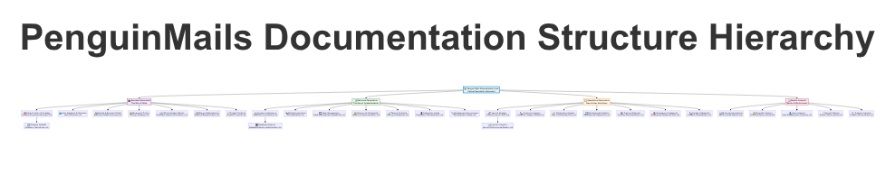

# PenguinMails Documentation Structure: Navigation, Business, Technical, and Operations for a Designer–Product Owner Cofounder

## Executive Overview: What This Structure Enables

This blueprint defines a documentation architecture that unifies navigation, business alignment, technical clarity, and operational execution for PenguinMails. It is designed to help a designer–product owner cofounder quickly orient new collaborators, drive informed decision-making, and reduce miscommunication across design, product, engineering, and operations.

The structure is built around four pillars that together cover the full lifecycle of product work and daily execution:

- Central Navigation: a single landing hub with explicit pathways into business, technical, and operational documentation.
- Business-Focused: a set of documents that explain why we are building, what we are solving, and how we measure success—no heavy jargon.
- Technical Reference: precise artifacts that serve as a shared source of truth for architecture, APIs, environments, and data handling.
- Operational Documents: playbooks and checklists that codify day-to-day processes and workflows across the product lifecycle.

Reading this document from front to back provides a complete view of how navigation, content categories, cross-referencing, ownership, and quality standards work together. The sections answer the key questions: what the architecture is, how to find the right document fast, what must be in each category, how cross-links keep the knowledge base coherent, who owns which documents, what quality and consistency standards apply, and how to evolve the structure responsibly.

Where details are not yet available—such as specific platform decisions, security posture, or release cadence—this blueprint explicitly flags information gaps so they can be resolved through the recommended review cadence.

To ground scope and ownership, Table 1 summarizes the primary document categories, their purpose, primary audience, and accountable owner.

To illustrate how responsibilities are distributed across the documentation system, the following table maps each category to its purpose, audience, and accountable owner.

Table 1. Document categories overview

| Category                    | Purpose                                                                 | Primary Audience                                          | Accountable Owner                         |
|----------------------------|-------------------------------------------------------------------------|-----------------------------------------------------------|-------------------------------------------|
| Central Navigation         | Single entry point and hub; fast pathways to all key artifacts          | Designers, Product, Engineering, Operations, New joiners  | Product Owner                             |
| Business-Focused           | Explain strategy, problems, success; inform roadmaps and decisions      | Product, Design, Leadership, Investors, Non-technical     | Product Owner                             |
| Technical Reference        | Provide precise technical truth: architecture, APIs, data, environments | Engineering, DevOps, Security, Technical Product          | Engineering Lead                          |
| Operational Documents      | Codify processes and runbooks for daily work                            | Operations, Support, Product, Engineering                 | Operations Lead                           |

The categories above are reinforced by detailed tables throughout this document. Notably, the cross-referencing strategy in a later section defines the specific links that connect business goals to technical specs and operational runbooks, minimizing ambiguity and duplicated effort.

## Audience and Core Use Cases

The documentation must serve four primary audiences: the cofounder (designer and product owner), designers, product managers, engineers, and operations. Each audience has a distinct set of tasks and goals, so the central navigation must provide tailored entry points while preserving a single source of truth.

- Designer–Product Owner Cofounder: Sets and communicates product strategy, guides the roadmap, coordinates design work, ensures decisions are coherent across teams, and quickly finds status and rationale behind key choices.
- Designers: Access clear product context, design principles and tokens, UI libraries, component states, and interaction patterns without needing to parse technical jargon.
- Engineers: Access architecture overviews, module responsibilities, API specs, environment and data policies, and decision records to build and test effectively.
- Operations and Support: Use SOPs and runbooks to handle onboarding, incident response, release coordination, and customer communications.

To make the pathways visible, Table 2 maps audiences to their core use cases and highlights the most relevant documents. The intent is to show how the navigation hub routes each audience to the right artifacts within two clicks.

Table 2. Audience-to-use-case mapping

| Audience                        | Key Tasks                                                    | Priority Documents                                                                                 |
|---------------------------------|--------------------------------------------------------------|----------------------------------------------------------------------------------------------------|
| Designer–Product Owner          | Set strategy, roadmap, decisions                            | Central Navigation; Product Strategy; Roadmap; Decision Log; Product Glossary                      |
| Designers                       | Build UI, define patterns, maintain design system           | Design Principles; Design Tokens; UI Library; Component Library; Interaction Patterns              |
| Engineers                       | Implement features, ensure reliability and security         | Architecture Overview; API Reference; Data Dictionary; Security & Privacy; Environments & Release |
| Operations & Support            | Run incidents, releases, customer comms                     | Incident Response Runbook; Release & Deployment SOP; Support Playbook; Customer Communications     |
| Investors/Stakeholders          | Understand value proposition and traction                   | Value Proposition; Market & Segments; Metrics & KPIs; Roadmap                                      |

The navigation hub must surface these priority documents prominently and preserve consistent breadcrumbs so users always know where they are and how to go back.

## Central Navigation Document

The Central Navigation document acts as the landing hub for the entire knowledge base. Its responsibilities are threefold: orient users quickly, provide high-level pathways into each documentation category, and offer “fast links” to the most frequently referenced artifacts.

The top of the page should feature a short summary of PenguinMails, a short list of value pillars, and a short “How to use this hub” section. Then, the hub must expose explicit pathways:

- Business Overview: product strategy, value proposition, segments, KPIs, and roadmap.
- Technical Reference: architecture overview, API reference, environments and release practices.
- Operations: onboarding, incident response, support processes, and customer communications.

Fast links should include the decision log, design principles, component library, API reference, release runbook, and incident response playbook. The page must consistently display last updated dates and owners, and apply consistent breadcrumbs across the entire knowledge base. A small status label—such as “current,” “under review,” or “outdated”—helps users understand the freshness of the content without needing to open it.

Table 3 inventories the hub’s sections and links. It also clarifies breadcrumbs and last-updated metadata that keep the navigation predictable and reliable.

Table 3. Navigation hub sections and links inventory

| Section                 | Description                                                           | Target Documents                                                  | Breadcrumb Path                 | Last Updated | Owner           |
|-------------------------|-----------------------------------------------------------------------|-------------------------------------------------------------------|----------------------------------|--------------|-----------------|
| Welcome & Overview      | Short intro to PenguinMails and value pillars                         | —                                                                 | Documentation > Home            | —            | Product Owner   |
| Business Overview       | Strategy, problems, value, segments, KPIs, roadmap                   | Product Strategy; Value Proposition; Market & Segments; KPIs & Metrics; Roadmap | Documentation > Business        | —            | Product Owner   |
| Technical Reference     | Architecture, APIs, data, environments, security                     | Architecture Overview; API Reference; Data Dictionary; Security & Privacy; Environments & Release | Documentation > Technical       | —            | Eng Lead        |
| Operations              | Processes, runbooks, support and customer communications              | SOP Overview; Incident Response; Release & Deployment; Support Playbook; Customer Comms             | Documentation > Operations      | —            | Operations Lead |
| Design System           | Principles, tokens, UI library, components, interactions              | Design Principles; Design Tokens; UI Library; Component Library; Interaction Patterns               | Documentation > Design System   | —            | Design Lead     |
| Fast Links              | Jump to the most used artifacts                                       | Decision Log; API Reference; Component Library; Release SOP; Incident Response                      | Documentation > Fast Links      | —            | Product Owner   |
| Governance & Updates    | Ownership, review cadence, versioning, contribution                   | Documentation Governance; Contribution Guidelines; Glossary; Templates                              | Documentation > Governance      | —            | Product Owner   |

By structuring the hub this way, every audience finds a clear route to the content they need. The governance section ties ownership and review cadence to the navigation itself, ensuring users understand how the hub is maintained and how to propose updates.

## Business-Focused Document Set

Business-focused documentation answers why we are building, what we are solving, and how we measure success. It must be free of technical jargon and should explicitly reference supporting technical and operational documents wherever decisions depend on constraints or trade-offs.

Core documents include: Product Strategy, Value Proposition, User Stories & Personas, Market & Segments, Business Metrics & KPIs, Roadmap, Pricing & Packaging (when relevant), and a Decision Log. Each document should link to technical architecture for feasibility, API references where integrations matter, and operational runbooks for delivery.

Table 4 provides a matrix that captures purpose, audience, owner, update cadence, and key cross-links for each business document.

Table 4. Business documents matrix

| Document                         | Purpose                                                           | Audience                                   | Owner            | Update Cadence     | Key Cross-Links                                                                 |
|----------------------------------|-------------------------------------------------------------------|--------------------------------------------|------------------|--------------------|----------------------------------------------------------------------------------|
| Product Strategy                 | Define objectives, outcomes, constraints, and rationale           | Product, Design, Leadership, Investors     | Product Owner    | Quarterly          | Architecture Overview; Decision Log; Roadmap                                    |
| Value Proposition                | Explain customer problems and unique value                        | Designers, Product, Investors              | Product Owner    | Quarterly          | Market & Segments; Metrics & KPIs                                               |
| User Stories & Personas          | Capture needs, jobs-to-be-done, and acceptance criteria           | Designers, Product, Engineers              | Product Owner    | Ongoing            | Component Library; Interaction Patterns; Acceptance Criteria Guidelines          |
| Market & Segments                | Describe target segments and their needs                          | Product, Investors                         | Product Owner    | Quarterly          | Value Proposition; Roadmap                                                      |
| Business Metrics & KPIs          | Define success metrics, targets, and measurement plans            | Product, Operations, Leadership            | Product Owner    | Monthly            | Data Dictionary; Environments & Release                                         |
| Roadmap                          | Prioritize initiatives and dependencies                           | All teams                                  | Product Owner    | Monthly            | Product Strategy; API Reference; Release SOP                                    |
| Pricing & Packaging (optional)   | Outline monetization model and tiers                              | Leadership, Investors                      | Product Owner    | Quarterly          | Value Proposition; Metrics & KPIs                                               |
| Decision Log                     | Record decisions and trade-offs with owners and timestamps        | All teams                                  | Product Owner    | Ongoing            | Architecture Overview; Product Strategy                                         |

The matrix clarifies how business documents connect to technical and operational artifacts. For example, the Roadmap explicitly links to the API Reference for integration efforts and to the Release SOP for delivery timelines. The Decision Log serves as the single source of truth for why a particular approach was chosen, referencing feasibility analysis in the Architecture Overview.

### Document Summaries (Business)

- Product Strategy: Defines the product’s objectives, outcomes, and constraints. It also captures rationale—what problems we prioritize and why—so future decisions remain coherent.
- Value Proposition: Explains the specific customer problems PenguinMails solves and how we deliver unique value compared to alternatives.
- User Stories & Personas: Documents user needs, jobs-to-be-done, and acceptance criteria so designers and engineers build the right experiences and behaviors.
- Market & Segments: Describes target segments, their needs, and how PenguinMails addresses them.
- Business Metrics & KPIs: Defines success metrics and measurement plans; clarifies how results are validated and reported.
- Roadmap: Captures priorities and dependencies across teams and cycles.
- Pricing & Packaging (optional): Outlines monetization model and tiers if applicable.
- Decision Log: Records key decisions and trade-offs with owners, dates, and context, linking back to architecture and business rationale.

## Technical Reference Document Set

Technical reference documentation must provide precise information that designers and product can trust, while enabling engineers to implement consistently. It should avoid unnecessary jargon, prefer visuals and labeled diagrams, and explain constraints and trade-offs in plain language.

Core documents include: System Architecture Overview, API Reference, Data Dictionary, Security & Privacy, Environments & Release, and Error Handling. Each document must link to business outcomes where relevant and be paired with checklists that support design, testing, and delivery.

Table 5 catalogs the technical artifacts and clarifies how they connect to business and operations.

Table 5. Technical artifacts catalog

| Artifact                         | Scope                                                           | Audience                   | Owner         | Related Docs                                           |
|----------------------------------|-----------------------------------------------------------------|----------------------------|---------------|--------------------------------------------------------|
| System Architecture Overview     | Components, data flows, responsibilities, constraints           | Product, Design, Engineering | Eng Lead     | Product Strategy; Decision Log                         |
| API Reference                    | Endpoints, methods, payloads, authentication, examples          | Engineering, Product       | Eng Lead      | Roadmap; Integration Guidelines                        |
| Data Dictionary                  | Entities, attributes, types, lifecycle, PII handling            | Engineering, Product, Ops  | Eng Lead      | Security & Privacy; Metrics & KPIs                     |
| Security & Privacy               | Data protection policies, access control, incident procedures   | Engineering, Ops, Product  | Eng Lead      | Incident Response Runbook; Environments & Release      |
| Environments & Release           | Environment definitions, promotion, deployment steps, rollback  | Engineering, Ops           | Eng Lead      | Release SOP; Metrics & KPIs                            |
| Error Handling                   | Standardized error catalog and remediation paths                | Engineering, Ops, Support  | Eng Lead      | API Reference; Support Playbook                        |

The architecture overview should include a high-level diagram that shows modules and data flows with labels and minimal jargon, followed by a written explanation that ties constraints to product goals (for example, rate limits that protect reliability).

#### Document Summaries (Technical)

- System Architecture Overview: Provides a diagram and narrative of components, data flows, responsibilities, and constraints to anchor design and delivery decisions.
- API Reference: Documents endpoints, methods, payloads, authentication, and examples; links to integration guidelines and roadmap items that depend on APIs.
- Data Dictionary: Describes entities, attributes, and lifecycle, including how personally identifiable information (PII) is handled and protected.
- Security & Privacy: Outlines data protection policies, access control, and incident procedures; connects to operational runbooks.
- Environments & Release: Defines development, staging, and production environments, promotion criteria, deployment steps, and rollback procedures.
- Error Handling: Establishes a standardized catalog of errors and remediation paths, tying into support playbooks.

## Operational Documents

Operational documentation codifies the daily workflows that keep PenguinMails shipping reliably and serving customers well. It should be written in accessible language, with step-by-step sequences and clear roles. Every process must have defined entry and exit criteria, ownership, and success measures.

Core documents include: Standard Operating Procedures (SOPs), Incident Response, Release & Deployment, Support Playbook, Onboarding & Access, and Customer Communications.

Table 6 maps each workflow to its audience, trigger, inputs/outputs, and success criteria.

Table 6. Operational workflows mapping

| Workflow                        | Audience                | Trigger                                 | Inputs                                   | Outputs                                 | Success Criteria                                         |
|---------------------------------|-------------------------|------------------------------------------|------------------------------------------|------------------------------------------|----------------------------------------------------------|
| SOP Overview                    | All teams               | Need for standardized procedures         | Process definitions                       | Linked SOPs, templates                   | Clear, discoverable SOPs                                 |
| Release & Deployment SOP        | Engineering, Ops        | Planned release or hotfix                | Release notes, code changes, approvals    | Deployed release, validated rollbacks    | On-time deployment, zero critical rollback               |
| Incident Response Runbook       | Ops, Engineering        | Alerts or customer-reported incidents    | Incident classification, severity, comms  | Resolved incident, RCA, updates          | MTTR within target, accurate classification              |
| Support Playbook                | Support, Ops            | Customer queries and issues              | FAQs, known issues, escalation paths      | Resolved tickets, knowledge base updates | High CSAT, consistent triage                             |
| Onboarding & Access             | Ops, New joiners        | New hire or role change                  | Access requests, checklists               | Provisioned accounts, completed training | On-time access provisioning, zero security violations    |
| Customer Communications         | Product, Ops, Support   | Incident or major change                 | Comms templates, approvals                | Timely, accurate communications          | Stakeholder satisfaction, compliance with comms policy   |

#### Document Summaries (Operations)

- SOP Overview: Introduces standardized procedures and templates; links to detailed SOPs for onboarding, support, release management, and compliance.
- Release & Deployment SOP: Defines prerequisites, approvals, execution steps, and validation checks for releases, including rollback readiness.
- Incident Response Runbook: Establishes classification and severity guidelines, roles and communications, resolution steps, and post-incident reviews.
- Support Playbook: Details triage, escalation paths, FAQs, and known issues; keeps customer communications accurate and timely.
- Onboarding & Access: Documents account provisioning, tool access, and role-based permissions; ties into security policies.
- Customer Communications: Provides templates and approval workflows for status pages and incident notices.

## Cross-Referencing Strategy

A strong documentation set is unified by explicit cross-links that connect business intent to technical feasibility and operational delivery. The Central Navigation hub must expose pathways by audience, while each document must include “Related Documents” sections that point to its dependencies and consumers.

- Navigation: The hub routes users based on task (“Plan roadmap,” “Implement feature,” “Respond to incident”) rather than role alone.
- Business-to-Technical: Strategic and roadmap documents link to architecture, API specs, and data handling where decisions depend on feasibility or constraints.
- Business-to-Operational: Strategy and KPIs link to release and support processes so success measures are embedded into how work is executed.
- Technical-to-Business: Architecture and APIs link back to product outcomes and decision rationale to maintain coherence over time.
- Bidirectional Links: Where changes in one document affect another, both should include cross-references so updates propagate consistently.

Table 7 illustrates common cross-link pairs and the reason they matter.

Table 7. Cross-link map examples

| Source Document                | Target Document              | Link Reason                                                     | User Task                                       |
|--------------------------------|------------------------------|-----------------------------------------------------------------|-------------------------------------------------|
| Product Strategy               | Architecture Overview        | Validate feasibility and constraints                            | Decide priorities                               |
| Roadmap                        | API Reference                | Identify integration dependencies                               | Plan release                                    |
| Decision Log                   | Environments & Release       | Confirm deployment implications of a decision                   | Execute release                                 |
| Metrics & KPIs                 | Data Dictionary              | Ensure metrics have correct entities and attributes             | Report performance                              |
| Support Playbook               | Error Handling               | Align triage with standardized error catalog                    | Resolve customer issue                          |
| Security & Privacy             | Onboarding & Access          | Ensure access provisioning follows policies                     | Provision accounts                              |

To preserve clarity, the following rule set governs link styling and consistency:

- Link styling: Within the navigation hub and document bodies, use descriptive link text that states the target document name and its purpose. Avoid bare URLs and generic “click here” labels.
- Consistency: Each “Related Documents” section must include at least one upstream link (what influences this document) and one downstream link (what this document influences).
- Link health: Conduct a periodic link validation scan as part of documentation governance. Remove broken links, add missing targets, and update link text for clarity.

## Suggested Reading Paths

Different stakeholders need different starting points and sequencing to achieve their goals efficiently. The central navigation hub must make these pathways discoverable, and every document should include a small “Start here” section that points to the relevant pathway if the user is new.

- Designer–Product Owner Path: Product Strategy → Value Proposition → User Stories & Personas → Design Principles → Design Tokens → UI Library → Component Library → Roadmap → Decision Log.
- Designer Path: Design Principles → Design Tokens → UI Library → Component Library → Interaction Patterns → User Stories & Personas.
- Product Manager Path: Product Strategy → Market & Segments → Metrics & KPIs → Roadmap → Decision Log.
- Engineer Path: Architecture Overview → API Reference → Environments & Release → Error Handling → Data Dictionary → Security & Privacy.
- Operations Path: SOP Overview → Incident Response → Support Playbook → Onboarding & Access → Customer Communications → Environments & Release.

Table 8 organizes these paths as ordered steps with expected outcomes so users know what they will achieve by following a path.

Table 8. Reading paths by role

| Role                      | Ordered Steps                                                                                                           | Expected Outcomes                                                                                  |
|---------------------------|-------------------------------------------------------------------------------------------------------------------------|----------------------------------------------------------------------------------------------------|
| Designer–Product Owner    | Strategy → Value → Personas → Design Principles → Tokens → UI Library → Component Library → Roadmap → Decision Log    | Aligned strategy and design system, coherent roadmap, documented rationale                        |
| Designer                  | Principles → Tokens → UI Library → Component Library → Interactions → Personas                                        | Consistent UI/UX patterns aligned with user needs                                                 |
| Product Manager           | Strategy → Segments → Metrics → Roadmap → Decision Log                                                                  | Informed prioritization and stakeholder communication                                              |
| Engineer                  | Architecture → API → Environments → Error Handling → Data Dictionary → Security                                         | Clear implementation path, reliable release, secure data handling                                  |
| Operations                | SOPs → Incident Response → Support → Onboarding → Communications → Environments                                         | Operational readiness, efficient incident handling, clear customer comms                          |

## Content Guidelines and Conventions

Consistency is essential for usability and trust. The following guidelines establish naming conventions, metadata, tone and readability, visuals, and versioning rules. Designers and product owners should feel confident contributing without learning technical jargon, and engineers should find precise definitions without wading through marketing language.

Naming conventions: Use Title Case for document titles. Prefer concise, descriptive names that reflect the content and purpose—for example, “Component Library” rather than “UI Components Index.” Avoid technical jargon in business documents; when technical terms are unavoidable, include definitions in the Product Glossary.

Metadata: Every document must include a short summary, last updated date, owner, and status label (“current,” “under review,” “outdated”). Maintain a short change history with dates and owners to preserve context and accountability.

Tone and readability: Keep language simple and direct. Use short paragraphs and define acronyms on first mention. Provide examples where they aid understanding and avoid long walls of text by using clear section headers.

Visuals: Use labeled diagrams, flowcharts, and annotated screenshots with captions. Diagrams should be introduced with context and followed by analysis that explains their significance. For technical diagrams, minimize jargon and explain constraints in plain language.

Versioning and change history: Minor changes update metadata and small content adjustments. Major changes introduce new sections, alter structures, or change processes. The document owner is responsible for updating status labels and ensuring downstream documents are reviewed if dependencies change.

Contributing: Use a standard template for new documents, with a required summary, owner, update cadence, and related documents. The contribution process includes a brief review by the owner and a link validation check.

Table 9 presents a metadata schema that clarifies required fields and example values. It helps content creators and owners maintain uniformity across documents.

Table 9. Content metadata schema

| Field            | Required | Description                                              | Example                                         |
|------------------|----------|----------------------------------------------------------|-------------------------------------------------|
| Title            | Yes      | Document title in Title Case                             | Component Library                               |
| Summary          | Yes      | 1–3 sentence overview of the document’s scope and value | Catalog of UI components with states and usage. |
| Owner            | Yes      | Accountable individual or role                           | Design Lead                                     |
| Last Updated     | Yes      | Date of most recent change                               | 2025-10-27                                      |
| Status           | Yes      | current / under review / outdated                        | current                                         |
| Update Cadence   | Yes      | Expected frequency of review                             | Monthly                                         |
| Related Docs     | Yes      | Upstream and downstream cross-references                 | Design Principles; Interaction Patterns         |
| Change History   | Yes      | Brief log of notable changes                             | 2025-10-27: Added pagination component          |

## Maintenance, Ownership, and Governance

A clear governance model ensures the documentation remains accurate, coherent, and up to date. Ownership is assigned per category, with a quarterly review cadence and an annual structural assessment. Contributions are welcomed via a defined process, and link health is monitored to prevent dead ends.

Ownership and accountability:

- Business documents: Product Owner.
- Technical documents: Engineering Lead.
- Operational documents: Operations Lead.
- Central Navigation: Product Owner.

Review cadence: Business documents are reviewed quarterly or when major product decisions change. Technical documents are reviewed monthly or with each major release that impacts architecture or APIs. Operational documents are reviewed monthly to reflect process improvements and incident learnings.

Contribution workflow: Proposals begin with a summary and target category. The owner triages the request, assigns a reviewer, and schedules a review. Accepted changes follow the content guidelines and metadata requirements, and link validation is performed.

Deprecation and archiving: Documents that become outdated are archived with a note that explains why and where relevant content now resides. Archival includes redirect links where possible and an update to the navigation hub.

Quality metrics: Track document freshness (status and last updated), link health (percentage of valid links), and contribution activity (proposals and resolutions). Use these metrics to prioritize maintenance efforts.

Table 10 sets out a governance matrix that clarifies who is responsible for each category, the SLA for updates, the review cadence, and escalation paths when blockers arise.

Table 10. Governance matrix

| Document Category         | Responsible Role    | Update SLA              | Review Cadence   | Escalation Path                         |
|---------------------------|---------------------|-------------------------|------------------|-----------------------------------------|
| Central Navigation        | Product Owner       | 2 weeks for structural  | Quarterly        | Cofounder                               |
| Business-Focused          | Product Owner       | 2 weeks for major items | Quarterly        | Leadership                               |
| Technical Reference       | Engineering Lead    | 2 weeks for releases    | Monthly          | Engineering leadership                   |
| Operational Documents     | Operations Lead     | 2 weeks for process     | Monthly          | Operations leadership                    |
| Governance & Templates    | Product Owner       | 4 weeks                 | Quarterly        | Cofounder                               |

## Implementation Roadmap

Roll out the documentation structure in three phases to achieve quick wins, establish shared technical and operational truth, and embed governance for long-term health.

Phase 1 (Weeks 0–2): Central Navigation and quick wins. Create the hub, fast links, and essential business documents (Product Strategy, Value Proposition, Decision Log). Ensure clear ownership and status labels.

Phase 2 (Weeks 2–6): Technical reference and operations. Publish Architecture Overview, API Reference, Data Dictionary, Security & Privacy, Environments & Release, and Error Handling. Deliver SOPs for incident response, release and deployment, support, onboarding, and customer communications.

Phase 3 (Weeks 6–12): Mature cross-linking, review cadence, and quality metrics. Validate link health, refine pathways based on usage, implement dashboards for freshness and contribution activity, and conduct the first quarterly governance review.

Training and onboarding: Schedule short workshops to introduce the hub and pathways, assign buddy pairs across functions to promote cross-functional fluency, and include documentation orientation in new joiner onboarding.

Success metrics: Monitor adoption (path usage and document views), freshness (status distribution and last updated), link health (valid links ratio), time-to-find (how quickly users access the right document), and reduction in repeated questions through tracking in support channels.

Table 11 lays out the phases, tasks, owners, milestones, and success criteria.

Table 11. Roadmap timeline

| Phase | Tasks                                                                                         | Owners            | Milestones                                       | Success Criteria                                           |
|-------|------------------------------------------------------------------------------------------------|-------------------|--------------------------------------------------|------------------------------------------------------------|
| 1     | Launch hub, fast links, Product Strategy, Value Proposition, Decision Log                      | Product Owner     | Hub live; core business docs published           | Hub adoption; clear entry points for all audiences         |
| 2     | Publish Architecture, API Reference, Data Dictionary, Security, Environments, Error Handling; SOPs for Incident, Release, Support, Onboarding, Comms | Eng Lead, Ops Lead | Technical and ops docs complete and linked        | Reliable delivery; accurate incident response and release   |
| 3     | Cross-link validation, dashboard for metrics, quarterly governance review                      | Product Owner     | Quarterly review executed; metrics reporting     | Improved freshness, link health, and time-to-find          |

## Information Gaps

Several items require future confirmation and should be treated as placeholders until decisions are finalized:

- Detailed system components, data flows, and architecture decisions.
- Security, privacy, and compliance requirements, including retention policies.
- Target environments (development, staging, production) and release processes.
- Business model, pricing strategy, and customer segments.
- Key metrics and KPIs that define success.
- Tooling and platform stack decisions.
- Team structure, roles, and ownership assignments for documentation categories.
- Brand assets and design tokens, including color, typography, and component library details.

Each information gap is addressed in the governance section by assigning ownership and a review cadence. As decisions are made, documents should be updated and cross-linked promptly to preserve a single source of truth.

---

By implementing this structure, PenguinMails will gain a coherent documentation system that supports decision-making, design integrity, technical reliability, and operational excellence. The central navigation ensures fast discovery, the business documents align strategy and execution, the technical references provide precision without jargon, and the operational runbooks embed quality into daily workflows. Together, these elements enable a scalable, maintainable knowledge base that grows with the product and the team.---

## 🗺️ Documentation Hierarchy Diagram

The following diagram shows the complete documentation structure for PenguinMails, organized into logical categories that support different stakeholder needs:

### Diagram Legend

- **🔵 Blue**: Central Navigation Hub - Entry point for all documentation
- **🟣 Purple**: Business Documents - Strategy, user research, market analysis
- **🟢 Green**: Technical Documents - Architecture, APIs, development guidelines
- **🟠 Orange**: Operational Documents - Day-to-day workflows, processes
- **🟣 Pink**: Data & Analytics - Metrics, performance tracking, reports

### Key Features of the Hierarchy

1. **Central Hub**: All documentation flows from a single navigation document
2. **Category Organization**: Documents grouped by purpose and audience
3. **Cross-References**: Documents reference related materials for complete context
4. **Scalability**: Structure accommodates future additions and expansions
5. **User-Centric**: Designed for different stakeholder needs and technical levels

### Navigation Principles

- **Breadcrumbs**: Easy navigation through the documentation tree
- **Index Pages**: Quick access to all documents within each category  
- **Search Integration**: Cross-category search for finding specific information
- **Version Control**: Clear versioning and update history for all documents
- **Access Levels**: Different permission levels based on document sensitivity

This hierarchical structure ensures that every stakeholder can find the information they need efficiently while maintaining a logical organization that scales with product growth.