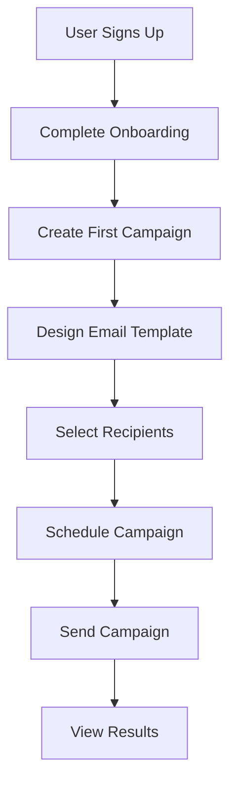

# **PenguinMails Implementation Roadmap**

---

## 1. **Purpose**

This Implementation Roadmap provides a comprehensive, phased approach to building PenguinMails from concept to production. It aligns technical implementation with business objectives, user needs, and technical constraints to ensure successful platform delivery.

## 2. **Roadmap Overview**

### **Implementation Phases**
```typescript
enum ImplementationPhase {
  FOUNDATION = 'foundation',       // Core infrastructure and basic functionality
  MVP = 'mvp',                     // Minimum viable product with core features
  SCALE = 'scale',                 // Performance optimization and scaling
  ENHANCE = 'enhance',             // Advanced features and polish
  OPTIMIZE = 'optimize'            // Continuous improvement and optimization
}

interface RoadmapPhase {
  id: ImplementationPhase;
  name: string;
  duration: number;                // weeks
  objectives: string[];
  deliverables: string[];
  successCriteria: string[];
  risks: string[];
  dependencies: string[];
}
```

### **Overall Timeline**
- **Total Duration**: 24 months (2 years)
- **MVP Launch**: Month 6
- **Full Launch**: Month 12
- **Scale Optimization**: Month 18
- **Continuous Enhancement**: Month 24+

## 3. **Phase 1: Foundation (Months 1-3)**

### **Objectives**
- Establish core infrastructure and development environment
- Build basic user authentication and account management
- Create fundamental database schema and API structure
- Implement essential security measures

### **Key Deliverables**
```typescript
const foundationDeliverables = {
  infrastructure: [
    'VPS infrastructure setup with Hostwinds',
    'NileDB multi-tenant database configuration',
    'CI/CD pipeline with GitHub Actions',
    'Development and staging environments',
    'Monitoring and logging infrastructure'
  ],

  authentication: [
    'User registration and login system',
    'Email verification workflow',
    'Basic user profile management',
    'Session management and security'
  ],

  database: [
    'Multi-tenant database schema design',
    'User and organization tables',
    'Campaigns table with tracking_domain column',
    'Basic data access layer',
    'Database migration system'
  ],

  api: [
    'RESTful API structure with Next.js',
    'Basic CRUD operations for users',
    'Campaign API with tracking domain support',
    'API documentation with Swagger',
    'Rate limiting and basic security'
  ]
};
```

### **Technical Implementation**
```typescript
interface FoundationImplementation {
  frontend: {
    framework: 'Next.js 13+ with App Router',
    styling: 'Tailwind CSS with design tokens',
    stateManagement: 'React Context for global state',
    formHandling: 'React Hook Form with validation'
  };

  backend: {
    runtime: 'Node.js with TypeScript',
    api: 'Next.js API routes',
    database: 'NileDB with Prisma ORM',
    authentication: 'Custom JWT implementation'
  };

  devops: {
    hosting: 'Hostwinds VPS with Docker',
    deployment: 'GitHub Actions CI/CD',
    monitoring: 'Basic uptime monitoring',
    security: 'SSL certificates and basic WAF'
  };
}
```

### **Success Criteria**
- [ ] Development environment fully operational
- [ ] User registration and login working
- [ ] Basic API endpoints functional
- [ ] Database multi-tenancy implemented
- [ ] Code can be deployed to staging environment

### **Risks and Mitigations**
- **Risk**: Infrastructure setup complexity
- **Mitigation**: Start with simple single-server setup, plan for scaling

- **Risk**: Multi-tenant database challenges
- **Mitigation**: Begin with single tenant, implement multi-tenancy incrementally

## 4. **Phase 2: MVP Development (Months 4-6)**

### **Objectives**
- Implement core email campaign functionality
- Build basic admin and user dashboards
- Create campaign creation and management workflow
- Establish payment processing for subscriptions

### **Key Deliverables**
```typescript
const mvpDeliverables = {
  campaignManagement: [
    'Campaign creation and editing interface',
    'Email template builder with drag-and-drop',
    'Recipient list management and segmentation',
    'Campaign scheduling and automation',
    'Custom tracking domain configuration per campaign'
  ],

  emailDelivery: [
    'Integration with Mailgun/SendGrid ESPs',
    'Email sending queue and processing',
    'Delivery tracking and basic analytics',
    'Bounce and unsubscribe handling',
    'Custom tracking domain support for open/click tracking'
  ],

  dashboard: [
    'User dashboard with campaign overview',
    'Basic analytics and reporting',
    'Account settings and billing',
    'Email template library'
  ],

  payments: [
    'Stripe Connect integration',
    'Subscription plan management',
    'Basic billing dashboard',
    'Payment method management'
  ]
};
```

### **User Journey Implementation**


### **Technical Challenges**
- **Email deliverability**: IP warming, reputation management
- **Template complexity**: Drag-and-drop email builder
- **Real-time analytics**: Basic tracking and reporting
- **Payment security**: PCI compliance and secure processing
- **Tracking domains**: Custom domain integration for link tracking

### **Success Criteria**
- [ ] Users can create and send basic email campaigns
- [ ] Dashboard shows campaign performance metrics
- [ ] Payment processing handles subscriptions
- [ ] Email deliverability meets basic standards
- [ ] System can handle 100+ concurrent users

### **MVP Launch Checklist**
- [ ] Core user journeys functional
- [ ] Payment processing stable
- [ ] Email delivery reliable
- [ ] Custom tracking domains functional
- [ ] Basic support and documentation
- [ ] Security and compliance requirements met

## 5. **Phase 3: Scale and Optimize (Months 7-12)**

### **Objectives**
- Optimize performance for growing user base
- Enhance email deliverability and analytics
- Implement advanced campaign features
- Build comprehensive admin and management tools

### **Key Deliverables**
```typescript
const scaleDeliverables = {
  performance: [
    'Database query optimization',
    'Caching layer implementation',
    'CDN integration for assets',
    'Horizontal scaling capabilities'
  ],

  deliverability: [
    'Dedicated IP management',
    'Advanced deliverability monitoring',
    'Spam complaint handling',
    'Domain reputation tracking'
  ],

  advancedFeatures: [
    'A/B testing for campaigns',
    'Dynamic content and personalization',
    'Automation workflows',
    'Advanced segmentation'
  ],

  analytics: [
    'Comprehensive campaign analytics',
    'User behavior tracking',
    'Revenue and ROI reporting',
    'Predictive analytics'
  ],

  adminTools: [
    'Administrative dashboard',
    'User management system',
    'System monitoring and alerts',
    'Customer support tools'
  ]
};
```

### **Scalability Architecture**
```typescript
interface ScalabilityArchitecture {
  database: {
    readReplicas: 'Multiple read replicas for query distribution',
    connectionPooling: 'Optimized connection management',
    queryOptimization: 'Indexing and query performance tuning',
    caching: 'Redis caching for frequently accessed data'
  };

  application: {
    loadBalancing: 'Application load balancer for traffic distribution',
    autoScaling: 'Automatic scaling based on demand',
    microservices: 'Service decomposition for independent scaling',
    apiGateway: 'Centralized API management and routing'
  };

  infrastructure: {
    cdn: 'Global content delivery network',
    monitoring: 'Comprehensive system monitoring',
    backup: 'Automated backup and disaster recovery',
    security: 'Enhanced security measures and controls'
  };
}
```

### **Success Criteria**
- [ ] System handles 1000+ concurrent users
- [ ] Email deliverability >95% inbox placement
- [ ] Page load times <2 seconds
- [ ] 99.9% uptime achieved
- [ ] Advanced features fully functional

## 6. **Phase 4: Enhance and Polish (Months 13-18)**

### **Objectives**
- Add advanced marketing automation features
- Implement enterprise-grade features
- Enhance user experience and design
- Build comprehensive integration ecosystem

### **Key Deliverables**
```typescript
const enhancementDeliverables = {
  automation: [
    'Drip campaign sequences',
    'Behavioral triggers and workflows',
    'Lead scoring and nurturing',
    'Multi-channel campaign orchestration'
  ],

  enterprise: [
    'Team collaboration features',
    'Advanced permission management',
    'White-label customization',
    'Enterprise security features'
  ],

  integrations: [
    'CRM system integrations',
    'E-commerce platform connections',
    'API access and webhooks',
    'Third-party app marketplace'
  ],

  intelligence: [
    'AI-powered content suggestions',
    'Predictive send time optimization',
    'Automated A/B testing',
    'Smart segmentation algorithms'
  ],

  userExperience: [
    'Mobile-responsive optimization',
    'Advanced accessibility features',
    'Progressive web app capabilities',
    'Offline functionality'
  ]
};
```

### **Integration Architecture**
```typescript
interface IntegrationArchitecture {
  api: {
    restApi: 'Comprehensive REST API with versioning',
    webhooks: 'Real-time event notifications',
    oauth: 'Secure third-party authentication',
    graphql: 'Flexible data querying (future consideration)'
  };

  connectors: {
    crm: ['Salesforce', 'HubSpot', 'Pipedrive'],
    ecommerce: ['Shopify', 'WooCommerce', 'Magento'],
    marketing: ['Google Analytics', 'Facebook Ads', 'LinkedIn'],
    communication: ['Slack', 'Microsoft Teams', 'Discord']
  };

  marketplace: {
    appDirectory: 'Third-party app marketplace',
    apiAccess: 'Developer API access program',
    certification: 'App certification process',
    revenueSharing: 'Partner revenue sharing model'
  };
}
```

## 7. **Phase 5: Optimize and Evolve (Months 19-24+)**

### **Objectives**
- Continuous performance optimization
- Advanced AI and machine learning features
- Global expansion and localization
- Enterprise feature development

### **Key Deliverables**
```typescript
const optimizationDeliverables = {
  ai_ml: [
    'AI content generation and optimization',
    'Predictive analytics and insights',
    'Automated campaign optimization',
    'Smart subject line suggestions'
  ],

  global: [
    'Multi-language support',
    'Localized content and campaigns',
    'International payment processing',
    'Global compliance and regulations'
  ],

  enterprise: [
    'Advanced security and compliance',
    'Custom integrations and APIs',
    'Dedicated infrastructure options',
    'Priority support and SLAs'
  ],

  innovation: [
    'Experimental features and testing',
    'User feedback integration',
    'Competitive analysis and differentiation',
    'Technology stack modernization'
  ]
};
```

## 8. **Technical Architecture Evolution**

### **Database Evolution**
- **Phase 1-2**: Single NileDB instance with basic multi-tenancy
- **Phase 3**: Read replicas and query optimization
- **Phase 4**: Advanced sharding and caching strategies
- **Phase 5**: Global database distribution and advanced analytics

### **Application Architecture**
- **Phase 1-2**: Monolithic Next.js application
- **Phase 3**: Microservices decomposition begins
- **Phase 4**: Full microservices architecture with API gateway
- **Phase 5**: Serverless functions and edge computing

### **Infrastructure Evolution**
- **Phase 1-2**: Single VPS with basic monitoring
- **Phase 3**: Multi-server setup with load balancing
- **Phase 4**: Auto-scaling infrastructure with CDN
- **Phase 5**: Multi-region deployment with disaster recovery

## 9. **Resource Planning**

### **Team Growth**
```typescript
interface TeamEvolution {
  phase1: {
    engineering: 3,     // Founder + 2 developers
    design: 1,          // 1 designer
    operations: 0       // Outsourced
  };

  phase2: {
    engineering: 6,     // +3 backend/frontend developers
    design: 2,          // +1 designer
    operations: 1       // DevOps engineer
  };

  phase3: {
    engineering: 12,    // +6 engineers (specialized roles)
    design: 3,          // +1 senior designer
    operations: 3       // DevOps + security + support
  };

  phase4: {
    engineering: 20,    // +8 engineers + architects
    design: 5,          // +2 designers + design system
    operations: 6       // Full operations team
  };

  phase5: {
    engineering: 30,    // +10 engineers + AI/ML specialists
    design: 8,          // +3 designers + UX researchers
    operations: 10      // Enterprise operations team
  };
}
```

### **Budget Allocation**
- **Phase 1-2**: 70% engineering, 20% infrastructure, 10% operations
- **Phase 3**: 60% engineering, 25% infrastructure, 15% operations
- **Phase 4**: 50% engineering, 30% infrastructure, 20% operations
- **Phase 5**: 40% engineering, 35% infrastructure, 25% operations

## 10. **Risk Management**

### **Technical Risks**
- **Scalability challenges**: Plan for infrastructure scaling early
- **Third-party dependencies**: Diversify providers and build fallbacks
- **Security vulnerabilities**: Implement security-first development
- **Performance bottlenecks**: Monitor and optimize continuously

### **Business Risks**
- **Market timing**: Validate product-market fit early
- **Competition**: Differentiate through unique features
- **Regulatory compliance**: Build compliance into architecture
- **Customer acquisition**: Validate pricing and go-to-market strategy

### **Operational Risks**
- **Team scaling**: Hire and retain top talent
- **Process complexity**: Maintain agility while scaling
- **Quality assurance**: Ensure quality doesn't degrade with speed
- **Cost management**: Control infrastructure and operational costs

## 11. **Success Metrics and KPIs**

### **Product Metrics**
- **User Acquisition**: Monthly active users and growth rate
- **Engagement**: Daily/weekly active users, feature adoption
- **Retention**: User retention rates and churn analysis
- **Revenue**: MRR growth, ARPU, LTV/CAC ratio

### **Technical Metrics**
- **Performance**: Response times, uptime, error rates
- **Scalability**: Concurrent users, throughput, resource utilization
- **Quality**: Test coverage, deployment frequency, incident response time
- **Security**: Vulnerability scans, incident response, compliance audits

### **Business Metrics**
- **Market Share**: Competitive positioning and market penetration
- **Customer Satisfaction**: NPS, support ticket resolution, feature requests
- **Operational Efficiency**: Team productivity, cost per user, time to market
- **Financial Performance**: Revenue growth, profitability, cash flow

## 12. **Milestone Tracking**

### **Phase 1 Milestones** (Month 3)
- [ ] Infrastructure setup complete
- [ ] Authentication system functional
- [ ] Basic API and database operational
- [ ] Development environment stable

### **Phase 2 Milestones** (Month 6)
- [ ] MVP features implemented
- [ ] User onboarding functional
- [ ] Payment processing operational
- [ ] Public beta launch

### **Phase 3 Milestones** (Month 12)
- [ ] Full product launch
- [ ] 1000+ active users
- [ ] Advanced features implemented
- [ ] Enterprise customers onboarded

### **Phase 4 Milestones** (Month 18)
- [ ] 10,000+ active users
- [ ] Global expansion initiated
- [ ] Advanced integrations complete
- [ ] Enterprise features mature

### **Phase 5 Milestones** (Month 24+)
- [ ] 100,000+ active users
- [ ] AI/ML features launched
- [ ] Multiple market dominance
- [ ] IPO or significant exit achieved

---

## Related Documents
- [Business Model](business_model.md) - Business strategy and objectives
- [Technical Constraints Analysis](technical_constraints_analysis.md) - Technical limitations and considerations
- [User Journeys](user_journeys.md) - User experience and feature requirements
- [Product Strategy](product_strategy.md) - Product vision and roadmap alignment
- [Financial Metrics](financial_metrics.md) - Revenue and growth projections

**Keywords**: implementation roadmap, phased development, MVP strategy, scalability planning, technical architecture evolution, resource planning, risk management, milestone tracking