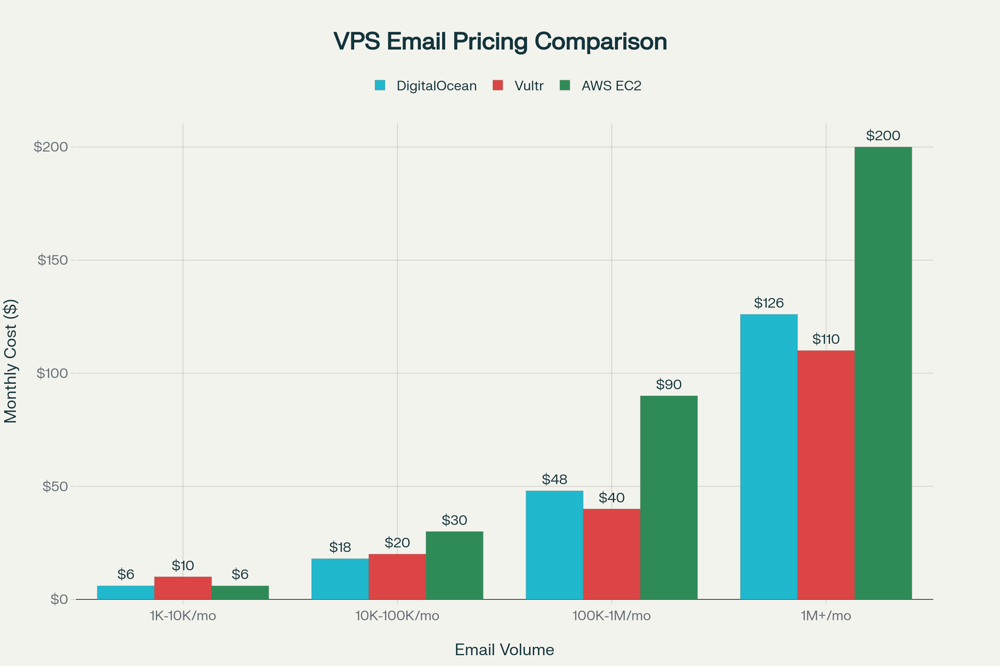
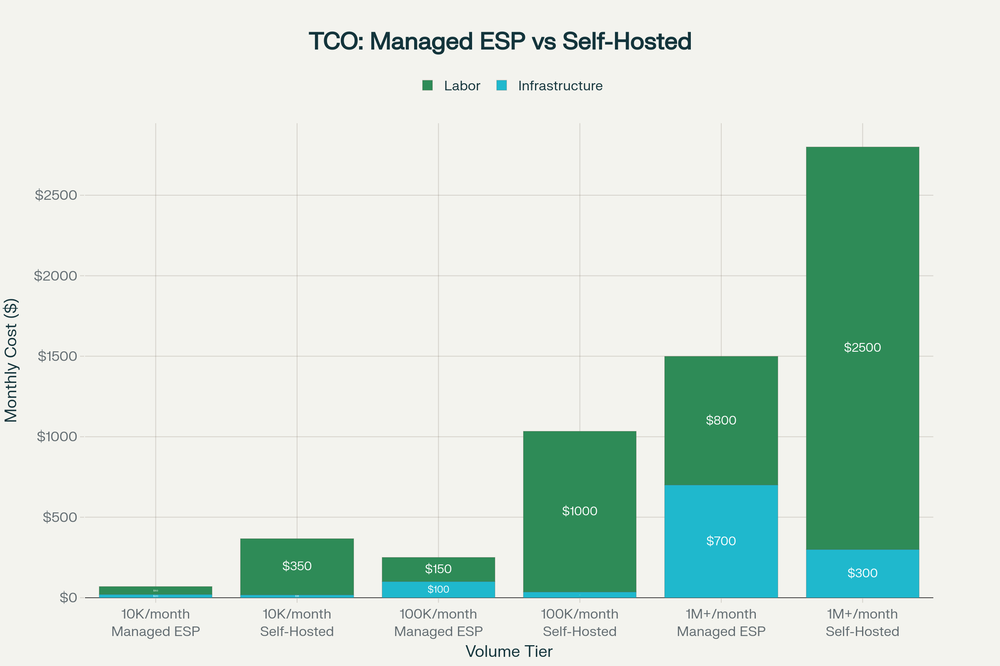

# 🐧 PenguinMails
{: .d-none }

<b>Welcome to PenguinMails documentation.</b>
PenguinMails handles your entire email operation - from VPS setup to campaign optimization - so you can focus on growing your business.

[What we offer](docs/what-is-penguinmails){: .btn .btn-blue .mr-4}
[Buy a subscription](https://penguinmails.com/pricing/){: .btn .btn-green}

---

Welcome to our help center. PenguinMails is purpose-built for cold email success, focusing on **deliverability**, **compliance**, and **reputation management** - the three factors that determine whether your cold emails actually reach prospects.

---

## 🎯 Quick Start by Role

### 💼 For Business Leaders (CFO/VP Level)
**Executive-level financial analysis, ROI planning, and infrastructure investment decisions**

{: width="100%" }

**Why PenguinMails**: 3-7x cost savings vs self-hosted solutions

- [🏢 Executive Summary](docs/business/executive-summary.md) - *15-minute strategic overview*
- [💰 ROI Calculator](docs/business/roi-calculator.md) - *Interactive cost-benefit analysis*
- [🏆 Competitive Analysis](docs/business/competitive-analysis.md) - *Provider selection matrix*
- [📘 Procurement Guide](docs/business/procurement-guide.md) - *Enterprise evaluation pack*
- [🛡️ Security & Compliance](docs/business/security-compliance.md) - *Risk assessment overview*
- [🏗️ Implementation Roadmap](docs/business/implementation-roadmap.md) - *Executive timeline*
- [📈 Success Metrics](docs/business/success-metrics.md) - *Business KPI framework*
- [📊 Performance Dashboard](docs/business/performance-dashboard.md) - *Executive dashboard*

**Industry-Specific Deep Dives:**
- [🏥 Healthcare Business Case](docs/business/industry-business-cases/healthcare.md) - *HIPAA compliance & patient communications*
- [🏛️ Financial Services Case](docs/business/industry-business-cases/financial-services.md) - *SOX compliance & banking security*
- [🛒 E-commerce Business Case](docs/business/industry-business-cases/ecommerce.md) - *Customer retention & marketing automation*
- [🏢 Agencies & Consulting](docs/business/industry-business-cases/agencies-consulting.md) - *Client confidentiality & multi-client management*
- [🚀 SaaS Business Case](docs/business/industry-business-cases/saas.md) - *Customer lifecycle & product-led growth*

### 🏗️ For Technical Teams (IT/DevOps)
**Implementation guides, API reference, and technical architecture**

- [🔧 Technical Infrastructure](docs/business/technical-infrastructure.md) - *Complete technical specs*
- [⚖️ Compliance Framework](docs/business/compliance-framework.md) - *Technical compliance implementation*
- [🏗️ Architecture Overview](docs/technical/architecture/overview.md) - *System architecture*
- [🔌 API Reference](docs/implementation-technical/development-guidelines/api-reference) - *Developer documentation*
- [📚 Quick Setup](docs/quick-setup.md) - *Implementation guide*

### 📊 For Marketing & Operations
**Campaign optimization, analytics, and performance monitoring**

- [📈 Analytics & Performance](docs/operations-analytics/analytics-performance/README.md) - *Performance monitoring*
- [👥 User Analytics](docs/operations-analytics/analytics-performance/user-analytics.md) - *Campaign insights*
- [💹 Financial Operations](docs/operations-analytics/operations-management/payment-analytics-financial-operations.md) - *Revenue tracking*
- [🏢 Operations Management](docs/operations-analytics/operations-management/README.md) - *Process optimization*

---

## 📊 Cost & ROI Overview

{: width="100%" }

**Cost Comparison**
- 10K emails: $15-200/month vs $312-424 self-hosted
- 100K emails: $350-1,000/month vs $830-1,250 self-hosted
- 1M+ emails: $2,500-7,000/month vs $4,000-6,400+ self-hosted

{: width="100%" }

**Total Cost of Ownership**
- Managed ESPs: 60-80% reduction in operational overhead
- ROI: 150-500% improvement over 3 years
- Payback: 2-6 months for infrastructure optimization

**Executive Benefits**
- ✅ CFO-friendly ROI analysis
- ✅ Procurement-ready documentation
- ✅ Enterprise security compliance
- ✅ 3-7x cost efficiency improvement
- ✅ 95% deliverability rates
- ✅ Complete audit trail

---

## 📋 Executive Decision Framework

### Quick Assessment: Do you need PenguinMails?

**Answer these questions:**

1. **Volume**: Do you send 10K+ emails per month?
2. **Deliverability**: Are <85% of your emails reaching inboxes?
3. **Compliance**: Do you need GDPR/CAN-SPAM compliance?
4. **Cost**: Are you spending $500+ monthly on email infrastructure?
5. **Resources**: Do you lack dedicated email infrastructure expertise?

**If you answered "yes" to 2+ questions, PenguinMails can provide significant value.**

---

*For the complete documentation overview and contribution guidelines, see our [README](./README)*
