# 🐧 Welcome to PenguinMails Documentation

**The complete guide to understanding, implementing, and mastering PenguinMails - your enterprise email management platform**

---

## 🎯 Quick Start Guide

**New to PenguinMails?** Start with our **[What is PenguinMails](./docs/what-is-penguinmails/)** section to understand the fundamentals.

**Ready to dive deeper?** Jump directly to specific areas using the sidebar navigation or explore our **Quick Access** documents below.

---

## 📊 Documentation Structure Overview

Our documentation follows a progressive disclosure approach, allowing you to find exactly what you need:

```mermaid
graph TD
    A[📚 Documentation Hub] --> B[🔍 What is PenguinMails?]
    A --> C[⚡ Features & Capabilities]
    A --> D[🎯 Goals & Competitive Edge]
    A --> E[🚀 Implementation & Getting Started]
    A --> F[📖 Resources & Support]
    
    B --> B1[Value Proposition]
    B --> B2[Problem/Solution Framework]
    
    C --> C1[Core Features]
    C --> C2[Advanced Capabilities]
    C --> C3[Integration Options]
    
    D --> D1[Strategic Goals]
    D --> D2[Competitive Advantages]
    
    E --> E1[Onboarding Guide]
    E --> E2[Setup Instructions]
    E --> E3[Integration Help]
    
    F --> F1[Support Resources]
    F --> F2[Training Materials]
    F --> F3[Community & Help]
```

*For a detailed visual overview, see our [Documentation Hierarchy Diagram](./documentation_hierarchy_diagram.png)*

---

## 🚀 Quick Access Documents

**Start here for immediate value:**

- **[High-Level Architecture](../docs/quick-access/high-level-architecture.md)** → System overview and technical foundation
- **[Key Performance Indicators](../docs/quick-access/key-performance-indicators.md)** → Metrics that matter
- **[Roadmap & Development Priorities](../docs/quick-access/roadmap-development-priorities.md)** → Future vision and current focus
- **[Team Workflow](../docs/quick-access/team-workflow.md)** → How our teams collaborate
- **[Compliance & Regulatory Standards](../docs/quick-access/compliance-regulatory-standards.md)** → Security and compliance essentials

---

## 📖 Documentation Sections

### 🔍 [What is PenguinMails](../docs/what-is-penguinmails/)
**Understand the fundamentals**
- Platform overview and value proposition
- Problem/solution framework
- Target use cases and benefits

### ⚡ [Features & Capabilities](../docs/features-capabilities/)
**Discover what we can do**
- Core feature showcase
- Advanced capabilities
- Integration possibilities

### 🎯 [Goals & Competitive Edge](../docs/goals-competitive-edge/)
**Why choose PenguinMails**
- Strategic objectives and vision
- Competitive advantages
- Market positioning

### 🚀 [Implementation & Getting Started](../docs/implementation-getting-started/)
**Begin your journey**
- Step-by-step onboarding
- Setup and configuration
- Integration guidance

### 📖 [Resources & Support](../docs/resources-support/)
**Get help and succeed**
- Support resources and contact info
- Training materials and guides
- Community and documentation help

---

**Need help navigating?** Start with any section above, or check out our **[Resources & Support](../docs/resources-support/)** section for detailed guidance.
