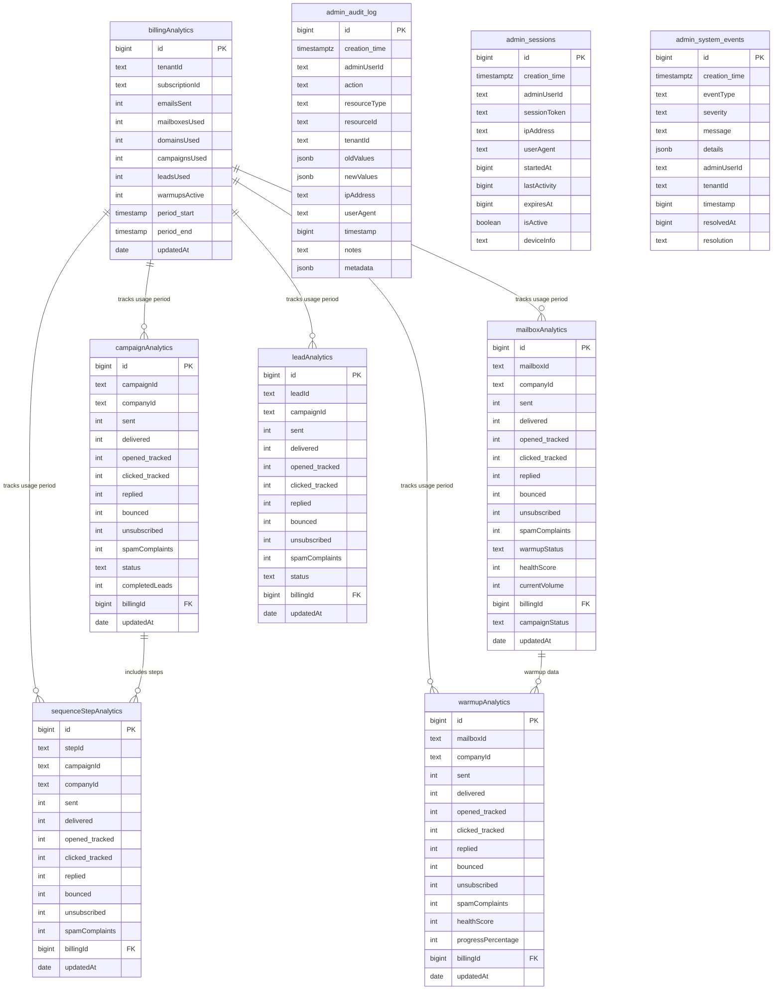

# OLAP Analytics Schema Guide

## Document Summary
This comprehensive guide details the OLAP (Online Analytical Processing) schema for PenguinMails' business intelligence and analytics system. It provides complete table definitions, relationships, indexing strategies, and implementation patterns for comprehensive reporting and analytics capabilities.

---

## Overview

### OLAP Schema Purpose
The OLAP schema provides business intelligence capabilities through:
- **Comprehensive Analytics**: Campaign, mailbox, and lead performance metrics
- **Billing Analytics**: Usage tracking and revenue reporting
- **Administrative Audit**: System administration and compliance tracking
- **Historical Analysis**: Long-term trend analysis and forecasting
- **Data Warehousing**: Optimized for aggregations and complex queries

### Schema Architecture


---

## Core Analytics Tables

### 1. Billing Analytics (Central Hub)

```sql
-- Billing Analytics - Usage tracking per billing period
CREATE TABLE billing_analytics (
    id BIGINT PRIMARY KEY GENERATED ALWAYS AS IDENTITY,
    tenant_id TEXT NOT NULL,
    subscription_id TEXT,
    emails_sent INTEGER DEFAULT 0,
    mailboxes_used INTEGER DEFAULT 0,
    domains_used INTEGER DEFAULT 0,
    campaigns_used INTEGER DEFAULT 0,
    leads_used INTEGER DEFAULT 0,
    warmups_active INTEGER DEFAULT 0,
    period_start TIMESTAMP WITH TIME ZONE NOT NULL,
    period_end TIMESTAMP WITH TIME ZONE NOT NULL,
    updated_at TIMESTAMP WITH TIME ZONE DEFAULT NOW()
);

-- Unique constraint to prevent duplicate periods
CREATE UNIQUE INDEX idx_billing_analytics_tenant_period 
ON billing_analytics(tenant_id, period_start, period_end);

-- Indexes for common queries
CREATE INDEX idx_billing_analytics_tenant ON billing_analytics(tenant_id);
CREATE INDEX idx_billing_analytics_subscription ON billing_analytics(subscription_id);
CREATE INDEX idx_billing_analytics_period ON billing_analytics(period_start, period_end);
```

**Purpose**: Central hub for all billing-related analytics, tracking tenant usage across all features per billing period.

**Key Metrics**:
- **Usage Tracking**: emails_sent, mailboxes_used, domains_used, campaigns_used, leads_used, warmups_active
- **Period Management**: period_start, period_end for billing cycle tracking
- **Subscription Context**: subscription_id for billing relationship

### 2. Campaign Analytics

```sql
-- Campaign Analytics - Campaign performance metrics
CREATE TABLE campaign_analytics (
    id BIGINT PRIMARY KEY GENERATED ALWAYS AS IDENTITY,
    campaign_id TEXT NOT NULL,
    company_id TEXT NOT NULL,
    sent INTEGER DEFAULT 0,                    -- Sum of all steps
    delivered INTEGER DEFAULT 0,               -- Sum of all steps
    opened_tracked INTEGER DEFAULT 0,          -- Sum of all steps
    clicked_tracked INTEGER DEFAULT 0,         -- Sum of all steps
    replied INTEGER DEFAULT 0,                 -- Sum of all steps
    bounced INTEGER DEFAULT 0,                 -- Sum of all steps
    unsubscribed INTEGER DEFAULT 0,            -- Sum of all steps
    spam_complaints INTEGER DEFAULT 0,         -- Sum of all steps
    status TEXT,
    completed_leads INTEGER DEFAULT 0,
    billing_id BIGINT REFERENCES billing_analytics(id),
    updated_at TIMESTAMP WITH TIME ZONE DEFAULT NOW()
);

-- Indexes for campaign analytics
CREATE INDEX idx_campaign_analytics_campaign ON campaign_analytics(campaign_id);
CREATE INDEX idx_campaign_analytics_company ON campaign_analytics(company_id);
CREATE INDEX idx_campaign_analytics_status ON campaign_analytics(status);
CREATE INDEX idx_campaign_analytics_billing ON campaign_analytics(billing_id);
```

**Purpose**: Aggregated campaign performance metrics, summing all sequence steps for comprehensive campaign analysis.

**Key Metrics**:
- **Email Performance**: sent, delivered, opened_tracked, clicked_tracked, replied, bounced
- **Compliance Metrics**: unsubscribed, spam_complaints
- **Business Metrics**: completed_leads (conversion tracking)
- **Status Tracking**: current campaign status

### 3. Mailbox Analytics

```sql
-- Mailbox Analytics - Individual mailbox performance
CREATE TABLE mailbox_analytics (
    id BIGINT PRIMARY KEY GENERATED ALWAYS AS IDENTITY,
    mailbox_id TEXT NOT NULL,
    company_id TEXT NOT NULL,
    sent INTEGER DEFAULT 0,
    delivered INTEGER DEFAULT 0,
    opened_tracked INTEGER DEFAULT 0,
    clicked_tracked INTEGER DEFAULT 0,
    replied INTEGER DEFAULT 0,
    bounced INTEGER DEFAULT 0,
    unsubscribed INTEGER DEFAULT 0,
    spam_complaints INTEGER DEFAULT 0,
    warmup_status TEXT,
    health_score INTEGER DEFAULT 0,
    current_volume INTEGER DEFAULT 0,
    billing_id BIGINT REFERENCES billing_analytics(id),
    campaign_status TEXT,
    updated_at TIMESTAMP WITH TIME ZONE DEFAULT NOW()
);

-- Indexes for mailbox analytics
CREATE INDEX idx_mailbox_analytics_mailbox ON mailbox_analytics(mailbox_id);
CREATE INDEX idx_mailbox_analytics_company ON mailbox_analytics(company_id);
CREATE INDEX idx_mailbox_analytics_warmup ON mailbox_analytics(warmup_status);
CREATE INDEX idx_mailbox_analytics_health ON mailbox_analytics(health_score);
CREATE INDEX idx_mailbox_analytics_billing ON mailbox_analytics(billing_id);
```

**Purpose**: Individual mailbox performance tracking including warmup status and health scoring.

**Key Metrics**:
- **Sending Performance**: All standard email metrics (sent, delivered, opened, etc.)
- **Warmup Tracking**: warmup_status, health_score (0-100), current_volume
- **Campaign Context**: campaign_status for active campaign tracking

### 4. Lead Analytics

```sql
-- Lead Analytics - Individual lead engagement
CREATE TABLE lead_analytics (
    id BIGINT PRIMARY KEY GENERATED ALWAYS AS IDENTITY,
    lead_id TEXT NOT NULL,
    campaign_id TEXT NOT NULL,
    sent INTEGER DEFAULT 0,                    -- Per campaign
    delivered INTEGER DEFAULT 0,
    opened_tracked INTEGER DEFAULT 0,
    clicked_tracked INTEGER DEFAULT 0,
    replied INTEGER DEFAULT 0,
    bounced INTEGER DEFAULT 0,
    unsubscribed INTEGER DEFAULT 0,
    spam_complaints INTEGER DEFAULT 0,
    status TEXT,
    billing_id BIGINT REFERENCES billing_analytics(id),
    updated_at TIMESTAMP WITH TIME ZONE DEFAULT NOW()
);

-- Indexes for lead analytics
CREATE INDEX idx_lead_analytics_lead ON lead_analytics(lead_id);
CREATE INDEX idx_lead_analytics_campaign ON lead_analytics(campaign_id);
CREATE INDEX idx_lead_analytics_status ON lead_analytics(status);
CREATE INDEX idx_lead_analytics_billing ON lead_analytics(billing_id);
```

**Purpose**: Individual lead engagement tracking per campaign for lead scoring and segmentation analysis.

**Key Metrics**:
- **Engagement Tracking**: Per-lead email interaction metrics
- **Campaign Context**: Links leads to specific campaigns
- **Lead Scoring**: status field for lead qualification tracking

### 5. Warmup Analytics

```sql
-- Warmup Analytics - Email warmup progression
CREATE TABLE warmup_analytics (
    id BIGINT PRIMARY KEY GENERATED ALWAYS AS IDENTITY,
    mailbox_id TEXT NOT NULL,
    company_id TEXT NOT NULL,
    sent INTEGER DEFAULT 0,
    delivered INTEGER DEFAULT 0,
    opened_tracked INTEGER DEFAULT 0,
    clicked_tracked INTEGER DEFAULT 0,
    replied INTEGER DEFAULT 0,
    bounced INTEGER DEFAULT 0,
    unsubscribed INTEGER DEFAULT 0,
    spam_complaints INTEGER DEFAULT 0,
    health_score INTEGER DEFAULT 0,
    progress_percentage INTEGER DEFAULT 0,
    billing_id BIGINT REFERENCES billing_analytics(id),
    updated_at TIMESTAMP WITH TIME ZONE DEFAULT NOW()
);

-- Indexes for warmup analytics
CREATE INDEX idx_warmup_analytics_mailbox ON warmup_analytics(mailbox_id);
CREATE INDEX idx_warmup_analytics_company ON warmup_analytics(company_id);
CREATE INDEX idx_warmup_analytics_health ON warmup_analytics(health_score);
CREATE INDEX idx_warmup_analytics_progress ON warmup_analytics(progress_percentage);
CREATE INDEX idx_warmup_analytics_billing ON warmup_analytics(billing_id);
```

**Purpose**: Dedicated warmup progression tracking with health scoring and completion percentage.

**Key Metrics**:
- **Warmup Progression**: progress_percentage (0-100%), health_score (0-100)
- **Warmup Performance**: Email metrics during warmup phase
- **Deliverability Insights**: Enhanced tracking for reputation building

### 6. Sequence Step Analytics

```sql
-- Sequence Step Analytics - Campaign step performance
CREATE TABLE sequence_step_analytics (
    id BIGINT PRIMARY KEY GENERATED ALWAYS AS IDENTITY,
    step_id TEXT NOT NULL,
    campaign_id TEXT NOT NULL,
    company_id TEXT NOT NULL,
    sent INTEGER DEFAULT 0,
    delivered INTEGER DEFAULT 0,
    opened_tracked INTEGER DEFAULT 0,
    clicked_tracked INTEGER DEFAULT 0,
    replied INTEGER DEFAULT 0,
    bounced INTEGER DEFAULT 0,
    unsubscribed INTEGER DEFAULT 0,
    spam_complaints INTEGER DEFAULT 0,
    billing_id BIGINT REFERENCES billing_analytics(id),
    updated_at TIMESTAMP WITH TIME ZONE DEFAULT NOW()
);

-- Indexes for sequence step analytics
CREATE INDEX idx_sequence_step_analytics_step ON sequence_step_analytics(step_id);
CREATE INDEX idx_sequence_step_analytics_campaign ON sequence_step_analytics(campaign_id);
CREATE INDEX idx_sequence_step_analytics_company ON sequence_step_analytics(company_id);
CREATE INDEX idx_sequence_step_analytics_billing ON sequence_step_analytics(billing_id);
```

**Purpose**: Granular step-level analytics for campaign sequence optimization and A/B testing.

**Key Metrics**:
- **Step Performance**: Individual step email metrics
- **Sequence Optimization**: Enables analysis of step effectiveness
- **A/B Testing**: Foundation for step-level experimentation

---

## Administrative Analytics Tables

### 7. Admin Audit Log

```sql
-- Admin Audit Log - System administration tracking
CREATE TABLE admin_audit_log (
    id BIGINT PRIMARY KEY GENERATED ALWAYS AS IDENTITY,
    creation_time TIMESTAMP WITH TIME ZONE DEFAULT NOW(),
    admin_user_id TEXT NOT NULL,
    action TEXT NOT NULL,
    resource_type TEXT NOT NULL,
    resource_id TEXT NOT NULL,
    tenant_id TEXT NOT NULL,
    old_values JSONB,
    new_values JSONB,
    ip_address TEXT,
    user_agent TEXT,
    timestamp BIGINT,
    notes TEXT,
    metadata JSONB
);

-- Indexes for admin audit log
CREATE INDEX idx_admin_audit_admin_user ON admin_audit_log(admin_user_id, creation_time DESC);
CREATE INDEX idx_admin_audit_tenant ON admin_audit_log(tenant_id, creation_time DESC);
CREATE INDEX idx_admin_audit_resource ON admin_audit_log(resource_type, resource_id);
CREATE INDEX idx_admin_audit_action ON admin_audit_log(action, creation_time DESC);
CREATE INDEX idx_admin_audit_timestamp ON admin_audit_log(timestamp);
```

**Purpose**: Comprehensive audit trail for administrative actions across all tenants.

**Key Features**:
- **Change Tracking**: old_values, new_values for before/after comparisons
- **User Context**: admin_user_id, tenant_id for accountability
- **Technical Context**: ip_address, user_agent for security analysis
- **Compliance**: timestamp, metadata for regulatory requirements

### 8. Admin System Events (Consolidated)

```sql
-- Admin System Events - Unified admin activity and system monitoring
CREATE TABLE admin_system_events (
    id BIGINT PRIMARY KEY GENERATED ALWAYS AS IDENTITY,
    creation_time TIMESTAMP WITH TIME ZONE DEFAULT NOW(),
    event_type TEXT NOT NULL,
    severity TEXT NOT NULL,                    -- 'low', 'medium', 'high', 'critical'
    message TEXT NOT NULL,
    details JSONB,                            -- Flexible storage for event-specific data
    admin_user_id TEXT,                       -- NULL for system events
    tenant_id TEXT,                           -- NULL for system-wide events
    timestamp BIGINT,
    resolved_at TIMESTAMP WITH TIME ZONE,
    resolution TEXT,
    
    -- Session-specific fields (stored in details JSONB)
    session_token TEXT,                       -- For session events
    ip_address TEXT,                          -- For session and audit events
    user_agent TEXT,                          -- For session and audit events
    device_info TEXT,                         -- For session events
    started_at BIGINT,                        -- For session events
    last_activity BIGINT,                     -- For session events
    expires_at BIGINT,                        -- For session events
    is_active BOOLEAN DEFAULT TRUE            -- For session events
);

-- Indexes for consolidated admin system events
CREATE INDEX idx_admin_system_events_type ON admin_system_events(event_type, creation_time DESC);
CREATE INDEX idx_admin_system_events_severity ON admin_system_events(severity, creation_time DESC);
CREATE INDEX idx_admin_system_events_tenant ON admin_system_events(tenant_id, creation_time DESC);
CREATE INDEX idx_admin_system_events_admin_user ON admin_system_events(admin_user_id, creation_time DESC);
CREATE INDEX idx_admin_system_events_unresolved ON admin_system_events(resolved_at) WHERE resolved_at IS NULL;
CREATE INDEX idx_admin_system_events_session_token ON admin_system_events(session_token) WHERE session_token IS NOT NULL;
CREATE INDEX idx_admin_system_events_active_sessions ON admin_system_events(admin_user_id, is_active) WHERE is_active = true;
CREATE INDEX idx_admin_system_events_timestamp ON admin_system_events(timestamp);
```

**Purpose**: Unified administrative activity tracking including sessions, system events, and audit logs.

**Event Types**:
- **Session Events**: 'session_started', 'session_ended', 'session_extended', 'session_expired'
- **System Events**: 'system_alert', 'performance_degradation', 'security_incident', 'maintenance'
- **Audit Events**: 'user_action', 'configuration_change', 'data_access', 'permission_change'

**Key Features**:
- **Unified Storage**: Both session management and system monitoring in one table
- **Flexible Details**: JSONB field stores event-specific metadata
- **Session Tracking**: session_token, device_info, activity monitoring via details
- **Security Context**: ip_address, user_agent for all admin activities
- **Event Classification**: event_type and severity for prioritization and filtering

**Example Usage**:
```sql
-- Session started event
INSERT INTO admin_system_events (
    event_type, severity, message, admin_user_id, tenant_id,
    session_token, ip_address, user_agent, device_info,
    started_at, expires_at, details
) VALUES (
    'session_started', 'low', 'Admin user logged in',
    'admin_123', 'tenant_456', 'token_abc789', '192.168.1.100',
    'Mozilla/5.0...', 'Chrome on Windows',
    1234567890, 1234567890 + 28800,
    '{"login_method": "password", "mfa_used": true}'
);

-- System alert event
INSERT INTO admin_system_events (
    event_type, severity, message, details
) VALUES (
    'system_alert', 'high', 'High CPU usage detected',
    '{"cpu_usage": 95, "threshold": 80, "duration_minutes": 15, "affected_services": ["email_sending"]}'
);
```

### 9. Admin Audit Log (Separate for Detailed Change Tracking)

```sql
-- Admin System Events - System-wide events and notifications
CREATE TABLE admin_system_events (
    id BIGINT PRIMARY KEY GENERATED ALWAYS AS IDENTITY,
    creation_time TIMESTAMP WITH TIME ZONE DEFAULT NOW(),
    event_type TEXT NOT NULL,
    severity TEXT NOT NULL,                    -- 'low', 'medium', 'high', 'critical'
    message TEXT NOT NULL,
    details JSONB,
    admin_user_id TEXT,
    tenant_id TEXT,
    timestamp BIGINT,
    resolved_at TIMESTAMP WITH TIME ZONE,
    resolution TEXT
);

-- Indexes for admin system events
CREATE INDEX idx_admin_system_events_type ON admin_system_events(event_type, creation_time DESC);
CREATE INDEX idx_admin_system_events_severity ON admin_system_events(severity, creation_time DESC);
CREATE INDEX idx_admin_system_events_tenant ON admin_system_events(tenant_id, creation_time DESC);
CREATE INDEX idx_admin_system_events_unresolved ON admin_system_events(resolved_at) WHERE resolved_at IS NULL;
CREATE INDEX idx_admin_system_events_timestamp ON admin_system_events(timestamp);
```

**Purpose**: System-wide event tracking for monitoring, alerting, and incident management.

**Key Features**:
- **Event Classification**: event_type, severity for prioritization
- **Context Tracking**: admin_user_id, tenant_id for targeted alerts
- **Resolution Tracking**: resolved_at, resolution for incident management
- **Alerting**: Supports real-time monitoring and notification systems

---

## Data Pipeline Implementation

### 1. Analytics Aggregation Service

```typescript
// services/AnalyticsAggregator.ts
import { Database } from '../Database';
import Redis from 'ioredis';

export class AnalyticsAggregator {
  private db: Database;
  private redis: Redis;

  constructor(db: Database, redis: Redis) {
    this.db = db;
    this.redis = redis;
  }

  async aggregateCampaignAnalytics(campaignId: string, date: string) {
    return await this.db.transaction(async (tx) => {
      // Get all steps for this campaign
      const steps = await tx.campaign_sequence_steps.findMany({
        where: { campaign_id: campaignId }
      });

      let totalSent = 0;
      let totalDelivered = 0;
      let totalOpened = 0;
      let totalClicked = 0;
      let totalReplied = 0;
      let totalBounced = 0;
      let totalUnsubscribed = 0;
      let totalSpamComplaints = 0;

      // Aggregate metrics from all steps
      for (const step of steps) {
        const stepMetrics = await tx.execute(sql`
          SELECT 
            COUNT(*) as sent,
            COUNT(CASE WHEN status = 'delivered' THEN 1 END) as delivered,
            COUNT(CASE WHEN opened_at IS NOT NULL THEN 1 END) as opened_tracked,
            COUNT(CASE WHEN clicked_at IS NOT NULL THEN 1 END) as clicked_tracked,
            COUNT(CASE WHEN replied_at IS NOT NULL THEN 1 END) as replied,
            COUNT(CASE WHEN bounce_type IS NOT NULL THEN 1 END) as bounced,
            COUNT(CASE WHEN unsubscribed_at IS NOT NULL THEN 1 END) as unsubscribed,
            COUNT(CASE WHEN complaint_at IS NOT NULL THEN 1 END) as spam_complaints
          FROM emails 
          WHERE campaign_id = ${campaignId} 
            AND sequence_step_id = ${step.id}
            AND DATE(sent_at) = ${date}
        `);

        totalSent += stepMetrics[0].sent;
        totalDelivered += stepMetrics[0].delivered;
        totalOpened += stepMetrics[0].opened_tracked;
        totalClicked += stepMetrics[0].clicked_tracked;
        totalReplied += stepMetrics[0].replied;
        totalBounced += stepMetrics[0].bounced;
        totalUnsubscribed += stepMetrics[0].unsubscribed;
        totalSpamComplaints += stepMetrics[0].spam_complaints;
      }

      // Insert or update campaign analytics
      await tx.campaign_analytics.upsert({
        where: {
          campaign_id_date: {
            campaign_id: campaignId,
            // You might want to add a date column or use updated_at
          }
        },
        create: {
          campaign_id: campaignId,
          company_id: steps[0]?.company_id || '',
          sent: totalSent,
          delivered: totalDelivered,
          opened_tracked: totalOpened,
          clicked_tracked: totalClicked,
          replied: totalReplied,
          bounced: totalBounced,
          unsubscribed: totalUnsubscribed,
          spam_complaints: totalSpamComplaints,
          status: 'active',
          updated_at: new Date()
        },
        update: {
          sent: totalSent,
          delivered: totalDelivered,
          opened_tracked: totalOpened,
          clicked_tracked: totalClicked,
          replied: totalReplied,
          bounced: totalBounced,
          unsubscribed: totalUnsubscribed,
          spam_complaints: totalSpamComplaints,
          updated_at: new Date()
        }
      });

      return {
        campaign_id: campaignId,
        sent: totalSent,
        delivered: totalDelivered,
        opened_tracked: totalOpened,
        clicked_tracked: totalClicked,
        replied: totalReplied,
        bounced: totalBounced,
        unsubscribed: totalUnsubscribed,
        spam_complaints: totalSpamComplaints
      };
    });
  }

  async aggregateBillingAnalytics(tenantId: string, periodStart: Date, periodEnd: Date) {
    return await this.db.transaction(async (tx) => {
      // Get all usage metrics for the period
      const usage = await tx.execute(sql`
        SELECT 
          COUNT(DISTINCT c.id) as campaigns_used,
          COUNT(DISTINCT ea.id) as mailboxes_used,
          COUNT(DISTINCT d.id) as domains_used,
          COUNT(DISTINCT l.id) as leads_used,
          COUNT(DISTINCT w.id) as warmups_active,
          COUNT(e.id) as emails_sent
        FROM tenants t
        LEFT JOIN campaigns c ON t.id = c.tenant_id AND c.created_at BETWEEN ${periodStart} AND ${periodEnd}
        LEFT JOIN email_accounts ea ON t.id = ea.tenant_id AND ea.created_at BETWEEN ${periodStart} AND ${periodEnd}
        LEFT JOIN domains d ON t.id = d.tenant_id AND d.created_at BETWEEN ${periodStart} AND ${periodEnd}
        LEFT JOIN leads l ON t.id = l.tenant_id AND l.imported BETWEEN ${periodStart} AND ${periodEnd}
        LEFT JOIN warmup_status w ON t.id = w.tenant_id AND w.status = 'active'
        LEFT JOIN emails e ON t.id = e.tenant_id AND e.sent_at BETWEEN ${periodStart} AND ${periodEnd}
        WHERE t.id = ${tenantId}
        GROUP BY t.id
      `);

      const metrics = usage[0] || {
        campaigns_used: 0,
        mailboxes_used: 0,
        domains_used: 0,
        leads_used: 0,
        warmups_active: 0,
        emails_sent: 0
      };

      // Insert or update billing analytics
      await tx.billing_analytics.upsert({
        where: {
          tenant_id_period_start: {
            tenant_id: tenantId,
            period_start: periodStart
          }
        },
        create: {
          tenant_id: tenantId,
          period_start: periodStart,
          period_end: periodEnd,
          ...metrics,
          updated_at: new Date()
        },
        update: {
          ...metrics,
          updated_at: new Date()
        }
      });

      return metrics;
    });
  }
}
```

### 2. Queue-Driven Analytics Processing

```typescript
// workers/AnalyticsWorker.ts
import { AnalyticsAggregator } from '../services/AnalyticsAggregator';
import { JobProcessor } from './JobProcessor';

export class AnalyticsWorker extends JobProcessor {
  private aggregator: AnalyticsAggregator;

  constructor(aggregator: AnalyticsAggregator) {
    super('analytics');
    this.aggregator = aggregator;
  }

  async processDailyAggregate(data: any) {
    const { date, tenant_id } = data;
    
    try {
      // Get all campaigns for this tenant on this date
      const campaigns = await this.db.campaigns.findMany({
        where: {
          tenant_id,
          sent_at: {
            gte: new Date(date),
            lt: new Date(date + ' 23:59:59')
          }
        }
      });

      // Aggregate each campaign
      for (const campaign of campaigns) {
        await this.aggregator.aggregateCampaignAnalytics(campaign.id, date);
      }

      // Aggregate billing analytics
      const periodStart = new Date(date + ' 00:00:00');
      const periodEnd = new Date(date + ' 23:59:59');
      await this.aggregator.aggregateBillingAnalytics(tenant_id, periodStart, periodEnd);

      console.log(`Daily analytics aggregated for ${tenant_id} on ${date}`);

    } catch (error) {
      console.error('Daily aggregate failed:', error);
      throw error;
    }
  }

  async processCampaignAggregate(data: any) {
    const { campaign_id, date } = data;
    
    try {
      await this.aggregator.aggregateCampaignAnalytics(campaign_id, date);
      console.log(`Campaign analytics aggregated for ${campaign_id}`);
      
    } catch (error) {
      console.error('Campaign aggregate failed:', error);
      throw error;
    }
  }

  async processBillingCalculate(data: any) {
    const { tenant_id, period_start, period_end } = data;
    
    try {
      await this.aggregator.aggregateBillingAnalytics(
        tenant_id, 
        new Date(period_start), 
        new Date(period_end)
      );
      console.log(`Billing analytics calculated for ${tenant_id}`);
      
    } catch (error) {
      console.error('Billing calculate failed:', error);
      throw error;
    }
  }
}
```

---

## Business Intelligence Queries

### 1. Campaign Performance Dashboard

```sql
-- Campaign performance summary with trends
WITH campaign_performance AS (
  SELECT 
    ca.campaign_id,
    ca.company_id,
    ca.sent,
    ca.delivered,
    ca.opened_tracked,
    ca.clicked_tracked,
    ca.replied,
    ca.bounced,
    ROUND((ca.delivered::DECIMAL / NULLIF(ca.sent, 0)) * 100, 2) as delivery_rate,
    ROUND((ca.opened_tracked::DECIMAL / NULLIF(ca.delivered, 0)) * 100, 2) as open_rate,
    ROUND((ca.clicked_tracked::DECIMAL / NULLIF(ca.delivered, 0)) * 100, 2) as click_rate,
    ROUND((ca.replied::DECIMAL / NULLIF(ca.delivered, 0)) * 100, 2) as reply_rate,
    ROUND((ca.bounced::DECIMAL / NULLIF(ca.sent, 0)) * 100, 2) as bounce_rate,
    ca.updated_at
  FROM campaign_analytics ca
  WHERE ca.company_id = $1
    AND ca.updated_at >= NOW() - INTERVAL '30 days'
),
ranked_campaigns AS (
  SELECT 
    *,
    ROW_NUMBER() OVER (ORDER BY sent DESC) as rank_by_volume,
    ROW_NUMBER() OVER (ORDER BY open_rate DESC) as rank_by_open_rate,
    ROW_NUMBER() OVER (ORDER BY reply_rate DESC) as rank_by_reply_rate
  FROM campaign_performance
)
SELECT 
  campaign_id,
  sent,
  delivered,
  opened_tracked,
  clicked_tracked,
  replied,
  bounced,
  delivery_rate,
  open_rate,
  click_rate,
  reply_rate,
  bounce_rate,
  rank_by_volume,
  rank_by_open_rate,
  rank_by_reply_rate,
  updated_at
FROM ranked_campaigns
ORDER BY sent DESC;
```

### 2. Tenant Usage Analytics

```sql
-- Monthly usage summary across all tenants
SELECT 
  ba.tenant_id,
  ba.period_start,
  ba.period_end,
  ba.emails_sent,
  ba.mailboxes_used,
  ba.domains_used,
  ba.campaigns_used,
  ba.leads_used,
  ba.warmups_active,
  -- Calculate usage efficiency metrics
  ROUND(ba.emails_sent::DECIMAL / NULLIF(ba.mailboxes_used, 0), 2) as emails_per_mailbox,
  ROUND(ba.emails_sent::DECIMAL / NULLIF(ba.campaigns_used, 0), 2) as emails_per_campaign,
  -- Compare to previous month
  LAG(ba.emails_sent) OVER (PARTITION BY ba.tenant_id ORDER BY ba.period_start) as prev_month_emails,
  ROUND(
    (ba.emails_sent - LAG(ba.emails_sent) OVER (PARTITION BY ba.tenant_id ORDER BY ba.period_start))::DECIMAL 
    / NULLIF(LAG(ba.emails_sent) OVER (PARTITION BY ba.tenant_id ORDER BY ba.period_start), 0) * 100, 
    2
  ) as month_over_month_growth
FROM billing_analytics ba
WHERE ba.period_start >= NOW() - INTERVAL '3 months'
ORDER BY ba.tenant_id, ba.period_start;
```

### 3. Warmup Performance Analytics

```sql
-- Warmup progression analysis
WITH warmup_progress AS (
  SELECT 
    wa.mailbox_id,
    wa.company_id,
    wa.health_score,
    wa.progress_percentage,
    wa.sent,
    wa.delivered,
    ROUND((wa.delivered::DECIMAL / NULLIF(wa.sent, 0)) * 100, 2) as delivery_rate,
    -- Calculate progression velocity
    wa.progress_percentage - LAG(wa.progress_percentage) OVER (
      PARTITION BY wa.mailbox_id ORDER BY wa.updated_at
    ) as daily_progress_increase,
    wa.updated_at
  FROM warmup_analytics wa
  WHERE wa.updated_at >= NOW() - INTERVAL '7 days'
)
SELECT 
  mailbox_id,
  company_id,
  AVG(health_score) as avg_health_score,
  AVG(progress_percentage) as avg_progress,
  AVG(delivery_rate) as avg_delivery_rate,
  AVG(daily_progress_increase) as avg_daily_progress,
  COUNT(*) as tracking_days,
  -- Categorize warmup performance
  CASE 
    WHEN AVG(health_score) >= 80 THEN 'Excellent'
    WHEN AVG(health_score) >= 60 THEN 'Good'
    WHEN AVG(health_score) >= 40 THEN 'Fair'
    ELSE 'Poor'
  END as warmup_category
FROM warmup_progress
GROUP BY mailbox_id, company_id
HAVING COUNT(*) >= 3  -- At least 3 days of tracking
ORDER BY avg_health_score DESC, avg_progress DESC;
```

### 4. Administrative Activity Analysis

```sql
-- Admin activity summary for compliance
SELECT 
  aal.admin_user_id,
  aal.action,
  aal.resource_type,
  COUNT(*) as action_count,
  COUNT(DISTINCT aal.tenant_id) as tenants_affected,
  aal.creation_time::DATE as activity_date,
  -- Security analysis
  COUNT(DISTINCT aal.ip_address) as unique_ips,
  -- Time-based analysis
  EXTRACT(HOUR FROM aal.creation_time) as hour_of_day,
  CASE 
    WHEN EXTRACT(HOUR FROM aal.creation_time) BETWEEN 9 AND 17 THEN 'Business Hours'
    WHEN EXTRACT(HOUR FROM aal.creation_time) BETWEEN 18 AND 22 THEN 'After Hours'
    ELSE 'Night Time'
  END as time_category
FROM admin_audit_log aal
WHERE aal.creation_time >= NOW() - INTERVAL '30 days'
GROUP BY 
  aal.admin_user_id,
  aal.action,
  aal.resource_type,
  aal.creation_time::DATE,
  EXTRACT(HOUR FROM aal.creation_time)
ORDER BY action_count DESC, activity_date DESC;
```

---

## Performance Optimization

### 1. Materialized Views for Complex Analytics

```sql
-- Campaign performance materialized view
CREATE MATERIALIZED VIEW campaign_performance_summary AS
SELECT 
  ca.campaign_id,
  ca.company_id,
  c.name as campaign_name,
  c.status as campaign_status,
  ca.sent,
  ca.delivered,
  ca.opened_tracked,
  ca.clicked_tracked,
  ca.replied,
  ca.bounced,
  ca.unsubscribed,
  ca.spam_complaints,
  -- Calculated rates
  ROUND((ca.delivered::DECIMAL / NULLIF(ca.sent, 0)) * 100, 2) as delivery_rate,
  ROUND((ca.opened_tracked::DECIMAL / NULLIF(ca.delivered, 0)) * 100, 2) as open_rate,
  ROUND((ca.clicked_tracked::DECIMAL / NULLIF(ca.delivered, 0)) * 100, 2) as click_rate,
  ROUND((ca.replied::DECIMAL / NULLIF(ca.delivered, 0)) * 100, 2) as reply_rate,
  ROUND((ca.bounced::DECIMAL / NULLIF(ca.sent, 0)) * 100, 2) as bounce_rate,
  -- Time-based metrics
  EXTRACT(EPOCH FROM (c.completed_at - c.started_at))/3600 as campaign_duration_hours,
  ca.updated_at
FROM campaign_analytics ca
JOIN campaigns c ON ca.campaign_id = c.id;

-- Refresh strategy
CREATE INDEX idx_campaign_performance_company ON campaign_performance_summary(company_id);
CREATE INDEX idx_campaign_performance_status ON campaign_performance_summary(campaign_status);
CREATE INDEX idx_campaign_performance_updated ON campaign_performance_summary(updated_at);

-- Refresh function
CREATE OR REPLACE FUNCTION refresh_campaign_performance()
RETURNS void AS $$
BEGIN
  REFRESH MATERIALIZED VIEW CONCURRENTLY campaign_performance_summary;
END;
$$ LANGUAGE plpgsql;
```

### 2. Partitioning Strategy for Large Tables

```sql
-- Partition billing_analytics by month
CREATE TABLE billing_analytics_partitioned (
    LIKE billing_analytics INCLUDING ALL
) PARTITION BY RANGE (period_start);

-- Create monthly partitions
CREATE TABLE billing_analytics_2025_01 PARTITION OF billing_analytics_partitioned
FOR VALUES FROM ('2025-01-01') TO ('2025-02-01');

CREATE TABLE billing_analytics_2025_02 PARTITION OF billing_analytics_partitioned
FOR VALUES FROM ('2025-02-01') TO ('2025-03-01');

-- Continue for other months...

-- Indexes on partition tables
CREATE INDEX idx_billing_analytics_2025_01_tenant ON billing_analytics_2025_01(tenant_id);
CREATE INDEX idx_billing_analytics_2025_02_tenant ON billing_analytics_2025_02(tenant_id);
```

### 3. Automated Maintenance

```sql
-- Analytics maintenance function
CREATE OR REPLACE FUNCTION maintain_analytics_tables()
RETURNS void AS $$
DECLARE
    cutoff_date DATE := CURRENT_DATE - INTERVAL '2 years';
BEGIN
    -- Archive old analytics data
    INSERT INTO analytics_archive 
    SELECT * FROM campaign_analytics 
    WHERE updated_at < cutoff_date;
    
    DELETE FROM campaign_analytics 
    WHERE updated_at < cutoff_date;
    
    -- Refresh materialized views
    PERFORM refresh_campaign_performance();
    
    -- Update table statistics
    ANALYZE campaign_analytics;
    ANALYZE mailbox_analytics;
    ANALYZE billing_analytics;
    
    -- Log maintenance
    INSERT INTO admin_system_events (
        event_type,
        severity,
        message,
        details
    ) VALUES (
        'analytics_maintenance',
        'low',
        'Analytics tables maintenance completed',
        jsonb_build_object(
            'cutoff_date', cutoff_date,
            'maintenance_time', NOW()
        )
    );
END;
$$ LANGUAGE plpgsql;
```

---

## Security and Compliance

### 1. Row Level Security

```sql
-- Enable RLS on all analytics tables
ALTER TABLE billing_analytics ENABLE ROW LEVEL SECURITY;
ALTER TABLE campaign_analytics ENABLE ROW LEVEL SECURITY;
ALTER TABLE mailbox_analytics ENABLE ROW LEVEL SECURITY;
ALTER TABLE lead_analytics ENABLE ROW LEVEL SECURITY;
ALTER TABLE warmup_analytics ENABLE ROW LEVEL SECURITY;
ALTER TABLE sequence_step_analytics ENABLE ROW LEVEL SECURITY;

-- RLS policies for tenant isolation
CREATE POLICY analytics_tenant_isolation ON billing_analytics
    FOR ALL USING (tenant_id = current_setting('app.current_tenant_id'));

CREATE POLICY campaign_analytics_tenant_isolation ON campaign_analytics
    FOR ALL USING (company_id IN (
        SELECT id FROM companies 
        WHERE tenant_id = current_setting('app.current_tenant_id')
    ));

-- Similar policies for other tables...
```

### 2. Data Anonymization

```sql
-- Anonymization function for GDPR compliance
CREATE OR REPLACE FUNCTION anonymize_analytics_data(tenant_id_param TEXT)
RETURNS VOID AS $$
BEGIN
    -- Anonymize tenant_id while preserving analytics relationships
    UPDATE billing_analytics 
    SET tenant_id = 'anonymized_' || tenant_id_param
    WHERE tenant_id = tenant_id_param;
    
    UPDATE campaign_analytics 
    SET company_id = 'anonymized_' || company_id
    WHERE company_id IN (
        SELECT id FROM companies 
        WHERE tenant_id = tenant_id_param
    );
    
    -- Similar updates for other tables...
    
    -- Log the anonymization
    INSERT INTO admin_audit_log (
        admin_user_id,
        action,
        resource_type,
        resource_id,
        tenant_id,
        notes
    ) VALUES (
        'system',
        'anonymize_analytics',
        'tenant',
        tenant_id_param,
        tenant_id_param,
        'Analytics data anonymized for GDPR compliance'
    );
END;
$$ LANGUAGE plpgsql SECURITY DEFINER;
```

---

## Conclusion

The OLAP analytics schema provides PenguinMails with comprehensive business intelligence capabilities while maintaining security, performance, and compliance requirements. The schema supports:

- **Real-time Analytics**: Queue-driven aggregation for fresh data
- **Historical Analysis**: Long-term trend analysis and forecasting
- **Business Intelligence**: Comprehensive reporting and dashboards
- **Compliance**: Audit trails and data governance features
- **Performance**: Optimized queries and materialized views

For implementation support or analytics queries, contact the Data Engineering team.

---

**Related Documents:**
- [Analytics Architecture](analytics_architecture.md) - Overall analytics system design
- [Database Schema Guide](database_schema_guide.md) - Complete database schema including OLTP tables
- [Queue System Implementation Guide](queue_system_implementation_guide.md) - Queue-driven analytics pipeline

**Keywords**: OLAP, analytics, business intelligence, data warehousing, reporting, analytics schema, campaign analytics, billing analytics, administrative analytics