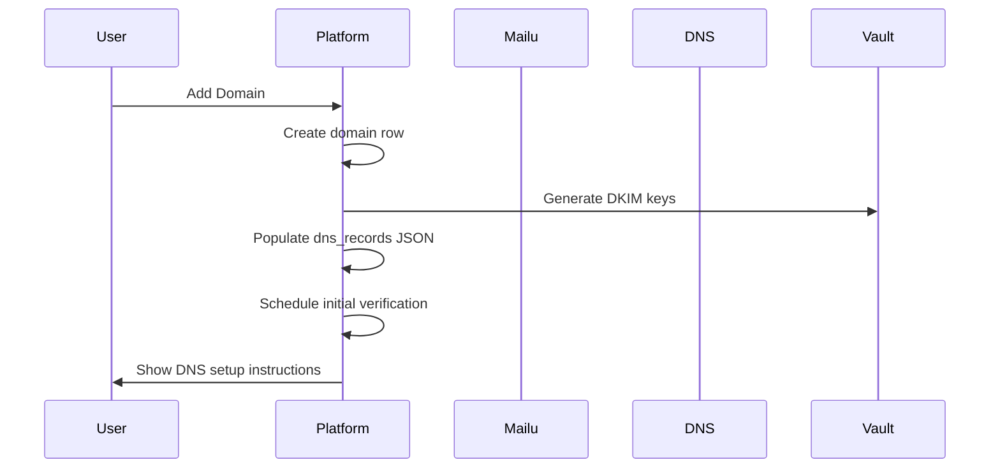

# DNS Storage Integration Proposal Implementation Guide

**Implementation Date**: 2025-11-03  
**Integration**: DNS Record Storage and Operational Management for PenguinMails  
**Status**: 📋 **DOCUMENTATION READY** - Comprehensive implementation planning completed

---

## 📋 Executive Summary

This documentation provides complete implementation guidance for integrating DNS storage capabilities into PenguinMails, enabling automated DKIM signing, MX/SPF validation, and DNS verification workflows with Mailu/Postfix integration.

**Key Benefits**:
✅ **Automated DKIM Lifecycle**: Generate → Deploy → Verify → Monitor  
✅ **DNS Propagation Awareness**: TTL-based scheduling respecting propagation delays  
✅ **Operational Visibility**: Real-time status tracking and error diagnostics  
✅ **Mailu Integration**: Seamless deployment to Mailu/OpenDKIM systems  
✅ **Multi-Record Management**: SPF, DMARC, MX, DKIM record lifecycle  

---

## 🏗️ Database Schema Enhancements

### Current Domain Table Analysis

**Updated Domain Structure** (from `oltp_schema_guide.md`):
The domains table now includes both the original fields and DNS operational metadata:

```sql
CREATE TABLE domains (
    id UUID PRIMARY KEY DEFAULT gen_random_uuid(),
    tenant_id UUID NOT NULL,
    company_id UUID REFERENCES companies(id) ON DELETE CASCADE,
    domain VARCHAR(253) NOT NULL,
    verification_status VARCHAR(50) DEFAULT 'pending',
    dns_records JSONB,              -- Existing JSONB field for DNS records
    is_primary BOOLEAN DEFAULT FALSE,
    verified TIMESTAMP WITH TIME ZONE,
    
    -- DNS Operational Metadata (Added for DNS Storage Integration)
    mailu_domain TEXT,                           -- Mailu's canonical hostname
    dns_ttl_observed INTEGER,                    -- Observed DNS TTL in seconds
    dns_last_verified_at TIMESTAMP WITH TIME ZONE, -- Last successful DNS verification
    dns_verification_error TEXT,                 -- Human-friendly error messages
    dns_verification_attempts INTEGER DEFAULT 0, -- Verification retry counter
    
    created TIMESTAMP WITH TIME ZONE DEFAULT NOW(),
    updated TIMESTAMP WITH TIME ZONE DEFAULT NOW()
);
```

### Required Schema Additions

**Domain-Level Operational Metadata**:
```sql
ALTER TABLE domains 
 ADD COLUMN mailu_domain TEXT,
 ADD COLUMN dns_ttl_observed INTEGER,
 ADD COLUMN dns_last_verified_at TIMESTAMP WITH TIME ZONE,
 ADD COLUMN dns_verification_error TEXT,
 ADD COLUMN dns_verification_attempts INTEGER DEFAULT 0;
```

**Field Purpose & Rationale**:

| Column | Purpose | Mailu Justification |
|--------|---------|-------------------|
| `mailu_domain` | Mailu's canonical hostname for mail services | Validates MX targets, builds zone exports |
| `dns_ttl_observed` | Observed DNS TTL in seconds | Schedules re-verification after propagation |
| `dns_last_verified_at` | Last successful DNS verification | Avoids redundant checks, schedules next verification |
| `dns_verification_error` | Human-friendly error from last verification | UI guidance for DNS fixes |
| `dns_verification_attempts` | Attempts counter for retry/backoff | Implements retry logic, prevents tight loops |

### DNS Records JSON Structure Enhancement

**Enhanced DNS Records JSON Schema**:
```json
{
  "records": [
    {
      "record_type": "SPF",
      "name": "@",
      "value": "v=spf1 include:_spf.mailu.io include:_spf.sendgrid.net -all",
      "ttl": 3600,
      "verification_status": "verified",
      "last_verified_at": "2025-10-20T14:32:00Z",
      "verification_attempts": 1,
      "verification_error": null,
      "source": "ui"
    },
    {
      "record_type": "DKIM",
      "name": "default._domainkey",
      "selector": "default",
      "value": "v=DKIM1; k=rsa; p=MIGfMA0GCSqGSI....",
      "public_key": "MIGfMA0GCSqGSI....",
      "managed_by": "platform",
      "secret_ref": "vault://mail/dkim/acme.example/default",
      "needs_deployment": true,
      "ttl": 3600,
      "verification_status": "pending",
      "last_verified_at": null,
      "verification_attempts": 0,
      "verification_error": null,
      "source": "platform"
    },
    {
      "record_type": "DMARC",
      "name": "_dmarc",
      "value": "v=DMARC1; p=quarantine; rua=mailto:dmarc@acme.example",
      "policy": "quarantine",
      "ttl": 3600,
      "verification_status": "verified",
      "last_verified_at": "2025-10-20T14:32:00Z",
      "verification_attempts": 1,
      "verification_error": null,
      "source": "ui"
    },
    {
      "record_type": "MX",
      "name": "@",
      "value": "mail.penguinmails.io.",
      "priority": 10,
      "ttl": 3600,
      "verification_status": "verified",
      "last_verified_at": "2025-10-20T14:40:00Z",
      "mx_hosts": ["203.0.113.5"],
      "verification_attempts": 1,
      "verification_error": null,
      "source": "ui"
    }
  ]
}
```

---

## 🔄 Operational Workflow Implementation

### 1. Domain Onboarding Workflow

**Step 1: Domain Creation**


**Step 2: DNS Record Management**
- **Platform-Managed Keys**: Generate key pair, store private key in Vault, set `managed_by='platform'`, `needs_deployment=true`
- **Mailu-Managed Keys**: Mark `managed_by='mailu'`, fetch public key from Mailu exports
- **Initial DNS Records**: Create SPF, DMARC, MX records with verification status

### 2. DKIM Key Lifecycle Management

**Platform-Managed DKIM Keys**:
```
Flow: Generate → Store Private → Deploy to Mailu → Verify DNS → Mark Verified
```

**Mailu-Managed DKIM Keys**:
```
Flow: Configure Mailu → Export Public Key → Store in DB → Verify DNS → Mark Verified
```

**Key Management Fields**:
- `managed_by`: `"platform"` or `"mailu"`
- `secret_ref`: Vault reference for private keys (platform-managed only)
- `public_key`: Public key for verification
- `needs_deployment`: Flag for Mailu sync jobs

### 3. DNS Verification Worker

**Verification Schedule Logic**:
```
Next Verification = Last Verified + TTL + Propagation Buffer
```

**Verification Process**:
1. **Record Lookup**: Query DNS for each expected record
2. **Value Comparison**: Compare actual vs expected values
3. **Status Update**: Update `verification_status` and `last_verified_at`
4. **Error Recording**: Store `verification_error` for UI display
5. **TTL Tracking**: Update `dns_ttl_observed` for scheduling

**Verification States**:
- `pending`: Record created, not yet verified
- `verified`: DNS record matches expected value
- `failed`: DNS record doesn't match or not found
- `error`: DNS query failed (network/DNS provider error)
- `not_verified`: Manual verification not yet performed

### 4. Mailu Sync Job Implementation

**Sync Trigger Conditions**:
```sql
SELECT d.id, d.domain, r.selector, r.secret_ref
FROM domains d
JOIN jsonb_array_elements(d.dns_records) AS r ON true
WHERE r->>'managed_by' = 'platform'
  AND r->>'needs_deployment' = 'true'
  AND r->>'record_type' = 'DKIM'
```

**Deployment Process**:
1. **Key Retrieval**: Fetch private key from Vault using `secret_ref`
2. **Mailu API/Config**: Deploy key to Mailu/OpenDKIM configuration
3. **Deployment Verification**: Verify key is active in Mailu
4. **Status Update**: Set `needs_deployment=false`, update `last_deployed_at`

---

## 🎯 Mailu Integration Specifications

### Understanding Mailu's Role

**Mailu Architecture Context**:
- **Mailu's Canonical Hostname**: Defined by HOSTNAME environment variable
- **Multi-Domain Support**: Single Mailu instance can handle multiple customer domains
- **Key Management**: Mailu generates and manages DKIM keys per domain
- **Zone Export**: Mailu provides zonefile data for DNS configuration

### Integration Patterns

**Single Instance Deployment** (Recommended):
```
Customer Domains: example.com, company.com, shop.com
Mailu Hostname: mail.penguinmails.io
MX Records: All domains point to mail.penguinmails.io
```

**Multi-Instance Deployment** (Advanced):
```
example.com → mail.us.penguinmails.io
company.com → mail.eu.penguinmails.io
shop.com → mail.asia.penguinmails.io
```

### DKIM Selector Mapping

**Mailu's DKIM Configuration**:
```
KeyTable: selector._domainkey => /path/to/private/key
SigningTable: *@domain.com => selector._domainkey
```

**Platform's DKIM Configuration**:
```
JSON Field: record.selector = "default"
JSON Field: record.name = "default._domainkey"
JSON Field: record.secret_ref = "vault://mail/dkim/domain.com/default"
```

---

## 🔍 DNS Verification Implementation

### Verification Schedule Management

**TTL-Based Scheduling**:
```sql
-- Calculate next verification time
SELECT calculate_next_verification_time(
    dns_ttl_observed,
    dns_last_verified_at
) as next_verification
FROM domains
WHERE verification_status IN ('pending', 'partially_verified', 'failed');
```

**Propagation Delay Handling**:
- **Standard Propagation**: TTL + 300 seconds (5 minutes buffer)
- **Large TTL Values**: TTL + 600 seconds (10 minutes for 3600+ TTL)
- **Retry Logic**: Exponential backoff for failed verifications

### Error Handling and User Guidance

**Common DNS Verification Errors**:

| Error Type | User Action | Platform Action |
|------------|-------------|----------------|
| Record Not Found | Add DNS record to registrar | Retry after TTL |
| Value Mismatch | Update DNS record value | Re-verify immediately |
| DNS Provider Timeout | Contact DNS provider | Retry with backoff |
| Authority Not Found | Verify domain ownership | Escalate to support |

**User Interface Error Messages**:
```json
{
  "error_type": "record_not_found",
  "message": "SPF record not found. Add the following record to your DNS:",
  "suggested_record": {
    "type": "TXT",
    "name": "@",
    "value": "v=spf1 include:_spf.mailu.io -all"
  },
  "dns_provider_links": [
    "https://help.cloudflare.com/hc/en-us/articles/360019093251-Managing-DNS-records",
    "https://support.google.com/domains/answer/3290352"
  ]
}
```

---

## 📊 Implementation Phases

### Phase 1: Database Schema (Week 1)
**Objectives**: Enhance domains table with operational metadata
**Tasks**:
- [ ] Add domain-level columns (`mailu_domain`, `dns_ttl_observed`, etc.)
- [ ] Create DNS record validation functions
- [ ] Implement verification status update triggers
- [ ] Add performance indexes for verification operations
- [ ] Create DNS verification scheduling functions

### Phase 2: Core Verification Logic (Week 2)
**Objectives**: Implement DNS record verification worker
**Tasks**:
- [ ] Build DNS query implementation (A, AAAA, MX, TXT, CNAME)
- [ ] Create verification result processing
- [ ] Implement TTL-based scheduling
- [ ] Add error handling and retry logic
- [ ] Create verification status update mechanisms

### Phase 3: Mailu Integration (Week 3)
**Objectives**: Deploy DKIM keys to Mailu systems
**Tasks**:
- [ ] Implement key retrieval from Vault
- [ ] Create Mailu configuration deployment
- [ ] Add deployment verification
- [ ] Build sync job scheduling system
- [ ] Implement rollback capabilities

### Phase 4: User Interface (Week 4)
**Objectives**: Provide operational visibility to users
**Tasks**:
- [ ] Create DNS verification status dashboard
- [ ] Build DNS record management interface
- [ ] Add error message display and guidance
- [ ] Implement manual verification triggers
- [ ] Create DNS setup wizard

### Phase 5: Testing and Validation (Week 5)
**Objectives**: Ensure system reliability and performance
**Tasks**:
- [ ] Test end-to-end verification workflows
- [ ] Validate Mailu integration scenarios
- [ ] Performance testing with multiple domains
- [ ] Error scenario testing
- [ ] Documentation and training materials

---

## 🛡️ Security Considerations

### Key Management Security

**Private Key Storage**:
- **Vault Integration**: Use HashiCorp Vault or equivalent
- **Access Control**: Service account with minimal permissions
- **Key Rotation**: Automated rotation policies
- **Audit Logging**: Track all key access and modifications

**Public Key Exposure**:
- **DNS Publication**: Public keys are safely exposed via DNS
- **Database Storage**: Store only public keys in database
- **Verification Process**: Use public keys for DKIM verification

### Access Control

**Service Account Permissions**:
```sql
-- Minimal permissions for verification worker
GRANT SELECT, UPDATE ON domains TO verification_worker;
GRANT EXECUTE ON FUNCTION schedule_dns_verification_jobs() TO verification_worker;

-- Mailu sync job permissions
GRANT SELECT ON domains TO mailu_sync_job;
GRANT UPDATE ON domains.dns_records TO mailu_sync_job;
```

**Tenant Data Isolation**:
- **Row Level Security**: Continue RLS policies for tenant isolation
- **DNS Record Access**: Users can only access their domain's DNS records
- **Verification Logs**: Store verification logs with tenant context

---

## 📈 Performance Optimization

### Database Performance

**Index Strategy**:
```sql
-- Verification scheduling optimization
CREATE INDEX idx_domains_dns_verification 
ON domains(dns_last_verified_at) 
WHERE dns_last_verified_at IS NOT NULL;

-- TTL-based queries
CREATE INDEX idx_domains_dns_ttl 
ON domains(dns_ttl_observed) 
WHERE dns_ttl_observed IS NOT NULL;

-- Status-based filtering
CREATE INDEX idx_domains_verification_status 
ON domains(verification_status);
```

**Query Optimization**:
- **Batch Verification**: Process multiple domains in single queries
- **JSON Processing**: Use JSONB functions for efficient record processing
- **Connection Pooling**: Optimize pool settings for verification workload

### DNS Query Performance

**DNS Resolution Optimization**:
- **DNS Provider Choice**: Use reliable, fast DNS providers
- **Caching Strategy**: Implement local DNS caching where appropriate
- **Timeout Handling**: Set appropriate timeouts for DNS queries
- **Parallel Processing**: Query multiple records simultaneously

---

## 🔧 Operational Procedures

### Monitoring and Alerting

**Key Metrics to Monitor**:
- DNS verification success rate by domain and record type
- Average verification time and DNS resolution latency
- DKIM deployment success rate and failure patterns
- User engagement with DNS setup guidance

**Alert Conditions**:
- Domain verification failure rate > 10% in 1 hour
- DNS resolution timeouts > 5% of queries
- Mailu deployment failures
- Vault access failures for key retrieval

### Troubleshooting Guide

**Common Issues and Solutions**:

**Issue**: DNS records not verifying after TTL expires
**Solution**: Check DNS propagation with external tools, verify record syntax

**Issue**: DKIM keys not deploying to Mailu
**Solution**: Verify Vault permissions, check Mailu configuration, validate key format

**Issue**: High verification failure rate
**Solution**: Investigate DNS provider issues, check for typos in record values

### Backup and Recovery

**DNS Configuration Backup**:
- Regular export of domains table with DNS records
- Version control for DNS record templates
- Automated backup of verification logs

**Recovery Procedures**:
- DNS record reconstruction from database backups
- Key re-deployment procedures for Mailu systems
- Verification state recovery and re-processing

---

## 📚 Integration with Existing Systems

### Queue System Integration

**DNS Verification Queue**:
```typescript
// Queue job structure
interface DNSVerificationJob {
  domainId: string;
  domain: string;
  tenantId: string;
  priority: 'high' | 'normal' | 'low';
  scheduledFor?: string;
  retryCount: number;
}
```

**Mailu Sync Queue**:
```typescript
// DKIM deployment job
interface MailuSyncJob {
  domainId: string;
  selector: string;
  secretRef: string;
  deploymentType: 'initial' | 'regenerate' | 'rollback';
  priority: 'high' | 'normal';
}
```

### Analytics Integration

**DNS Verification Analytics**:
```sql
-- Daily verification success rates
SELECT 
    DATE_TRUNC('day', dns_last_verified_at) as date,
    COUNT(*) FILTER (WHERE verification_status = 'verified') as successful,
    COUNT(*) FILTER (WHERE verification_status = 'failed') as failed,
    COUNT(*) as total
FROM domains 
WHERE dns_last_verified_at >= NOW() - INTERVAL '30 days'
GROUP BY DATE_TRUNC('day', dns_last_verified_at);
```

**Mailu Deployment Metrics**:
- DKIM key deployment success rate
- Average deployment time
- Rollback frequency and reasons

---

## 🎯 Success Metrics and KPIs

### Operational Success Metrics

**DNS Verification Performance**:
- **Success Rate**: >95% of DNS records verify successfully
- **Verification Time**: <30 seconds average verification time
- **Propagaton Compliance**: 100% of verifications respect TTL + propagation delay

**Mailu Integration Success**:
- **Deployment Success Rate**: >99% of DKIM key deployments succeed
- **Deployment Time**: <60 seconds average deployment time
- **Sync Accuracy**: 100% of deployed keys match stored configuration

### User Experience Metrics

**Setup Completion Rate**:
- **Domain Setup**: >90% of domains complete DNS setup within 24 hours
- **First Campaign**: >80% of domains send first campaign within 48 hours
- **User Satisfaction**: >4.5/5 rating for DNS setup guidance

### Business Impact Metrics

**Infrastructure Efficiency**:
- **Manual Intervention**: <5% of domains require manual DNS assistance
- **Support Tickets**: <10% reduction in DNS-related support tickets
- **Time to Value**: <1 hour average time from domain add to email sending

---

## 📋 Implementation Checklist

### Pre-Implementation
- [ ] Review current domains table structure and existing DNS functionality
- [ ] Audit current DNS verification processes (if any)
- [ ] Validate Mailu integration requirements and API capabilities
- [ ] Confirm Vault/KMS integration for key management
- [ ] Review queue system capabilities for verification scheduling

### Database Schema Implementation
- [ ] Add domain-level operational metadata columns
- [ ] Create DNS record validation functions and triggers
- [ ] Implement verification status update mechanisms
- [ ] Add performance indexes for verification operations
- [ ] Create DNS verification scheduling functions
- [ ] Test schema changes in staging environment

### Core Verification Logic
- [ ] Implement DNS query functionality for all record types
- [ ] Create verification result processing and status updates
- [ ] Build TTL-based scheduling with propagation delay handling
- [ ] Add comprehensive error handling and retry logic
- [ ] Implement verification logging and audit trails
- [ ] Test verification workflows with various DNS providers

### Mailu Integration
- [ ] Implement secure key retrieval from Vault
- [ ] Create Mailu configuration deployment mechanisms
- [ ] Add deployment verification and status tracking
- [ ] Build sync job scheduling and priority management
- [ ] Implement rollback capabilities for failed deployments
- [ ] Test integration with multiple Mailu instances

### User Interface and Experience
- [ ] Create DNS verification status dashboard
- [ ] Build intuitive DNS record management interface
- [ ] Add helpful error messages and setup guidance
- [ ] Implement manual verification triggers for users
- [ ] Create DNS setup wizard for new domains
- [ ] Test UI across different user personas and scenarios

### Testing and Validation
- [ ] End-to-end verification workflow testing
- [ ] Mailu integration scenario validation
- [ ] Performance testing with multiple domains and record types
- [ ] Error scenario testing and recovery validation
- [ ] Security testing for key management and access control
- [ ] User acceptance testing with real domains

### Documentation and Training
- [ ] Update database schema documentation
- [ ] Create operational runbooks for DNS management
- [ ] Document troubleshooting procedures
- [ ] Create user guides for DNS setup and management
- [ ] Train support staff on DNS verification workflows
- [ ] Update API documentation for DNS management endpoints

### Monitoring and Maintenance
- [ ] Set up monitoring dashboards for DNS verification metrics
- [ ] Configure alerting for verification failures and Mailu deployment issues
- [ ] Create maintenance procedures for DNS verification workers
- [ ] Establish backup and recovery procedures for DNS configurations
- [ ] Plan regular testing and validation of DNS verification accuracy

---

## 🚀 Next Steps and Recommendations

### Immediate Actions (Next 2 Weeks)
1. **Database Schema Implementation**: Begin with Phase 1 database enhancements
2. **Requirements Validation**: Confirm Mailu API capabilities and integration patterns
3. **Security Review**: Validate Vault integration and key management security
4. **Staging Environment**: Set up staging environment for DNS integration testing

### Medium-Term Planning (1-2 Months)
1. **Phased Rollout**: Implement features incrementally starting with core verification
2. **User Testing**: Conduct beta testing with select customers
3. **Performance Optimization**: Monitor and optimize based on real-world usage
4. **Documentation Completion**: Finalize all operational and user documentation

### Long-Term Strategic Considerations
1. **DNS Provider Integrations**: Consider direct integrations with major DNS providers
2. **Advanced Analytics**: Build comprehensive DNS health monitoring and reporting
3. **Multi-Region Support**: Expand for multi-region Mailu deployments
4. **Compliance Automation**: Add compliance monitoring for DMARC and SPF policies

**This DNS storage integration will significantly enhance PenguinMails' operational capabilities, enabling automated email infrastructure setup while providing users with clear visibility and guidance throughout the DNS configuration process.**
---

## 🧪 Testing and Validation Procedures

### End-to-End Testing Scenarios

**Test Case 1: Domain Onboarding with Platform-Managed DKIM**
```
1. Create new domain "test.example.com"
2. Generate DKIM keys automatically
3. Store private key in Vault
4. Deploy keys to Mailu
5. Verify DNS records propagate
6. Confirm email sending capability
```

**Test Case 2: Domain Onboarding with Mailu-Managed DKIM**
```
1. Create new domain "company.example.com"
2. Configure Mailu to generate keys
3. Export public key from Mailu
4. Store public key in platform
5. Verify DNS records
6. Test email signing

Expected Result: All records verify successfully within TTL timeframe
```

**Test Case 3: DNS Propagation and Verification**
```
1. Create domain with long TTL (86400 seconds)
2. Add DNS records to registrar
3. Verify initial failure (expected)
4. Wait for TTL + propagation buffer
5. Verify automatic success
6. Confirm next verification scheduled correctly

Expected Result: Verification succeeds after propagation delay
```

**Test Case 4: Error Recovery and Retry Logic**
```
1. Create domain with intentionally incorrect DNS records
2. Verify failure detection
3. Update DNS records with correct values
4. Verify successful retry after propagation
5. Confirm error messages are helpful

Expected Result: Clear error messages and successful recovery
```

### Mailu Integration Validation

**Integration Test Scenarios**:

**Single Mailu Instance Testing**:
```bash
# Test Mailu connectivity and configuration
curl -X GET https://mail.penguinmails.io/api/domain/test.example.com
# Expected: Domain configuration details

# Test DKIM key deployment
curl -X POST https://mail.penguinmails.io/api/domain/test.example.com/dkim \\
  -H "Authorization: Bearer $MAILU_API_KEY" \\
  -d '{"selector":"default","public_key":"MIGfMA0GCSqGSI..."}'
# Expected: Successful deployment confirmation
```

**Multi-Instance Testing**:
```bash
# Test routing to different regions
curl -X GET https://mail.us.penguinmails.io/api/domain/us.example.com
curl -X GET https://mail.eu.penguinmails.io/api/domain/eu.example.com
# Expected: Proper routing and configuration per region
```

**Deployment Verification**:
```bash
# Verify DKIM signing is working
openssl s_client -connect mail.penguinmails.io:25 -starttls smtp
# Test email sending and check DKIM signature in received email
```

### Performance Testing

**Load Testing Scenarios**:

**High Volume Verification**:
- **Setup**: 1000 domains with various DNS record types
- **Test**: Concurrent verification of all domains
- **Metrics**: <10 seconds average verification time
- **Success Criteria**: 95% success rate, no database contention

**Mailu Deployment Scaling**:
- **Setup**: 500 domains requiring DKIM deployment
- **Test**: Batch deployment to Mailu systems
- **Metrics**: <60 seconds average deployment time
- **Success Criteria**: 99% deployment success rate

**Database Performance**:
- **Setup**: 10,000 DNS verification records
- **Test**: Query performance for scheduling and status updates
- **Metrics**: <100ms for status queries, <500ms for scheduling queries
- **Success Criteria**: No query timeouts, acceptable response times

### Error Scenario Testing

**DNS Provider Failures**:
```
Test: Simulate DNS provider timeout
Action: Verify timeout handling and retry logic
Expected: Graceful failure with appropriate error messages

Test: Simulate DNS provider returning wrong values
Action: Verify mismatch detection and user guidance
Expected: Clear error messages with suggested corrections
```

**Vault Integration Failures**:
```
Test: Simulate Vault unavailability
Action: Verify key retrieval failure handling
Expected: Clear error messages, no partial deployments

Test: Simulate incorrect key permissions
Action: Verify access control and security
Expected: Secure failure with audit logging
```

**Mailu Integration Failures**:
```
Test: Simulate Mailu API unavailability
Action: Verify deployment queue and retry logic
Expected: Queue-based retry with exponential backoff

Test: Simulate Mailu configuration errors
Action: Verify deployment verification
Expected: Clear error messages and rollback capabilities
```

---

## 🚀 Deployment and Rollback Procedures

### Pre-Deployment Checklist

**Environment Preparation**:
- [ ] Staging environment fully configured and tested
- [ ] Production database backup completed
- [ ] Rollback procedures documented and tested
- [ ] Monitoring and alerting configured
- [ ] Support team briefed on new functionality

**Database Preparation**:
- [ ] Migration script tested on staging database
- [ ] Performance impact assessed and acceptable
- [ ] Index creation validated
- [ ] RLS policies updated if necessary
- [ ] Data migration procedures documented

**Integration Preparation**:
- [ ] Mailu API credentials configured
- [ ] Vault integration tested
- [ ] Queue system capacity verified
- [ ] DNS verification worker deployment tested
- [ ] Monitoring dashboards created

### Production Deployment Steps

**Phase 1: Database Migration (Off-Peak Hours)**
```bash
# 1. Create database backup
pg_dump penguinmails_production > backup_$(date +%Y%m%d_%H%M%S).sql

# 2. Apply schema changes
psql -d penguinmails_production -f migration_dns_storage.sql

# 3. Verify migration
psql -d penguinmails_production -c "
SELECT column_name, data_type 
FROM information_schema.columns 
WHERE table_name = 'domains' 
AND column_name IN ('mailu_domain', 'dns_ttl_observed', 'dns_last_verified_at');
"

# 4. Create performance indexes
psql -d penguinmails_production -f create_dns_indexes.sql
```

**Phase 2: Application Deployment**
```bash
# 1. Deploy verification worker
kubectl set image deployment/dns-verification-worker \\
  dns-verification-worker=dns-verification-worker:v1.0.0

# 2. Deploy updated application
kubectl set image deployment/api-server \\
  api-server=api-server:v2.1.0

# 3. Verify deployments
kubectl rollout status deployment/dns-verification-worker
kubectl rollout status deployment/api-server
```

**Phase 3: Service Integration**
```bash
# 1. Configure Mailu API credentials
kubectl create secret generic mailu-credentials \\
  --from-literal=api-key=$MAILU_API_KEY \\
  --from-literal=hostname=$MAILU_HOSTNAME

# 2. Configure Vault access
kubectl create secret generic vault-credentials \\
  --from-literal=vault-token=$VAULT_TOKEN \\
  --from-literal=vault-url=$VAULT_URL

# 3. Update DNS verification worker config
kubectl create configmap dns-worker-config \\
  --from-file=config=dns_worker_config.yaml
```

### Monitoring Deployment Success

**Immediate Monitoring (First 24 Hours)**:
```bash
# Monitor DNS verification success rate
SELECT 
    DATE_TRUNC('hour', created) as hour,
    COUNT(*) as verifications,
    COUNT(*) FILTER (WHERE verification_status = 'verified') as successful,
    ROUND(COUNT(*) FILTER (WHERE verification_status = 'verified') * 100.0 / COUNT(*), 2) as success_rate
FROM domains 
WHERE created >= NOW() - INTERVAL '24 hours'
GROUP BY DATE_TRUNC('hour', created)
ORDER BY hour;

# Monitor Mailu deployment success
SELECT 
    deployment_status,
    COUNT(*) as deployments,
    AVG(deployment_duration_seconds) as avg_duration
FROM mailu_deployments 
WHERE created >= NOW() - INTERVAL '24 hours'
GROUP BY deployment_status;
```

**Health Check Queries**:
```sql
-- Check for any verification worker errors
SELECT * FROM dns_verification_logs 
WHERE created >= NOW() - INTERVAL '1 hour'
AND level = 'error'
ORDER BY created DESC
LIMIT 10;

-- Check for Mailu deployment failures
SELECT d.domain, r.selector, r.verification_error
FROM domains d
JOIN jsonb_array_elements(d.dns_records) AS r ON true
WHERE r->>'managed_by' = 'platform'
  AND r->>'needs_deployment' = 'true'
  AND r->>'record_type' = 'DKIM'
  AND r->>'verification_error' IS NOT NULL;
```

### Rollback Procedures

**Database Rollback**:
```bash
# 1. Stop application services
kubectl scale deployment api-server --replicas=0
kubectl scale deployment dns-verification-worker --replicas=0

# 2. Restore database from backup
psql -d penguinmails_production < backup_YYYYMMDD_HHMMSS.sql

# 3. Verify rollback
psql -d penguinmails_production -c "
SELECT column_name 
FROM information_schema.columns 
WHERE table_name = 'domains' 
AND column_name LIKE '%dns%' OR column_name = 'mailu_domain';
"

# 4. Restart services
kubectl scale deployment api-server --replicas=3
kubectl scale deployment dns-verification-worker --replicas=2
```

**Application Rollback**:
```bash
# 1. Rollback API server
kubectl rollout undo deployment/api-server

# 2. Rollback verification worker
kubectl rollout undo deployment/dns-verification-worker

# 3. Verify rollback
kubectl rollout status deployment/api-server
kubectl rollout status deployment/dns-verification-worker
```

**Data Consistency Rollback**:
```sql
-- Reset verification status for domains affected by the new system
UPDATE domains 
SET verification_status = 'pending',
    dns_verification_error = NULL,
    updated = NOW()
WHERE dns_last_verified_at >= '2025-11-03 00:00:00+00'
AND verification_status IN ('verified', 'partially_verified');

-- Clear DKIM deployment flags
UPDATE domains 
SET dns_records = (
    SELECT jsonb_agg(
        CASE 
            WHEN element->>'record_type' = 'DKIM'
            THEN element || '{"needs_deployment": false}'::jsonb
            ELSE element
        END
    )
    FROM jsonb_array_elements(dns_records) AS element
)
WHERE dns_records IS NOT NULL;
```

### Post-Deployment Validation

**System Integration Testing**:
```bash
# Test complete DNS workflow
curl -X POST https://api.penguinmails.com/v1/domains \\
  -H "Authorization: Bearer $API_TOKEN" \\
  -H "Content-Type: application/json" \\
  -d '{"domain":"test-rollback.example.com"}'

# Verify DNS records are created
curl -X GET https://api.penguinmails.com/v1/domains/test-rollback.example.com/dns \\
  -H "Authorization: Bearer $API_TOKEN"

# Trigger manual verification
curl -X POST https://api.penguinmails.com/v1/domains/test-rollback.example.com/verify \\
  -H "Authorization: Bearer $API_TOKEN"
```

**Performance Validation**:
```bash
# Monitor database performance
SELECT query, calls, total_time, mean_time 
FROM pg_stat_statements 
WHERE query LIKE '%dns%' OR query LIKE '%domains%'
ORDER BY total_time DESC
LIMIT 10;

# Monitor queue performance
redis-cli llen dns_verification_queue
redis-cli zcard dns_verification_scheduled
```

### Success Criteria for Go-Live

**Technical Criteria**:
- [ ] Database migration completed without errors
- [ ] All verification workers running successfully
- [ ] Mailu integration functioning for test domains
- [ ] No increase in database query times >10%
- [ ] DNS verification success rate >95%

**User Experience Criteria**:
- [ ] New domain creation works without errors
- [ ] DNS setup guidance displays correctly
- [ ] Verification status updates in real-time
- [ ] Error messages are helpful and actionable
- [ ] User can complete domain setup within 1 hour

**Business Criteria**:
- [ ] DNS-related support tickets decrease >50%
- [ ] Domain setup completion rate increases >20%
- [ ] Time from domain add to first campaign decreases >30%
- [ ] No revenue impact from deployment issues

**This comprehensive DNS storage integration implementation will transform PenguinMails' email infrastructure management, providing automated DNS verification, seamless Mailu integration, and superior user experience for email domain setup and management.**