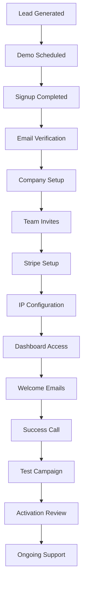

# **PenguinMails Customer Onboarding Process**

---

## 1. **Purpose**

This document outlines the comprehensive process for onboarding new customers to PenguinMails, from initial signup through full platform activation and first successful campaign. The goal is to ensure customers achieve value within their first 30 days while minimizing support overhead.

## 2. **Onboarding Phases**

### **Phase 1: Pre-Onboarding (Lead Generation to Signup)**
- **Lead Qualification**: Marketing team qualifies leads based on company size, email volume, and budget
- **Demo/Pitch**: Technical team conducts product demonstration highlighting key benefits
- **Trial Signup**: Customer creates account and begins self-guided onboarding
- **Success Criteria**: Account created, initial payment method added

### **Phase 2: Technical Setup (Days 1-7)**
- **Email Verification**: Automated verification process to activate account
- **Company Profile**: Collection of business information for compliance and personalization
- **Team Setup**: Invitation and role assignment for team members
- **Stripe Connect**: Payment processing setup and billing configuration
- **IP Configuration**: Email infrastructure setup and DNS configuration
- **Success Criteria**: All setup steps completed, infrastructure ready for campaigns

### **Phase 3: Education & Training (Days 8-14)**
- **Welcome Series**: Automated email sequence with platform tips and best practices
- **Onboarding Calls**: Scheduled calls with customer success manager
- **Documentation Review**: Guided walkthrough of key features and workflows
- **Test Campaign**: Assisted setup of first email campaign
- **Success Criteria**: Customer comfortable with basic platform navigation, first campaign sent

### **Phase 4: Activation & Optimization (Days 15-30)**
- **Campaign Optimization**: Review of first campaign performance and recommendations
- **Advanced Features**: Introduction to automation, segmentation, and analytics
- **Integration Setup**: Third-party integrations and API connections
- **Scale Planning**: Discussion of growth strategies and platform scaling
- **Success Criteria**: Customer running regular campaigns, demonstrating platform value

## 3. **Customer Journey Map**



## 4. **Key Processes**

### **Automated Onboarding Sequence**
- **Welcome Email**: Sent immediately after signup with account activation link
- **Progress Tracking**: Dashboard shows completion status of setup steps
- **Nudge Emails**: Automated reminders for incomplete onboarding steps
- **Success Milestones**: Celebrations and tips sent after key achievements

### **Manual Intervention Triggers**
- **Stuck Users**: No progress after 48 hours triggers support outreach
- **High-Value Customers**: Priority onboarding with dedicated success manager
- **Technical Issues**: Immediate escalation to engineering team
- **Payment Failures**: Dedicated billing support and alternative options

### **Success Metrics Tracking**
- **Onboarding Completion Rate**: Percentage of users completing full setup
- **Time to First Campaign**: Average days from signup to first email sent
- **30-Day Activation Rate**: Percentage of users actively using platform after 30 days
- **Support Ticket Volume**: Number of onboarding-related support requests

## 5. **Team Responsibilities**

### **Customer Success Manager**
- **Lead Onboarding Calls**: Conduct scheduled check-ins and provide guidance
- **Progress Monitoring**: Track individual customer progress and identify blockers
- **Custom Solutions**: Develop tailored onboarding plans for complex requirements
- **Retention Focus**: Identify at-risk customers and implement retention strategies

### **Technical Support**
- **Setup Assistance**: Help with technical configuration and troubleshooting
- **Integration Support**: Guide through API and third-party integrations
- **Performance Optimization**: Review campaign setup and provide improvement recommendations
- **Escalation Handling**: Manage complex technical issues and coordinate with engineering

### **Product Team**
- **Feature Education**: Develop and maintain onboarding materials and tutorials
- **UX Improvements**: Analyze onboarding friction points and suggest improvements
- **Content Updates**: Keep documentation and guides current with product changes
- **Feedback Collection**: Gather customer feedback to improve onboarding experience

## 6. **Common Challenges & Solutions**

### **Challenge: Onboarding Abandonment**
- **Detection**: Automated alerts for users inactive for 72+ hours
- **Solution**: Personalized re-engagement emails with progress preservation
- **Prevention**: Simplified steps and clear progress indicators

### **Challenge: Technical Setup Issues**
- **Detection**: Error tracking and user-reported issues
- **Solution**: Comprehensive setup guides and live chat support
- **Prevention**: Improved error messaging and automated validation

### **Challenge: Feature Adoption**
- **Detection**: Analytics tracking of feature usage patterns
- **Solution**: Contextual tips and guided tutorials for unused features
- **Prevention**: Integrated learning paths within the platform

## 7. **Tools & Resources**

### **Internal Tools**
- **Intercom**: Customer communication and support ticketing
- **Mixpanel/PostHog**: User behavior tracking and onboarding analytics
- **Jira**: Task management for onboarding improvements
- **Google Workspace**: Documentation and process management

### **Customer-Facing Resources**
- **Knowledge Base**: Self-service documentation and troubleshooting
- **Video Tutorials**: Step-by-step walkthroughs of key processes
- **Community Forum**: Peer-to-peer support and best practice sharing
- **Live Chat**: Real-time assistance for immediate issues

## 8. **Quality Assurance**

### **Process Audits**
- **Weekly Reviews**: Team reviews of recent onboarding experiences
- **Customer Feedback**: Regular surveys and feedback collection
- **Metrics Analysis**: Monthly review of onboarding KPIs and trends
- **Process Updates**: Continuous improvement based on data and feedback

### **Success Criteria**
- **90% Onboarding Completion Rate**: Target for users completing full setup
- **7-Day Time to Value**: Average time for customers to send first campaign
- **4.5/5 Onboarding Satisfaction**: Customer satisfaction score target
- **20% Reduction in Support Tickets**: Year-over-year improvement goal

## 9. **Decision Trees**

### **Escalation Decision Tree**
```
Customer stuck at setup step?
├── Yes → Check error logs
│   ├── Technical issue? → Escalate to engineering
│   └── User error? → Provide guidance
└── No → Check engagement metrics
    ├── Low engagement? → Send re-engagement campaign
    └── High engagement? → Schedule success call
```

### **Support Priority Matrix**
```
Urgency × Impact
├── High Urgency + High Impact → Immediate response (<1 hour)
├── High Urgency + Low Impact → Fast response (<4 hours)
├── Low Urgency + High Impact → Scheduled response (<24 hours)
└── Low Urgency + Low Impact → Standard response (<48 hours)
```

---

## Related Documents
- [User Journeys Onboarding](user_journeys_onboarding.md) - Detailed user onboarding flows
- [Onboarding & Authentication Guide](onboarding_and_authentication_guide.md) - Technical implementation details
- [Stripe Onboarding Guide](stripe_onboarding_guide.md) - Payment setup processes
- [Communication Guidelines](communication_guidelines.md) - Team coordination protocols
- [Billing and Subscription Guide](billing_and_subscription_guide.md) - Subscription management processes

**Keywords**: customer onboarding, user activation, setup process, customer success, onboarding automation, customer journey