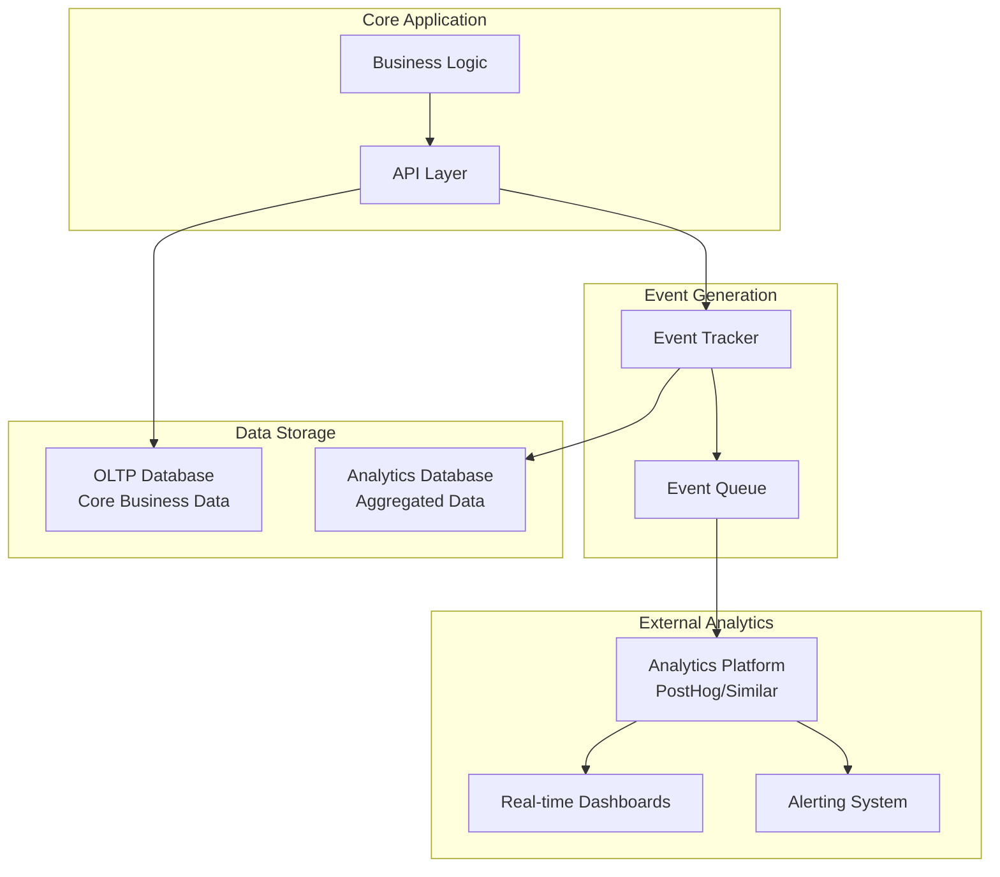

# External Analytics Integration Plan

## Overview

This document outlines the strategic approach for integrating external analytics and monitoring platforms with PenguinMails' core business logic. Instead of storing infrastructure and monitoring concerns in the operational database, we delegate these to specialized external analytics platforms for better observability, cost efficiency, and scalability.

## Strategic Principles

### 🎯 **Core Philosophy**
- **OLTP Focus**: Operational database handles only core business logic
- **External Delegation**: Infrastructure monitoring goes to specialized platforms
- **Platform Agnostic**: Design events to work with any analytics provider
- **Cost Optimization**: Use external platforms for high-volume monitoring data
- **Developer Experience**: Reduce complexity in core database schemas

### 📊 **Data Classification**

| Data Type | Storage Location | Rationale |
|-----------|-----------------|-----------|
| **Core Business Logic** | OLTP Database (Postgres) | Fast transactions, data integrity |
| **Email Analytics** | Analytics Database + External | High-volume event tracking, real-time dashboards |
| **Infrastructure Monitoring** | External Analytics Platform | Performance metrics, alerting |
| **Security Events** | External Analytics Platform | Audit trails, compliance, threat detection |
| **System Health** | External Analytics Platform | Resource utilization, error tracking |
| **User Behavior** | External Analytics Platform | Product analytics, user insights |

---

## Event Taxonomy

### 📧 **Email & Campaign Events**
```typescript
interface EmailEvent {
  event_type: 'email_sent' | 'email_delivered' | 'email_opened' | 'email_clicked' | 'email_bounced';
  email_id: string;
  campaign_id?: string;
  mailbox_id?: string;
  user_id: string;
  tenant_id: string;
  metadata: {
    timestamp: string;
    recipient_email?: string;
    clicked_url?: string;
    bounce_type?: 'hard' | 'soft';
    bounce_reason?: string;
  };
}
```

### 🔐 **Security Events**
```typescript
interface SecurityEvent {
  event_type: 'login_attempt' | 'login_success' | 'login_failure' | 'suspicious_activity' | 'data_access';
  severity: 'low' | 'medium' | 'high' | 'critical';
  user_id?: string;
  tenant_id?: string;
  metadata: {
    ip_address?: string;
    user_agent?: string;
    resource_type?: string;
    resource_id?: string;
    failure_reason?: string;
    timestamp: string;
  };
}
```

### 🏗️ **Infrastructure Events**
```typescript
interface InfrastructureEvent {
  event_type: 'connection_pool_metrics' | 'database_performance' | 'api_response_time' | 'error_rate';
  component: 'database' | 'api' | 'queue' | 'email_service';
  metadata: {
    metric_value: number;
    threshold_exceeded?: boolean;
    performance_tier?: 'oltp' | 'content' | 'queue' | 'olap';
    timestamp: string;
  };
}
```

### 📊 **System Performance Events**
```typescript
interface PerformanceEvent {
  event_type: 'query_performance' | 'memory_usage' | 'cpu_utilization' | 'disk_io';
  component: string;
  metadata: {
    duration_ms?: number;
    memory_mb?: number;
    cpu_percent?: number;
    query_type?: string;
    table_accessed?: string;
    timestamp: string;
  };
}
```

---

## Integration Architecture

### 🔄 **Event Flow Pattern**



### 🎯 **Event Collection Strategy**

#### 1. **Immediate Events** (Real-time)
- User authentication events
- Email delivery events  
- Security incidents
- API response errors

#### 2. **Aggregated Events** (Batch)
- Daily performance metrics
- Usage statistics
- Resource utilization
- Compliance reports

#### 3. **Historical Events** (Long-term)
- Business intelligence data
- Trend analysis
- Capacity planning
- Audit trails

---

## Platform Integration Patterns

### 🔌 **Generic Analytics Interface**

```typescript
interface AnalyticsPlatform {
  // Event tracking
  capture(event: string, properties: Record<string, any>): Promise<void>;
  
  // User identification
  identify(userId: string, traits?: Record<string, any>): Promise<void>;
  
  // Batch events for high-volume scenarios
  captureBatch(events: Array<{event: string, properties: Record<string, any>}>): Promise<void>;
  
  // Query capabilities (if supported)
  query(sql: string, params?: any[]): Promise<any>;
}

// Platform-agnostic implementation
class AnalyticsManager {
  constructor(private platform: AnalyticsPlatform) {}
  
  async trackEmailEvent(event: EmailEvent) {
    await this.platform.capture(`email_${event.event_type}`, {
      email_id: event.email_id,
      campaign_id: event.campaign_id,
      tenant_id: event.tenant_id,
      ...event.metadata
    });
  }
  
  async trackSecurityEvent(event: SecurityEvent) {
    await this.platform.capture(`security_${event.event_type}`, {
      severity: event.severity,
      user_id: event.user_id,
      tenant_id: event.tenant_id,
      ...event.metadata
    });
  }
  
  async trackInfrastructureEvent(event: InfrastructureEvent) {
    await this.platform.capture(`infra_${event.event_type}`, {
      component: event.component,
      metric_value: event.metadata.metric_value,
      ...event.metadata
    });
  }
}
```

### 📈 **Platform Migration Strategy**

#### Phase 1: **Abstraction Layer**
```typescript
// Define common interface
interface AnalyticsProvider {
  capture(event: string, properties: any): Promise<void>;
}

// Implement for different platforms
class PostHogProvider implements AnalyticsProvider { ... }
class SegmentProvider implements AnalyticsProvider { ... }
class CustomProvider implements AnalyticsProvider { ... }

// Easy platform switching
const analytics = new AnalyticsManager(new PostHogProvider());
// To switch: const analytics = new AnalyticsManager(new SegmentProvider());
```

#### Phase 2: **Event Schema Standardization**
- Standardize event names across platforms
- Define consistent property naming
- Ensure backward compatibility
- Document migration procedures

#### Phase 3: **Gradual Migration**
- Run platforms in parallel
- Validate data consistency
- Switch traffic gradually
- Maintain rollback capability

---

## Event Naming Conventions

### 📋 **Standardized Event Prefixes**

| Category | Prefix | Examples |
|----------|--------|----------|
| **Email** | `email_` | `email_sent`, `email_opened`, `email_clicked` |
| **Security** | `security_` | `security_login`, `security_incident`, `security_access` |
| **Infrastructure** | `infra_` | `infra_performance`, `infra_error`, `infra_metric` |
| **Business** | `business_` | `business_signup`, `business_upgrade`, `business_churn` |
| **Performance** | `perf_` | `perf_query`, `perf_api`, `perf_database` |

### 🎯 **Event Property Standards**

```typescript
// Required properties for all events
interface BaseEvent {
  event_name: string;
  timestamp: string;
  source: 'api' | 'worker' | 'webhook' | 'cron';
  environment: 'development' | 'staging' | 'production';
  version?: string;
}

// Optional but recommended
interface ExtendedEvent extends BaseEvent {
  tenant_id?: string;
  user_id?: string;
  session_id?: string;
  correlation_id?: string;
  retry_count?: number;
}
```

---

## Data Retention & Privacy

### 🗂️ **Retention Policies**

| Event Type | Retention Period | Storage Location |
|------------|------------------|------------------|
| **Security Events** | 7 years | External Analytics + Cold Storage |
| **Email Events** | 2 years | External Analytics + Aggregated |
| **Infrastructure Events** | 90 days | External Analytics Only |
| **Performance Events** | 30 days | External Analytics Only |
| **Business Events** | 5 years | External Analytics + Archive |

### 🔒 **Privacy Considerations**

- **PII Handling**: Never send sensitive PII to external platforms
- **Data Anonymization**: Hash or tokenize identifiers when possible
- **Consent Management**: Respect user preferences for analytics tracking
- **GDPR Compliance**: Implement data deletion and export capabilities
- **Regional Storage**: Consider data residency requirements

---

## Implementation Roadmap

### 🚀 **Phase 1: Foundation** (Week 1-2)
- [ ] Create analytics abstraction interface
- [ ] Implement PostHog integration as primary provider
- [ ] Migrate connection pool monitoring from OLTP
- [ ] Set up basic security event tracking
- [ ] Create event naming standards documentation

### 🔄 **Phase 2: Migration** (Week 3-4)
- [ ] Migrate security events from OLTP to external platform
- [ ] Implement infrastructure monitoring events
- [ ] Set up real-time alerting for critical events
- [ ] Create dashboard templates for common metrics
- [ ] Implement event validation and quality checks

### 📊 **Phase 3: Advanced Features** (Week 5-6)
- [ ] Add platform migration capabilities (Segment integration)
- [ ] Implement event batching for high-volume scenarios
- [ ] Create custom event schemas for complex business logic
- [ ] Set up automated event documentation generation
- [ ] Implement A/B testing framework for event strategies

### 🏢 **Phase 4: Enterprise Features** (Week 7-8)
- [ ] Add multi-tenant event isolation
- [ ] Implement custom event retention policies
- [ ] Create compliance reporting features
- [ ] Set up advanced filtering and segmentation
- [ ] Implement cost optimization strategies

---

## Cost Optimization Strategies

### 💰 **Event Volume Management**

1. **Sampling**: Use statistical sampling for high-volume, low-value events
2. **Aggregation**: Pre-aggregate metrics before sending to external platform
3. **Filtering**: Only send events that provide business value
4. **Compression**: Batch events during high-traffic periods
5. **Tiered Storage**: Use different retention periods based on event importance

### 📊 **Platform Cost Comparison**

| Platform | Pricing Model | Best For |
|----------|---------------|----------|
| **PostHog** | Event-based | Product analytics, real-time dashboards |
| **Segment** | Monthly flat + overage | Data routing, multiple destinations |
| **Amplitude** | MAU-based | User behavior, cohort analysis |
| **Custom Solution** | Infrastructure costs | High volume, specific requirements |

---

## Monitoring & Maintenance

### 📈 **Key Performance Indicators**

1. **Event Delivery Rate**: >99.9% success rate
2. **Platform Latency**: <100ms for real-time events
3. **Data Consistency**: Validate events against source systems
4. **Cost Efficiency**: Monitor cost per event and optimize
5. **Developer Experience**: Track integration complexity and maintenance overhead

### 🔧 **Maintenance Tasks**

#### Daily
- Monitor event delivery success rates
- Check platform usage quotas and costs
- Validate data consistency

#### Weekly
- Review event schema effectiveness
- Analyze cost optimization opportunities
- Update documentation with new event types

#### Monthly
- Performance review and optimization
- Platform cost analysis and forecasting
- Security audit of event data handling

---

## Success Metrics

### ✅ **Technical Success**
- Zero infrastructure monitoring tables in OLTP schema
- <100ms average event tracking latency
- 99.9% event delivery success rate
- Seamless platform migration capability

### 💼 **Business Success**
- Improved developer productivity (reduced schema complexity)
- Better observability through specialized analytics tools
- Cost optimization through appropriate platform selection
- Enhanced security posture through centralized event monitoring

---

**Keywords**: external analytics, event tracking, platform agnostic, infrastructure monitoring, security events, PostHog integration, analytics abstraction, data governance, cost optimization

*This integration plan provides a flexible, scalable approach to external analytics that can evolve with business needs while maintaining separation of concerns between core business logic and monitoring infrastructure.*